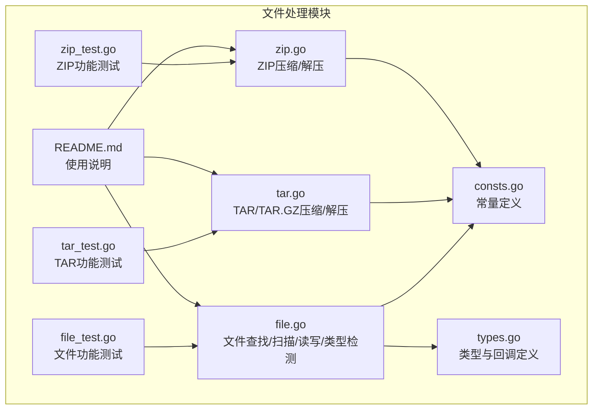
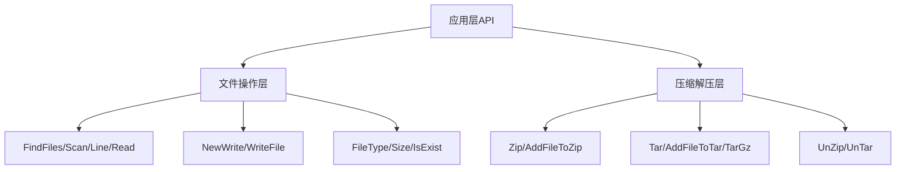
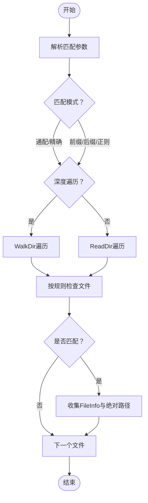
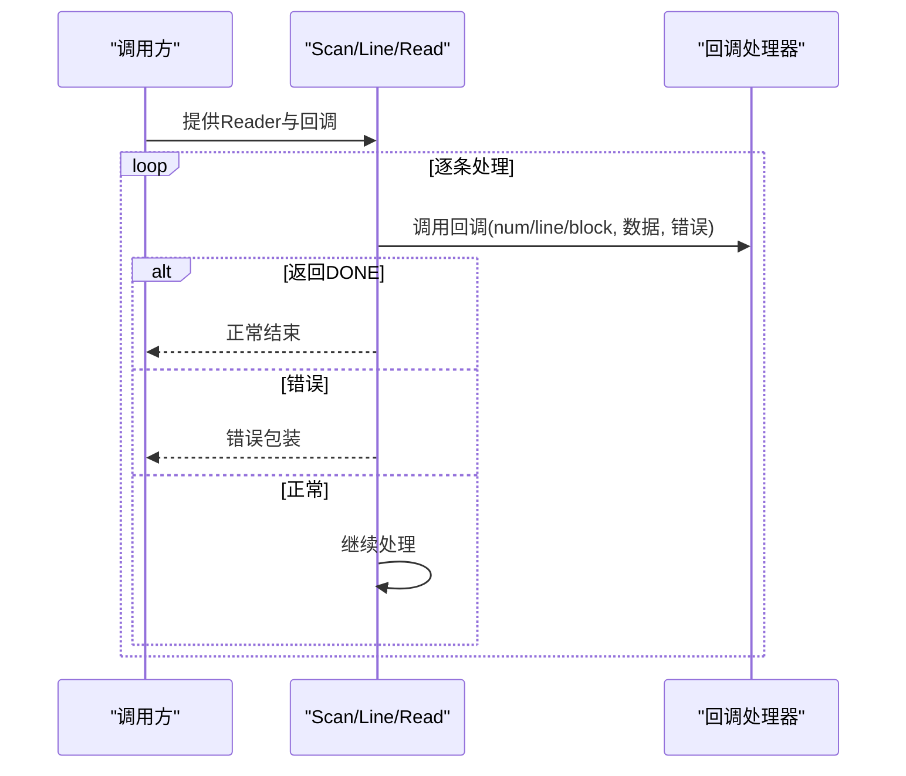
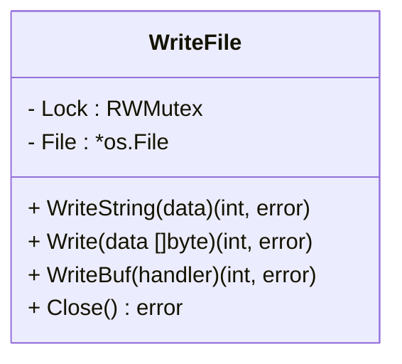
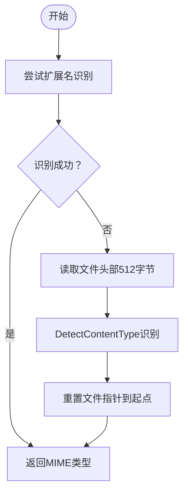
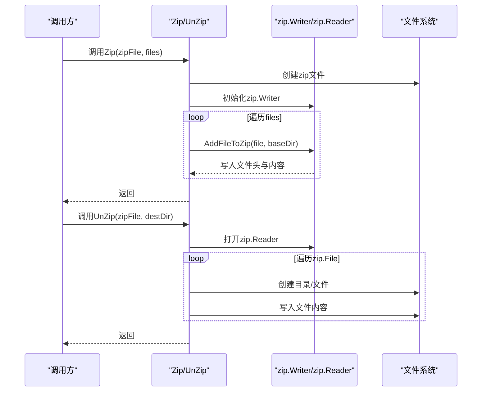
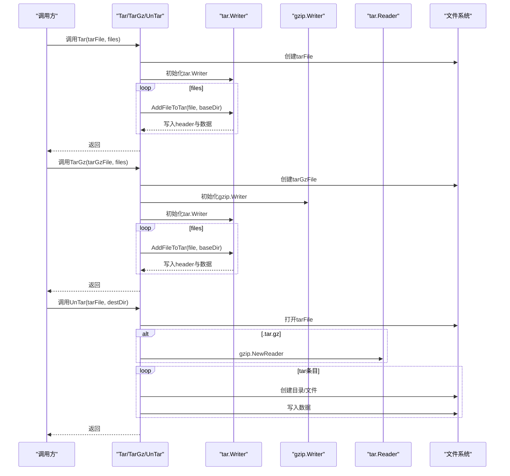
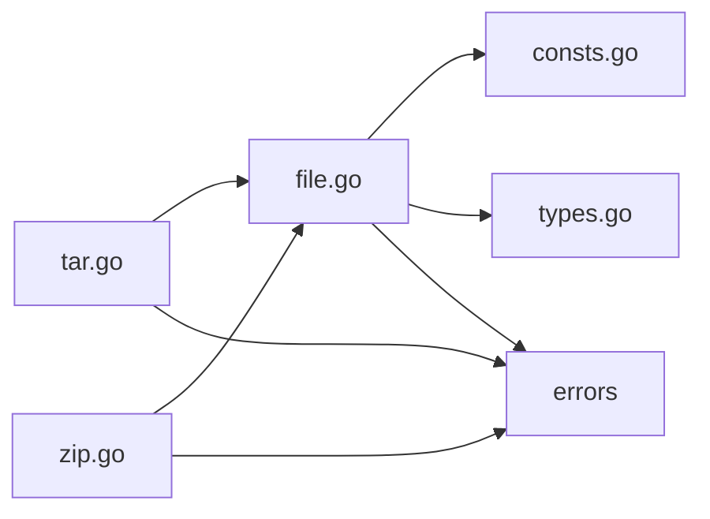

# 文件处理模块

<cite>
**本文档引用的文件**
- [file.go](file://file.go)
- [tar.go](file://tar.go)
- [zip.go](file://zip.go)
- [file_test.go](file://file_test.go)
- [tar_test.go](file://tar_test.go)
- [zip_test.go](file://zip_test.go)
- [consts.go](file://consts.go)
- [types.go](file://types.go)
- [README.md](file://README.md)
</cite>

## 目录

1. [简介](#简介)
2. [项目结构](#项目结构)
3. [核心组件](#核心组件)
4. [架构总览](#架构总览)
5. [详细组件分析](#详细组件分析)
6. [依赖关系分析](#依赖关系分析)
7. [性能考虑](#性能考虑)
8. [故障排除指南](#故障排除指南)
9. [结论](#结论)
10. [附录](#附录)

## 简介

本文件处理模块提供了完整的文件操作能力，涵盖文件查找、扫描与读写、文件类型检测、文件属性获取，以及压缩与解压缩功能。模块支持：

- 文件查找与过滤（前缀、后缀、精确匹配、正则）
- 多种读取模式（逐行扫描、按行读取、分块读取）
- 并发安全的文件写入（基于互斥锁的WriteFile封装）
- ZIP压缩与解压缩
- TAR与TAR.GZ压缩与解压缩
- 文件类型检测与大小格式化

## 项目结构

文件处理模块主要由以下文件组成：

- file.go：文件查找、扫描、读取、写入、类型检测、大小格式化等通用文件操作
- tar.go：TAR与TAR.GZ的压缩与解压缩实现
- zip.go：ZIP压缩与解压缩实现
- file_test.go、tar_test.go、zip_test.go：对应功能的单元测试
- consts.go：常量定义（存储单位等）
- types.go：类型别名与回调函数类型定义
- README.md：模块使用说明与示例

图表来源

- [file.go](file://file.go#L1-L451)
- [tar.go](file://tar.go#L1-L263)
- [zip.go](file://zip.go#L1-L213)
- [consts.go](file://consts.go#L1-L48)
- [types.go](file://types.go#L1-L98)
- [file_test.go](file://file_test.go#L1-L680)
- [tar_test.go](file://tar_test.go#L1-L71)
- [zip_test.go](file://zip_test.go#L1-L49)
- [README.md](file://README.md#L1-L3892)

章节来源

- [file.go](file://file.go#L1-L451)
- [tar.go](file://tar.go#L1-L263)
- [zip.go](file://zip.go#L1-L213)
- [consts.go](file://consts.go#L1-L48)
- [types.go](file://types.go#L1-L98)
- [file_test.go](file://file_test.go#L1-L680)
- [tar_test.go](file://tar_test.go#L1-L71)
- [zip_test.go](file://zip_test.go#L1-L49)
- [README.md](file://README.md#L1-L3892)

## 核心组件

- 文件查找与过滤：支持深度遍历与当前目录遍历，提供多种匹配模式（通配、前缀、后缀、精确、正则）
- 文件扫描与读取：提供Scan（逐行扫描）、Line（按行读取）、Read（分块读取）三种读取模式
- 文件写入：NewWrite创建并发安全的WriteFile，支持字符串、字节、缓冲写入
- 文件类型检测：FileType通过扩展名与内容探测结合的方式识别文件类型
- 压缩与解压缩：ZIP、TAR、TAR.GZ的完整实现，支持目录递归压缩与解压

章节来源

- [file.go](file://file.go#L89-L225)
- [file.go](file://file.go#L227-L309)
- [file.go](file://file.go#L311-L395)
- [file.go](file://file.go#L434-L450)
- [zip.go](file://zip.go#L12-L41)
- [tar.go](file://tar.go#L13-L79)

## 架构总览

文件处理模块采用分层设计：

- 应用层：对外暴露统一的API（FindFiles、Scan、Line、Read、NewWrite、Zip、Tar、TarGz、UnZip、UnTar）
- 业务层：实现具体文件操作逻辑（文件系统访问、压缩算法、类型检测）
- 工具层：提供常量与类型定义，辅助实现细节

图表来源

- [file.go](file://file.go#L89-L395)
- [zip.go](file://zip.go#L12-L138)
- [tar.go](file://tar.go#L13-L262)

## 详细组件分析

### 文件查找与过滤（FindFiles）

- 功能概述：在指定目录下查找匹配的文件，支持深度遍历与当前目录遍历，支持多种匹配规则
- 匹配规则：
    - 无参或"*"：匹配所有文件
    - "e"：精确匹配文件名
    - "p"：前缀匹配
    - "s"：后缀匹配
    - "r"：正则表达式匹配
- 处理流程：
    - 解析匹配参数，编译正则表达式（如适用）
    - WalkDir或ReadDir遍历目录
    - 对每个文件根据规则判断是否匹配
    - 收集匹配文件的FileInfo与绝对路径

图表来源

- [file.go](file://file.go#L101-L225)

章节来源

- [file.go](file://file.go#L89-L225)
- [file_test.go](file://file_test.go#L13-L48)

### 文件扫描与读取（Scan/Line/Read）

- Scan：基于bufio.Scanner，支持自定义Scanner缓冲区大小，适合逐行读取
- Line：基于bufio.Reader，逐行读取，适合大文件或大行数据
- Read：基于io.Reader，按固定块大小读取，适合无换行或大文件
- 共同特性：
    - 回调函数支持返回DONE以提前终止
    - 错误处理统一包装

图表来源

- [file.go](file://file.go#L227-L309)
- [types.go](file://types.go#L76-L97)

章节来源

- [file.go](file://file.go#L227-L309)
- [types.go](file://types.go#L76-L97)
- [file_test.go](file://file_test.go#L141-L497)

### 并发安全文件写入（WriteFile）

- 设计要点：
    - 使用sync.RWMutex保证并发安全
    - 支持字符串写入、字节写入、缓冲写入
    - 自动创建目录，支持追加与覆盖模式
- 方法族：
    - WriteString：字符串写入
    - Write：字节写入
    - WriteBuf：缓冲写入，回调中使用bufio.Writer
    - Close：关闭文件句柄

图表来源

- [file.go](file://file.go#L353-L395)

章节来源

- [file.go](file://file.go#L311-L395)
- [file_test.go](file://file_test.go#L499-L678)

### 文件类型检测（FileType）

- 检测策略：
    - 优先通过扩展名推断MIME类型
    - 若失败，读取文件头部512字节，使用http.DetectContentType识别
    - 识别后将文件指针重置到起始位置
- 适用场景：上传文件类型校验、批量文件分类

图表来源

- [file.go](file://file.go#L434-L450)

章节来源

- [file.go](file://file.go#L434-L450)

### ZIP压缩与解压缩

- 压缩（Zip）：
    - 校验文件名后缀为.zip
    - 创建zip.Writer，遍历文件列表，调用AddFileToZip
    - 支持目录递归压缩
- 解压缩（UnZip）：
    - 校验文件名后缀为.zip
    - 打开zip文件，遍历zip.File
    - 目录直接创建，文件写入对应路径

图表来源

- [zip.go](file://zip.go#L12-L41)
- [zip.go](file://zip.go#L43-L138)
- [zip.go](file://zip.go#L140-L213)

章节来源

- [zip.go](file://zip.go#L12-L213)
- [zip_test.go](file://zip_test.go#L8-L48)

### TAR与TAR.GZ压缩与解压缩

- 压缩（Tar/TarGz）：
    - Tar：仅TAR归档，校验后缀为.tar
    - TarGz：TAR+GZIP，校验后缀为.tar.gz
    - 递归添加文件与目录，支持baseDir控制归档内路径
- 解压缩（UnTar）：
    - 自动识别.tar或.tar.gz
    - GZIP解码（如适用），逐条读取tar条目
    - 目录创建与文件写入

图表来源

- [tar.go](file://tar.go#L13-L79)
- [tar.go](file://tar.go#L81-L174)
- [tar.go](file://tar.go#L176-L262)

章节来源

- [tar.go](file://tar.go#L13-L262)
- [tar_test.go](file://tar_test.go#L8-L70)

### 文件属性获取与格式化

- 属性获取：
    - IsDir/IsFile/IsExist：路径/文件状态判断
    - Size：获取文件大小
- 大小格式化：
    - SizeFormat：将字节转换为人类可读格式（B/K/M/G/T/P/E）

章节来源

- [file.go](file://file.go#L21-L48)
- [file.go](file://file.go#L397-L432)
- [consts.go](file://consts.go#L14-L24)

## 依赖关系分析

- 内部依赖：
    - file.go依赖consts.go（常量）、types.go（回调类型）
    - tar.go/zip.go依赖file.go的工具函数（如IsExist）
- 外部依赖：
    - 标准库：os、io、fs、bufio、archive/tar、compress/gzip、mime、net/http
    - 错误包装：errors包（统一错误追踪）

图表来源

- [file.go](file://file.go#L1-L16)
- [tar.go](file://tar.go#L1-L11)
- [zip.go](file://zip.go#L1-L10)
- [consts.go](file://consts.go#L1-L48)
- [types.go](file://types.go#L1-L98)

章节来源

- [file.go](file://file.go#L1-L16)
- [tar.go](file://tar.go#L1-L11)
- [zip.go](file://zip.go#L1-L10)
- [consts.go](file://consts.go#L1-L48)
- [types.go](file://types.go#L1-L98)

## 性能考虑

- 读取性能：
    - Scan适用于常规文本文件，支持自定义Scanner缓冲区大小
    - Line在大行数据场景表现更优
    - Read适合无换行或超大文件
- 写入性能：
    - WriteBuf使用bufio.Writer，建议在高并发写入场景优先使用
    - WriteFile内部加锁，避免竞态写入
- 压缩性能：
    - ZIP使用Deflate压缩，TAR默认无压缩，TAR.GZ结合gzip压缩
    - 目录递归压缩时注意I/O开销，建议批量处理

章节来源

- [file.go](file://file.go#L227-L309)
- [file.go](file://file.go#L311-L395)
- [zip.go](file://zip.go#L62-L96)
- [tar.go](file://tar.go#L61-L67)

## 故障排除指南

- 文件查找失败：
    - 检查匹配规则是否正确（如正则表达式语法）
    - 确认目录存在且具有读取权限
- 读取异常：
    - Scan/Line/Read的回调返回DONE可提前终止
    - 注意单行过大导致的Scanner缓冲区不足，可通过size参数调整
- 写入冲突：
    - 使用WriteFile并发写入，内部已加锁
    - 避免同时对同一文件进行不同模式的写入
- 压缩/解压错误：
    - 确认文件名后缀与操作类型一致（.zip/.tar/.tar.gz）
    - 解压前确保目标目录可写
- 类型检测失败：
    - 若扩展名为空，系统会尝试内容探测，必要时检查文件头部可读性

章节来源

- [file.go](file://file.go#L121-L136)
- [file.go](file://file.go#L230-L240)
- [file.go](file://file.go#L359-L387)
- [zip.go](file://zip.go#L17-L19)
- [tar.go](file://tar.go#L18-L20)
- [tar.go](file://tar.go#L181-L183)

## 结论

文件处理模块提供了从基础文件操作到压缩解压缩的完整能力，具备良好的扩展性与易用性。通过统一的错误包装与并发安全的写入机制，能够满足大多数文件处理场景的需求。建议在生产环境中结合具体业务选择合适的读取与写入模式，并合理使用压缩功能以平衡存储与性能。

## 附录

### 使用示例（基于测试用例）

- 文件查找：参考[file_test.go](file://file_test.go#L13-L48)
- 文件扫描：参考[file_test.go](file://file_test.go#L141-L207)
- 按行读取：参考[file_test.go](file://file_test.go#L279-L335)
- 分块读取：参考[file_test.go](file://file_test.go#L397-L445)
- 并发写入：参考[file_test.go](file://file_test.go#L499-L678)
- ZIP压缩/解压：参考[zip_test.go](file://zip_test.go#L8-L48)
- TAR/TAR.GZ压缩/解压：参考[tar_test.go](file://tar_test.go#L8-L70)

章节来源

- [file_test.go](file://file_test.go#L13-L678)
- [zip_test.go](file://zip_test.go#L8-L48)
- [tar_test.go](file://tar_test.go#L8-L70)