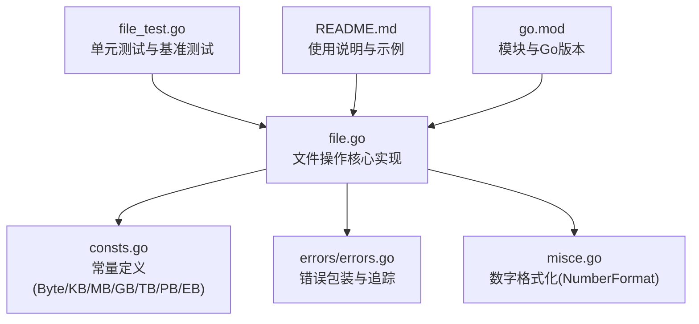
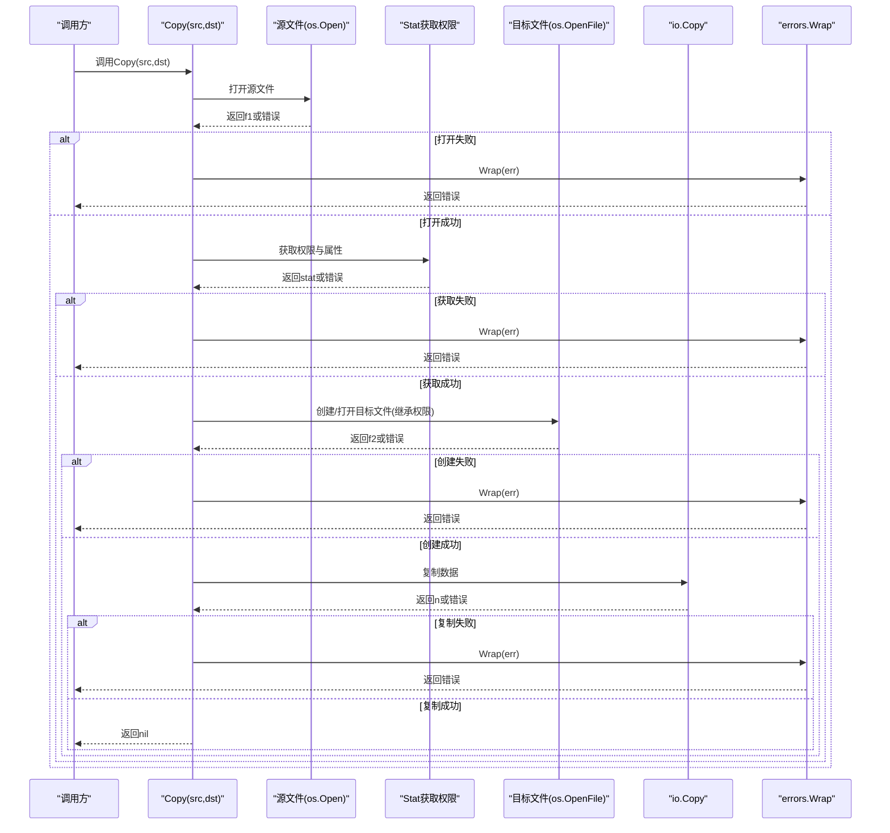
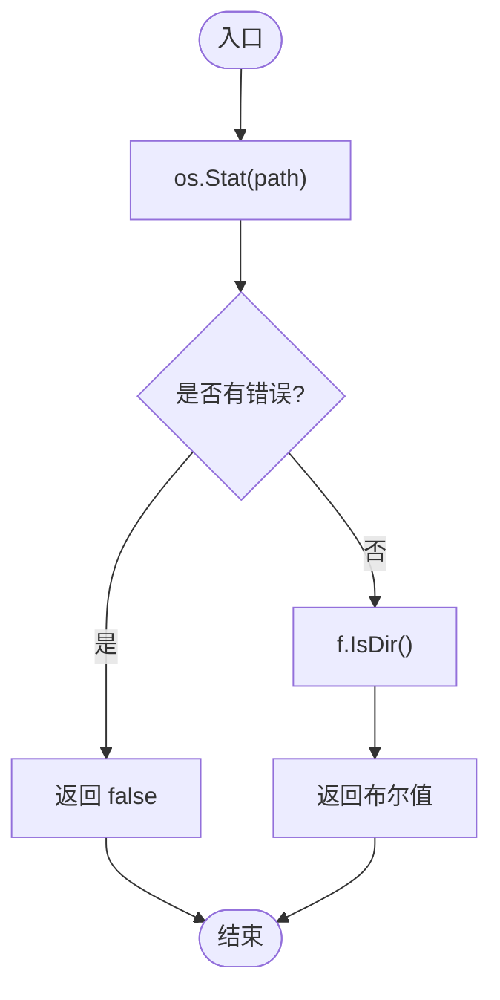
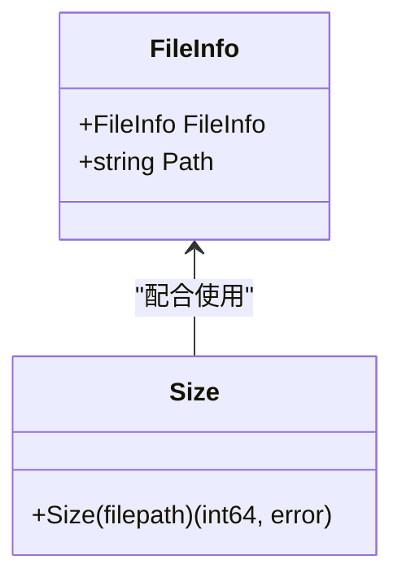
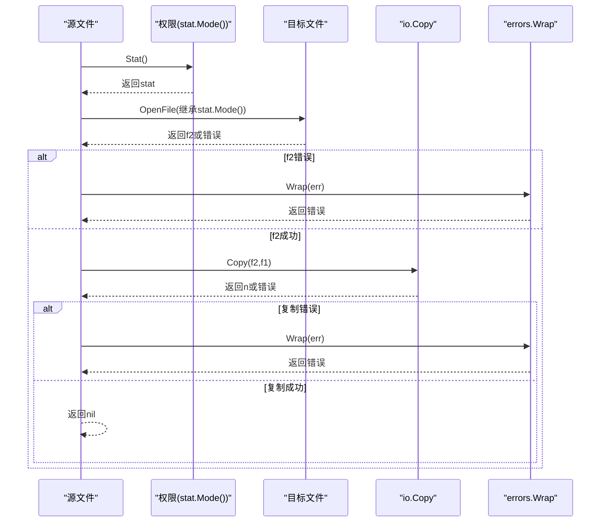
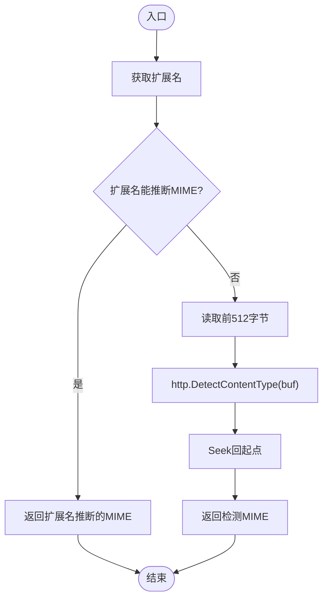
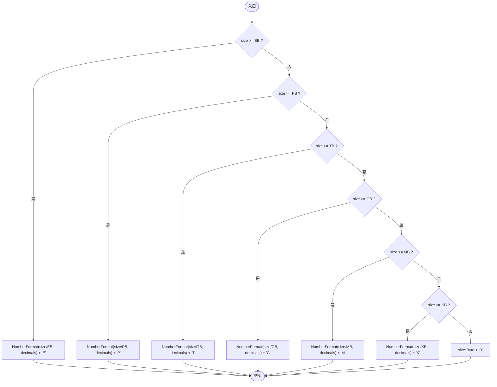
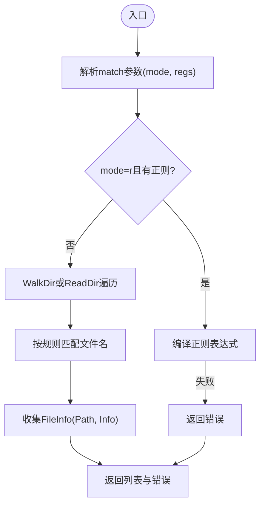
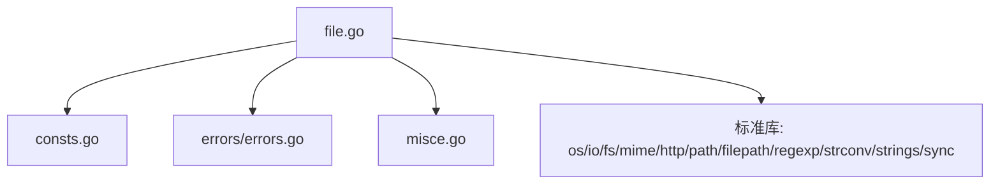

# 文件操作功能

<cite>
**本文档引用的文件**
- [file.go](file://file.go)
- [file_test.go](file://file_test.go)
- [consts.go](file://consts.go)
- [errors.go](file://errors/errors.go)
- [misce.go](file://misce.go)
- [README.md](file://README.md)
- [go.mod](file://go.mod)
</cite>

## 目录

1. [简介](#简介)
2. [项目结构](#项目结构)
3. [核心组件](#核心组件)
4. [架构总览](#架构总览)
5. [详细组件分析](#详细组件分析)
6. [依赖关系分析](#依赖关系分析)
7. [性能考虑](#性能考虑)
8. [故障排除指南](#故障排除指南)
9. [结论](#结论)
10. [附录](#附录)

## 简介

本文件系统化梳理了 Go 工具库中的文件操作功能，重点覆盖以下方面：

- 文件类型判断：IsDir、IsFile、IsExist 的实现原理与使用方法
- 文件信息获取：Size 函数与 FileInfo 结构体的使用
- 文件复制：Copy 的完整流程、权限处理与错误处理机制
- 文件类型检测：FileType 的工作原理与 MIME 类型识别
- 文件大小格式化：SizeFormat 的功能与应用场景
- 最佳实践、性能优化建议与常见问题解决方案
- 具体的使用示例与场景说明

## 项目结构

该项目采用按功能模块划分的组织方式，文件操作相关的核心代码集中在 file.go 中，配套的常量定义位于 consts.go，错误包装与追踪位于
errors/errors.go，数字格式化工具位于 misce.go。README.md 提供了使用说明与示例参考。

**图表来源**

- [file.go](file://file.go#L1-L451)
- [consts.go](file://consts.go#L1-L48)
- [errors.go](file://errors/errors.go#L1-L282)
- [misce.go](file://misce.go#L20-L83)
- [file_test.go](file://file_test.go#L1-L680)
- [README.md](file://README.md#L1-L3892)
- [go.mod](file://go.mod#L1-L4)

**章节来源**

- [file.go](file://file.go#L1-L451)
- [consts.go](file://consts.go#L1-L48)
- [errors.go](file://errors/errors.go#L1-L282)
- [misce.go](file://misce.go#L20-L83)
- [file_test.go](file://file_test.go#L1-L680)
- [README.md](file://README.md#L1-L3892)
- [go.mod](file://go.mod#L1-L4)

## 核心组件

- 文件类型判断
    - IsDir：基于 os.Stat 判断路径是否为目录
    - IsFile：通过 IsDir 取反判断是否为文件
    - IsExist：判断文件或目录是否存在（兼容 os.IsExist）
- 文件信息获取
    - Size：获取文件大小，返回字节数与错误
    - FileInfo：封装 fs.FileInfo 与 Path 字段，用于 FindFiles 返回
- 文件复制
    - Copy：打开源文件，读取权限，创建目标文件并使用 io.Copy 完成复制
- 文件类型检测
    - FileType：优先根据扩展名推断 MIME，否则读取文件前 512 字节进行自动检测
- 文件大小格式化
    - SizeFormat：将字节大小格式化为人类可读形式（B/K/M/G/T/P/E）

**章节来源**

- [file.go](file://file.go#L21-L81)
- [file.go](file://file.go#L83-L225)
- [file.go](file://file.go#L397-L450)
- [consts.go](file://consts.go#L14-L24)

## 架构总览

文件操作功能围绕标准库 os、io/fs、mime、http 等模块构建，统一通过 errors 包进行错误包装与追踪，确保错误链路可追溯。文件复制流程中，权限继承自源文件，使用
io.Copy 进行高效传输。

**图表来源**

- [file.go](file://file.go#L54-L81)
- [errors.go](file://errors/errors.go#L24-L53)

**章节来源**

- [file.go](file://file.go#L54-L81)
- [errors.go](file://errors/errors.go#L24-L53)

## 详细组件分析

### 文件类型判断

- IsDir
    - 实现：调用 os.Stat 获取文件信息，若错误则返回 false；否则返回 f.IsDir()
    - 使用：适用于目录存在性与类型判断
- IsFile
    - 实现：!IsDir(filepath)
    - 使用：快速判断路径是否为文件
- IsExist
    - 实现：os.Stat 后判断 err == nil 或 os.IsExist(err)
    - 使用：判断资源是否存在（含跨平台差异处理）

**图表来源**

- [file.go](file://file.go#L21-L39)

**章节来源**

- [file.go](file://file.go#L21-L39)

### 文件信息获取

- Size
    - 功能：获取文件大小（字节）
    - 实现：os.Stat -> f.Size()，错误通过 errors.Wrap 包装
    - 应用：配合 SizeFormat 进行人性化展示
- FileInfo
    - 结构：嵌入 fs.FileInfo，新增 Path 字段
    - 用途：FindFiles 返回集合中的每个文件项

**图表来源**

- [file.go](file://file.go#L83-L87)
- [file.go](file://file.go#L41-L48)

**章节来源**

- [file.go](file://file.go#L41-L48)
- [file.go](file://file.go#L83-L87)

### 文件复制 Copy

- 流程
    - 打开源文件：os.Open(src)
    - 获取权限：f1.Stat()，继承源文件权限
    - 创建/打开目标文件：os.OpenFile(dst, O_WRONLY|O_CREATE|O_TRUNC, stat.Mode())
    - 复制数据：io.Copy(f2, f1)
    - 错误处理：所有阶段均通过 errors.Wrap 包装
- 权限处理
    - 目标文件权限直接继承源文件 Mode()
    - 若目标目录不存在，Copy 不会自动创建目录（需外部保障）
- 错误处理
    - 打开源文件失败、Stat 失败、创建目标文件失败、复制失败均返回包装后的错误
    - 成功返回 nil

**图表来源**

- [file.go](file://file.go#L54-L81)
- [errors.go](file://errors/errors.go#L24-L53)

**章节来源**

- [file.go](file://file.go#L54-L81)
- [errors.go](file://errors/errors.go#L24-L53)

### 文件类型检测 FileType

- 工作原理
    - 优先：根据文件扩展名通过 mime.TypeByExtension 推断 MIME
    - 备选：若扩展名为空或未知，读取文件前 512 字节，使用 http.DetectContentType 自动识别
    - 重置：检测后将文件指针 Seek 回起点，保持调用者视角的文件状态一致
- 错误处理
    - 读取或 Seek 失败时通过 errors.Wrap 包装返回

**图表来源**

- [file.go](file://file.go#L434-L450)

**章节来源**

- [file.go](file://file.go#L434-L450)

### 文件大小格式化 SizeFormat

- 功能
    - 将字节大小转换为人类可读形式，如 B、K、M、G、T、P、E
    - 使用 NumberFormat 进行数值格式化（千分位分隔与小数点控制）
- 常量
    - Byte、KB、MB、GB、TB、PB、EB 在 consts.go 中定义，支持 int64 最大值至 EB
- 应用场景
    - 日志输出、用户界面展示、监控指标呈现

**图表来源**

- [file.go](file://file.go#L397-L432)
- [consts.go](file://consts.go#L14-L24)
- [misce.go](file://misce.go#L21-L83)

**章节来源**

- [file.go](file://file.go#L397-L432)
- [consts.go](file://consts.go#L14-L24)
- [misce.go](file://misce.go#L21-L83)

### 文件查找与匹配 FindFiles

- 功能
    - 在指定目录下查找匹配的文件，支持深度遍历与当前目录两种模式
    - 支持多种匹配规则：通配符(*)、精确匹配(e)、前缀匹配(p)、后缀匹配(s)、正则匹配(r)
- 匹配规则
    - 无参或仅传入 "*"：匹配所有文件
    - 传入 "e" + 文件名：精确匹配
    - 传入 "p" + 前缀：前缀匹配
    - 传入 "s" + 后缀：后缀匹配
    - 传入 "r" + 正则表达式：正则匹配（需验证正则有效性）
- 返回
    - FileInfo 列表与错误包装

**图表来源**

- [file.go](file://file.go#L89-L225)

**章节来源**

- [file.go](file://file.go#L89-L225)

## 依赖关系分析

- 内部依赖
    - file.go 依赖 consts.go（Byte/KB/MB/GB/TB/PB/EB）、errors/errors.go（错误包装）、misce.go（NumberFormat）
- 外部依赖
    - 标准库：os、io、io/fs、mime、http、path/filepath、regexp、strconv、strings、sync
- 错误处理策略
    - 所有错误通过 errors.Wrap 包装，保持原始错误上下文与堆栈追踪

**图表来源**

- [file.go](file://file.go#L1-L16)
- [consts.go](file://consts.go#L1-L48)
- [errors.go](file://errors/errors.go#L1-L282)
- [misce.go](file://misce.go#L20-L83)

**章节来源**

- [file.go](file://file.go#L1-L16)
- [consts.go](file://consts.go#L1-L48)
- [errors.go](file://errors/errors.go#L1-L282)
- [misce.go](file://misce.go#L20-L83)

## 性能考虑

- 复制性能
    - 使用 io.Copy 进行零拷贝传输，避免手动缓冲，减少内存占用与系统调用次数
    - 建议在高并发场景下结合缓冲写入（如 WriteFile 的 WriteBuf）以提升吞吐
- 读取策略
    - 大文件逐行扫描：Scan 使用 Scanner，可配置最大令牌大小，适合超大单行数据
    - 大文件逐行读取：Line 使用 Reader，适合逐行处理且避免一次性加载
    - 大文件分块读取：Read 使用固定缓冲区，适合无换行或超大文件
- 缓冲与并发
    - WriteFile 提供 RWMutex 保护，WriteBuf 使用 bufio.Writer 提升写入性能
    - 多协程写入时建议统一通过 WriteFile 接口，避免竞态与数据损坏

**章节来源**

- [file.go](file://file.go#L227-L309)
- [file.go](file://file.go#L311-L395)

## 故障排除指南

- 常见错误与定位
    - 打开文件失败：检查路径是否存在、权限是否足够、磁盘空间是否充足
    - Stat 失败：确认 IsExist 判断与 os.IsExist 的兼容性
    - 复制失败：检查源文件可读性、目标目录可写性、权限继承是否正确
    - MIME 检测失败：确认文件扩展名与内容一致性，必要时使用自动检测分支
- 错误包装与追踪
    - 所有错误通过 errors.Wrap 包装，支持 errors.Is、errors.As 进行错误类型判断与解包
    - 使用 errors.Trace 或 slog 记录堆栈信息，便于定位问题根因

**章节来源**

- [errors.go](file://errors/errors.go#L24-L72)
- [file_test.go](file://file_test.go#L120-L139)

## 结论

本文件操作功能以简洁高效的 API
设计为核心，结合统一的错误包装与格式化工具，提供了从类型判断、信息获取、复制、类型检测到大小格式化的完整能力。通过合理的缓冲策略与并发控制，可在不同规模与场景下获得稳定且高性能的表现。

## 附录

- 使用示例与场景
    - 类型判断：IsDir、IsFile、IsExist 用于路径合法性校验与目录/文件区分
    - 文件大小：Size + SizeFormat 用于日志与界面展示
    - 文件复制：Copy 用于备份、迁移与批量处理
    - 类型检测：FileType 用于上传文件校验与内容识别
    - 文件查找：FindFiles 用于批量筛选与自动化处理
- 最佳实践
    - 复制前确保目标目录存在，必要时使用 NewWrite 自动创建
    - 大文件处理优先选择 Scan/Line/Read 中合适的读取策略
    - 并发写入统一通过 WriteFile 接口，避免竞态
    - 错误处理统一使用 errors.Wrap，保留堆栈信息

**章节来源**

- [file_test.go](file://file_test.go#L13-L118)
- [README.md](file://README.md#L1382-L1459)