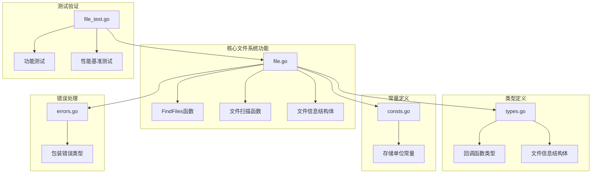
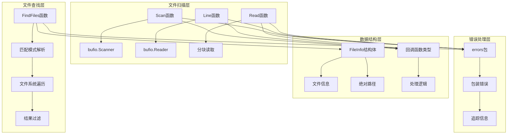
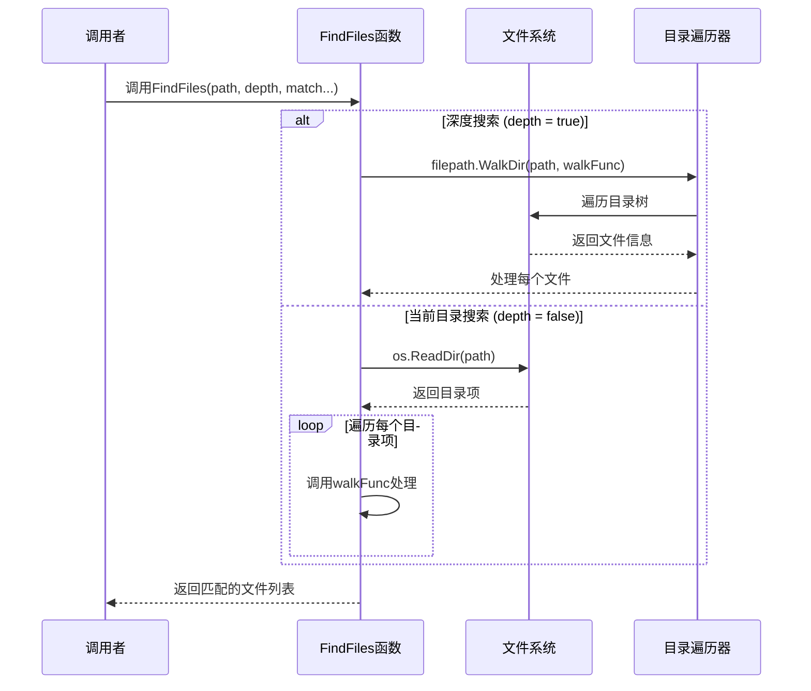
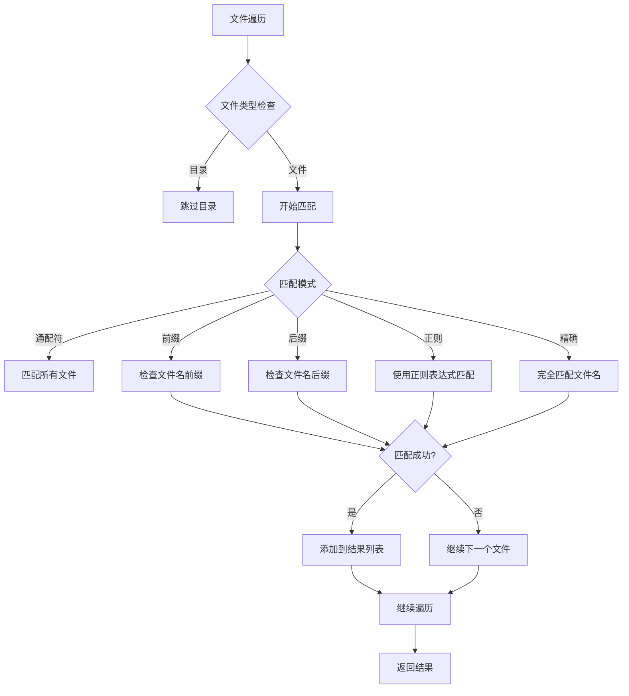
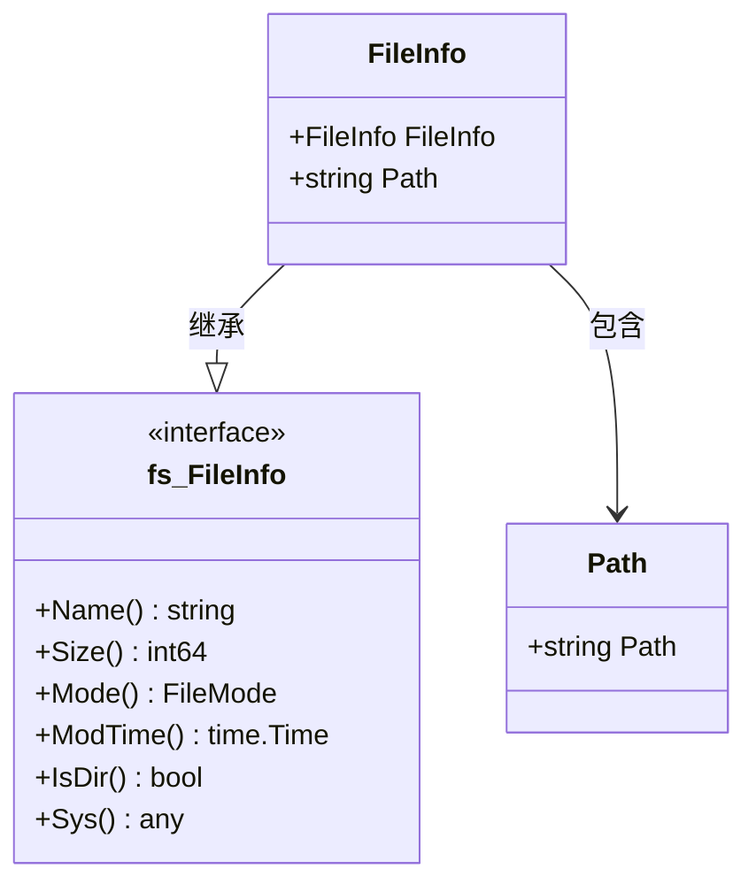
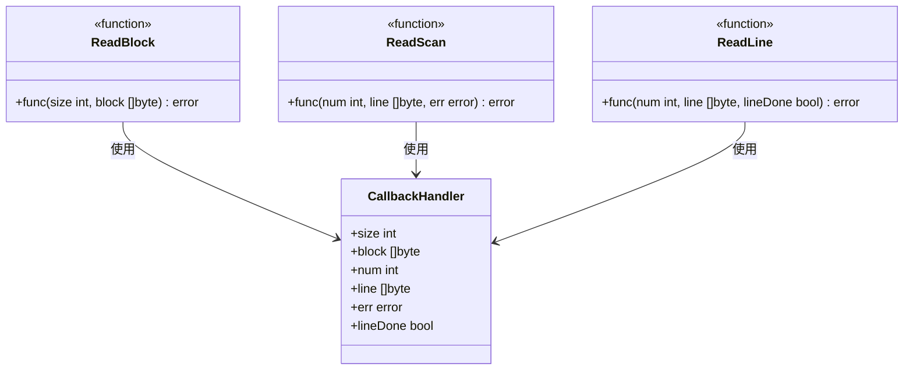
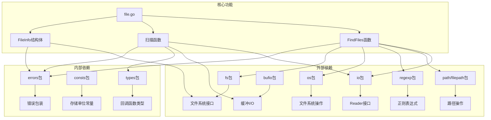
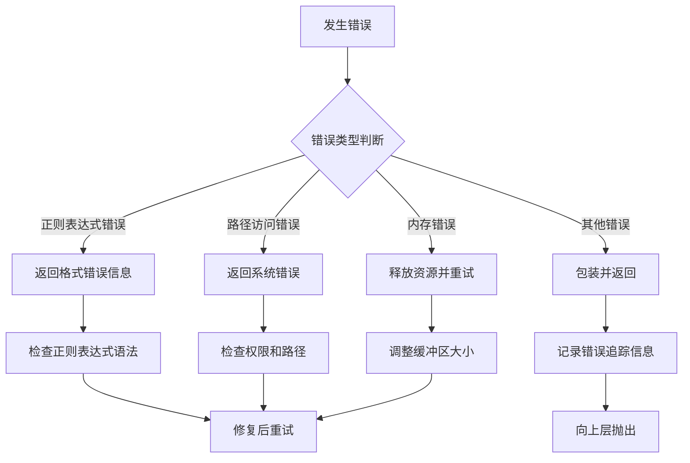

# 文件查找和扫描

<cite>
**本文档引用的文件**
- [file.go](file://file.go)
- [file_test.go](file://file_test.go)
- [types.go](file://types.go)
- [consts.go](file://consts.go)
- [errors.go](file://errors/errors.go)
- [README.md](file://README.md)
- [go.mod](file://go.mod)
</cite>

## 目录

1. [简介](#简介)
2. [项目结构](#项目结构)
3. [核心组件](#核心组件)
4. [架构概览](#架构概览)
5. [详细组件分析](#详细组件分析)
6. [依赖关系分析](#依赖关系分析)
7. [性能考虑](#性能考虑)
8. [故障排除指南](#故障排除指南)
9. [结论](#结论)
10. [附录](#附录)

## 简介

本文档详细介绍Go-utils库中的文件查找和扫描功能。该库提供了强大的文件系统操作能力，包括多模式文件查找、精确匹配、前缀匹配、后缀匹配和正则表达式匹配，以及高效的文件扫描功能，涵盖行扫描、高效行读取和分块读取三种方式。

## 项目结构

Go-utils项目采用模块化设计，主要功能集中在单个文件中，通过清晰的函数分离实现不同功能：



**图表来源**

- [file.go](file://file.go#L1-L451)
- [types.go](file://types.go#L76-L97)
- [consts.go](file://consts.go#L12-L22)
- [errors.go](file://errors/errors.go#L1-L282)

**章节来源**

- [file.go](file://file.go#L1-L451)
- [go.mod](file://go.mod#L1-L4)

## 核心组件

### 文件查找功能

文件查找功能通过`FindFiles`函数实现，支持多种匹配模式：

- **精确匹配** (`e`模式)：完全匹配文件名
- **前缀匹配** (`p`模式)：匹配以指定前缀开头的文件
- **后缀匹配** (`s`模式)：匹配以指定后缀结尾的文件
- **正则表达式匹配** (`r`模式)：使用正则表达式进行复杂匹配
- **通配符匹配** (`*`模式)：匹配所有文件

### 文件扫描功能

文件扫描功能提供三种不同的读取方式：

- **行扫描** (`Scan`)：逐行读取文件内容
- **高效行读取** (`Line`)：优化的大文件行读取
- **分块读取** (`Read`)：适用于大文件和无换行文件的分块读取

**章节来源**

- [file.go](file://file.go#L89-L225)
- [types.go](file://types.go#L76-L97)

## 架构概览

文件查找和扫描功能的架构设计体现了高内聚、低耦合的原则：



**图表来源**

- [file.go](file://file.go#L83-L87)
- [file.go](file://file.go#L227-L309)
- [errors.go](file://errors/errors.go#L14-L53)

## 详细组件分析

### FindFiles函数详解

`FindFiles`函数是文件查找功能的核心，实现了多模式匹配和深度搜索控制。

#### 函数签名和参数

```go
func FindFiles(path string, depth bool, match ...string) (files []FileInfo, err error)
```

参数说明：

- `path`：目标目录路径
- `depth`：搜索深度控制
    - `true`：深度搜索，遍历整个目录树
    - `false`：当前目录搜索，仅遍历当前目录
- `match`：可变参数，包含匹配规则

#### 匹配模式解析

```mermaid
flowchart TD
A[开始匹配解析] --> B{match参数数量}
B --> |0个| C[使用通配符模式]
B --> |1个| D{参数是否为"*"}
D --> |是| C
D --> |否| E[设置为精确匹配模式]
B --> |≥2个| F{第一个参数是否有效}
F --> |有效| G[解析匹配模式]
F --> |无效| H[返回错误]
G --> I{模式类型}
I --> |通配符| C
I --> |前缀| J[设置前缀匹配]
I --> |后缀| K[设置后缀匹配]
I --> |正则| L[编译正则表达式]
I --> |精确| E
L --> M[验证正则表达式]
M --> |错误| H
M --> |成功| N[继续处理]
```

**图表来源**

- [file.go](file://file.go#L101-L136)

#### 深度搜索与当前目录搜索



**图表来源**

- [file.go](file://file.go#L195-L223)

#### 匹配算法实现



**图表来源**

- [file.go](file://file.go#L139-L193)

**章节来源**

- [file.go](file://file.go#L89-L225)

### FileInfo结构体设计

`FileInfo`结构体扩展了标准库的`fs.FileInfo`接口，增加了路径信息：



**图表来源**

- [file.go](file://file.go#L83-L87)

#### Path字段的作用

`Path`字段存储文件的绝对路径，这对于以下场景至关重要：

- **跨目录操作**：确保文件路径的唯一性和准确性
- **后续处理**：为其他文件操作提供完整路径信息
- **调试输出**：便于错误诊断和日志记录

**章节来源**

- [file.go](file://file.go#L83-L87)

### 文件扫描功能详解

文件扫描功能提供了三种不同的读取方式，每种都有其特定的使用场景和性能特征。

#### Scan函数 - 行扫描

```mermaid
flowchart TD
A[开始Scan函数] --> B[创建bufio.Scanner]
B --> C{是否指定缓冲区大小}
C --> |是| D[设置Scanner缓冲区]
C --> |否| E[使用默认缓冲区]
D --> F[初始化行号计数器]
E --> F
F --> G[循环读取行]
G --> H{Scanner.Scan()返回}
H --> |true| I[处理当前行]
H --> |false| J{是否有错误}
I --> K{处理函数返回}
K --> |DONE| L[正常结束]
K --> |其他错误| M[包装并返回错误]
K --> |正常| N[继续下一行]
J --> |EOF| L
J --> |其他错误| M
N --> G
```

**图表来源**

- [file.go](file://file.go#L227-L253)

#### Line函数 - 高效行读取

```mermaid
flowchart TD
A[开始Line函数] --> B[创建bufio.Reader]
B --> C[初始化行号计数器]
C --> D[循环读取行]
D --> E[reader.ReadLine()]
E --> F{读取状态}
F --> |isPrefix=true| G[行数据未完整读取]
F --> |isPrefix=false| H[行数据完整]
G --> I[行号不增加]
H --> J[行号递增]
I --> K{处理函数返回}
J --> K
K --> |DONE| L[正常结束]
K --> |其他错误| M[包装并返回错误]
K --> |正常| D
M --> N[错误处理]
N --> O[返回错误]
```

**图表来源**

- [file.go](file://file.go#L255-L283)

#### Read函数 - 分块读取

```mermaid
flowchart TD
A[开始Read函数] --> B[创建固定大小的缓冲区]
B --> C[循环读取数据块]
C --> D[r.Read(buffer)]
D --> E{n > 0?}
E --> |是| F[处理数据块]
E --> |否| G{错误处理}
F --> H{处理函数返回}
H --> |DONE| I[正常结束]
H --> |其他错误| J[包装并返回错误]
H --> |正常| C
G --> |EOF| K[重置错误为nil]
G --> |其他错误| J
K --> L[返回nil]
J --> M[返回错误]
C --> N{n = 0?}
N --> |是| L
```

**图表来源**

- [file.go](file://file.go#L285-L309)

**章节来源**

- [file.go](file://file.go#L227-L309)

### 回调函数类型定义

文件扫描功能通过回调函数实现灵活的数据处理：



**图表来源**

- [types.go](file://types.go#L76-L97)

**章节来源**

- [types.go](file://types.go#L76-L97)

## 依赖关系分析

文件查找和扫描功能的依赖关系体现了清晰的层次结构：



**图表来源**

- [file.go](file://file.go#L3-L16)
- [types.go](file://types.go#L76-L97)
- [consts.go](file://consts.go#L12-L22)
- [errors.go](file://errors/errors.go#L1-L282)

**章节来源**

- [file.go](file://file.go#L3-L16)
- [types.go](file://types.go#L76-L97)
- [consts.go](file://consts.go#L12-L22)

## 性能考虑

### 文件查找性能优化

1. **深度搜索vs当前目录搜索**
    - 深度搜索：适合需要遍历整个目录树的场景，但性能较低
    - 当前目录搜索：仅遍历当前目录，性能更高，适合限定范围的查找

2. **匹配模式选择**
    - 精确匹配：性能最佳，适合已知具体文件名的场景
    - 前缀/后缀匹配：性能良好，适合模糊匹配
    - 正则表达式匹配：功能强大但性能相对较低

3. **内存管理**
    - 使用`FileInfo`结构体避免重复的文件信息查询
    - 合理使用缓冲区大小，避免内存浪费

### 文件扫描性能优化

1. **行扫描(Scan)**
    - 适合大多数文本文件处理场景
    - 默认缓冲区大小为64KB，可根据需要调整
    - 适合逐行处理的场景

2. **高效行读取(Line)**
    - 专为大文件设计，性能略优于行扫描
    - 处理超大行数据时表现更好
    - 适合需要精确行号控制的场景

3. **分块读取(Read)**
    - 适合处理超大文件和无换行文件
    - 提供最大的灵活性
    - 需要手动处理数据边界

**章节来源**

- [file.go](file://file.go#L227-L309)
- [file_test.go](file://file_test.go#L209-L497)

## 故障排除指南

### 常见错误类型

1. **正则表达式错误**
   ```go
   // 错误示例：格式错误的正则表达式
   FindFiles(path, false, "r", "^[[A-z]{2,4})_test.go")
   ```

2. **路径访问错误**
    - 权限不足
    - 路径不存在
    - 磁盘空间不足

3. **内存溢出**
    - 处理超大文件时内存不足
    - 缓冲区设置过大

### 错误处理策略



**图表来源**

- [file.go](file://file.go#L121-L136)
- [errors.go](file://errors/errors.go#L14-L53)

### 最佳实践

1. **文件查找最佳实践**
    - 优先使用精确匹配减少匹配开销
    - 对于大量文件的场景，考虑使用前缀或后缀匹配
    - 合理设置搜索深度，避免不必要的遍历

2. **文件扫描最佳实践**
    - 小文件：使用行扫描(Scan)
    - 大文件：使用高效行读取(Line)
    - 超大文件：使用分块读取(Read)
    - 合理设置缓冲区大小，避免内存浪费

3. **错误处理最佳实践**
    - 始终检查返回的错误
    - 使用DONE常量优雅地终止处理
    - 记录详细的错误追踪信息

**章节来源**

- [file.go](file://file.go#L121-L136)
- [errors.go](file://errors/errors.go#L14-L53)

## 结论

Go-utils库的文件查找和扫描功能提供了全面而高效的文件系统操作能力。通过多模式匹配和三种不同的扫描方式，开发者可以根据具体需求选择最适合的方案。

关键优势：

- **灵活性**：支持多种匹配模式和读取方式
- **性能**：针对不同场景优化，提供最佳性能
- **易用性**：简洁的API设计，易于理解和使用
- **可靠性**：完善的错误处理和资源管理

建议在实际项目中根据文件大小、匹配复杂度和性能要求选择合适的函数，并遵循最佳实践来确保系统的稳定性和效率。

## 附录

### 使用示例

#### 文件查找示例

```go
// 查找所有文件
files, err := utils.FindFiles("./", true)

// 查找特定前缀的文件
files, err := utils.FindFiles("./", false, "p", "config")

// 使用正则表达式匹配
files, err := utils.FindFiles("./", true, "r", `^.*\.go$`)
```

#### 文件扫描示例

```go
// 行扫描
err := utils.Scan(fileReader, func(num int, line []byte, err error) error {
    // 处理每一行
    return nil
})

// 分块读取
err := utils.Read(fileReader, func(size int, block []byte) error {
    // 处理数据块
    return nil
})
```

### 性能基准测试

项目包含完整的性能基准测试，可以参考以下测试结果：

- **Scan函数**：适合大多数文本文件处理
- **Line函数**：大文件行读取性能更优
- **Read函数**：超大文件处理的最佳选择

这些测试结果为选择合适的扫描方式提供了量化依据。

**章节来源**

- [file_test.go](file://file_test.go#L141-L497)
- [README.md](file://README.md#L1480-L1519)