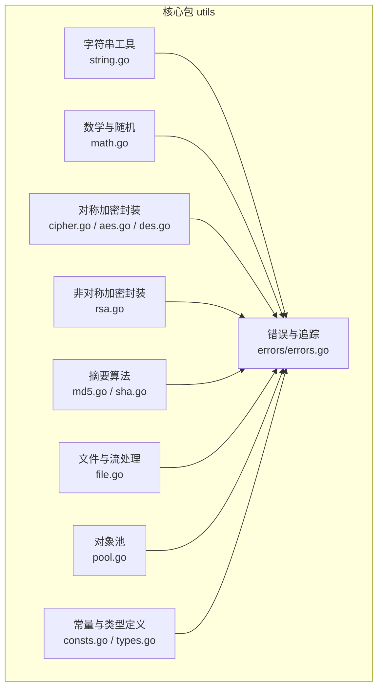
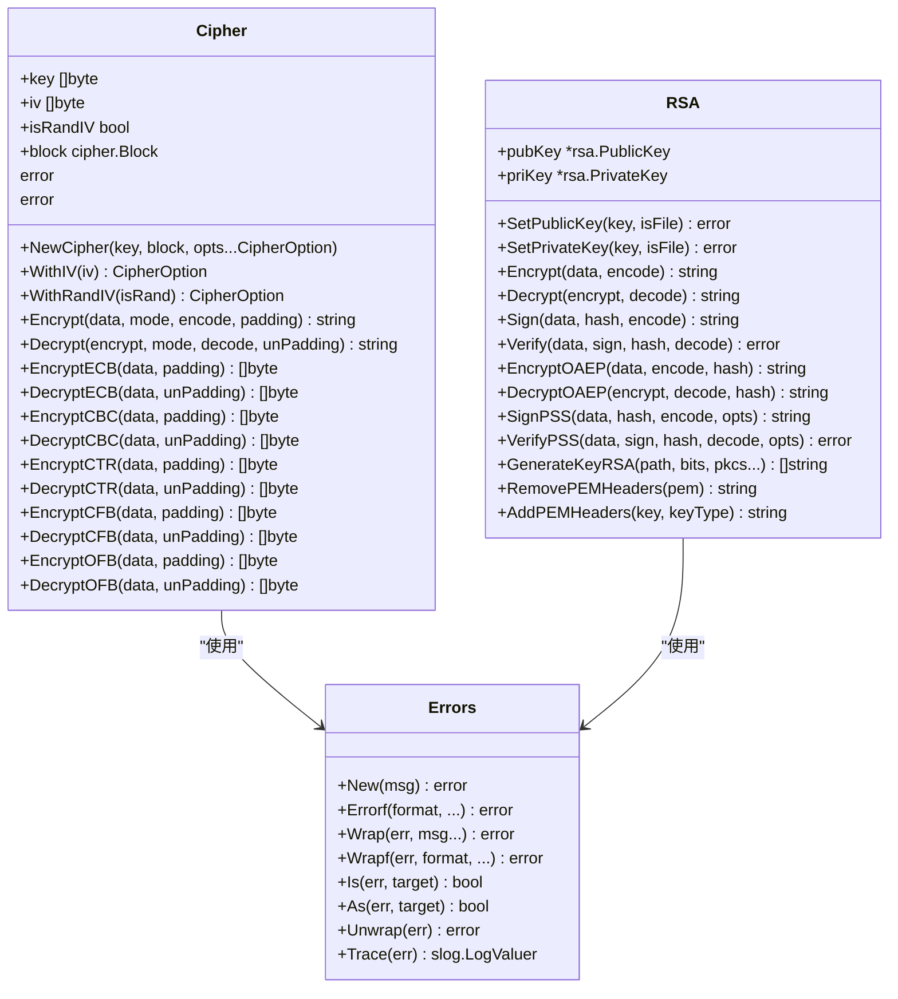
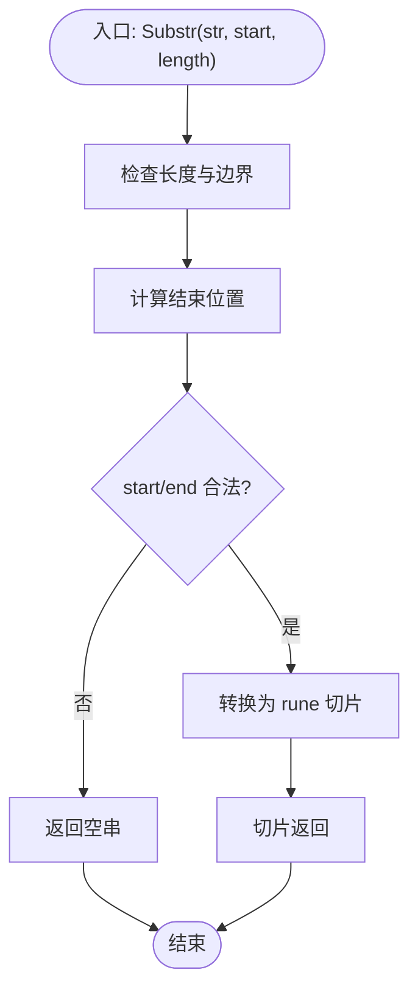
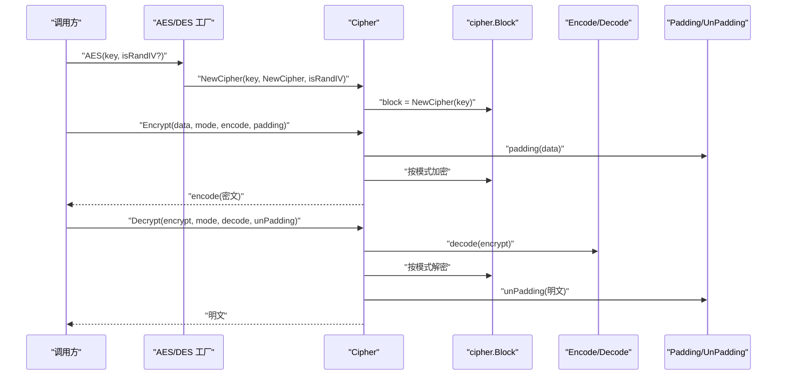
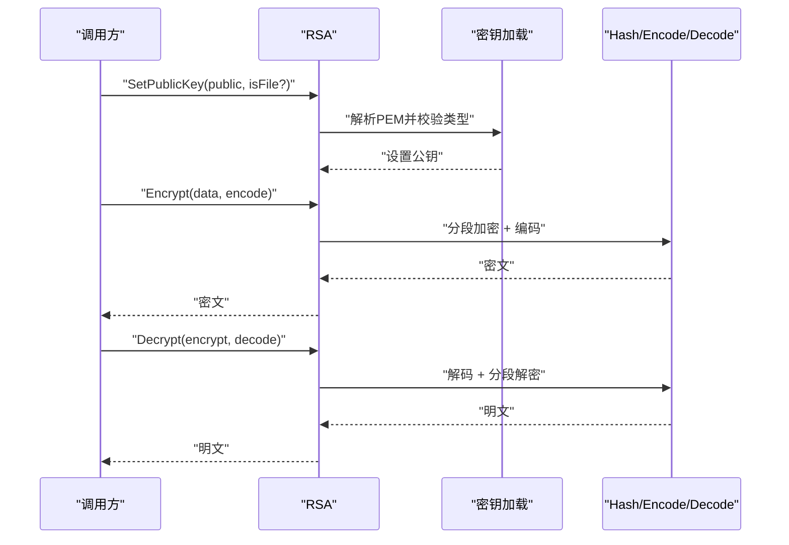
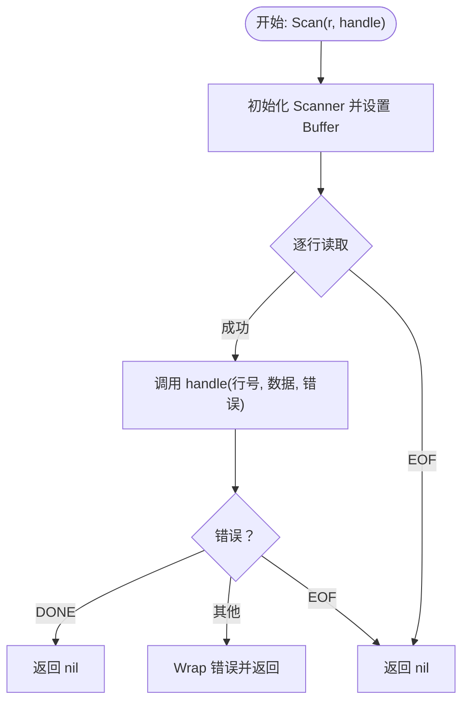
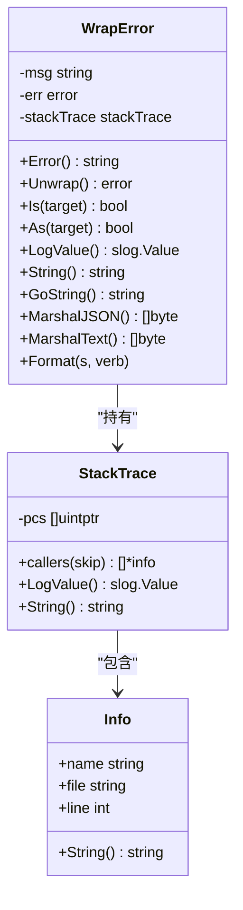
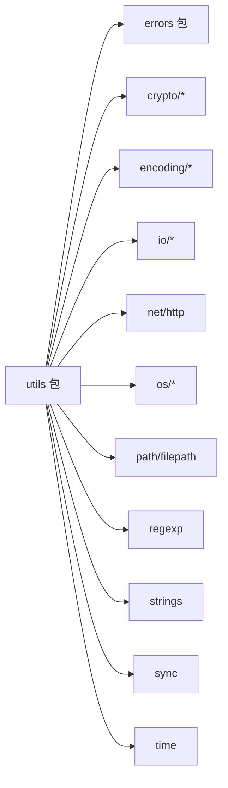

# 代码组织与架构

<cite>
**本文引用的文件列表**
- [go.mod](file://go.mod)
- [README.md](file://README.md)
- [consts.go](file://consts.go)
- [types.go](file://types.go)
- [errors/errors.go](file://errors/errors.go)
- [string.go](file://string.go)
- [math.go](file://math.go)
- [aes.go](file://aes.go)
- [cipher.go](file://cipher.go)
- [rsa.go](file://rsa.go)
- [sha.go](file://sha.go)
- [md5.go](file://md5.go)
- [file.go](file://file.go)
- [pool.go](file://pool.go)
- [example_test.go](file://example_test.go)
</cite>

## 目录

1. [简介](#简介)
2. [项目结构](#项目结构)
3. [核心组件](#核心组件)
4. [架构总览](#架构总览)
5. [详细组件分析](#详细组件分析)
6. [依赖关系分析](#依赖关系分析)
7. [性能考量](#性能考量)
8. [故障排查指南](#故障排查指南)
9. [结论](#结论)
10. [附录](#附录)

## 简介

本指南面向 Go Utils
库，系统阐述其代码组织与架构设计，覆盖包结构设计原则、模块划分、依赖管理、接口设计、代码复用策略、架构模式应用（工厂、策略、适配器）、命名与风格规范、测试组织与持续集成建议，以及大型项目演进与重构策略。目标是帮助读者快速理解并高效扩展该工具库。

## 项目结构

- 单包多文件组织：所有功能集中在统一包内，便于导入与复用，同时通过文件职责划分实现模块化。
- 功能域划分：
    -
    字符串与基础工具：string.go、strconv.go、reverse.go、map.go、slices.go、time.go、runtime.go、once.go、zero.go、env.go、html.go、url.go、ip.go、regexp.go、base64.go、json.go、curl.go、response.go、misce.go、pool.go、file.go、tar.go、zip.go、md5.go、sha.go、pkcs7.go、des.go、aes.go、cipher.go、rsa.go、cipher_test.go、md5_test.go、sha_test.go、pkcs7_test.go、des_test.go、aes_test.go、rsa_test.go、file_test.go、string_test.go、strconv_test.go、map_test.go、slices_test.go、time_test.go、runtime_test.go、env_test.go、curl_test.go、response_test.go、ip_test.go、regexp_test.go、base64_test.go、json_test.go、html_test.go、url_test.go、zero_test.go、tar_test.go、zip_test.go、example_test.go。
    - 错误与追踪：errors/errors.go。
    - 常量与类型：consts.go、types.go。
- 版本与模块：go.mod 指定模块名为 github.com/Is999/go-utils，Go 版本要求 1.22。

**图表来源**

- [string.go](file://string.go#L1-L187)
- [math.go](file://math.go#L1-L37)
- [cipher.go](file://cipher.go#L1-L498)
- [aes.go](file://aes.go#L1-L23)
- [rsa.go](file://rsa.go#L1-L527)
- [md5.go](file://md5.go#L1-L13)
- [sha.go](file://sha.go#L1-L27)
- [file.go](file://file.go#L1-L451)
- [pool.go](file://pool.go#L1-L34)
- [consts.go](file://consts.go#L1-L23)
- [types.go](file://types.go#L1-L98)
- [errors/errors.go](file://errors/errors.go#L1-L282)

**章节来源**

- [go.mod](file://go.mod#L1-L4)
- [README.md](file://README.md#L1-L3892)

## 核心组件

- 类型与常量层：通过泛型接口与常量定义抽象数字、字符串、切片排序、加密模式与存储单位，形成跨模块共享的契约。
- 工具函数层：围绕字符串、数学、文件、网络、加密、摘要等高频场景提供简洁 API。
- 错误与追踪层：统一错误包装与堆栈追踪，兼容 slog 日志，便于定位问题。
- 加密封装层：对称加密（AES/DES）与非对称加密（RSA）的统一接口，支持多种填充与编码方式。

**章节来源**

- [consts.go](file://consts.go#L1-L23)
- [types.go](file://types.go#L1-L98)
- [errors/errors.go](file://errors/errors.go#L1-L282)

## 架构总览

- 单包单模块：避免跨包循环依赖，简化导入与发布。
- 分层与解耦：
    - 类型与常量层：提供跨文件共享的类型别名与接口。
    - 工具函数层：面向具体任务的函数集合，尽量无副作用。
    - 错误与追踪层：集中处理错误包装与日志追踪，向上游暴露一致的错误语义。
    - 加密封装层：通过接口与工厂函数屏蔽底层差异，提供统一的加密/解密 API。
- 数据与控制流：
    - 输入参数校验与错误包装贯穿各层。
    - 加密流程通过 Cipher 结构体组合不同模式与填充策略，解耦调用方与实现细节。
    - 文件处理通过 Reader/Writer 抽象与回调接口，支持大文件与流式处理。

**图表来源**

- [cipher.go](file://cipher.go#L20-L498)
- [rsa.go](file://rsa.go#L18-L527)
- [errors/errors.go](file://errors/errors.go#L14-L82)

## 详细组件分析

### 字符串工具与通用函数

- 设计要点：
    - 提供字符串截取、反转、替换、随机字符串生成、唯一 ID 生成等高频能力。
    - 通过常量与辅助函数统一字符集与随机源，减少重复实现。
- 复用策略：
    - 将通用逻辑抽取为独立函数，如替换、随机生成、唯一 ID，便于单元测试与复用。
- 性能注意：
    - 截取使用 rune 切片确保宽字符安全；随机字符串生成避免不必要的内存分配。

**图表来源**

- [string.go](file://string.go#L38-L84)

**章节来源**

- [string.go](file://string.go#L1-L187)

### 数学与随机

- 设计要点：
    - 提供区间随机数与浮点数四舍五入，统一随机源以提升批量生成效率。
- 复用策略：
    - 将随机源作为可选参数，支持外部注入，便于测试与性能优化。

**章节来源**

- [math.go](file://math.go#L1-L37)

### 对称加密封装（Cipher/AES/DES）

- 设计要点：
    - 通过 Cipher 结构体统一密钥、IV、块大小与模式选择，支持 ECB/CBC/CTR/CFB/OFB。
    - 通过接口（Encode/Decode/Padding/UnPadding/CipherBlock）解耦编码、填充与底层 Block。
- 工厂与策略：
    - AES/DES 提供工厂函数，根据密钥长度与模式选择底层 Block。
- 适配器：
    - Encode/Decode 适配 hex/base64 等编码，Padding/UnPadding 适配 PKCS7/Zero 填充。

**图表来源**

- [aes.go](file://aes.go#L8-L22)
- [cipher.go](file://cipher.go#L20-L498)
- [types.go](file://types.go#L44-L74)

**章节来源**

- [aes.go](file://aes.go#L1-L23)
- [cipher.go](file://cipher.go#L1-L498)
- [types.go](file://types.go#L1-L98)

### 非对称加密封装（RSA）

- 设计要点：
    - 支持 PKCS1/PKCS8 公私钥格式，提供多种签名与验签方式（PKCS1v15、PSS、OAEP）。
    - 支持长文本分段加解密与编码/解码。
- 复用策略：
    - 通过公共方法封装 PEM 头尾处理与密钥生成，降低调用复杂度。

**图表来源**

- [rsa.go](file://rsa.go#L23-L331)

**章节来源**

- [rsa.go](file://rsa.go#L1-L527)

### 摘要算法（MD5/SHA）

- 设计要点：
    - 提供常用摘要算法的便捷封装，统一返回十六进制字符串。
- 复用策略：
    - 保持函数级 API，便于直接替换标准库调用。

**章节来源**

- [md5.go](file://md5.go#L1-L13)
- [sha.go](file://sha.go#L1-L27)

### 文件与流处理

- 设计要点：
    - 提供文件存在性判断、复制、大小格式化、类型检测。
    - 通过回调接口 ReadBlock/ReadScan/ReadLine 支持大文件与流式处理，统一 DONE 终止信号。
- 并发与资源：
    - WriteFile 使用互斥锁保护写入，支持缓冲写入与关闭。

**图表来源**

- [file.go](file://file.go#L227-L253)

**章节来源**

- [file.go](file://file.go#L1-L451)

### 对象池（Pool）

- 设计要点：
    - 泛型对象池，支持可选重置函数，降低频繁分配/回收成本。
- 复用策略：
    - 在高并发或高频分配场景中复用对象，减少 GC 压力。

**章节来源**

- [pool.go](file://pool.go#L1-L34)

### 错误与追踪（errors）

- 设计要点：
    - 统一错误包装与链式追踪，实现 slog.LogValuer 接口，支持 JSON 文本序列化。
    - 提供 Is/As/Unwrap 与 Trace 辅助函数，便于日志与调试。
- 复用策略：
    - 所有工具函数返回错误均通过 Wrap/Errorf/New 包装，保证一致性。

**图表来源**

- [errors/errors.go](file://errors/errors.go#L140-L282)

**章节来源**

- [errors/errors.go](file://errors/errors.go#L1-L282)

## 依赖关系分析

- 内部依赖：
    - 工具函数普遍依赖 errors 包进行错误包装与日志追踪。
    - 加密相关模块依赖 types.go 中的接口与常量。
- 外部依赖：
    - 标准库：crypto/*、encoding/*、io/*、net/http、os/*、path/filepath、regexp、strings、sync、time 等。
    - 通过 go.mod 管理模块版本与 Go 版本约束。

**图表来源**

- [cipher.go](file://cipher.go#L3-L8)
- [rsa.go](file://rsa.go#L3-L16)
- [file.go](file://file.go#L3-L16)
- [errors/errors.go](file://errors/errors.go#L3-L12)

**章节来源**

- [go.mod](file://go.mod#L1-L4)

## 性能考量

- 字符串处理：使用 rune 切片进行宽字符安全截取，避免错误的字节切片导致乱码。
- 随机生成：批量生成时复用随机源，减少种子初始化开销。
- 加密：CBC/CTR/CFB/OFB 模式支持随机 IV，提高安全性；分段处理长文本，避免一次性加载。
- 文件处理：优先使用流式读取与缓冲写入，避免大文件内存占用过高。
- 对象池：在高并发场景中使用对象池降低分配与 GC 压力。

[本节为通用指导，无需列出具体文件来源]

## 故障排查指南

- 常见错误来源：
    - 密钥长度不合法：AES/DES/RSA 密钥长度不符合规范时会报错。
    - IV 长度不匹配：CBC/CTR/CFB/OFB 模式下 IV 长度需与块大小一致。
    - 模式错误：Encrypt/Decrypt 传入未知模式会返回错误。
    - 文件操作：路径不存在、权限不足、句柄未关闭等问题。
- 排查建议：
    - 使用 errors.Trace 输出堆栈信息，结合 slog 记录定位问题。
    - 在单元测试中覆盖边界条件（空输入、超长输入、非法参数）。
    - 对长文本加密/解密场景，确认分段逻辑与编码/解码一致。

**章节来源**

- [cipher.go](file://cipher.go#L42-L99)
- [rsa.go](file://rsa.go#L53-L144)
- [file.go](file://file.go#L50-L81)
- [errors/errors.go](file://errors/errors.go#L74-L82)

## 结论

该工具库以“单包多文件”为核心组织形式，通过类型与常量层抽象、工具函数层实现、错误与追踪层收敛，构建出清晰、可复用且易于扩展的架构。加密封装采用接口与工厂/策略模式，文件处理采用回调与流式抽象，对象池与随机源优化性能。建议在大型项目中遵循本文的命名规范、测试组织与持续集成建议，以保障代码质量与演进稳定性。

[本节为总结，无需列出具体文件来源]

## 附录

### 命名规范与代码风格

- 包与模块
    - 包名使用小写、简短、语义明确；模块名遵循 go.mod 命令约定。
- 函数与方法
    - 动词+名词结构，如 Encrypt、Decrypt、FindFiles、Scan。
    - 首字母大写导出，遵循 Go 命名约定。
- 类型与接口
    - 结构体首字母大写；接口以 -er 结尾或抽象语义命名，如 Encode、Decode、Padding。
- 常量与变量
    - 常量全大写并以下划线分隔；变量采用驼峰命名。
- 注释与文档
    - 函数/方法注释说明用途、参数、返回值与注意事项。
    - 关键流程与边界条件需在注释中体现。

[本节为通用规范，无需列出具体文件来源]

### 单元测试组织与示例

- 测试文件命名：与被测文件同名并以 _test.go 结尾。
- 示例测试：example_test.go 展示 HTTP 响应与视图渲染示例，便于集成演示。
- 断言与覆盖率：使用标准库 testing，关注边界与异常分支。

**章节来源**

- [example_test.go](file://example_test.go#L1-L108)

### 持续集成与版本演进

- 版本要求：Go 1.22，确保新特性（如泛型、随机库 v2）可用。
- 迁移建议：
    - 移除过时 API（如内置 Max/Min 替代、slog 替代 Logger）。
    - 逐步引入泛型与更严格的类型约束，提升类型安全。
- CI 建议：
    - 覆盖所有平台与 Go 版本矩阵。
    - 引入静态分析（如 go vet、staticcheck）与覆盖率报告。
    - 对加密与文件处理场景增加压力与边界测试。

**章节来源**

- [go.mod](file://go.mod#L1-L4)
- [README.md](file://README.md#L18-L28)