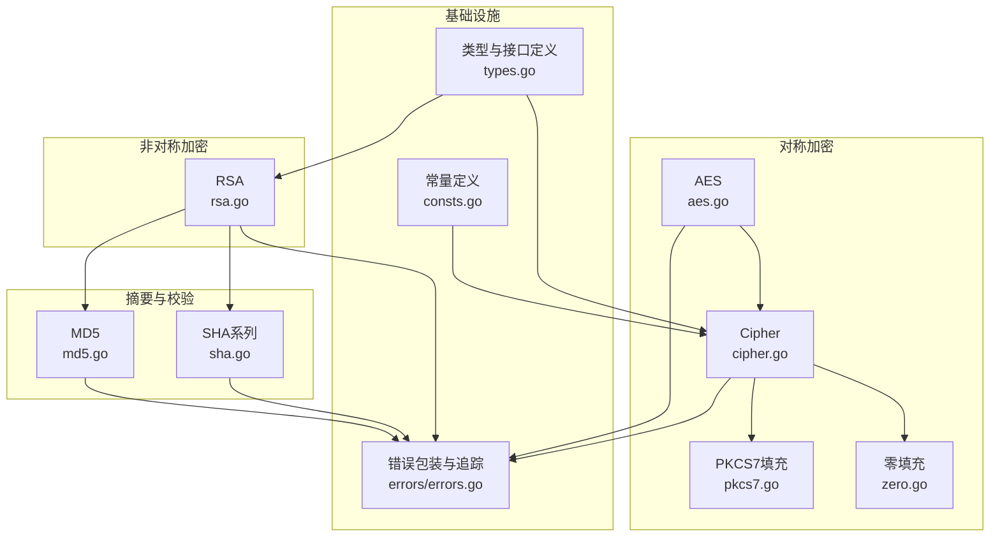
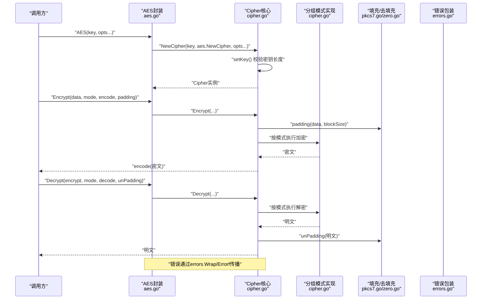
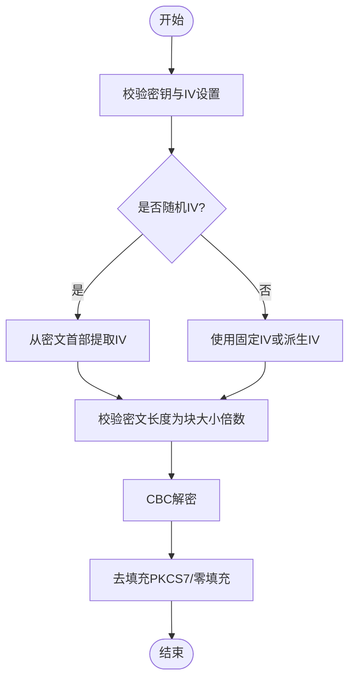
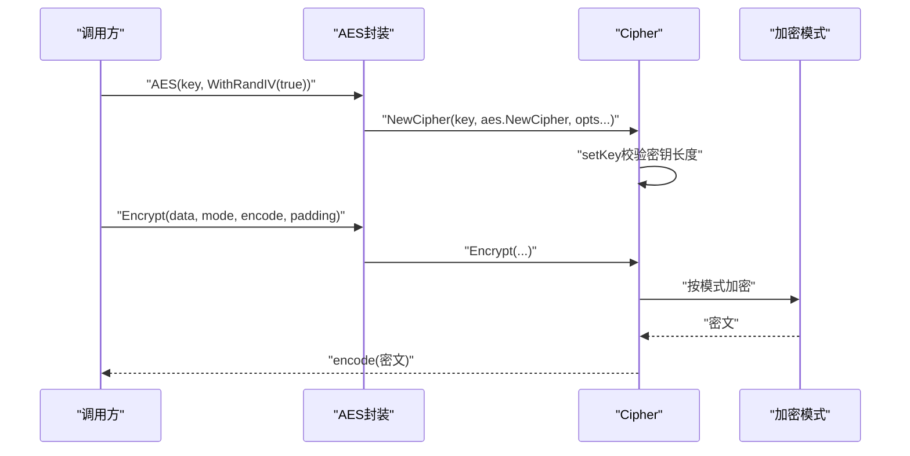
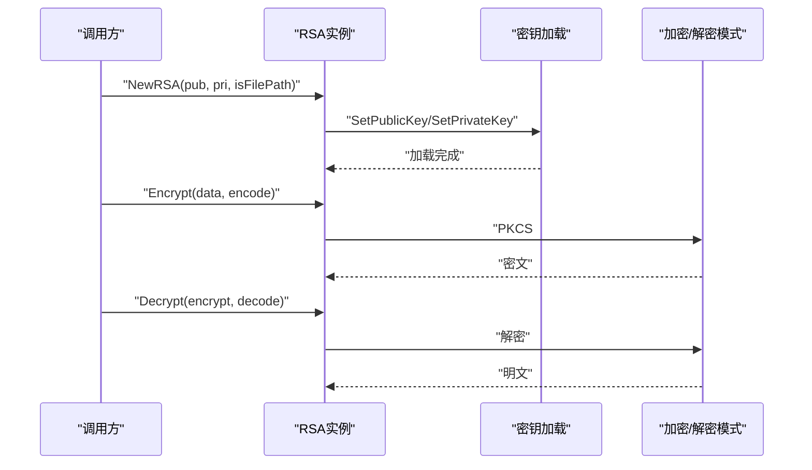
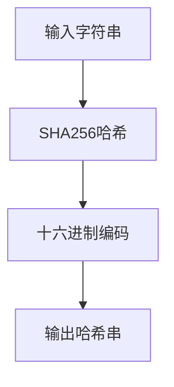
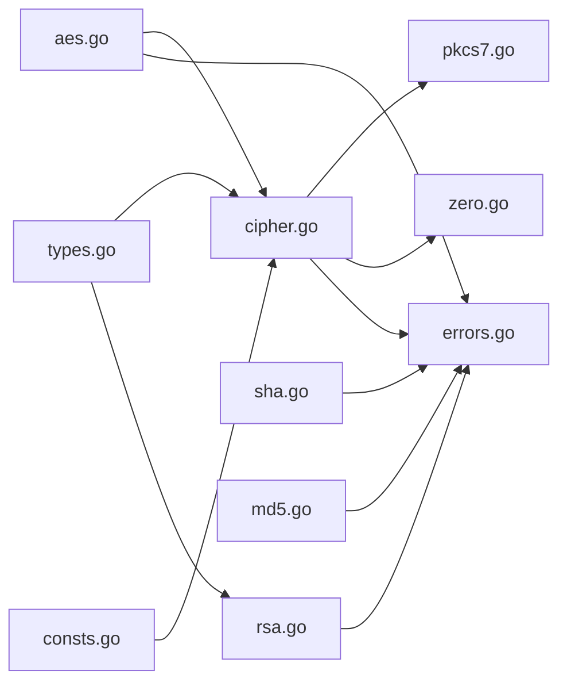

# 安全性考虑

<cite>
**本文引用的文件**
- [aes.go](file://aes.go)
- [cipher.go](file://cipher.go)
- [rsa.go](file://rsa.go)
- [sha.go](file://sha.go)
- [md5.go](file://md5.go)
- [pkcs7.go](file://pkcs7.go)
- [zero.go](file://zero.go)
- [errors.go](file://errors/errors.go)
- [consts.go](file://consts.go)
- [types.go](file://types.go)
- [aes_test.go](file://aes_test.go)
- [rsa_test.go](file://rsa_test.go)
- [cipher_test.go](file://cipher_test.go)
- [md5_test.go](file://md5_test.go)
- [sha_test.go](file://sha_test.go)
</cite>

## 目录

1. [引言](#引言)
2. [项目结构](#项目结构)
3. [核心组件](#核心组件)
4. [架构总览](#架构总览)
5. [详细组件分析](#详细组件分析)
6. [依赖关系分析](#依赖关系分析)
7. [性能考量](#性能考量)
8. [故障排查指南](#故障排查指南)
9. [结论](#结论)
10. [附录](#附录)

## 引言

本指南面向Go Utils库的安全性最佳实践，聚焦以下目标：

- 加密算法选择原则：AES、RSA等算法的安全强度评估与适用场景
- 密钥管理最佳实践：密钥生成、存储、轮换与销毁
- 输入验证与数据清理：防范注入攻击与数据污染
- 安全编码实践：错误处理、日志记录与敏感信息保护
- 常见安全漏洞与防护措施，以及安全审计与合规性检查要点

本指南基于仓库现有实现进行分析与提炼，帮助读者在使用该库时遵循安全规范。

## 项目结构

该库围绕“对称加密（AES/DES）”“非对称加密（RSA）”“摘要算法（SHA/MD5）”“填充与解填充（PKCS7/零填充）”“错误包装与追踪（errors）”“类型与常量定义（types/consts）”等模块组织，形成清晰的分层与职责边界。

图表来源

- [aes.go](file://aes.go#L1-L23)
- [cipher.go](file://cipher.go#L1-L498)
- [rsa.go](file://rsa.go#L1-L527)
- [sha.go](file://sha.go#L1-L27)
- [md5.go](file://md5.go#L1-L13)
- [pkcs7.go](file://pkcs7.go#L1-L31)
- [zero.go](file://zero.go#L1-L29)
- [errors.go](file://errors/errors.go#L1-L282)
- [types.go](file://types.go#L1-L98)
- [consts.go](file://consts.go#L1-L23)

章节来源

- [aes.go](file://aes.go#L1-L23)
- [cipher.go](file://cipher.go#L1-L498)
- [rsa.go](file://rsa.go#L1-L527)
- [sha.go](file://sha.go#L1-L27)
- [md5.go](file://md5.go#L1-L13)
- [pkcs7.go](file://pkcs7.go#L1-L31)
- [zero.go](file://zero.go#L1-L29)
- [errors.go](file://errors/errors.go#L1-L282)
- [types.go](file://types.go#L1-L98)
- [consts.go](file://consts.go#L1-L23)

## 核心组件

- 对称加密框架（Cipher）：统一管理密钥、IV、填充与多种分组模式（ECB/CBC/CTR/CFB/OFB），提供可插拔的编码/解码与填充方案。
- AES封装：对密钥长度进行严格校验（16/24/32字节），并支持随机IV与固定IV两种模式。
- RSA实现：支持公钥加密、私钥解密、签名与验签，兼容PKCS#1与OAEP两种填充；支持生成密钥对、PEM头处理。
- 摘要算法：SHA1/SHA256/SHA512与MD5，用于完整性校验与哈希用途。
- 填充工具：PKCS7与零填充，配套去填充函数，确保解密一致性。
- 错误体系：统一的错误包装与堆栈追踪，便于定位问题与审计。

章节来源

- [cipher.go](file://cipher.go#L20-L84)
- [aes.go](file://aes.go#L12-L22)
- [rsa.go](file://rsa.go#L18-L144)
- [sha.go](file://sha.go#L10-L26)
- [md5.go](file://md5.go#L8-L12)
- [pkcs7.go](file://pkcs7.go#L8-L30)
- [zero.go](file://zero.go#L8-L28)
- [errors.go](file://errors/errors.go#L14-L82)

## 架构总览

下图展示从调用方到具体加密/解密实现的交互流程，突出错误包装与填充链路。

图表来源

- [aes.go](file://aes.go#L12-L22)
- [cipher.go](file://cipher.go#L42-L497)
- [pkcs7.go](file://pkcs7.go#L8-L30)
- [zero.go](file://zero.go#L8-L28)
- [errors.go](file://errors/errors.go#L24-L53)

## 详细组件分析

### 对称加密框架（Cipher）

- 设计要点
    - 统一密钥与IV管理：支持随机IV与固定IV；随机IV时将IV置于密文首部，解密时自动提取。
    - 多模式支持：ECB/CBC/CTR/CFB/OFB，均要求明文按块大小对齐（CBC/ECB需填充）。
    - 可插拔编码：支持Base64/Hex等编码方式，便于跨系统传输。
- 安全建议
    - 优先使用CBC/CTR/CFB/OFB，避免ECB（明文模式泄露）。
    - 固定IV仅用于特定场景，通常启用随机IV以提升抗攻击能力。
    - 明确填充策略，推荐PKCS7，避免零填充导致的歧义。
- 关键流程（CBC解密）

图表来源

- [cipher.go](file://cipher.go#L173-L208)
- [pkcs7.go](file://pkcs7.go#L17-L30)
- [zero.go](file://zero.go#L17-L28)

章节来源

- [cipher.go](file://cipher.go#L20-L84)
- [cipher.go](file://cipher.go#L139-L208)
- [cipher.go](file://cipher.go#L210-L279)
- [cipher.go](file://cipher.go#L281-L350)
- [cipher.go](file://cipher.go#L352-L421)
- [cipher.go](file://cipher.go#L423-L497)
- [pkcs7.go](file://pkcs7.go#L8-L30)
- [zero.go](file://zero.go#L8-L28)

### AES封装（AES）

- 设计要点
    - 密钥长度严格校验（16/24/32字节），不符合将直接报错。
    - 支持随机IV模式，随机IV随密文下发，解密时自动解析。
- 安全建议
    - 优先选择256位密钥（32字节）以获得更强抗攻击能力。
    - 避免硬编码密钥，采用环境变量或安全密钥管理系统。
- 关键流程（AES加密）

图表来源

- [aes.go](file://aes.go#L12-L22)
- [cipher.go](file://cipher.go#L42-L171)

章节来源

- [aes.go](file://aes.go#L12-L22)
- [cipher.go](file://cipher.go#L42-L84)

### RSA实现（RSA）

- 设计要点
    - 支持公钥加密（PKCS#1 v1.5与OAEP）、私钥解密；支持私钥签名（PKCS#1 v1.5与PSS）、公钥验签。
    - 支持从文件或字符串加载密钥，自动识别PEM头与PKCS#1/PKCS#8格式。
    - 提供生成密钥对与PEM头增删工具。
- 安全建议
    - OAEP优于PKCS#1 v1.5用于加密；PSS优于PKCS#1 v1.5用于签名。
    - 私钥文件权限最小化，避免全局可读写；建议使用硬件安全模块（HSM）或密钥管理服务（KMS）。
    - 生成密钥时选择至少2048位（推荐4096位）。
- 关键流程（RSA加密/解密）

图表来源

- [rsa.go](file://rsa.go#L24-L144)
- [rsa.go](file://rsa.go#L162-L223)
- [rsa.go](file://rsa.go#L268-L331)

章节来源

- [rsa.go](file://rsa.go#L18-L144)
- [rsa.go](file://rsa.go#L162-L223)
- [rsa.go](file://rsa.go#L268-L331)
- [rsa.go](file://rsa.go#L377-L481)
- [rsa.go](file://rsa.go#L483-L526)

### 摘要与校验（SHA/MD5）

- 设计要点
    - 提供SHA1/SHA256/SHA512与MD5的便捷函数。
- 安全建议
    - 摘要算法仅用于完整性校验与非安全用途；签名应使用RSA/ECDSA等非对称算法。
    - 避免使用MD5与SHA1于安全场景（易受碰撞攻击）。
- 关键流程（SHA256）

图表来源

- [sha.go](file://sha.go#L16-L26)

章节来源

- [sha.go](file://sha.go#L10-L26)
- [md5.go](file://md5.go#L8-L12)

### 填充与解填充（PKCS7/零填充）

- 设计要点
    - PKCS7填充与去填充：保证明文长度与块大小对齐，去填充时校验合法性。
    - 零填充与去填充：简单但存在歧义，建议仅在明确兼容需求时使用。
- 安全建议
    - 默认使用PKCS7，避免零填充带来的语义模糊。
    - 去填充失败应视为解密错误，拒绝返回部分数据。

章节来源

- [pkcs7.go](file://pkcs7.go#L8-L30)
- [zero.go](file://zero.go#L8-L28)

### 错误包装与追踪（errors）

- 设计要点
    - 提供New/Errorf/Wrap/Wrapf等统一错误接口，支持堆栈追踪与多层包装。
    - Trace/LogValue便于日志系统记录调用栈。
- 安全建议
    - 不在错误信息中泄露敏感上下文（如密钥、密文）。
    - 在生产环境记录Trace以便审计，但注意日志脱敏。

章节来源

- [errors.go](file://errors/errors.go#L14-L82)
- [errors.go](file://errors/errors.go#L141-L250)

## 依赖关系分析

- 模块耦合
    - Cipher为核心，被AES与DES/3DES封装复用；填充模块独立，被Cipher各模式调用。
    - RSA与摘要模块相对独立，但依赖错误包装与类型定义。
- 外部依赖
    - 标准库crypto/*与encoding/*；错误包装依赖slog与runtime。
- 潜在风险
    - 模式选择不当（如ECB）可能暴露明文特征。
    - 填充不一致会导致解密失败或数据污染。

图表来源

- [aes.go](file://aes.go#L1-L23)
- [cipher.go](file://cipher.go#L1-L498)
- [rsa.go](file://rsa.go#L1-L527)
- [sha.go](file://sha.go#L1-L27)
- [md5.go](file://md5.go#L1-L13)
- [pkcs7.go](file://pkcs7.go#L1-L31)
- [zero.go](file://zero.go#L1-L29)
- [errors.go](file://errors/errors.go#L1-L282)
- [types.go](file://types.go#L1-L98)
- [consts.go](file://consts.go#L1-L23)

章节来源

- [aes.go](file://aes.go#L1-L23)
- [cipher.go](file://cipher.go#L1-L498)
- [rsa.go](file://rsa.go#L1-L527)
- [sha.go](file://sha.go#L1-L27)
- [md5.go](file://md5.go#L1-L13)
- [pkcs7.go](file://pkcs7.go#L1-L31)
- [zero.go](file://zero.go#L1-L29)
- [errors.go](file://errors/errors.go#L1-L282)
- [types.go](file://types.go#L1-L98)
- [consts.go](file://consts.go#L1-L23)

## 性能考量

- 模式选择
    - CTR/CFB/OFB为流模式，适合大块数据与低延迟场景；CBC/ECB需填充且存在并行限制。
- 填充开销
    - PKCS7去填充在解密后执行，增加少量CPU开销；零填充开销更低但安全性较差。
- 随机IV
    - 随机IV带来一次随机数生成与密文首部附加，但显著提升安全性。
- 建议
    - 大文件加密优先CTR；网络传输优先Base64编码；严格控制填充与编码链路。

## 故障排查指南

- 常见错误与定位
    - 密钥长度错误：检查AES/DES密钥长度（16/24/32字节或8字节）。
    - IV长度不匹配：确认块大小与IV长度一致。
    - 模式错误：确保加密/解密使用相同模式。
    - 填充异常：去填充失败通常由密文损坏或填充不一致引起。
    - RSA密钥格式：PEM头缺失或PKCS#1/PKCS#8格式不匹配。
- 日志与追踪
    - 使用Trace/LogValue记录调用栈，结合Wrap/Wrapf保留上下文。
- 测试参考
    - 单元测试覆盖了AES/RSA/Cipher/摘要等关键路径，可作为回归与集成测试基线。

章节来源

- [cipher.go](file://cipher.go#L42-L84)
- [aes.go](file://aes.go#L12-L22)
- [rsa.go](file://rsa.go#L57-L144)
- [errors.go](file://errors/errors.go#L74-L82)
- [aes_test.go](file://aes_test.go#L10-L147)
- [rsa_test.go](file://rsa_test.go#L22-L270)
- [cipher_test.go](file://cipher_test.go#L10-L61)
- [md5_test.go](file://md5_test.go#L8-L27)
- [sha_test.go](file://sha_test.go#L8-L69)

## 结论

- 算法选择
    - 对称加密优先AES（256位），模式优先CBC/CTR/CFB/OFB；避免ECB。
    - 非对称加密优先RSA（2048+/4096位），加密用OAEP，签名用PSS。
- 密钥管理
    - 生成密钥对时选择足够位数；私钥文件最小权限；定期轮换；销毁时安全擦除。
- 输入与数据
    - 明确输入来源与范围；使用PKCS7填充；严格校验与去填充结果。
- 编码实践
    - 统一错误包装与追踪；日志记录保留必要上下文；避免敏感信息泄露。
- 审计与合规
    - 记录关键操作与错误；定期审查密钥与证书有效期；遵循组织安全策略。

## 附录

- 安全配置清单
    - 对称加密：密钥长度、模式、IV策略、填充方式、编码方式
    - 非对称加密：密钥位数、填充方式（加密/签名）、PEM格式、文件权限
    - 摘要算法：仅用于完整性校验，不参与保密性
    - 错误处理：统一包装、堆栈追踪、日志脱敏
- 测试用例参考
    - AES/RSA/Cipher/摘要均有单元测试覆盖，建议在变更后回归执行