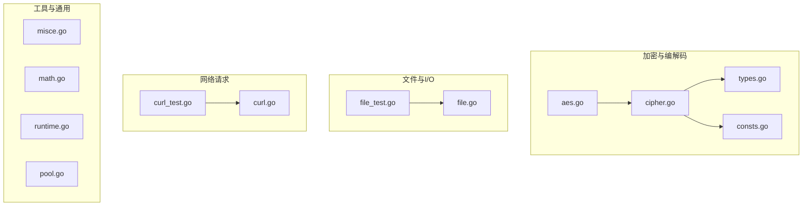
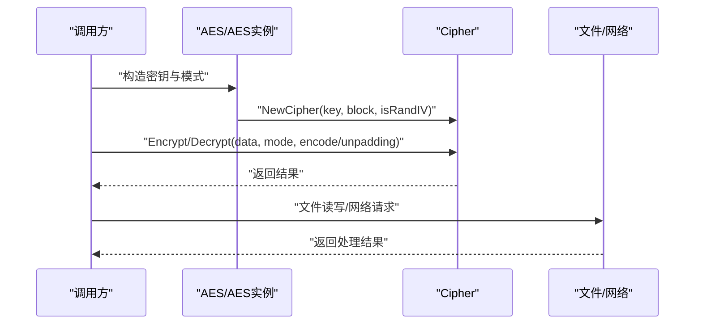
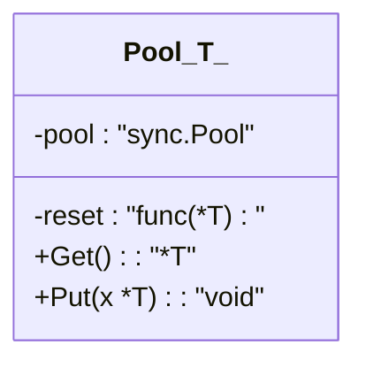
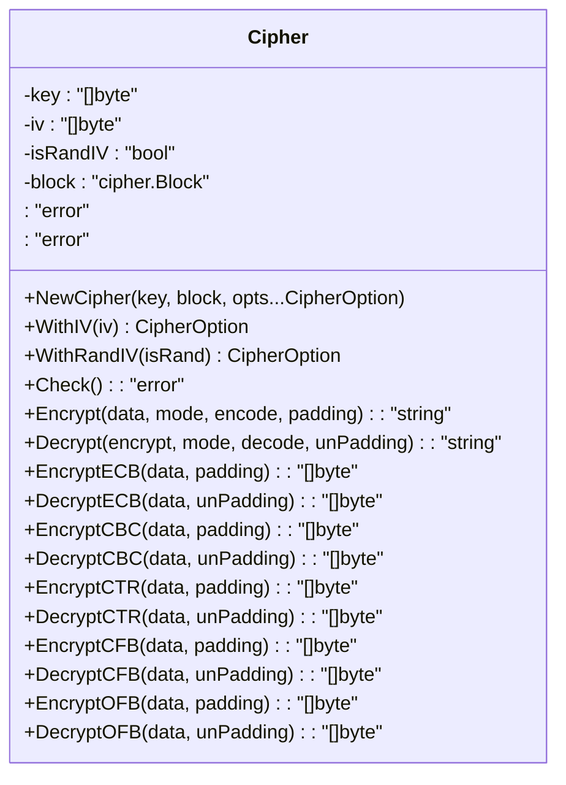
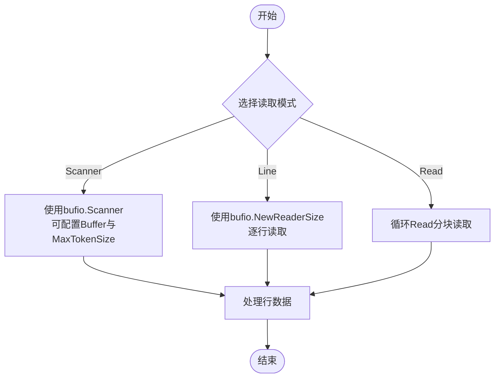
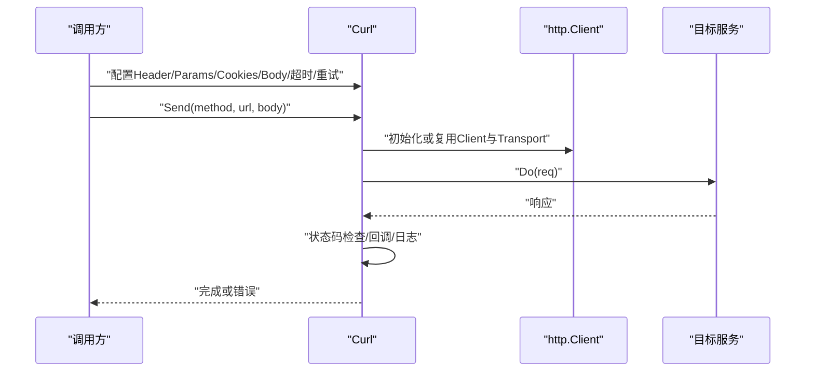
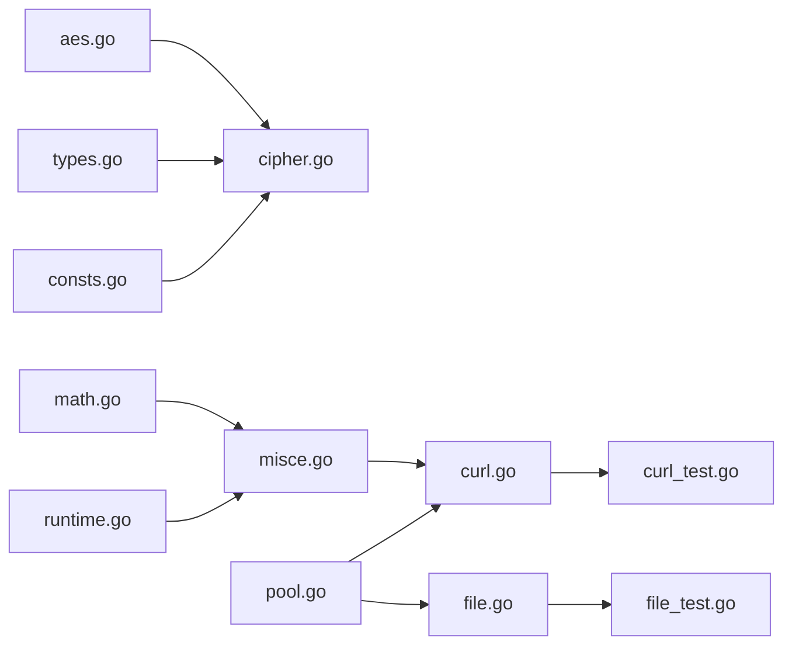

# 性能优化

<cite>
**本文引用的文件**
- [go.mod](file://go.mod)
- [consts.go](file://consts.go)
- [types.go](file://types.go)
- [misce.go](file://misce.go)
- [math.go](file://math.go)
- [runtime.go](file://runtime.go)
- [pool.go](file://pool.go)
- [aes.go](file://aes.go)
- [cipher.go](file://cipher.go)
- [file.go](file://file.go)
- [file_test.go](file://file_test.go)
- [cipher_test.go](file://cipher_test.go)
- [curl.go](file://curl.go)
- [curl_test.go](file://curl_test.go)
</cite>

## 目录

1. [简介](#简介)
2. [项目结构](#项目结构)
3. [核心组件](#核心组件)
4. [架构总览](#架构总览)
5. [详细组件分析](#详细组件分析)
6. [依赖关系分析](#依赖关系分析)
7. [性能考量与优化建议](#性能考量与优化建议)
8. [故障排查指南](#故障排查指南)
9. [结论](#结论)
10. [附录](#附录)

## 简介

本指南面向 Go Utils 库，聚焦于内存使用优化（对象池、减少分配、GC 优化）、CPU 性能提升（加密算法选择、批量与并行处理）、I/O
优化（文件读写缓冲、网络请求优化、磁盘 I/O 调优）以及性能测试与基准测试方法。文档结合仓库现有实现，给出可落地的最佳实践与对比建议。

## 项目结构

- 语言与版本：模块定义与 Go 版本见 go.mod。
- 功能模块划分：
    - 加密与编解码：aes.go、cipher.go、types.go、consts.go
    - 文件与 I/O：file.go、file_test.go
    - 网络请求：curl.go、curl_test.go
    - 工具与通用：types.go、consts.go、misce.go、math.go、runtime.go、pool.go

**图表来源**

- [go.mod](file://go.mod#L1-L4)
- [aes.go](file://aes.go#L1-L23)
- [cipher.go](file://cipher.go#L1-L498)
- [types.go](file://types.go#L1-L98)
- [consts.go](file://consts.go#L1-L48)
- [file.go](file://file.go#L1-L451)
- [file_test.go](file://file_test.go#L1-L680)
- [curl.go](file://curl.go#L1-L1058)
- [curl_test.go](file://curl_test.go#L1-L724)
- [misce.go](file://misce.go#L1-L133)
- [math.go](file://math.go#L1-L37)
- [runtime.go](file://runtime.go#L1-L41)
- [pool.go](file://pool.go#L1-L34)

**章节来源**

- [go.mod](file://go.mod#L1-L4)

## 核心组件

- 对象池：pool.go 提供泛型 sync.Pool 封装，支持可选 reset 回调，适合高频临时对象复用。
- 加密框架：cipher.go 提供统一 Cipher 抽象，支持多种分组密码模式与填充方案；aes.go 快速构造 AES 实例。
- 文件 I/O：file.go 提供扫描、逐行读取、分块读取、缓冲写入、并发写保护等能力。
- 网络请求：curl.go 提供链式配置的 HTTP 客户端封装，内置重试、TLS、代理、日志与回调钩子。
- 通用工具：types.go/consts.go 定义类型别名与常量；misce.go 提供三元运算、数字格式化、重试；math.go 提供随机数与取整；runtime.go
  提供运行时信息。

**章节来源**

- [pool.go](file://pool.go#L1-L34)
- [aes.go](file://aes.go#L1-L23)
- [cipher.go](file://cipher.go#L1-L498)
- [file.go](file://file.go#L1-L451)
- [curl.go](file://curl.go#L1-L1058)
- [types.go](file://types.go#L1-L98)
- [consts.go](file://consts.go#L1-L48)
- [misce.go](file://misce.go#L1-L133)
- [math.go](file://math.go#L1-L37)
- [runtime.go](file://runtime.go#L1-L41)

## 架构总览

从调用链看，典型流程如下：

- 加密：调用 AES/DES 构造 Cipher，按模式加密/解密，编码/解码结果。
- 文件：根据场景选择 Scanner/Reader/Buffered Writer，配合锁实现并发安全写。
- 网络：构建 Curl，设置 Header/Params/Cookies/Body，发送请求并处理响应与错误。

**图表来源**

- [aes.go](file://aes.go#L1-L23)
- [cipher.go](file://cipher.go#L1-L498)
- [file.go](file://file.go#L1-L451)
- [curl.go](file://curl.go#L1-L1058)

## 详细组件分析

### 对象池（pool.go）

- 设计要点
    - 泛型封装 sync.Pool，支持可选 reset 回调，便于复用时清理状态。
    - Get/Put 语义清晰，避免重复分配。
- 性能意义
    - 减少 GC 压力：高频创建/销毁的对象通过池复用。
    - 降低锁竞争：sync.Pool 本身具备 goroutine 本地缓存机制。
- 使用建议
    - 仅对生命周期短、频繁创建的对象使用池。
    - reset 回调中确保清空内部状态，避免“脏”对象污染。
    - 与并发写保护（如 file.go 中的 RWMutex）组合使用，避免竞态。

**图表来源**

- [pool.go](file://pool.go#L1-L34)

**章节来源**

- [pool.go](file://pool.go#L1-L34)

### 加密与编解码（aes.go、cipher.go、types.go、consts.go）

- 设计要点
    - Cipher 抽象统一了密钥设置、IV 校验、多种模式（ECB/CBC/CTR/CFB/OFB）与填充。
    - AES 快速入口校验密钥长度并委托 NewCipher。
    - types/consts 定义模式、编码/解码、填充/去填充等类型别名与常量。
- 性能要点
    - 模式选择：CTR/CFB/OFB 为流模式，适合大数据流；CBC/ECB 需填充且受分组长度限制。
    - 填充：PKCS7/零填充影响内存与 CPU，尽量使用流模式减少填充开销。
    - IV 策略：isRandIV=true 时每次加密生成随机 IV 并写入密文头部，增加开销但提高安全性。
    - 批处理：cipher.go 中各模式均通过分块处理，避免一次性分配超大切片。
- 优化建议
    - 优先选择 CTR/CFB/OFB，减少填充与分组对齐成本。
    - 复用 Cipher 实例，避免重复 NewCipher。
    - 大数据加密时使用流式 XORKeyStream/CryptBlocks，减少中间拷贝。

**图表来源**

- [cipher.go](file://cipher.go#L1-L498)
- [aes.go](file://aes.go#L1-L23)
- [types.go](file://types.go#L44-L98)
- [consts.go](file://consts.go#L5-L12)

**章节来源**

- [aes.go](file://aes.go#L1-L23)
- [cipher.go](file://cipher.go#L1-L498)
- [types.go](file://types.go#L44-L98)
- [consts.go](file://consts.go#L5-L12)

### 文件 I/O（file.go、file_test.go）

- 设计要点
    - 读取：Scanner、逐行 Reader、分块 Read 三种策略，适配不同场景。
    - 写入：NewWrite 创建/打开文件；Write/WriteString/WriteBuf 三种写法；并发写通过 RWMutex 保护。
    - 基准测试：file_test.go 展示了 WriteBuf 的性能优势与并发写行为。
- 性能要点
    - 缓冲写：WriteBuf 使用 bufio.Writer，显著降低系统调用次数。
    - 并发写：加锁保证一致性，但会引入竞争；建议合并写入或使用队列。
    - 大文件/长行：Line 与 Scan 有不同适用场景，可根据数据特征选择。
- 优化建议
    - 优先使用 WriteBuf；必要时自定义缓冲区大小以适配超大单行。
    - 读取长行时，适当增大 Scanner 的 Buffer 与 MaxTokenSize。
    - 大文件扫描建议分块读取，避免一次性加载。

**图表来源**

- [file.go](file://file.go#L227-L309)

**章节来源**

- [file.go](file://file.go#L1-L451)
- [file_test.go](file://file_test.go#L590-L680)

### 网络请求（curl.go、curl_test.go）

- 设计要点
    - Curl 提供链式配置：Header/Params/Cookies/Body/超时/代理/TLS/重试/日志/回调。
    - Send 内部封装请求生命周期：请求构造、客户端初始化、发送、响应处理、资源释放。
    - 支持失败重试与指数退避，避免瞬时抖动导致失败。
- 性能要点
    - 连接复用：默认 http.Client 会复用连接；可通过 CloseIdleConnections 主动回收。
    - TLS 与代理：动态配置 TLS 与代理会带来额外开销，建议在长生命周期中复用。
    - 日志与 Dump：调试模式会读取并记录请求/响应体，生产环境应关闭。
- 优化建议
    - 生产环境禁用 dump，合理设置超时与重试次数。
    - 复用 Curl 实例，避免频繁重建 http.Transport。
    - 对高并发场景，结合连接池与限流策略，控制并发度。

**图表来源**

- [curl.go](file://curl.go#L435-L772)

**章节来源**

- [curl.go](file://curl.go#L1-L1058)
- [curl_test.go](file://curl_test.go#L1-L724)

## 依赖关系分析

- 加密链路：aes.go -> cipher.go（NewCipher/WithIV/WithRandIV/Encrypt/Decrypt）
- 文件链路：file.go（Scan/Line/Read/NewWrite/WriteFile）与 file_test.go 的基准测试
- 网络链路：curl.go（Curl 结构体与 Send 方法）与 curl_test.go 的集成测试
- 工具链路：types.go/consts.go（类型与常量）、misce.go（三元/重试/格式化）、math.go（随机数）、runtime.go（运行时信息）、pool.go（对象池）

**图表来源**

- [aes.go](file://aes.go#L1-L23)
- [cipher.go](file://cipher.go#L1-L498)
- [types.go](file://types.go#L1-L98)
- [consts.go](file://consts.go#L1-L48)
- [file.go](file://file.go#L1-L451)
- [file_test.go](file://file_test.go#L1-L680)
- [curl.go](file://curl.go#L1-L1058)
- [curl_test.go](file://curl_test.go#L1-L724)
- [misce.go](file://misce.go#L1-L133)
- [math.go](file://math.go#L1-L37)
- [runtime.go](file://runtime.go#L1-L41)
- [pool.go](file://pool.go#L1-L34)

**章节来源**

- [aes.go](file://aes.go#L1-L23)
- [cipher.go](file://cipher.go#L1-L498)
- [types.go](file://types.go#L1-L98)
- [consts.go](file://consts.go#L1-L48)
- [file.go](file://file.go#L1-L451)
- [file_test.go](file://file_test.go#L1-L680)
- [curl.go](file://curl.go#L1-L1058)
- [curl_test.go](file://curl_test.go#L1-L724)
- [misce.go](file://misce.go#L1-L133)
- [math.go](file://math.go#L1-L37)
- [runtime.go](file://runtime.go#L1-L41)
- [pool.go](file://pool.go#L1-L34)

## 性能考量与优化建议

### 内存使用优化

- 对象池
    - 适用：高频创建/销毁的临时对象（如加密过程中的中间缓冲、网络请求上下文）。
    - 建议：使用 pool.go 的泛型池，配合 reset 清理状态；避免池中持有外部引用导致泄漏。
- 减少分配
    - 复用切片：cipher.go 中按块处理，避免一次性分配超大切片。
    - 缓冲写：file.go 的 WriteBuf 显著降低系统调用与临时对象创建。
- 垃圾回收优化
    - 控制短生命周期对象数量，优先使用对象池与复用。
    - 避免在热路径上频繁创建/销毁结构体与切片。

**章节来源**

- [pool.go](file://pool.go#L1-L34)
- [cipher.go](file://cipher.go#L100-L171)
- [file.go](file://file.go#L377-L387)

### CPU 性能提升

- 加密算法与模式选择
    - 优先 CTR/CFB/OFB 流模式，减少填充与分组对齐开销。
    - ECB/ CBC 需填充，且 CBC/CTR/CFB/OFB 依赖分组加密器，注意密钥长度与 IV 规范。
- 批量处理优化
    - cipher.go 的 Encrypt/Decrypt 通过分块处理，避免一次性拷贝大块数据。
    - file.go 的 Read/Scan/Line 三种读取策略，按场景选择以减少 CPU 与内存压力。
- 并行计算应用
    - file_test.go 展示了并发写入的 WaitGroup 使用，注意加锁带来的竞争。
    - curl.go 支持并发请求，建议结合连接池与限流，避免过度并发导致抖动。

**章节来源**

- [cipher.go](file://cipher.go#L100-L498)
- [file.go](file://file.go#L227-L309)
- [file_test.go](file://file_test.go#L529-L588)
- [curl.go](file://curl.go#L435-L772)

### I/O 操作优化

- 文件读写缓冲
    - WriteBuf 使用 bufio.Writer，显著降低系统调用次数，性能优于逐次 Write/WriteString。
    - 读取长行时，适当增大 Scanner 的 Buffer 与 MaxTokenSize，避免多次扩容。
- 网络请求优化
    - 合理设置超时与重试次数，避免长时间阻塞。
    - 生产环境禁用 dump，避免读取与记录响应体带来的额外 CPU 与内存消耗。
    - 复用 Curl 实例，避免频繁重建 http.Transport。
- 磁盘 I/O 性能调优
    - 大文件扫描优先使用分块读取，减少内存峰值。
    - 并发写入时注意加锁与顺序写入，避免磁盘寻道与写放大。

**章节来源**

- [file.go](file://file.go#L227-L309)
- [file_test.go](file://file_test.go#L590-L680)
- [curl.go](file://curl.go#L435-L772)

### 性能测试与基准测试

- 文件写入基准
    - file_test.go 提供 BenchmarkWrite，展示 WriteBuf 的性能优势；可扩展为不同缓冲大小与并发度对比。
- 加密基准
    - cipher_test.go 展示了多种模式的正确性测试；可基于此扩展不同数据规模的基准测试。
- 网络基准
    - curl_test.go 为集成测试，可拆分为独立基准测试，覆盖不同并发度、超时与重试策略。
- 建议的测试维度
    - 数据规模：小/中/大（KB/MB/GB 级别）
    - 并发度：1/2/4/8/16 等
    - 场景：纯 CPU（仅加密）、纯 I/O（仅文件/网络）、混合（加密+I/O）
    - 指标：吞吐量、P99 延迟、内存分配次数与字节数、GC 次数与暂停时间

**章节来源**

- [file_test.go](file://file_test.go#L590-L680)
- [cipher_test.go](file://cipher_test.go#L1-L62)
- [curl_test.go](file://curl_test.go#L1-L200)

## 故障排查指南

- 加密错误
    - 密钥长度不合法：检查 aes.go/cipher.go 的密钥长度约束。
    - IV 长度不匹配：确保 WithIV 传入的IV长度与块大小一致。
    - 模式错误：确认 Encrypt/Decrypt 的模式参数。
- 文件读写问题
    - Scanner 单行过大：增大 Buffer 与 MaxTokenSize。
    - 并发写冲突：确认 RWMutex 使用与临界区范围。
    - 权限与路径：新建文件时检查目录权限与路径存在性。
- 网络请求问题
    - 超时与重试：调整超时与最大重试次数，避免指数退避过大。
    - TLS/代理：确认证书与代理配置正确，避免额外握手开销。
    - 日志与 Dump：调试阶段启用，生产禁用。

**章节来源**

- [aes.go](file://aes.go#L1-L23)
- [cipher.go](file://cipher.go#L42-L99)
- [file.go](file://file.go#L227-L395)
- [curl.go](file://curl.go#L435-L772)

## 结论

- 通过对象池与缓冲 I/O，可显著降低分配与系统调用开销。
- 优先选择流式加密模式（CTR/CFB/OFB），并复用 Cipher 实例。
- 文件读取与网络请求应按场景选择合适策略，并结合并发与限流。
- 基于仓库现有测试与实现，建议围绕数据规模、并发度与场景维度开展系统性基准测试，持续监控 GC 与延迟指标。

## 附录

- 常用常量与类型参考
    - 模式常量：ECB/CBC/CTR/CFB/OFB
    - 存储单位：Byte/KB/MB/GB/TB/PB/EB
    - 类型别名：Signed/Unsigned/Integer/Float/Number/Ordered/Slice
- 工具函数
    - 三元运算、数字格式化、重试、随机数、运行时信息等

**章节来源**

- [consts.go](file://consts.go#L1-L48)
- [types.go](file://types.go#L1-L98)
- [misce.go](file://misce.go#L1-L133)
- [math.go](file://math.go#L1-L37)
- [runtime.go](file://runtime.go#L1-L41)