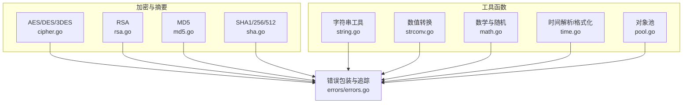
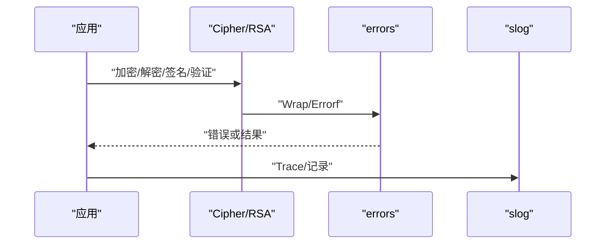
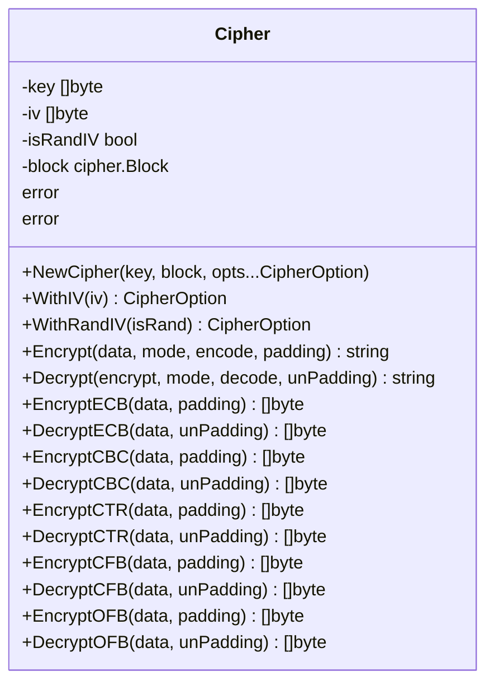
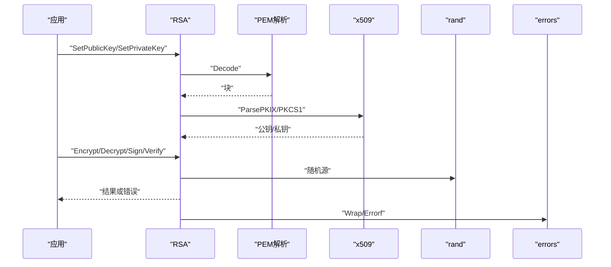
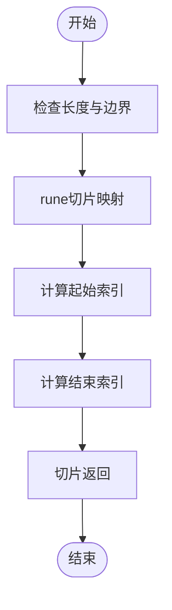
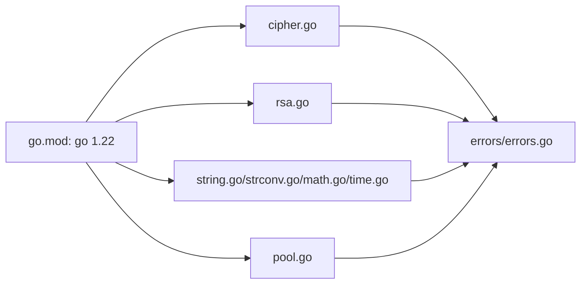
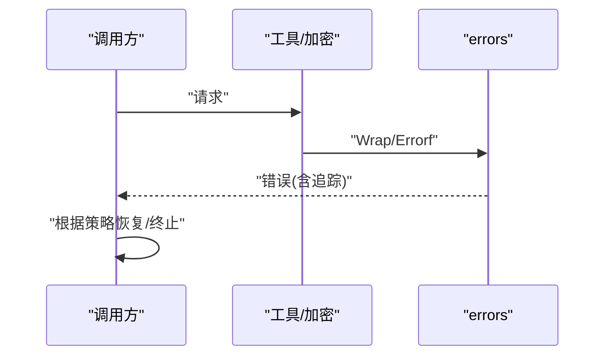

# 最佳实践

<cite>
**本文引用的文件**
- [README.md](file://README.md)
- [go.mod](file://go.mod)
- [aes.go](file://aes.go)
- [cipher.go](file://cipher.go)
- [rsa.go](file://rsa.go)
- [md5.go](file://md5.go)
- [sha.go](file://sha.go)
- [pool.go](file://pool.go)
- [errors/errors.go](file://errors/errors.go)
- [consts.go](file://consts.go)
- [types.go](file://types.go)
- [pkcs7.go](file://pkcs7.go)
- [string.go](file://string.go)
- [strconv.go](file://strconv.go)
- [math.go](file://math.go)
- [time.go](file://time.go)
</cite>

## 目录

1. [简介](#简介)
2. [项目结构](#项目结构)
3. [核心组件](#核心组件)
4. [架构总览](#架构总览)
5. [详细组件分析](#详细组件分析)
6. [依赖关系分析](#依赖关系分析)
7. [性能考量](#性能考量)
8. [安全注意事项](#安全注意事项)
9. [错误处理模式](#错误处理模式)
10. [代码组织与架构设计建议](#代码组织与架构设计建议)
11. [与其他Go库的集成与兼容性](#与其他go库的集成与兼容性)
12. [常见陷阱与规避方法](#常见陷阱与规避方法)
13. [调试技巧与故障排除](#调试技巧与故障排除)
14. [结论](#结论)
15. [附录](#附录)

## 简介

本指南面向Go
Utils库的使用者与维护者，系统总结性能优化、安全性、错误处理、代码组织、集成兼容、常见陷阱与调试排障等最佳实践。文档基于仓库现有实现进行提炼，强调可落地的建议与图示化说明，帮助在不同规模与场景下稳定高效地使用该工具库。

## 项目结构

- 模块与版本
    - 模块名为 github.com/Is999/go-utils，Go版本要求1.22。
- 主要功能域
    - 加密与摘要：AES/DES/3DES（封装cipher.Block）、RSA、MD5、SHA系列。
    - 工具函数：字符串处理、数值转换、数学与随机、时间解析与格式化、通用池化。
    - 错误包装与追踪：统一的Wrap/Errorf/Trace，便于日志与定位。
- 设计要点
    - 通过类型别名与泛型池化减少分配与GC压力。
    - 通过常量与模式枚举约束加密模式与存储单位，降低调用歧义。
    - 通过统一错误包装与slog集成，提升可观测性。

**图表来源**

- [cipher.go](file://cipher.go#L1-L498)
- [rsa.go](file://rsa.go#L1-L527)
- [md5.go](file://md5.go#L1-L13)
- [sha.go](file://sha.go#L1-L27)
- [string.go](file://string.go#L1-L187)
- [strconv.go](file://strconv.go#L1-L109)
- [math.go](file://math.go#L1-L37)
- [time.go](file://time.go#L1-L377)
- [pool.go](file://pool.go#L1-L34)
- [errors/errors.go](file://errors/errors.go#L1-L282)

**章节来源**

- [go.mod](file://go.mod#L1-L4)
- [README.md](file://README.md#L1-L30)

## 核心组件

- 加密抽象与多模式支持
    - 通过Cipher结构体统一管理密钥、IV、块大小与多种分组模式（ECB/CBC/CTR/CFB/OFB），并支持随机IV与填充策略。
- RSA非对称加密
    - 支持PKCS1/PKCS8公私钥解析、PKCS1v15与OAEP加密、PSS签名与验证、长文本分段处理。
- 摘要算法
    - 提供MD5与SHA系列摘要封装，便于快速生成哈希值。
- 工具函数族
    - 字符串截取、反转、随机字符串、唯一ID生成；数值转换；数学与随机；时间解析/格式化；通用对象池。
- 错误包装与追踪
    - 统一Wrap/Errorf/Trace，支持链式追踪与slog日志输出，便于问题定位。

**章节来源**

- [cipher.go](file://cipher.go#L20-L498)
- [rsa.go](file://rsa.go#L18-L527)
- [md5.go](file://md5.go#L8-L13)
- [sha.go](file://sha.go#L10-L27)
- [string.go](file://string.go#L22-L187)
- [strconv.go](file://strconv.go#L8-L109)
- [math.go](file://math.go#L8-L37)
- [time.go](file://time.go#L10-L377)
- [pool.go](file://pool.go#L5-L34)
- [errors/errors.go](file://errors/errors.go#L14-L282)

## 架构总览

- 组件交互
    - 应用层调用工具函数与加密模块，错误通过errors包统一包装与追踪，日志通过slog记录。
- 数据流
    - 输入数据经字符串/数值/时间等工具函数预处理，再进入加密/摘要流程，最终编码输出。
- 关键约束
    - 加密模式与块大小由常量与类型约束，确保调用一致性与安全性。

**图表来源**

- [cipher.go](file://cipher.go#L423-L498)
- [rsa.go](file://rsa.go#L162-L331)
- [errors/errors.go](file://errors/errors.go#L14-L82)

## 详细组件分析

### 加密抽象与多模式（Cipher）

- 设计要点
    - 通过CipherBlock抽象底层块密码，支持AES/DES/3DES；通过McryptMode枚举统一模式；通过Encode/Decode与Padding/UnPadding解耦编码与填充。
- 性能与内存
    - 使用make([]byte, size)预分配缓冲区，避免频繁扩容；CBC/CTR/CFB/OFB在isRandIV=true时将IV置于密文头部，减少额外参数传递。
- 安全性
    - CBC/CTR/CFB/OFB均需正确设置IV；PKCS7填充用于满足块大小；禁止ECB用于长文本。
- 错误处理
    - 所有校验失败与IO错误均通过errors.Wrap/Errorf返回，便于上层捕获与追踪。

**图表来源**

- [cipher.go](file://cipher.go#L20-L498)
- [types.go](file://types.go#L46-L74)
- [consts.go](file://consts.go#L5-L12)
- [pkcs7.go](file://pkcs7.go#L8-L31)

**章节来源**

- [cipher.go](file://cipher.go#L20-L498)
- [types.go](file://types.go#L46-L74)
- [consts.go](file://consts.go#L5-L12)
- [pkcs7.go](file://pkcs7.go#L8-L31)

### RSA非对称加密

- 设计要点
    - 支持公钥/私钥独立设置，自动识别PKCS1/PKCS8；提供PKCS1v15、OAEP与PSS签名/验证；长文本分段处理。
- 性能与内存
    - 分段加密/解密，避免单次超长输入导致内存峰值过高；使用bytes.Buffer累积结果。
- 安全性
    - OAEP相比PKCS1v15更安全；PSS签名抗更弱的哈希碰撞；注意密钥格式与PEM头尾标记处理。
- 错误处理
    - PEM解析失败、密钥类型不符、长度不足等均返回带追踪的错误。

**图表来源**

- [rsa.go](file://rsa.go#L53-L144)
- [rsa.go](file://rsa.go#L162-L331)
- [errors/errors.go](file://errors/errors.go#L24-L53)

**章节来源**

- [rsa.go](file://rsa.go#L18-L527)
- [errors/errors.go](file://errors/errors.go#L14-L82)

### 字符串工具与随机

- 设计要点
    - Substr使用rune切片处理宽字符；RandStr系列支持自定义字符集与复用随机源；UniqId生成可排序的伪唯一ID。
- 性能与内存
    - 使用strings.Builder预估容量，减少扩容；随机生成复用同一rand.Rand实例。
- 安全性
    - 随机字符串与唯一ID不应用于密码学安全场景，仅作业务标识使用。

**图表来源**

- [string.go](file://string.go#L38-L84)

**章节来源**

- [string.go](file://string.go#L11-L187)

### 数值转换与数学

- 设计要点
    - 提供字符串到整数/浮点的容错转换；进制转换封装；随机数与四舍五入工具。
- 性能与内存
    - 直接调用标准库解析/格式化，避免中间缓冲；四舍五入使用幂运算一次完成。

**章节来源**

- [strconv.go](file://strconv.go#L8-L109)
- [math.go](file://math.go#L8-L37)

### 时间解析与格式化

- 设计要点
    - 提供灵活布局替换与多格式解析；支持时区切换；提供日期信息聚合。
- 性能与内存
    - 多布局尝试解析时避免重复构造；格式化采用预置pattern减少字符串拼接。

**章节来源**

- [time.go](file://time.go#L25-L324)

### 对象池（通用泛型）

- 设计要点
    - 通过sync.Pool复用对象，支持可选reset回调清理状态。
- 性能与内存
    - 降低频繁分配与GC压力；适合高并发短生命周期对象。

**章节来源**

- [pool.go](file://pool.go#L5-L34)

## 依赖关系分析

- 内部依赖
    - cipher/rsa等模块依赖errors统一错误；string/strconv/math/time等工具模块被上层加密/网络等场景复用。
- 外部依赖
    - 标准库crypto/*、encoding/*、strings、time、sync等；日志通过slog集成。
- 版本要求
    - go.mod声明1.22，确保泛型与新rand API可用。

**图表来源**

- [go.mod](file://go.mod#L3-L4)
- [errors/errors.go](file://errors/errors.go#L1-L12)
- [cipher.go](file://cipher.go#L1-L8)
- [rsa.go](file://rsa.go#L1-L16)
- [string.go](file://string.go#L1-L9)
- [strconv.go](file://strconv.go#L1-L6)
- [math.go](file://math.go#L1-L6)
- [time.go](file://time.go#L1-L8)
- [pool.go](file://pool.go#L1-L3)

**章节来源**

- [go.mod](file://go.mod#L1-L4)

## 性能考量

- 内存使用优化
    - 预分配缓冲区：Cipher各模式在加密/解密前使用make([]byte, size)预分配，避免多次扩容。
    - 字符串拼接：使用strings.Builder并提前Grow，减少临时对象与拷贝。
    - 对象复用：通过sync.Pool复用高频短生命周期对象。
- CPU性能提升
    - 随机数：复用同一rand.Rand实例，减少种子初始化开销。
    - 进制转换：直接调用标准库解析/格式化，避免手工循环。
    - 四舍五入：使用幂运算一次性完成，减少分支与循环。
- I/O操作优化
    - RSA分段处理：对超长明文按最大块长度分段，避免单次I/O峰值。
    - PEM处理：正则去头尾与换行，减少后续解析成本。

**章节来源**

- [cipher.go](file://cipher.go#L106-L118)
- [cipher.go](file://cipher.go#L153-L171)
- [string.go](file://string.go#L151-L153)
- [pool.go](file://pool.go#L22-L33)
- [rsa.go](file://rsa.go#L170-L189)
- [rsa.go](file://rsa.go#L313-L331)
- [string.go](file://string.go#L47-L84)

## 安全注意事项

- 加密算法与密钥管理
    - AES支持16/24/32字节密钥；DES/3DES密钥长度限制；CBC/CTR/CFB/OFB需正确IV；禁止ECB用于长文本。
    - RSA优先使用OAEP与PSS；支持PKCS1/PKCS8公私钥；PEM头尾标记处理需严格校验。
- 输入验证与安全编码
    - 所有外部输入（密钥、IV、明文、密文、PEM）均需长度与格式校验；错误通过Wrap/Errorf返回，避免泄露内部细节。
- 摘要与随机
    - MD5/SHA1仅用于兼容场景；密码学安全随机应使用crypto/rand；业务标识类随机不等同安全随机。

**章节来源**

- [aes.go](file://aes.go#L12-L22)
- [cipher.go](file://cipher.go#L42-L58)
- [cipher.go](file://cipher.go#L86-L99)
- [rsa.go](file://rsa.go#L53-L144)
- [rsa.go](file://rsa.go#L162-L331)
- [md5.go](file://md5.go#L8-L13)
- [sha.go](file://sha.go#L10-L27)

## 错误处理模式

- 统一包装与追踪
    - 使用Wrap/Errorf包裹底层错误，Trace输出堆栈信息，便于日志与定位。
- 错误传播与恢复
    - 在加密/解密/签名/验证流程中，任何一步失败均向上返回带追踪的错误；调用方可根据需要决定是否恢复或终止。
- 异常处理策略
    - 对可预期的输入错误（如密钥长度/IV长度不合法）立即返回错误；对不可预期的IO/解析错误同样包装返回。

**图表来源**

- [errors/errors.go](file://errors/errors.go#L24-L53)
- [cipher.go](file://cipher.go#L102-L119)
- [rsa.go](file://rsa.go#L162-L189)

**章节来源**

- [errors/errors.go](file://errors/errors.go#L14-L82)
- [cipher.go](file://cipher.go#L102-L119)
- [rsa.go](file://rsa.go#L162-L189)

## 代码组织与架构设计建议

- 模块化与职责分离
    - 将加密、摘要、字符串、数值、时间、池化等功能划分为独立文件，降低耦合。
- 接口与抽象
    - 通过类型别名（Encode/Decode/Padding/UnPadding）与枚举（McryptMode）统一调用契约。
- 可测试性
    - 所有核心函数均配套单元测试，建议新增功能保持同等覆盖率。

**章节来源**

- [types.go](file://types.go#L46-L97)
- [consts.go](file://consts.go#L5-L47)

## 与其他Go库的集成与兼容性

- 标准库集成
    - crypto/*、encoding/*、strings、time、sync等；日志通过slog集成。
- 版本兼容
    - go 1.22，使用math/rand/v2与slog；避免使用已废弃的旧API。
- 第三方库
    - 与常见HTTP客户端、数据库驱动等通过标准接口对接；错误统一通过errors包装。

**章节来源**

- [go.mod](file://go.mod#L3-L4)
- [errors/errors.go](file://errors/errors.go#L1-L12)

## 常见陷阱与规避方法

- 宽字符截取错误
    - 使用rune切片而非字节切片进行截取，避免中间字符被截断。
- IV与密钥混淆
    - CBC/CTR/CFB/OFB必须设置正确IV；ECB无需IV但不适合长文本。
- PEM格式错误
    - 去头尾与换行后仍需校验类型与内容；解析失败需明确报错。
- 随机源复用
    - 大批量生成时复用同一rand.Rand实例，避免重复初始化。
- 错误信息泄露
    - 使用Wrap/Errorf返回错误，避免直接暴露内部细节。

**章节来源**

- [string.go](file://string.go#L47-L84)
- [cipher.go](file://cipher.go#L86-L99)
- [rsa.go](file://rsa.go#L483-L527)
- [string.go](file://string.go#L185-L187)

## 调试技巧与故障排除

- 错误追踪
    - 使用Trace输出堆栈信息，结合slog定位问题发生位置。
- 日志记录
    - 在关键路径打印上下文信息（如模式、长度、块大小），辅助排查。
- 快速验证
    - 使用单元测试覆盖典型场景（如边界长度、非法IV、错误PEM），快速回归。

**章节来源**

- [errors/errors.go](file://errors/errors.go#L74-L82)
- [cipher.go](file://cipher.go#L102-L119)
- [rsa.go](file://rsa.go#L162-L189)

## 结论

本指南围绕Go
Utils库的核心能力，从性能、安全、错误处理、代码组织、集成兼容、陷阱规避与调试排障等方面提供了系统化的最佳实践。建议在实际项目中遵循统一的错误包装与日志策略，合理使用对象池与预分配缓冲，严格校验输入并选择合适的加密模式与算法，以获得更高的稳定性与可维护性。

## 附录

- 实际使用场景与优化案例
    - 大文件分块加密：Cipher在CBC/CTR/CFB/OFB模式下自动处理IV与填充，建议结合分块读写与对象池复用缓冲。
    - 长文本RSA：RSA模块内置分段处理，建议优先使用OAEP/PSS并控制分段大小。
    - 高频字符串拼接：使用strings.Builder并预估容量，避免频繁扩容。
    - 随机标识生成：复用rand.Rand实例，提高批量生成效率。