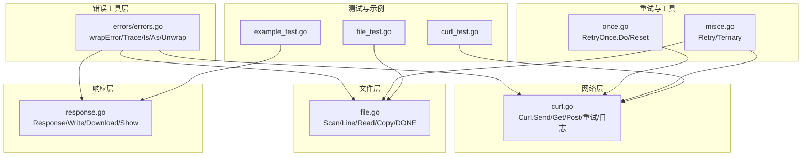
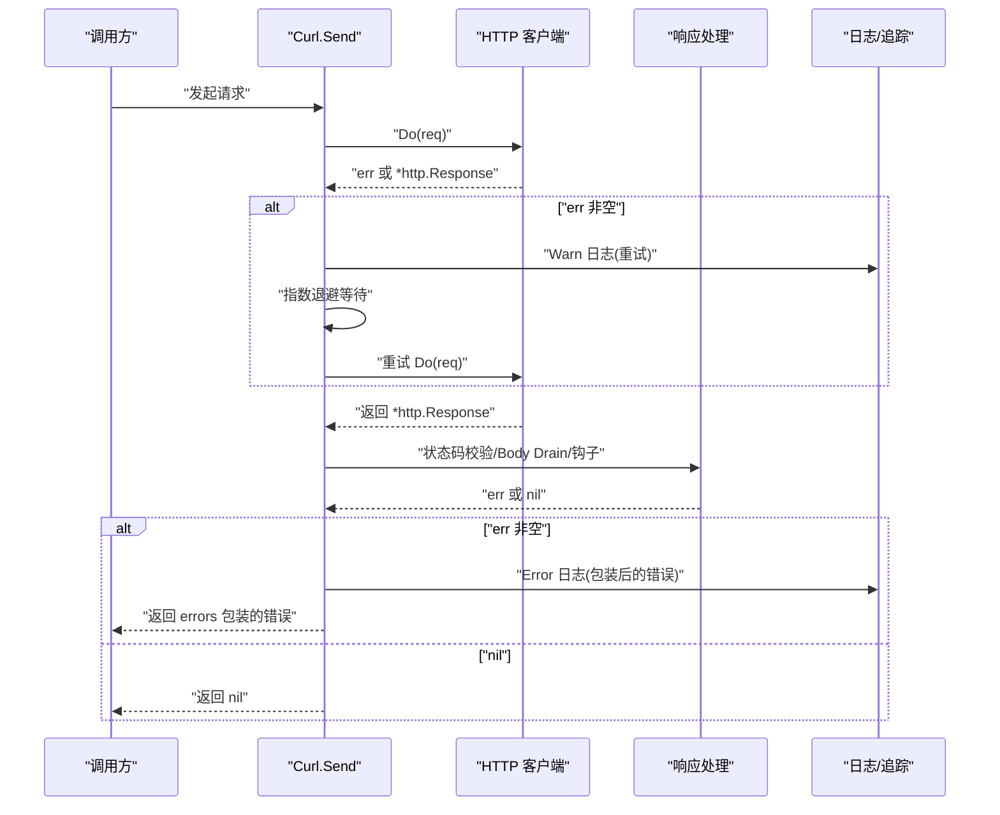
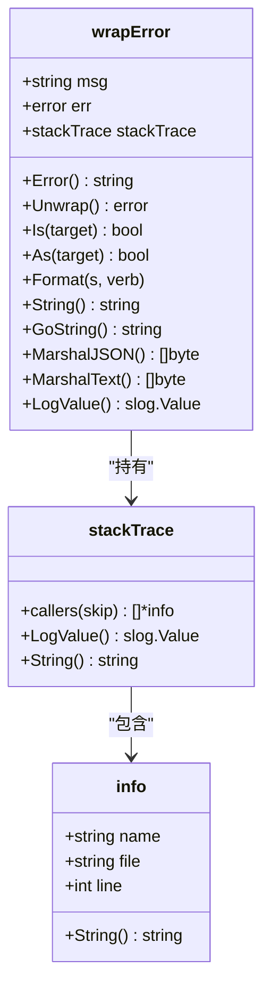
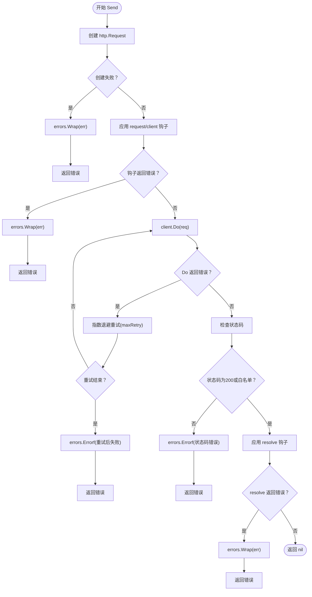
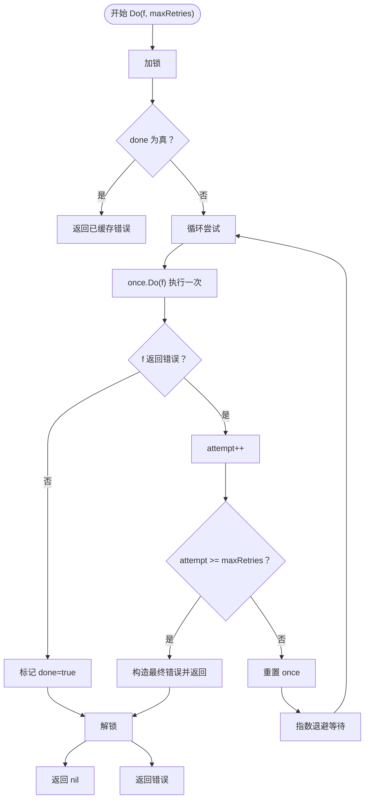
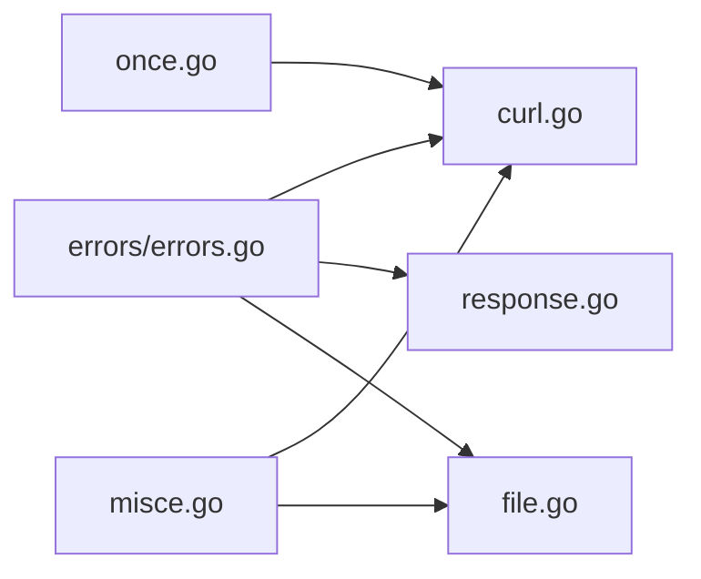

# 错误处理模式

<cite>
**本文引用的文件**
- [errors/errors.go](file://errors/errors.go)
- [errors/errors_test.go](file://errors/errors_test.go)
- [curl.go](file://curl.go)
- [response.go](file://response.go)
- [file.go](file://file.go)
- [once.go](file://once.go)
- [misce.go](file://misce.go)
- [curl_test.go](file://curl_test.go)
- [file_test.go](file://file_test.go)
- [example_test.go](file://example_test.go)
- [go.mod](file://go.mod)
- [README.md](file://README.md)
</cite>

## 目录

1. [简介](#简介)
2. [项目结构](#项目结构)
3. [核心组件](#核心组件)
4. [架构总览](#架构总览)
5. [详细组件分析](#详细组件分析)
6. [依赖关系分析](#依赖关系分析)
7. [性能考量](#性能考量)
8. [故障排查指南](#故障排查指南)
9. [结论](#结论)
10. [附录](#附录)

## 简介

本指南围绕 Go Utils
库的错误处理模式展开，系统阐述错误传播策略（错误包装、错误链构建、上下文保留）、错误恢复模式（重试、退避、降级与优雅降级）、异常处理最佳实践（panic、defer、资源清理），并给出错误分类与处理策略、日志记录与监控告警、故障诊断方法，以及在不同模块中的错误处理模式与使用示例。

## 项目结构

- 错误工具与包装层位于 errors 包，提供带堆栈追踪的错误包装、错误链遍历与日志追踪输出。
- curl 模块封装 HTTP 请求，内置默认日志、请求/响应钩子、Body Drain、状态码校验与重试策略。
- response 模块提供统一的 JSON/HTML/XML/下载/显示响应封装，内部对编码与 IO 错误进行统一处理与日志上报。
- file 模块提供文件扫描、读取、写入与复制等能力，统一使用 errors 包进行错误包装与 DONE 终止信号。
- once 与 misce 提供重试与通用工具，支持指数退避与三元选择等常见模式。
- 测试文件展示了错误包装、日志追踪、状态码校验与响应处理的典型用法。

图表来源

- [errors/errors.go](file://errors/errors.go#L14-L82)
- [curl.go](file://curl.go#L435-L772)
- [response.go](file://response.go#L11-L342)
- [file.go](file://file.go#L18-L351)
- [once.go](file://once.go#L9-L81)
- [misce.go](file://misce.go#L9-L133)
- [curl_test.go](file://curl_test.go#L38-L220)
- [file_test.go](file://file_test.go#L13-L680)
- [example_test.go](file://example_test.go#L17-L107)

章节来源

- [go.mod](file://go.mod#L1-L4)
- [README.md](file://README.md#L1-L80)

## 核心组件

- 错误包装与追踪
    - errors.New/Errorf/Wrap/Wrapf 提供带上下文的错误包装，支持链式 Unwrap/Is/As，Trace 输出堆栈追踪。
    - wrapError 实现 Error/Unwrap/Is/As/Format/LogValue/Marshal 等接口，便于日志与调试。
- Curl 网络层
    - Send/Get/Post 内置 defer 资源清理、日志记录、状态码校验、Body Drain、客户端初始化与 TLS 配置。
    - 支持重试（maxRetry）与指数退避，记录 warn/info 日志并最终返回包装后的错误。
- Response 响应层
    - 统一 Success/Fail/Text/Html/Xml/Download/Show/Write，内部对编码、文件 IO、写入错误进行统一处理与日志上报。
- 文件扫描与读取
    - Scan/Line/Read 提供行扫描、逐行读取与分块读取，统一使用 errors 包包装错误；DONE 作为“处理完成”的终止信号。
- 重试与工具
    - once.RetryOnce.Do 提供线程安全的带指数退避的重试；misce.Retry 提供更通用的指数退避重试；Ternary 提供三元选择。

章节来源

- [errors/errors.go](file://errors/errors.go#L14-L82)
- [errors/errors.go](file://errors/errors.go#L141-L250)
- [curl.go](file://curl.go#L435-L772)
- [response.go](file://response.go#L24-L342)
- [file.go](file://file.go#L227-L310)
- [once.go](file://once.go#L9-L81)
- [misce.go](file://misce.go#L99-L133)

## 架构总览

错误处理贯穿工具层、网络层、响应层与文件层，形成“包装-传播-恢复-记录-降级”的闭环。

图表来源

- [curl.go](file://curl.go#L669-L724)
- [curl.go](file://curl.go#L449-L772)

## 详细组件分析

### 错误包装与追踪（errors 包）

- 设计要点
    - 新增 wrapError 结构体，保存 msg、底层 err 与调用栈，实现标准库 errors 接口。
    - Trace 返回 slog.LogValuer，支持将错误链路以结构化形式输出。
    - Is/As/Unwrap 保持与标准库一致的行为，便于统一错误匹配与提取。
- 使用建议
    - 所有外部错误一律通过 Wrap/Wrapf 包装，保留上下文。
    - 日志记录时优先使用 errors.Trace 输出堆栈，便于定位。
    - 使用 errors.Is/errors.As 进行错误类型匹配与提取。

图表来源

- [errors/errors.go](file://errors/errors.go#L141-L250)
- [errors/errors.go](file://errors/errors.go#L84-L131)
- [errors/errors.go](file://errors/errors.go#L258-L266)

章节来源

- [errors/errors.go](file://errors/errors.go#L14-L82)
- [errors/errors.go](file://errors/errors.go#L141-L250)
- [errors/errors_test.go](file://errors/errors_test.go#L10-L84)

### Curl 网络层错误处理

- 关键流程
    - defer 统一关闭响应体与执行 Done 钩子，避免资源泄漏。
    - 请求前/后钩子（request/client/response/resolve/done）均可返回错误，统一通过 errors 包包装。
    - Body Drain 与 DumpRequestOut/DumpResponse 均可能出错，统一包装并记录日志。
    - 状态码非 200 且不在白名单时，返回包装后的错误。
    - 内置重试（maxRetry）与指数退避，记录 warn 日志，最终返回包装后的错误。
- 最佳实践
    - 使用 SetDefLogOutput 控制默认日志输出级别。
    - 使用 SetDump 记录完整请求/响应细节，便于问题定位。
    - 使用 SetMaxRetry 配置重试次数，结合指数退避降低抖动。

图表来源

- [curl.go](file://curl.go#L435-L772)

章节来源

- [curl.go](file://curl.go#L435-L772)
- [curl_test.go](file://curl_test.go#L38-L220)

### Response 响应层错误处理

- 关键流程
    - Success/Fail/Text/Html/Xml/Download/Show/Write 统一封装，内部对编码、文件 IO、写入错误进行统一处理。
    - 发生错误时生成唯一 UID，记录 slog.Error 并返回 HTTP 错误响应。
- 最佳实践
    - 使用 Json/View/Redirect 快速构建响应，减少重复样板代码。
    - 对外部错误统一通过 errors 包包装并记录 trace，便于定位。

章节来源

- [response.go](file://response.go#L24-L342)

### 文件扫描与读取（Scan/Line/Read/Copy/DONE）

- 关键流程
    - Scan/Line/Read 对读取过程中的错误进行统一包装；当回调返回 errors.Is(err, DONE) 时视为正常终止。
    - Copy 打开/Stat/OpenFile/Copy/Close 均使用 defer 与 errors 包包装，确保资源释放与错误传播。
- 最佳实践
    - 使用 DONE 作为“处理完成”的信号，避免返回业务错误。
    - 对大文件/大行数据优先使用 Line/Read，提升性能。

章节来源

- [file.go](file://file.go#L227-L310)
- [file.go](file://file.go#L41-L81)
- [file_test.go](file://file_test.go#L141-L207)

### 重试与退避（once.RetryOnce 与 misce.Retry）

- RetryOnce.Do
    - 线程安全，使用 sync.Once 确保目标函数在单次循环中仅执行一次。
    - 指数退避策略，支持最大重试次数与最终错误包装。
    - Reset 可重置状态，使实例可再次执行。
- misce.Retry
    - 更通用的指数退避重试，支持最大重试次数与最大延迟限制。
- 最佳实践
    - 对瞬时性网络/IO 错误采用指数退避重试。
    - 对幂等操作使用 RetryOnce.Do，对非幂等操作谨慎使用。

图表来源

- [once.go](file://once.go#L30-L71)

章节来源

- [once.go](file://once.go#L9-L81)
- [misce.go](file://misce.go#L99-L133)

## 依赖关系分析

- errors 包为全局错误包装与追踪的核心，被 curl/response/file 等模块广泛依赖。
- curl 依赖 errors、slog、net/http、mime/multipart 等标准库与第三方能力。
- response 依赖 slog、net/http、encoding/xml、os 等标准库。
- file 依赖 errors、io/fs、mime、net/http、os、path/filepath、regexp、sync 等。
- once 与 misce 为通用工具，被 curl 与 file 等模块复用。

图表来源

- [errors/errors.go](file://errors/errors.go#L1-L282)
- [curl.go](file://curl.go#L1-L19)
- [response.go](file://response.go#L1-L9)
- [file.go](file://file.go#L1-L16)
- [once.go](file://once.go#L1-L81)
- [misce.go](file://misce.go#L1-L133)

章节来源

- [curl.go](file://curl.go#L1-L19)
- [response.go](file://response.go#L1-L9)
- [file.go](file://file.go#L1-L16)

## 性能考量

- 指数退避
    - curl 与 once.RetryOnce 均采用指数退避策略，降低对下游的压力与抖动风险。
    - 建议根据场景调整最大重试次数与最大延迟，避免长时间阻塞。
- 日志级别控制
    - 使用 SetDefLogOutput 与 SetDump 控制日志输出，避免在高吞吐场景产生过多 I/O。
- Body Drain
    - 在记录请求/响应时使用 DrainBody，避免阻塞与资源泄漏，同时减少不必要的数据复制。
- 文件读写
    - 使用 bufio.Writer 与 WriteBuf 提升写入性能；对大文件优先使用 Line/Read。

## 故障排查指南

- 错误链定位
    - 使用 errors.Trace 输出结构化堆栈，结合 slog 日志快速定位错误来源。
    - 使用 errors.Is/errors.As 进行错误类型匹配与提取，避免字符串比对。
- Curl 调试
    - 开启 SetDump 与 SetDefLogOutput，观察请求/响应详情与重试行为。
    - 检查状态码白名单与 resolve 钩子返回值，确认业务错误与网络错误的区分。
- 响应层问题
    - 编码/文件 IO/写入错误均会生成唯一 UID 并记录 slog.Error，优先查看 UID 与 trace。
- 文件层问题
    - 使用 DONE 作为“处理完成”信号，避免误判为业务错误。
    - 对大文件/大行数据，优先使用 Line/Read，必要时调整 Scanner 缓冲区大小。

章节来源

- [errors/errors.go](file://errors/errors.go#L74-L82)
- [curl.go](file://curl.go#L435-L772)
- [response.go](file://response.go#L24-L342)
- [file.go](file://file.go#L227-L310)

## 结论

Go Utils 通过 errors 包实现统一的错误包装与追踪，结合 curl/response/file 等模块的默认日志、钩子与资源清理，形成了完善的错误传播与恢复体系。配合
once 与 misce 的重试与工具函数，能够在复杂场景下实现稳健的错误处理与优雅降级。建议在生产环境中严格遵循错误包装、日志追踪与资源清理的最佳实践，以获得更好的可观测性与稳定性。

## 附录

- 错误分类与处理策略
    - 可恢复错误：瞬时网络/IO 错误，采用指数退避重试（maxRetries 与最大延迟限制）。
    - 不可恢复错误：业务状态码异常、参数错误、资源不可用等，直接返回包装后的错误并记录 trace。
- 日志记录与监控告警
    - 使用 errors.Trace 输出结构化堆栈，结合 slog 记录关键事件与错误。
    - 对重试与错误发生频率建立监控告警，及时发现异常波动。
- 使用示例参考
    - Curl GET/POST/FORM/FILE 请求与重试、日志与状态码校验。
    - Response JSON/HTML/XML/下载/显示响应与错误处理。
    - 文件扫描/读取/写入与 DONE 终止信号。

章节来源

- [curl_test.go](file://curl_test.go#L38-L220)
- [curl_test.go](file://curl_test.go#L222-L414)
- [curl_test.go](file://curl_test.go#L416-L724)
- [example_test.go](file://example_test.go#L17-L107)
- [file_test.go](file://file_test.go#L141-L207)
- [file_test.go](file://file_test.go#L279-L395)
- [file_test.go](file://file_test.go#L397-L497)