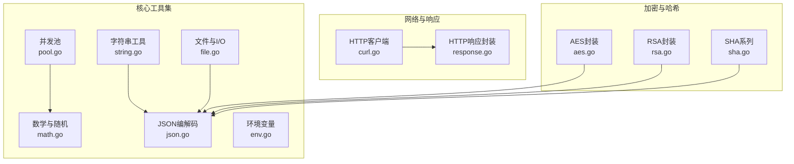
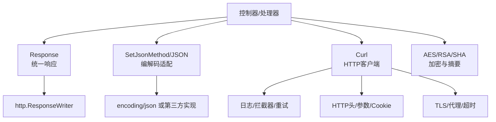
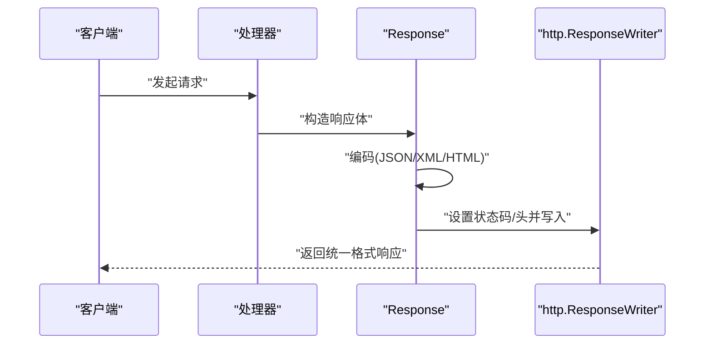
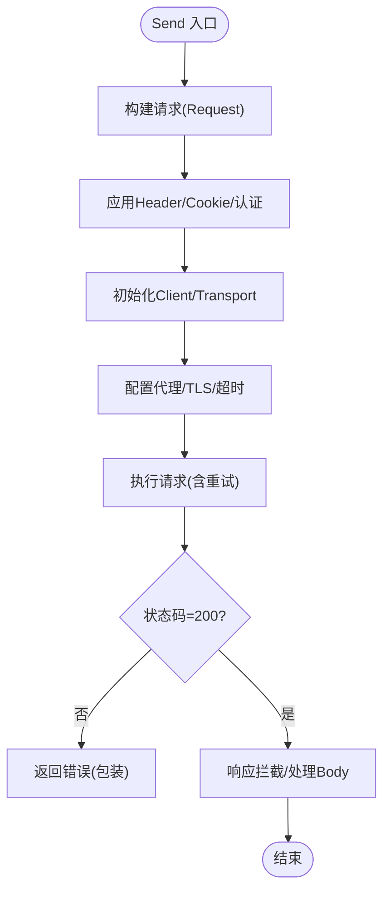
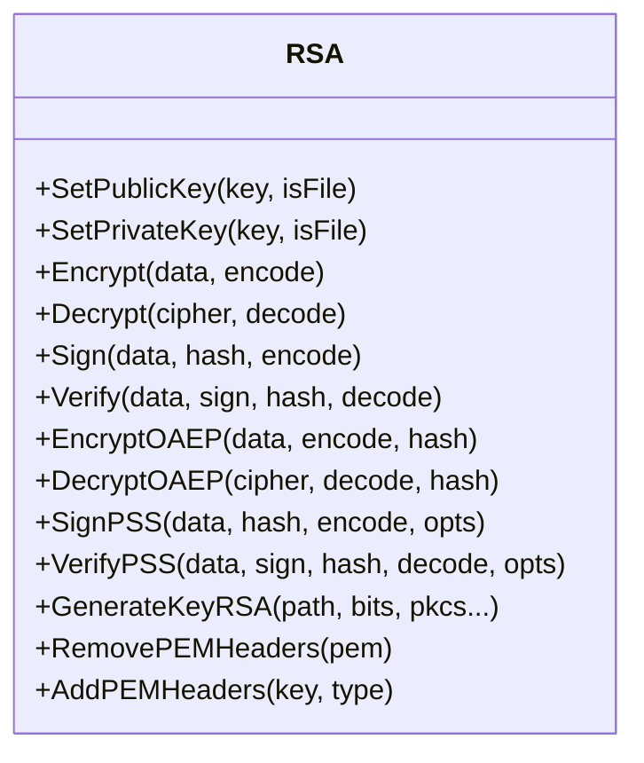
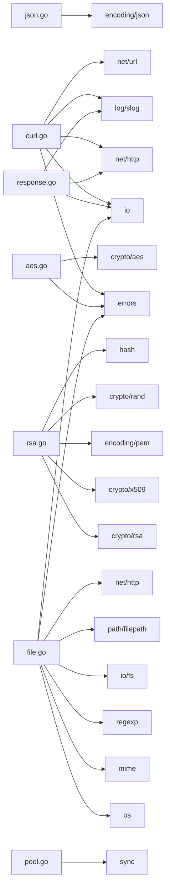

# 集成模式与兼容性

<cite>
**本文引用的文件**
- [README.md](file://README.md)
- [go.mod](file://go.mod)
- [types.go](file://types.go)
- [consts.go](file://consts.go)
- [response.go](file://response.go)
- [curl.go](file://curl.go)
- [aes.go](file://aes.go)
- [rsa.go](file://rsa.go)
- [sha.go](file://sha.go)
- [json.go](file://json.go)
- [pool.go](file://pool.go)
- [string.go](file://string.go)
- [math.go](file://math.go)
- [file.go](file://file.go)
- [env.go](file://env.go)
</cite>

## 目录

1. [简介](#简介)
2. [项目结构](#项目结构)
3. [核心组件](#核心组件)
4. [架构总览](#架构总览)
5. [详细组件分析](#详细组件分析)
6. [依赖关系分析](#依赖关系分析)
7. [性能考量](#性能考量)
8. [故障排查指南](#故障排查指南)
9. [结论](#结论)
10. [附录](#附录)

## 简介

本指南面向在Go生态中集成与兼容Go
Utils库的工程团队，系统阐述与标准库、第三方库的集成方法、Web框架适配策略、微服务使用模式、版本兼容与迁移建议，以及容器化与云原生实践要点。文档基于仓库现有实现进行归纳总结，避免臆测，确保读者可直接对照源码落地。

## 项目结构

- 模块与版本：模块名为 github.com/Is999/go-utils，最低Go版本要求为1.22。
- 功能模块分布：围绕字符串处理、数学与随机、文件与I/O、JSON编解码、HTTP客户端、响应封装、加密解密、哈希、并发池、环境变量等能力组织。
- 设计原则：以工具函数与类型组合为主，尽量复用标准库，必要时通过可插拔接口扩展第三方库行为。

图表来源

- [go.mod](file://go.mod#L1-L4)
- [string.go](file://string.go#L1-L187)
- [math.go](file://math.go#L1-L37)
- [file.go](file://file.go#L1-L451)
- [json.go](file://json.go#L1-L67)
- [env.go](file://env.go#L1-L19)
- [pool.go](file://pool.go#L1-L34)
- [curl.go](file://curl.go#L1-L1058)
- [response.go](file://response.go#L1-L342)
- [aes.go](file://aes.go#L1-L23)
- [rsa.go](file://rsa.go#L1-L527)
- [sha.go](file://sha.go#L1-L27)

章节来源

- [go.mod](file://go.mod#L1-L4)
- [README.md](file://README.md#L1-L800)

## 核心组件

- 类型与约束
    - 泛型数字与有序类型、切片排序接口、加密相关回调函数类型等，便于统一处理不同数值与字符串场景。
- 常量
    - 加密模式枚举、存储容量单位常量，为加密与文件处理提供一致语义。
- JSON编解码适配
    - 提供可插拔的编解码器注册机制，允许在应用入口替换为高性能第三方库实现。
- HTTP客户端与响应封装
    - Curl提供链式配置、拦截器、重试、日志与TLS/代理等能力；Response封装统一的业务响应结构与多种输出格式。
- 加解密与哈希
    - AES/RSA封装简化密钥管理与长文本处理；SHA系列提供常用摘要。
- 文件与I/O
    - 提供文件扫描、行读取、分块读取、写入与并发安全写、大小格式化、MIME推断等。
- 工具与并发
    - 字符串工具、随机数与唯一ID、数学辅助、通用并发池。

章节来源

- [types.go](file://types.go#L1-L98)
- [consts.go](file://consts.go#L1-L23)
- [json.go](file://json.go#L1-L67)
- [response.go](file://response.go#L1-L342)
- [curl.go](file://curl.go#L1-L1058)
- [aes.go](file://aes.go#L1-L23)
- [rsa.go](file://rsa.go#L1-L527)
- [sha.go](file://sha.go#L1-L27)
- [file.go](file://file.go#L1-L451)
- [string.go](file://string.go#L1-L187)
- [math.go](file://math.go#L1-L37)
- [pool.go](file://pool.go#L1-L34)

## 架构总览

下图展示典型Web服务中，控制器如何使用响应封装与HTTP客户端，结合JSON编解码与加密模块，形成清晰的职责边界与可替换点。

图表来源

- [response.go](file://response.go#L1-L342)
- [json.go](file://json.go#L1-L67)
- [curl.go](file://curl.go#L1-L1058)
- [aes.go](file://aes.go#L1-L23)
- [rsa.go](file://rsa.go#L1-L527)
- [sha.go](file://sha.go#L1-L27)

## 详细组件分析

### HTTP客户端与响应封装集成

- 响应封装
    - 通过泛型Body与Response，统一成功/失败响应结构，支持JSON、XML、HTML、文本、下载、显示与重定向。
    - 内置日志与错误追踪，异常时返回带唯一ID的错误信息，便于定位。
- HTTP客户端
    - 支持链式配置请求头、参数、Cookie、Basic认证、代理、TLS、超时、重试、请求/响应拦截与日志。
    - 提供便捷的GET/POST等方法，内部自动处理请求体与响应体读取、状态码校验与错误包装。

图表来源

- [response.go](file://response.go#L1-L342)

图表来源

- [curl.go](file://curl.go#L435-L772)

章节来源

- [response.go](file://response.go#L1-L342)
- [curl.go](file://curl.go#L1-L1058)

### JSON编解码适配策略

- 可插拔编解码器
    - 在应用启动阶段通过选项注册自定义编码/解码器，后续Marshal/Unmarshal统一走新实现。
- 兼容性建议
    - 保持接口一致性，避免在业务层硬编码具体库名；通过工厂或配置中心切换实现。

章节来源

- [json.go](file://json.go#L1-L67)

### 加密与哈希集成

- AES
    - 根据密钥长度选择合适算法，支持随机IV与可选前置存储。
- RSA
    - 支持PKCS1/PKCS8密钥格式、公钥加密/私钥解密、签名/验签、OAEP/PSS变体、长文本分段处理、PEM头尾处理。
- SHA
    - 提供常用摘要函数，便于签名与完整性校验。

图表来源

- [rsa.go](file://rsa.go#L1-L527)

章节来源

- [aes.go](file://aes.go#L1-L23)
- [rsa.go](file://rsa.go#L1-L527)
- [sha.go](file://sha.go#L1-L27)

### 文件与I/O处理

- 扫描与读取
    - 提供Scan/Line/Read三种读取模式，分别适用于行级处理、大行优化与大文件/无换行场景。
- 写入与并发
    - WriteFile提供互斥保护的写入接口，支持缓冲写入；并发池Pool[T]用于对象复用与重置。
- 其他
    - 文件存在性判断、复制、大小格式化、MIME类型推断等。

章节来源

- [file.go](file://file.go#L1-L451)
- [pool.go](file://pool.go#L1-L34)

### 字符串与数学工具

- 字符串
    - 提供替换、截取、反转、随机字符串、唯一ID生成等。
- 数学
    - 提供区间随机数与四舍五入等辅助函数，配合随机源提升批量生成效率。

章节来源

- [string.go](file://string.go#L1-L187)
- [math.go](file://math.go#L1-L37)

### 环境变量集成

- 提供简洁的环境变量读取与默认值处理，便于配置注入与多环境适配。

章节来源

- [env.go](file://env.go#L1-L19)

## 依赖关系分析

- 标准库依赖
    - net/http、crypto/*、encoding/*、mime、os、io、sync、strings、strconv、time、math/rand/v2等。
- 可选外部依赖
    - 通过JSON编解码器插件机制可接入第三方高性能实现；HTTP客户端默认使用标准库。
- 内聚与耦合
    - 各模块以工具函数与类型为主，低耦合；通过统一的错误包装与日志接口增强可观测性。

图表来源

- [curl.go](file://curl.go#L1-L1058)
- [response.go](file://response.go#L1-L342)
- [json.go](file://json.go#L1-L67)
- [rsa.go](file://rsa.go#L1-L527)
- [aes.go](file://aes.go#L1-L23)
- [file.go](file://file.go#L1-L451)
- [pool.go](file://pool.go#L1-L34)

章节来源

- [curl.go](file://curl.go#L1-L1058)
- [response.go](file://response.go#L1-L342)
- [json.go](file://json.go#L1-L67)
- [rsa.go](file://rsa.go#L1-L527)
- [aes.go](file://aes.go#L1-L23)
- [file.go](file://file.go#L1-L451)
- [pool.go](file://pool.go#L1-L34)

## 性能考量

- JSON编解码
    - 在高吞吐场景建议注册第三方高性能实现；通过一次性配置避免重复初始化开销。
- HTTP客户端
    - 合理设置超时与重试策略；启用连接池与合适的传输配置；避免在热路径频繁创建Client。
- 文件读取
    - 大文件优先使用Line或Read以减少内存占用；WriteFile配合缓冲写降低系统调用次数。
- 并发池
    - 对热点对象使用Pool[T]减少GC压力；结合重置函数清理状态。

## 故障排查指南

- 错误包装与追踪
    - 统一使用错误包装接口，关键路径记录唯一ID，便于日志关联与问题定位。
- HTTP客户端
    - 开启dump模式或默认日志输出，观察请求/响应关键字段；检查状态码、TLS配置与代理设置。
- 响应封装
    - 编码失败时返回带唯一ID的错误提示；核对Content-Type与Writer状态码设置。
- 文件与I/O
    - 使用DONE信号终止扫描流程；关注权限与路径合法性；MIME推断失败时回退至内容探测。

章节来源

- [response.go](file://response.go#L1-L342)
- [curl.go](file://curl.go#L1-L1058)
- [file.go](file://file.go#L1-L451)

## 结论

Go Utils库以“工具函数+可插拔适配+标准库复用”为核心设计，既满足日常开发高频需求，又为性能与兼容性留出扩展空间。遵循本文的集成与兼容策略，可在不改变业务代码风格的前提下，平滑对接主流Web框架、第三方库与云原生基础设施。

## 附录

### Web框架集成模式（概念性说明）

- Gin/Echo/Fiber等框架均以http.ResponseWriter作为输出载体，可直接复用响应封装组件，统一返回结构与错误处理。
- 中间件层面可注入日志、请求ID、超时控制与重试策略，结合HTTP客户端实现跨服务调用。
- 本节为通用集成思路，不直接对应特定源码文件。

### 微服务使用模式（概念性说明）

- 服务间通信：统一使用HTTP客户端，开启TLS与代理，配置超时与重试；在网关或SDK层引入熔断与限流。
- 负载均衡：由平台或Sidecar负责；应用侧通过健康检查与优雅退出保障。
- 本节为通用实践建议，不直接对应特定源码文件。

### 版本兼容与迁移指南

- Go版本：最低要求1.22；升级时关注内置函数替代与rand包迁移。
- 日志：使用标准库log/slog；错误追踪统一WrapError。
- 迁移建议：逐步替换旧API，优先在非关键路径验证；通过CI覆盖关键路径。

章节来源

- [README.md](file://README.md#L18-L28)
- [go.mod](file://go.mod#L1-L4)

### 容器化与云原生实践（概念性说明）

- 容器镜像：最小化基础镜像、多阶段构建、健康检查端点。
- 配置注入：优先使用环境变量与Secret；结合配置热更新。
- 观测性：集中日志与指标、分布式追踪、告警策略。
- DevOps：GitOps、自动化测试与发布流水线。
- 本节为通用实践建议，不直接对应特定源码文件。