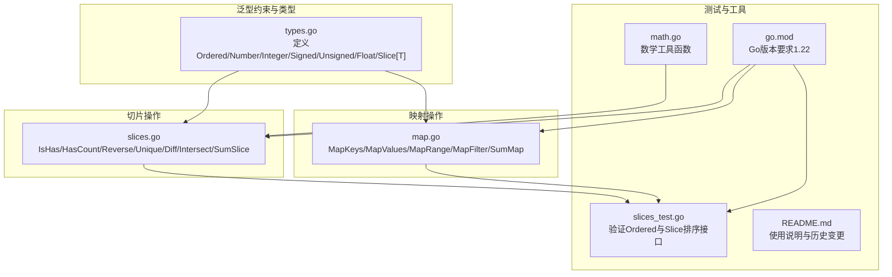
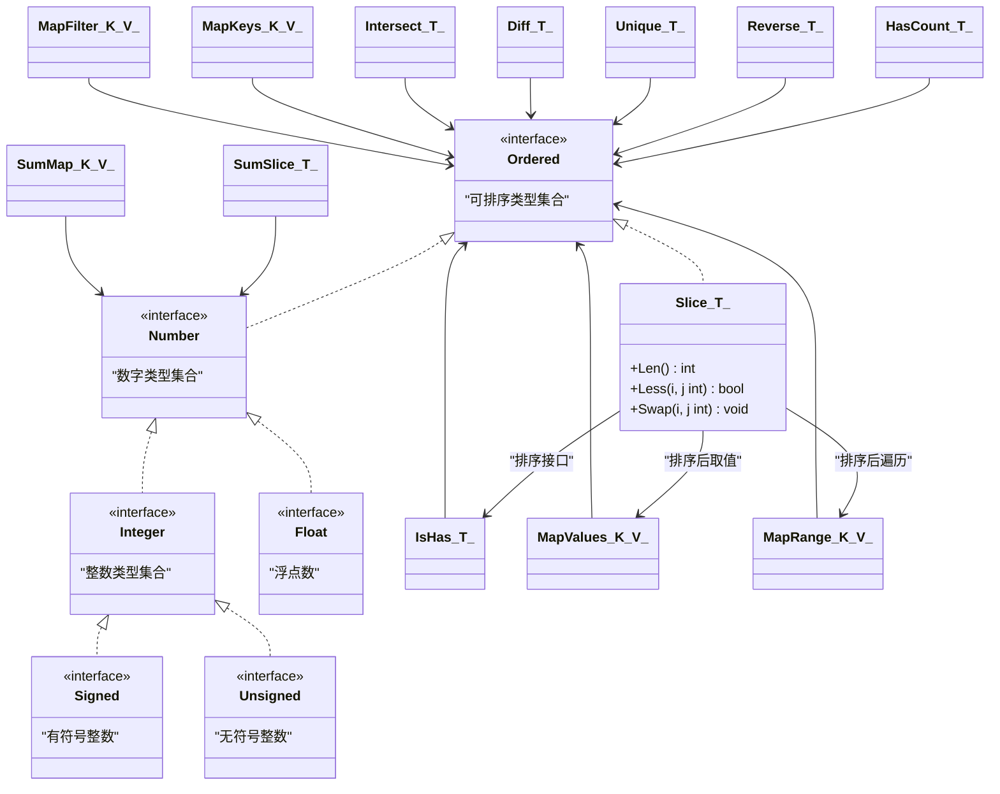
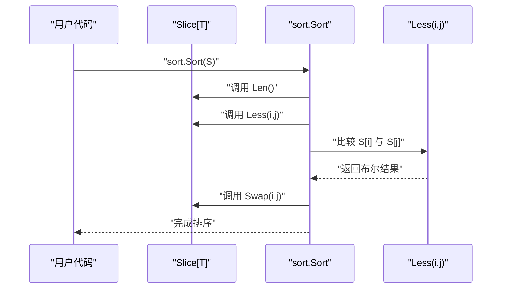
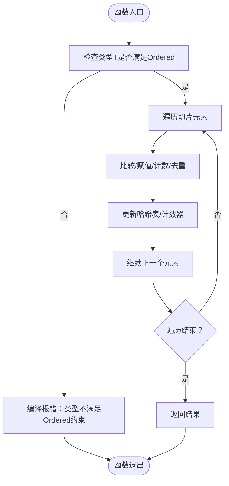
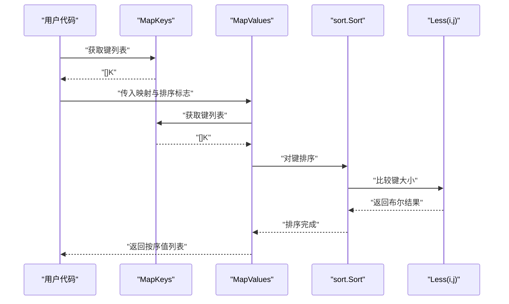
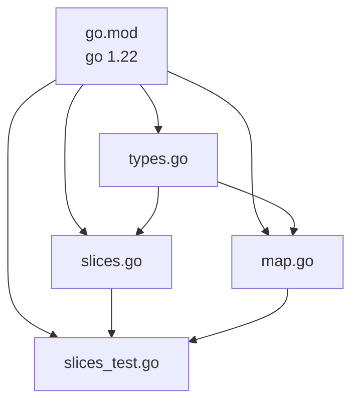

# Go泛型基础

<cite>
**本文档引用的文件**
- [types.go](file://types.go)
- [slices.go](file://slices.go)
- [slices_test.go](file://slices_test.go)
- [map.go](file://map.go)
- [math.go](file://math.go)
- [go.mod](file://go.mod)
- [README.md](file://README.md)
</cite>

## 目录

1. [简介](#简介)
2. [项目结构](#项目结构)
3. [核心组件](#核心组件)
4. [架构总览](#架构总览)
5. [详细组件分析](#详细组件分析)
6. [依赖关系分析](#依赖关系分析)
7. [性能考量](#性能考量)
8. [故障排查指南](#故障排查指南)
9. [结论](#结论)
10. [附录](#附录)

## 简介

本文件面向Go泛型基础，系统讲解Go 1.18+引入的泛型语法与约束接口的使用，重点围绕以下主题：

- Ordered、Number、Integer、Signed、Unsigned、Float等类型约束的定义与作用
- Slice[T]泛型切片类型的实现，以及Len()、Less()、Swap()排序接口的实现
- 数字类型约束的设计理念与适用场景
- 在不同场景下使用泛型的实践案例：类型安全的数值比较、字符串排序等
- 面向初学者的概念解释与面向有经验开发者的高级用法和性能优化建议

## 项目结构

该项目是一个通用工具库，其中与泛型相关的核心实现集中在以下文件：

- types.go：定义了泛型类型约束与Slice[T]排序接口实现
- slices.go：提供基于Ordered约束的切片操作函数
- map.go：提供基于Ordered与Number约束的映射操作函数
- slices_test.go：验证Ordered约束与Slice[T]排序接口的测试用例
- math.go：提供数学相关的辅助函数（与泛型结合使用）
- go.mod：声明Go版本要求为1.22
- README.md：项目使用说明与版本演进

图表来源

- [types.go](file://types.go#L1-L98)
- [slices.go](file://slices.go#L1-L83)
- [map.go](file://map.go#L1-L134)
- [slices_test.go](file://slices_test.go#L1-L232)
- [math.go](file://math.go#L1-L37)
- [go.mod](file://go.mod#L1-L4)
- [README.md](file://README.md#L1-L3892)

章节来源

- [types.go](file://types.go#L1-L98)
- [slices.go](file://slices.go#L1-L83)
- [map.go](file://map.go#L1-L134)
- [slices_test.go](file://slices_test.go#L1-L232)
- [math.go](file://math.go#L1-L37)
- [go.mod](file://go.mod#L1-L4)
- [README.md](file://README.md#L1-L3892)

## 核心组件

本节聚焦于泛型约束与Slice[T]排序接口的定义与实现，以及基于这些约束的切片与映射操作函数。

- 类型约束
    - Signed：有符号整数类型集合
    - Unsigned：无符号整数类型集合
    - Integer：整数类型集合（Signed | Unsigned）
    - Float：浮点数类型集合
    - Number：数字类型集合（Integer | Float）
    - Ordered：可排序类型集合（Number | string）

- Slice[T]排序接口实现
    - Slice[T]基于Ordered约束，实现Len()、Less()、Swap()方法，满足sort.Interface，可直接用于sort.Sort()

- 切片操作函数（基于Ordered）
    - IsHas：检查元素是否存在
    - HasCount：统计元素出现次数
    - Reverse：反转切片
    - Unique：去重
    - Diff：差集
    - Intersect：交集
    - SumSlice：求和（基于Number）

- 映射操作函数（基于Ordered与Number）
    - MapKeys：获取键列表
    - MapValues：按键排序后返回值列表
    - MapRange：按键排序后遍历
    - MapFilter：过滤键值对
    - SumMap：计算值的和（基于Number）

章节来源

- [types.go](file://types.go#L5-L38)
- [slices.go](file://slices.go#L3-L82)
- [map.go](file://map.go#L7-L133)

## 架构总览

下图展示了泛型约束、Slice[T]排序接口与具体操作函数之间的关系，以及测试验证流程。

图表来源

- [types.go](file://types.go#L5-L38)
- [slices.go](file://slices.go#L3-L82)
- [map.go](file://map.go#L7-L133)

## 详细组件分析

### 类型约束与设计哲学

- Signed/Unsigned/Integer/Float/Number/Ordered分别从“有符号”、“无符号”、“整数”、“浮点数”、“数字”、“可排序”等维度构建类型层次，形成清晰的约束体系。
- Ordered将Number与string组合，使得数字与字符串均可参与排序，满足常见的比较与排序需求。
- 设计理念强调“最小必要性”：仅在需要比较或排序时使用Ordered；仅在需要数值运算时使用Number，从而在保证类型安全的同时避免过度约束。

章节来源

- [types.go](file://types.go#L5-L38)

### Slice[T]排序接口实现

- Slice[T]通过实现Len()、Less()、Swap()满足sort.Interface，使任意Ordered类型的切片可直接使用sort.Sort进行排序。
- Less()的实现基于T的比较运算符，确保在编译期约束T必须支持比较操作。
- 这种设计使得用户无需为每种类型编写重复的排序逻辑，提高代码复用性与安全性。

图表来源

- [types.go](file://types.go#L38-L42)

章节来源

- [types.go](file://types.go#L38-L42)

### 切片操作函数（基于Ordered）

- IsHas/HasCount：基于==比较，适用于Ordered类型，实现存在性检查与计数。
- Reverse：原地反转，适用于Ordered类型。
- Unique：基于map[T]struct{}去重，保持相对顺序。
- Diff/Intersect：基于哈希表实现集合运算，时间复杂度O(n+m)。
- SumSlice：基于Number约束，实现数值求和。

图表来源

- [slices.go](file://slices.go#L3-L82)

章节来源

- [slices.go](file://slices.go#L3-L82)

### 映射操作函数（基于Ordered与Number）

- MapKeys：提取键列表，键类型需满足Ordered。
- MapValues：先按键排序，再按序返回对应值；支持升序/降序。
- MapRange：按键排序后遍历，支持提前终止。
- MapFilter：按键过滤，原地修改映射。
- SumMap：对值求和，值类型需满足Number。

图表来源

- [map.go](file://map.go#L7-L43)

章节来源

- [map.go](file://map.go#L7-L43)

### 测试验证与使用示例

- slices_test.go通过多组测试覆盖int、string、rune、byte等Ordered类型，验证IsHas、Unique、Diff、Intersect等函数的行为。
- 测试中还演示了Slice[T]作为sort.Interface的使用方式，验证排序接口的正确性。

章节来源

- [slices_test.go](file://slices_test.go#L11-L76)
- [slices_test.go](file://slices_test.go#L101-L132)
- [slices_test.go](file://slices_test.go#L149-L181)
- [slices_test.go](file://slices_test.go#L200-L231)

## 依赖关系分析

- 版本要求：项目使用Go 1.22，确保能充分利用泛型与标准库新特性。
- 标准库依赖：map.go中使用sort包进行排序；slices_test.go中使用sort包对Slice[T]进行排序。
- 内聚与耦合：类型约束定义集中于types.go，操作函数按功能拆分至slices.go与map.go，测试独立于实现，降低耦合度，提高内聚性。

图表来源

- [go.mod](file://go.mod#L1-L4)
- [types.go](file://types.go#L1-L98)
- [slices.go](file://slices.go#L1-L83)
- [map.go](file://map.go#L1-L134)
- [slices_test.go](file://slices_test.go#L1-L232)

章节来源

- [go.mod](file://go.mod#L1-L4)
- [types.go](file://types.go#L1-L98)
- [slices.go](file://slices.go#L1-L83)
- [map.go](file://map.go#L1-L134)
- [slices_test.go](file://slices_test.go#L1-L232)

## 性能考量

- 时间复杂度
    - Unique/Diff/Intersect：基于哈希表，平均O(n+m)，空间换时间
    - Reverse：原地双指针，O(n)
    - SumSlice/SumMap：线性遍历，O(n)
- 空间复杂度
    - Unique/Diff/Intersect：额外哈希表空间O(n)
    - Reverse：原地操作，O(1)
- 排序性能
    - Slice[T]实现sort.Interface，底层采用高效排序算法，适合大规模数据排序
- 实践建议
    - 对于超大数据集，优先使用哈希表去重与集合运算
    - 尽量在调用方传入已分配容量的切片，减少扩容开销
    - 对频繁排序的场景，考虑预先分配足够容量并复用切片

## 故障排查指南

- 编译错误：类型不满足约束
    - 症状：使用非Ordered/Number类型调用相关函数时报错
    - 处理：确认类型满足Ordered或Number约束，或为自定义类型添加约束
- 排序异常：Less()比较逻辑不符合预期
    - 症状：排序结果与预期不符
    - 处理：检查T的比较运算符是否符合业务需求；必要时自定义排序逻辑
- 性能问题：去重/集合运算耗时过长
    - 症状：Unique/Diff/Intersect执行缓慢
    - 处理：检查输入规模与哈希冲突；必要时预估容量、减少不必要的拷贝
- 测试失败：断言不匹配
    - 症状：测试用例断言失败
    - 处理：对照slices_test.go中的用例，逐项核对输入与期望输出

章节来源

- [slices_test.go](file://slices_test.go#L11-L76)
- [slices_test.go](file://slices_test.go#L101-L132)
- [slices_test.go](file://slices_test.go#L149-L181)
- [slices_test.go](file://slices_test.go#L200-L231)

## 结论

本项目通过清晰的类型约束体系与简洁的泛型实现，提供了类型安全且高效的切片与映射操作。Ordered与Number等约束的设计既满足了常见排序与数值运算需求，又保持了足够的灵活性。配合Slice[T]
的排序接口实现，用户可以以极低的学习成本获得强大的泛型能力。建议在实际项目中：

- 优先使用Ordered与Number约束，确保类型安全
- 合理选择数据结构与算法，平衡时间与空间复杂度
- 在大规模数据场景下，关注内存分配与缓存局部性
- 充分利用测试用例，验证边界条件与异常路径

## 附录

- 版本要求：Go 1.22
- 使用说明：参考README.md中的使用说明与历史变更
- 示例路径：slices_test.go中包含多种Ordered类型的使用示例

章节来源

- [README.md](file://README.md#L13-L28)
- [slices_test.go](file://slices_test.go#L11-L76)
- [slices_test.go](file://slices_test.go#L101-L132)
- [slices_test.go](file://slices_test.go#L149-L181)
- [slices_test.go](file://slices_test.go#L200-L231)