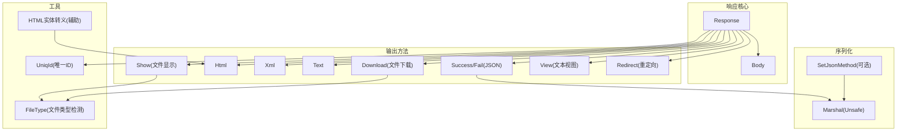
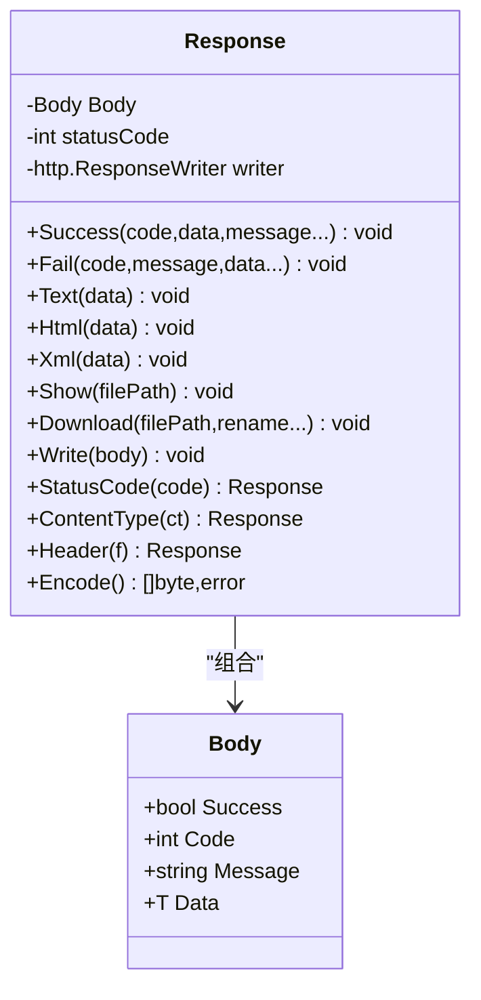
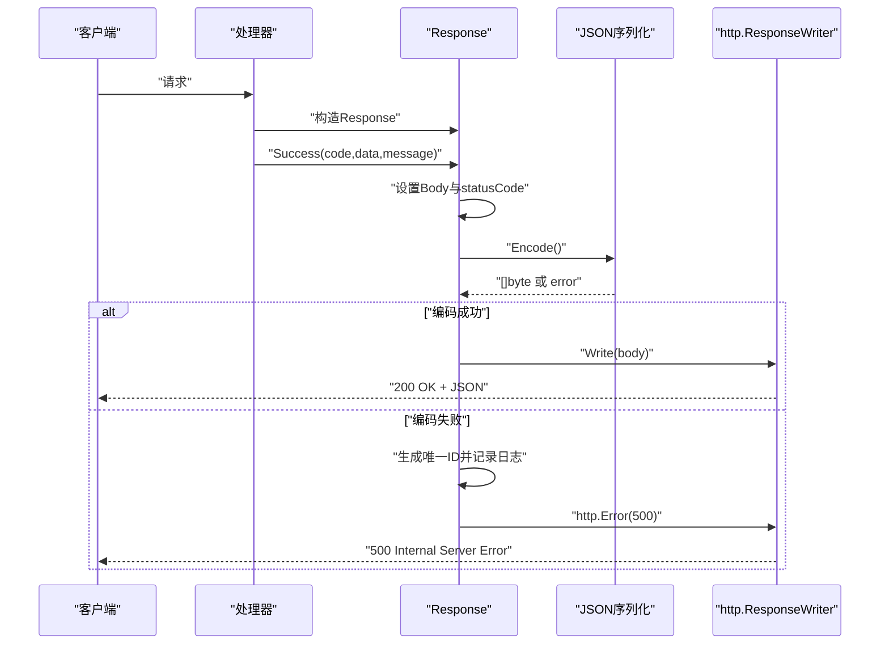
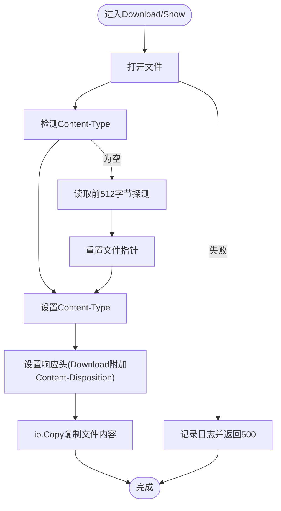
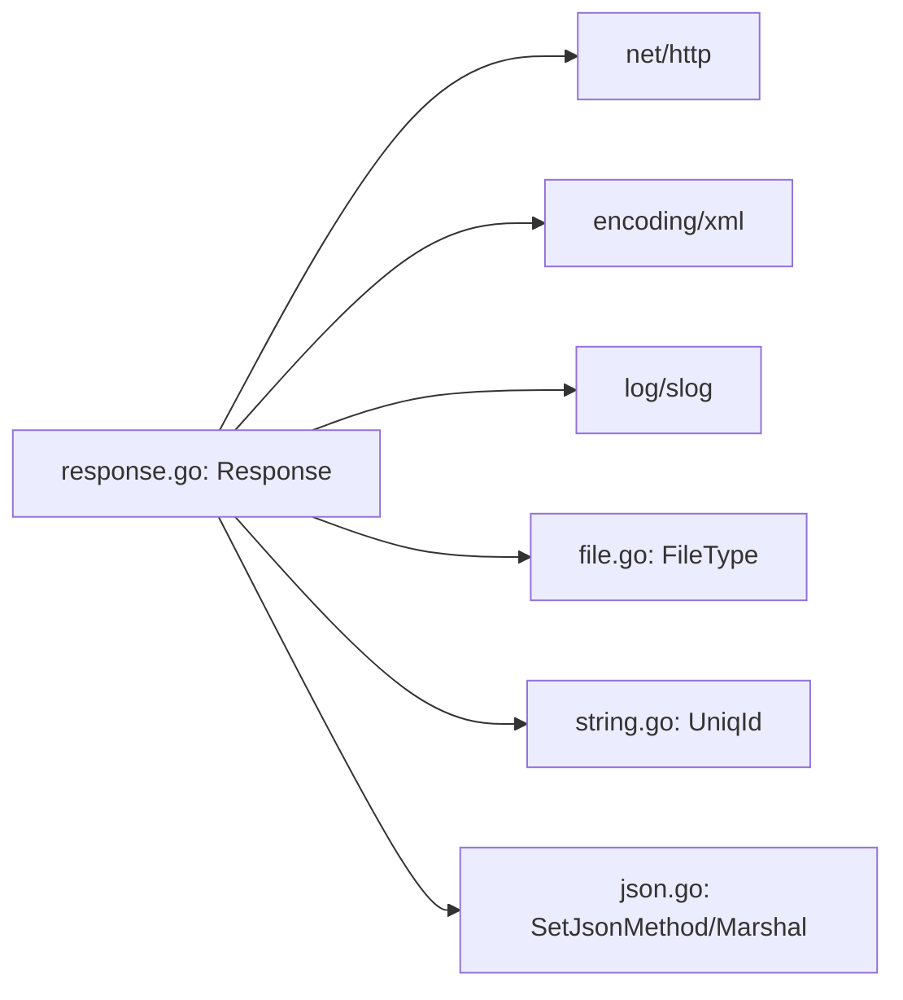

# HTTP响应设计

<cite>
**本文档引用的文件**
- [response.go](file://response.go)
- [json.go](file://json.go)
- [file.go](file://file.go)
- [string.go](file://string.go)
- [html.go](file://html.go)
- [example_test.go](file://example_test.go)
- [response_test.go](file://response_test.go)
- [README.md](file://README.md)
</cite>

## 目录

1. [简介](#简介)
2. [项目结构](#项目结构)
3. [核心组件](#核心组件)
4. [架构总览](#架构总览)
5. [详细组件分析](#详细组件分析)
6. [依赖关系分析](#依赖关系分析)
7. [性能考量](#性能考量)
8. [故障排查指南](#故障排查指南)
9. [结论](#结论)
10. [附录](#附录)

## 简介

本文件面向Web开发者，系统性阐述HTTP响应设计的统一结构与实现机制。通过对Response结构体、统一响应体Body、多格式响应支持（JSON、XML、HTML、纯文本、文件下载/显示）以及自定义JSON编解码器的深入解析，帮助读者建立一致、可维护且高性能的HTTP响应体系。文档同时提供最佳实践、错误处理策略、内容协商与缓存控制建议，并给出可直接参考的集成模式与示例路径。

## 项目结构

该工具库围绕HTTP响应设计提供了以下关键模块：

- 响应核心：Response与Body，统一JSON响应结构
- 多格式输出：HTML、XML、纯文本、文件下载与显示
- 序列化扩展：可插拔JSON编解码器
- 工具能力：文件类型检测、唯一ID生成、HTML实体转义辅助

图表来源

- [response.go](file://response.go#L11-L342)
- [json.go](file://json.go#L1-L67)
- [file.go](file://file.go#L434-L450)
- [string.go](file://string.go#L140-L187)
- [html.go](file://html.go#L1-L5)

章节来源

- [response.go](file://response.go#L1-L342)
- [json.go](file://json.go#L1-L67)
- [file.go](file://file.go#L1-L451)
- [string.go](file://string.go#L1-L187)
- [html.go](file://html.go#L1-L5)

## 核心组件

- Response：响应容器，封装Body、状态码与http.ResponseWriter，提供统一的写入与头部设置能力。
- Body：统一响应体，包含success、code、message、data字段，便于前端统一解析。
- 多格式输出方法：Success/Fail（JSON）、Html、Xml、Text、Show、Download、View、Redirect。
- 序列化机制：默认使用encoding/json，支持通过SetJsonMethod注入第三方库实现。

章节来源

- [response.go](file://response.go#L11-L342)
- [json.go](file://json.go#L1-L67)

## 架构总览

统一响应结构通过Response将业务数据与HTTP细节解耦，确保：

- 结构一致性：所有JSON响应均遵循统一的Body结构
- 状态管理：集中设置状态码与响应头
- 多格式支持：按需切换HTML/XML/文本/文件
- 可扩展性：JSON编解码器可替换

图表来源

- [response.go](file://response.go#L11-L342)

## 详细组件分析

### Response与Body：统一响应结构

- 设计理念
    - 以Body承载统一的响应字段，避免不同接口返回结构不一致
    - 泛型约束T，使Data字段类型安全，便于前端强类型消费
    - 将状态码与响应头管理内聚于Response，减少重复代码
- 关键行为
    - Success/Fail：自动设置状态码、序列化Body并写入响应
    - Text/Html/Xml：设置Content-Type并写入原始字节
    - Show/Download：基于文件类型检测设置Content-Type，支持附件下载
    - StatusCode/ContentType/Header：链式设置状态码与响应头
    - Encode：委托Marshal进行JSON序列化

章节来源

- [response.go](file://response.go#L11-L342)

### JSON响应：Success/Fail与自定义编解码器

- Success/Fail流程
    - 设置Body字段与状态码
    - 调用Encode()序列化Body
    - 发生错误时生成唯一ID并记录日志，返回500
    - 调用Write()写入响应
- 自定义JSON编解码器
    - 通过SetJsonMethod注册自定义编码/解码函数
    - 仅在程序启动时设置一次，保证全局一致性
    - 未设置时回退至标准库encoding/json

图表来源

- [response.go](file://response.go#L29-L83)
- [json.go](file://json.go#L39-L66)

章节来源

- [response.go](file://response.go#L24-L83)
- [json.go](file://json.go#L16-L66)

### HTML/XML/纯文本响应

- Html/Text：设置Content-Type为text/html或text/plain，直接写入字节
- Xml：使用xml.MarshalIndent序列化，自动添加XML声明与缩进，设置application/xml
- 注意：Html/Xml/Text不参与统一Body结构，适合非JSON场景

章节来源

- [response.go](file://response.go#L85-L116)

### 文件下载与显示：Show/Download

- Show：打开文件，检测MIME类型，设置Content-Type，直接复制文件内容到响应
- Download：与Show类似，但额外设置Content-Disposition为附件形式，支持重命名
- 文件类型检测：优先根据扩展名推断，若为空则读取文件前512字节进行类型探测，并重置文件指针

图表来源

- [response.go](file://response.go#L118-L251)
- [file.go](file://file.go#L434-L450)

章节来源

- [response.go](file://response.go#L118-L251)
- [file.go](file://file.go#L434-L450)

### 文本视图与重定向：View/Redirect

- View：返回Response，不强制JSON结构，适合HTML/XML/文本等
- Redirect：设置Location与状态码（默认302），立即写入响应头

章节来源

- [response.go](file://response.go#L310-L342)

### 唯一ID与错误追踪

- 唯一ID：用于错误追踪，生成固定长度的唯一字符串
- 错误记录：发生编码/写入/文件操作错误时，生成唯一ID并记录slog日志，同时返回500

章节来源

- [string.go](file://string.go#L140-L187)
- [response.go](file://response.go#L40-L53)
- [response.go](file://response.go#L122-L136)

## 依赖关系分析

- Response依赖
    - http标准库：http.ResponseWriter、状态码常量
    - encoding/xml：XML序列化
    - 标准库log/slog：错误日志记录
    - utils/file.go：文件类型检测
    - utils/string.go：唯一ID生成
    - utils/json.go：JSON编解码器注入
- 多格式输出与工具函数的耦合度低，便于按需引入

图表来源

- [response.go](file://response.go#L1-L342)
- [file.go](file://file.go#L434-L450)
- [json.go](file://json.go#L1-L67)
- [string.go](file://string.go#L140-L187)

章节来源

- [response.go](file://response.go#L1-L342)
- [file.go](file://file.go#L434-L450)
- [json.go](file://json.go#L1-L67)
- [string.go](file://string.go#L140-L187)

## 性能考量

- JSON序列化
    - 默认使用标准库，性能稳定；如需更高性能，可通过SetJsonMethod注入第三方实现
    - 避免在热路径频繁创建临时对象，尽量复用Response实例
- 文件传输
    - Show/Download使用io.Copy，内存占用低，适合大文件
    - 文件类型检测仅读取少量字节并重置指针，避免额外IO开销
- 日志与错误
    - 唯一ID生成与slog记录为O(1)开销，建议在错误路径使用，避免在高频正常路径频繁调用

[本节为通用性能建议，无需特定文件来源]

## 故障排查指南

- JSON编码失败
    - 现象：返回500 Internal Server Error，响应体包含错误码
    - 处理：检查数据结构是否可JSON序列化，必要时使用SetJsonMethod注入自定义编解码器
- 文件读取/类型检测失败
    - 现象：打开文件、Stat、FileType、io.Copy阶段返回500
    - 处理：确认文件路径存在且可读，检查权限与磁盘空间
- 响应写入失败
    - 现象：Write阶段记录日志并返回500
    - 处理：检查网络连接、客户端关闭连接、缓冲区溢出等情况
- HTML/XML/文本输出异常
    - 现象：Content-Type设置不当导致浏览器渲染异常
    - 处理：确保调用对应方法（Html/Xml/Text），或手动设置ContentType

章节来源

- [response.go](file://response.go#L40-L53)
- [response.go](file://response.go#L122-L136)
- [response.go](file://response.go#L254-L268)
- [response.go](file://response.go#L91-L116)

## 结论

该响应设计通过Response与Body实现了统一的JSON响应结构，结合多格式输出与可插拔JSON编解码器，既满足了REST
API的一致性需求，又兼顾了HTML/XML/文本/文件等多样化场景。配合完善的错误追踪与文件类型检测，能够为Web应用提供稳定、可维护且高性能的HTTP响应层。

[本节为总结性内容，无需特定文件来源]

## 附录

### 最佳实践清单

- 统一使用Response封装JSON响应，保持success/code/message/data字段一致
- 在应用启动时通过SetJsonMethod设置自定义JSON编解码器（如需）
- 文件下载使用Download，显示使用Show，避免混淆Content-Disposition
- 使用StatusCode/ContentType/Header链式设置响应头，避免分散设置
- 对外暴露的错误统一走Fail，内部错误记录唯一ID并返回500
- 对于HTML/XML/文本等非JSON场景，使用View并选择对应输出方法

### 示例与集成模式

- JSON响应：参考示例路径
    - [示例：JSON响应](file://example_test.go#L24-L48)
    - [示例：HTML/XML/文本/文件显示/下载](file://example_test.go#L50-L107)
- README文档中的使用说明
    - [JSON响应](file://README.md#L3489-L3535)
    - [HTML响应](file://README.md#L3539-L3552)
    - [XML响应](file://README.md#L3556-L3579)
    - [TEXT响应](file://README.md#L3583-L3595)
    - [文件显示/下载](file://README.md#L3599-L3642)
    - [重定向](file://README.md#L3480-L3485)

### 关键API速览

- Response方法
    - Success/Fail：设置Body并写入JSON
    - Html/Xml/Text：设置Content-Type并写入字节
    - Show/Download：基于文件类型检测设置Content-Type并传输
    - StatusCode/ContentType/Header：设置状态码与响应头
    - Encode：序列化Body
- 工具函数
    - SetJsonMethod：设置自定义JSON编解码器
    - FileType：文件类型检测
    - UniqId：生成唯一ID

章节来源

- [response.go](file://response.go#L24-L342)
- [json.go](file://json.go#L16-L66)
- [file.go](file://file.go#L434-L450)
- [string.go](file://string.go#L140-L187)
- [example_test.go](file://example_test.go#L1-L107)
- [README.md](file://README.md#L3489-L3642)