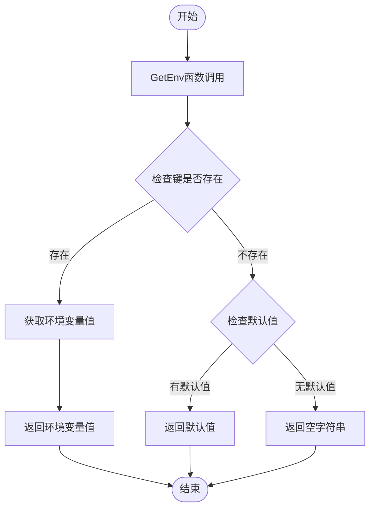

# 全局配置系统

<cite>
**本文档引用的文件**
- [config.go](file://config.go)
- [json.go](file://json.go)
- [env.go](file://env.go)
- [types.go](file://types.go)
- [consts.go](file://consts.go)
- [config_test.go](file://config_test.go)
- [env_test.go](file://env_test.go)
- [go.mod](file://go.mod)
- [README.md](file://README.md)
</cite>

## 目录

1. [简介](#简介)
2. [项目结构](#项目结构)
3. [核心组件](#核心组件)
4. [架构概览](#架构概览)
5. [详细组件分析](#详细组件分析)
6. [依赖关系分析](#依赖关系分析)
7. [性能考虑](#性能考虑)
8. [故障排除指南](#故障排除指南)
9. [结论](#结论)

## 简介

全局配置系统是Go-utils工具库中的核心基础设施，提供了一种线程安全的全局配置管理机制。该系统允许应用程序在启动时配置各种全局设置，特别是JSON编解码器的替换功能，使得开发者可以灵活地选择不同的JSON库实现。

系统采用单例模式和一次性初始化策略，确保配置在整个应用程序生命周期内保持一致性和安全性。主要特性包括：

- **线程安全的全局配置**
- **一次性初始化保证**
- **可插拔的JSON编解码器**
- **环境变量访问接口**
- **类型安全的配置选项**

## 项目结构

Go-utils项目采用模块化的文件组织方式，每个功能模块都有独立的文件和对应的测试文件。全局配置系统主要涉及以下关键文件：

**图表来源**

- [config.go](file://config.go#L1-L63)
- [json.go](file://json.go#L1-L12)
- [env.go](file://env.go#L1-L19)

**章节来源**

- [config.go](file://config.go#L1-L63)
- [json.go](file://json.go#L1-L12)
- [env.go](file://env.go#L1-L19)
- [go.mod](file://go.mod#L1-L4)

## 核心组件

全局配置系统由以下几个核心组件构成：

### 1. 配置选项结构体

配置系统的核心是一个全局的options结构体，它包含了所有可配置的参数。当前版本主要支持JSON编解码器的自定义配置。

### 2. 选项函数模式

系统采用Go语言中常见的"选项函数"设计模式，通过WithJSON等函数来构建配置选项。这种模式提供了：

- 灵活的配置组合
- 可选参数支持
- 类型安全的配置过程

### 3. 一次性初始化机制

使用sync.Once确保配置只初始化一次，防止并发访问时的竞态条件。

**章节来源**

- [config.go](file://config.go#L8-L32)
- [config.go](file://config.go#L34-L43)
- [config.go](file://config.go#L45-L62)

## 架构概览

全局配置系统的整体架构采用了分层设计，确保了高内聚低耦合的特性：

**图表来源**

- [config.go](file://config.go#L45-L62)
- [json.go](file://json.go#L3-L11)
- [env.go](file://env.go#L9-L18)

## 详细组件分析

### 配置管理器组件

配置管理器是整个系统的核心，负责管理全局配置状态和提供配置接口。

#### 配置结构体设计

**图表来源**

- [config.go](file://config.go#L29-L32)
- [config.go](file://config.go#L23-L31)
- [config.go](file://config.go#L8-L16)

#### 一次性初始化机制

系统使用sync.Once确保配置只初始化一次，这提供了：

1. **线程安全性**：防止多个goroutine同时初始化配置
2. **性能优化**：避免重复的初始化开销
3. **一致性保证**：确保配置在整个应用生命周期内保持一致

#### 配置选项构建器

配置选项采用函数式编程风格，每个选项函数都是纯函数，接收当前配置并返回修改后的配置。

**章节来源**

- [config.go](file://config.go#L8-L16)
- [config.go](file://config.go#L45-L62)
- [config.go](file://config.go#L34-L43)

### JSON编解码服务组件

JSON编解码服务是配置系统的主要应用场景，允许用户替换默认的encoding/json库。

#### 编解码器接口设计

**图表来源**

- [json.go](file://json.go#L3-L11)
- [config.go](file://config.go#L34-L43)

#### 编解码器类型系统

系统定义了灵活的编解码器接口，支持任何符合特定签名的函数：

- **Encode函数**：接收任意类型，返回字节数组和错误
- **Decode函数**：接收字节数组和目标指针，返回错误

**章节来源**

- [json.go](file://json.go#L3-L11)
- [types.go](file://types.go#L100-L108)

### 环境变量服务组件

环境变量服务提供了简单易用的环境变量访问接口，支持默认值设置。

#### 环境变量访问流程

**图表来源**

- [env.go](file://env.go#L12-L18)

**章节来源**

- [env.go](file://env.go#L9-L18)

## 依赖关系分析

全局配置系统的依赖关系相对简单，主要依赖于标准库和自身的类型定义。

**图表来源**

- [config.go](file://config.go#L3-L6)
- [json.go](file://json.go#L1-L2)
- [env.go](file://env.go#L3-L4)

### 外部依赖分析

1. **sync.Once**：提供线程安全的一次性初始化
2. **encoding/json**：提供默认的JSON编解码器
3. **os**：提供环境变量访问功能

### 内部依赖分析

系统内部模块之间的依赖关系清晰且单一：

- JSON服务依赖配置系统
- 环境服务依赖常量定义
- 类型定义被多个模块共享

**章节来源**

- [config.go](file://config.go#L3-L6)
- [json.go](file://json.go#L1-L2)
- [env.go](file://env.go#L3-L4)

## 性能考虑

全局配置系统在设计时充分考虑了性能因素：

### 1. 内存效率

- 使用全局变量存储配置，避免重复分配
- sync.Once确保只进行一次初始化
- 函数式配置选项避免创建复杂对象图

### 2. 并发安全

- sync.Once提供高效的并发保护
- 无锁读取路径，只有初始化时有同步开销
- 配置一旦设置就不可更改，简化了并发模型

### 3. 执行效率

- 配置查找为O(1)时间复杂度
- JSON编解码直接委托给配置的函数指针
- 环境变量访问为系统调用级别性能

## 故障排除指南

### 常见问题及解决方案

#### 1. 配置未生效问题

**症状**：调用Configure后，配置没有按预期工作

**可能原因**：

- 配置被其他代码覆盖
- 初始化顺序错误
- 并发访问问题

**解决方案**：

- 确保在程序启动时调用Configure
- 避免在多个地方设置配置
- 检查是否有其他代码修改了全局配置

#### 2. JSON编解码器替换失败

**症状**：WithJSON返回的配置无法正常工作

**可能原因**：

- 传入nil参数
- 编解码器签名不匹配
- 类型不兼容

**解决方案**：

- 确保传入非nil的编解码器函数
- 验证函数签名与类型定义匹配
- 使用标准库的json.Marshal和json.Unmarshal作为参考

#### 3. 环境变量访问异常

**症状**：GetEnv返回意外的结果

**可能原因**：

- 键不存在
- 默认值设置错误
- 环境变量为空字符串

**解决方案**：

- 检查环境变量是否正确设置
- 验证默认值参数传递
- 区分空字符串和未设置的情况

**章节来源**

- [config_test.go](file://config_test.go#L10-L24)
- [env_test.go](file://env_test.go#L9-L28)

## 结论

全局配置系统是Go-utils工具库中设计精良的基础设施组件。它成功地解决了以下关键问题：

### 设计优势

1. **简洁性**：采用最小必要的API设计，易于理解和使用
2. **安全性**：通过一次性初始化和线程安全机制确保配置一致性
3. **灵活性**：支持可插拔的组件替换，特别是JSON编解码器
4. **性能**：零运行时开销的配置查找和高效的并发保护

### 技术特色

- **函数式配置**：选项函数模式提供了优雅的配置DSL
- **类型安全**：严格的类型定义确保编解码器兼容性
- **扩展性**：易于添加新的配置选项而不需要修改现有代码
- **测试友好**：完整的单元测试覆盖关键功能

### 应用场景

该配置系统特别适用于：

- 需要替换默认JSON库的应用
- 配置驱动的可插拔架构
- 需要在启动时统一配置的大型应用
- 需要线程安全配置管理的并发应用

全局配置系统为Go-utils提供了坚实的基础，展示了如何在Go语言中设计高质量的基础设施组件。