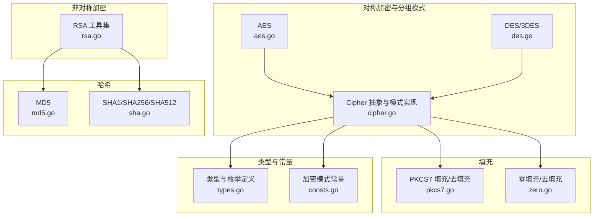
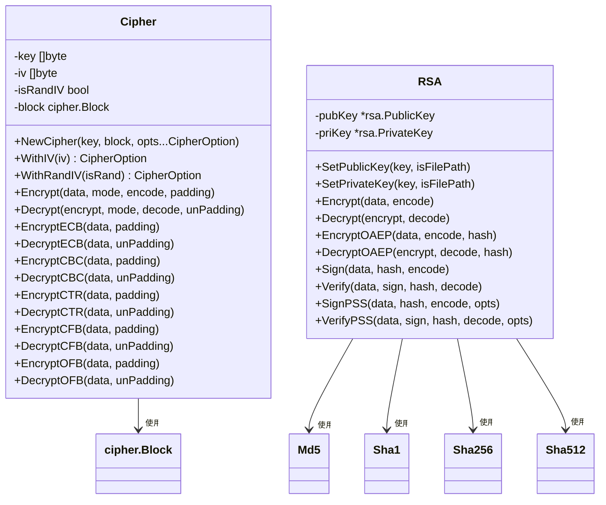
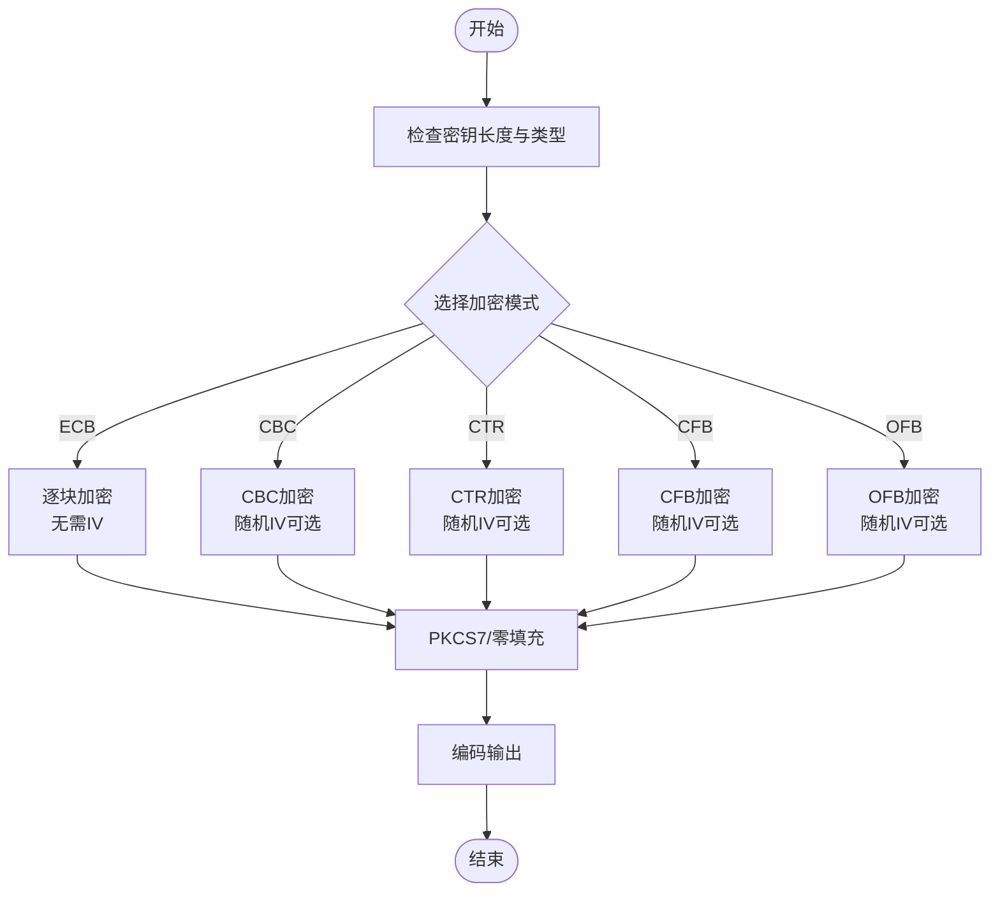
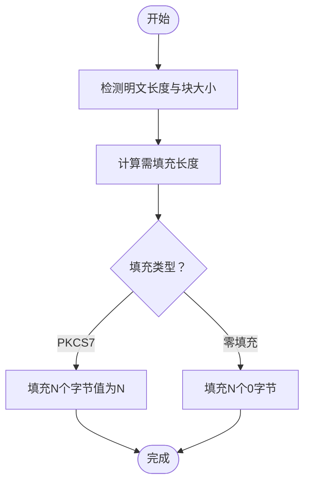
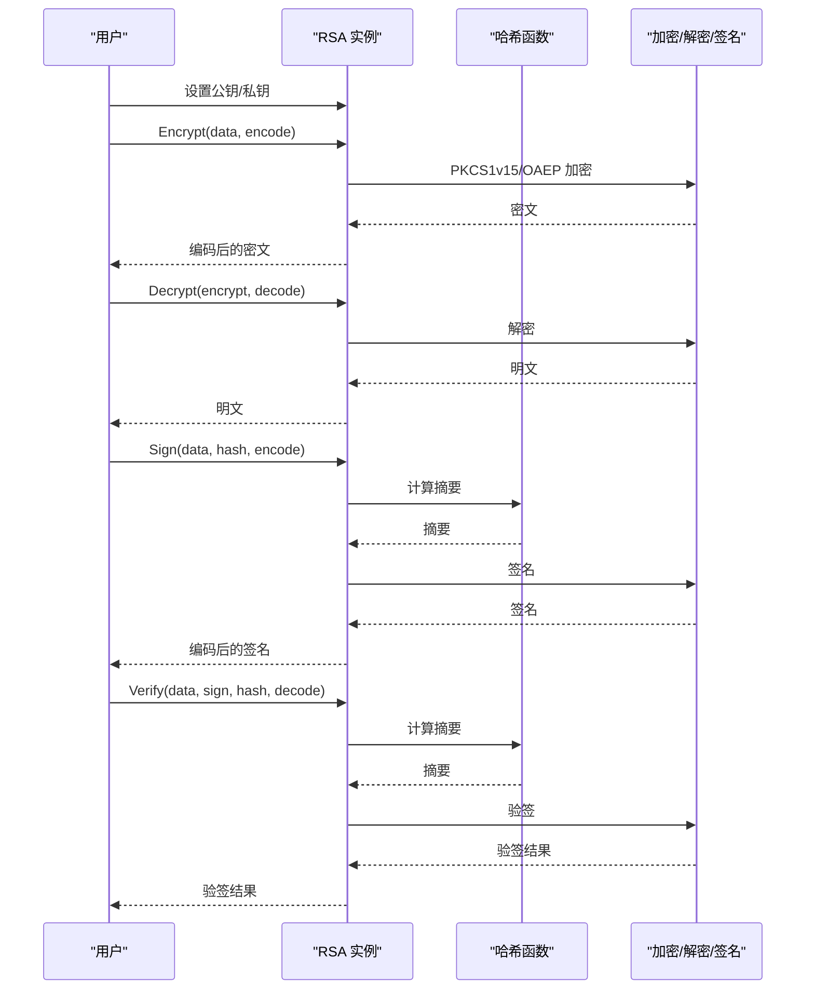
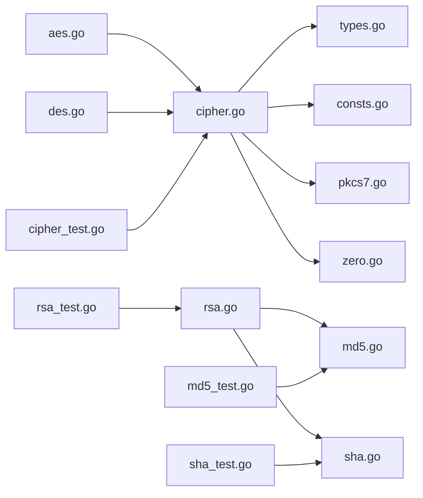

# 加密算法基础

<cite>
**本文引用的文件**
- [aes.go](file://aes.go)
- [des.go](file://des.go)
- [cipher.go](file://cipher.go)
- [pkcs7.go](file://pkcs7.go)
- [zero.go](file://zero.go)
- [rsa.go](file://rsa.go)
- [md5.go](file://md5.go)
- [sha.go](file://sha.go)
- [consts.go](file://consts.go)
- [types.go](file://types.go)
- [cipher_test.go](file://cipher_test.go)
- [rsa_test.go](file://rsa_test.go)
- [md5_test.go](file://md5_test.go)
- [sha_test.go](file://sha_test.go)
</cite>

## 目录

1. [简介](#简介)
2. [项目结构](#项目结构)
3. [核心组件](#核心组件)
4. [架构总览](#架构总览)
5. [详细组件分析](#详细组件分析)
6. [依赖关系分析](#依赖关系分析)
7. [性能考虑](#性能考虑)
8. [故障排查指南](#故障排查指南)
9. [结论](#结论)
10. [附录](#附录)

## 简介

本文件面向初学者与安全开发者，系统梳理对称加密与非对称加密的区别与适用场景，详解块密码工作原理与常见模式（ECB、CBC、CTR、CFB、OFB）及其安全性考量，介绍填充机制（PKCS7、零填充）的原理与使用场景，阐述哈希算法（MD5、SHA
系列）的安全特性与应用，最后给出密钥管理最佳实践与实现指导。文中所有技术细节均基于仓库中的具体实现进行解读与可视化。

## 项目结构

该项目围绕“对称加密（AES/DES/3DES）、分组密码模式、填充、非对称加密（RSA）、哈希（MD5/SHA）”构建，采用模块化设计，核心文件如下：

- 对称加密与分组模式：aes.go、des.go、cipher.go
- 填充工具：pkcs7.go、zero.go
- 非对称加密：rsa.go
- 哈希工具：md5.go、sha.go
- 枚举与类型定义：consts.go、types.go
- 单元测试：cipher_test.go、rsa_test.go、md5_test.go、sha_test.go

图表来源

- [aes.go](file://aes.go#L1-L23)
- [des.go](file://des.go#L1-L45)
- [cipher.go](file://cipher.go#L1-L498)
- [pkcs7.go](file://pkcs7.go#L1-L31)
- [zero.go](file://zero.go#L1-L29)
- [rsa.go](file://rsa.go#L1-L527)
- [md5.go](file://md5.go#L1-L13)
- [sha.go](file://sha.go#L1-L27)
- [consts.go](file://consts.go#L1-L23)
- [types.go](file://types.go#L1-L98)

章节来源

- [aes.go](file://aes.go#L1-L23)
- [des.go](file://des.go#L1-L45)
- [cipher.go](file://cipher.go#L1-L498)
- [pkcs7.go](file://pkcs7.go#L1-L31)
- [zero.go](file://zero.go#L1-L29)
- [rsa.go](file://rsa.go#L1-L527)
- [md5.go](file://md5.go#L1-L13)
- [sha.go](file://sha.go#L1-L27)
- [consts.go](file://consts.go#L1-L23)
- [types.go](file://types.go#L1-L98)

## 核心组件

- 对称加密抽象与模式实现：Cipher 结构体封装密钥、IV、块密码实例与多种分组模式（ECB、CBC、CTR、CFB、OFB），统一提供加密/解密入口。
- 填充工具：PKCS7 与零填充，分别满足不同场景下的明文对齐需求。
- 非对称加密：RSA 类型封装公私钥设置、加密/解密、签名/验签、OAEP 加密等能力。
- 哈希工具：MD5、SHA1、SHA256、SHA512 提供快速摘要计算。
- 类型与常量：定义 McryptMode、Encode/Decode、Padding/UnPadding、CipherBlock 等函数类型与加密模式常量。

章节来源

- [cipher.go](file://cipher.go#L20-L25)
- [types.go](file://types.go#L46-L74)
- [consts.go](file://consts.go#L4-L10)
- [pkcs7.go](file://pkcs7.go#L8-L15)
- [zero.go](file://zero.go#L8-L15)
- [rsa.go](file://rsa.go#L18-L21)
- [md5.go](file://md5.go#L8-L12)
- [sha.go](file://sha.go#L10-L26)

## 架构总览

下图展示对称加密与非对称加密在本项目中的组织关系与交互流程。

图表来源

- [cipher.go](file://cipher.go#L20-L498)
- [rsa.go](file://rsa.go#L18-L527)
- [md5.go](file://md5.go#L8-L12)
- [sha.go](file://sha.go#L10-L26)

## 详细组件分析

### 对称加密与分组模式（Cipher）

- 设计要点
    - 通过 NewCipher 统一设置密钥与底层块密码实例（AES/DES/3DES），密钥在构造时通过内部 setKey 完成校验。
    - 支持随机 IV 与固定 IV 两种模式，CBC/CTR/CFB/OFB 均可配置是否在密文头部携带 IV。
    - 明确密钥长度约束：AES 16/24/32 字节，DES 8 字节，3DES 24 字节；IV 长度与块大小一致。
- 模式实现
    - ECB：逐块加密，无需 IV；易受重放与统计分析攻击，不推荐用于长文本。
    - CBC：需填充；支持随机 IV；抗统计性较好，广泛使用。
    - CTR：流式模式；无需填充；适合并行与随机访问。
    - CFB/OFB：流式模式；无需填充；适合流式数据。
- 错误处理
    - 密钥/IV 长度校验、随机 IV 生成失败、密文长度不合法等均有明确错误返回。

图表来源

- [cipher.go](file://cipher.go#L101-L137)
- [cipher.go](file://cipher.go#L139-L208)
- [cipher.go](file://cipher.go#L210-L279)
- [cipher.go](file://cipher.go#L281-L350)
- [cipher.go](file://cipher.go#L352-L421)

章节来源

- [cipher.go](file://cipher.go#L20-L58)
- [cipher.go](file://cipher.go#L101-L137)
- [cipher.go](file://cipher.go#L139-L208)
- [cipher.go](file://cipher.go#L210-L279)
- [cipher.go](file://cipher.go#L281-L350)
- [cipher.go](file://cipher.go#L352-L421)
- [aes.go](file://aes.go#L12-L22)
- [des.go](file://des.go#L12-L44)

### 填充机制（PKCS7 与 零填充）

- PKCS7
    - 原理：填充长度为 padding = blockSize - len(data)%blockSize，填充字节为该长度值。
    - 去填充：读取末字节作为填充长度，截断去除。
    - 优点：通用性强，适用于 CBC/CFB/OFB 等需对齐的模式。
- 零填充
    - 原理：以 0 字节补齐至块大小。
    - 去填充：从末尾去除连续的 0 字节。
    - 注意：当明文末尾可能包含 0 字节时存在歧义，需谨慎使用。

图表来源

- [pkcs7.go](file://pkcs7.go#L8-L15)
- [pkcs7.go](file://pkcs7.go#L17-L30)
- [zero.go](file://zero.go#L8-L15)
- [zero.go](file://zero.go#L17-L28)

章节来源

- [pkcs7.go](file://pkcs7.go#L8-L30)
- [zero.go](file://zero.go#L8-L29)

### 非对称加密（RSA）

- 功能覆盖
    - 公钥/私钥设置：支持 PEM 文件与字符串，自动识别 PKCS1/PKCS8。
    - 加密/解密：PKCS1v15 与 OAEP；支持按块处理长文本。
    - 签名/验签：支持 PKCS1v15 与 PSS；可指定哈希算法。
    - 密钥生成：可生成指定位数的 RSA 密钥对，导出 PEM 文件。
- 安全考量
    - OAEP 相比 PKCS1v15 更安全，推荐用于加密。
    - PSS 相比 PKCS1v15 更安全，推荐用于签名。
    - 私钥应妥善保管，避免泄露。

图表来源

- [rsa.go](file://rsa.go#L162-L223)
- [rsa.go](file://rsa.go#L225-L266)
- [rsa.go](file://rsa.go#L268-L331)
- [rsa.go](file://rsa.go#L333-L375)
- [rsa.go](file://rsa.go#L377-L481)

章节来源

- [rsa.go](file://rsa.go#L18-L144)
- [rsa.go](file://rsa.go#L162-L223)
- [rsa.go](file://rsa.go#L225-L266)
- [rsa.go](file://rsa.go#L268-L331)
- [rsa.go](file://rsa.go#L333-L375)
- [rsa.go](file://rsa.go#L377-L481)

### 哈希算法（MD5、SHA 系列）

- MD5：生成 128 位摘要，已不建议用于安全场景。
- SHA1/SHA256/SHA512：分别生成 160/256/512 位摘要，SHA256/SHA512 适用于安全场景。
- 使用建议：优先使用 SHA256 或更高强度；避免使用 MD5。

章节来源

- [md5.go](file://md5.go#L8-L12)
- [sha.go](file://sha.go#L10-L26)

### 加密模式与适用场景

- ECB：简单但不安全，仅适合对少量、无模式特征的纯随机数据。
- CBC：最常用，需注意填充与随机 IV；适合大多数块加密场景。
- CTR/CFB/OFB：流式模式，适合长流数据与随机访问；CTR 抗错误传播能力强。
- RSA：用于密钥交换、数字签名、小数据加密（OAEP/PSS）。

章节来源

- [consts.go](file://consts.go#L4-L10)
- [cipher.go](file://cipher.go#L10-L19)

## 依赖关系分析

- Cipher 依赖 crypto/cipher 与随机源，提供统一的对称加密接口。
- AES/DES/3DES 通过 NewCipher/DES/NewTripleDESCipher 注入块密码实例。
- 填充工具独立于 Cipher，可自由组合。
- RSA 依赖 crypto/rsa、crypto/x509、encoding/pem 等，提供完整的非对称加密能力。
- 哈希工具依赖 crypto/md5、crypto/sha1、crypto/sha256、crypto/sha512。

图表来源

- [aes.go](file://aes.go#L3-L6)
- [des.go](file://des.go#L3-L6)
- [cipher.go](file://cipher.go#L3-L8)
- [types.go](file://types.go#L3-L4)
- [consts.go](file://consts.go#L1-L3)
- [pkcs7.go](file://pkcs7.go#L3-L6)
- [zero.go](file://zero.go#L3-L6)
- [rsa.go](file://rsa.go#L3-L15)
- [md5.go](file://md5.go#L3-L6)
- [sha.go](file://sha.go#L3-L7)

章节来源

- [aes.go](file://aes.go#L3-L6)
- [des.go](file://des.go#L3-L6)
- [cipher.go](file://cipher.go#L3-L8)
- [rsa.go](file://rsa.go#L3-L15)
- [md5.go](file://md5.go#L3-L6)
- [sha.go](file://sha.go#L3-L7)

## 性能考虑

- AES/DES/3DES：AES 在现代硬件上性能优异，推荐优先使用 AES；DES/3DES 已过时，仅用于兼容。
- CBC/CTR/CFB/OFB：CTR 通常性能最优且便于并行；CBC 抗统计性好但需填充与 IV。
- RSA：密钥越大越慢；建议使用 2048 位以上；仅用于小数据或密钥交换。
- 哈希：SHA256/SHA512 性能略低于 SHA1，但安全性更高；MD5 最快但不安全。

## 故障排查指南

- 密钥长度错误
    - 现象：初始化 Cipher 时报错。
    - 处理：确保 AES 使用 16/24/32 字节，DES 使用 8 字节，3DES 使用 24 字节。
- IV 长度不匹配
    - 现象：设置 IV 时报错。
    - 处理：IV 长度必须与块大小一致（AES=16，DES=8）。
- CBC 密文长度不合法
    - 现象：解密报错。
    - 处理：确认密文长度为块大小的整数倍；若使用随机 IV，确保密文包含 IV。
- RSA 加密/解密失败
    - 现象：加密长度限制导致失败。
    - 处理：PKCS1v15 最大加密长度为 keySize-11；OAEP 为 keySize-2*hashSize-2；分块处理长文本。
- 填充问题
    - 现象：去填充失败或数据丢失。
    - 处理：确保填充与去填充一致；零填充需避免明文末尾含 0 字节。

章节来源

- [cipher.go](file://cipher.go#L42-L58)
- [cipher.go](file://cipher.go#L86-L99)
- [cipher.go](file://cipher.go#L183-L195)
- [cipher.go](file://cipher.go#L254-L266)
- [rsa.go](file://rsa.go#L171-L174)
- [rsa.go](file://rsa.go#L278-L281)
- [pkcs7.go](file://pkcs7.go#L17-L30)
- [zero.go](file://zero.go#L17-L28)

## 结论

本项目提供了对称加密（AES/DES/3DES）、分组模式（ECB/CBC/CTR/CFB/OFB）、填充（PKCS7/零填充）、非对称加密（RSA，含
OAEP/PSS）与哈希（MD5/SHA）的完整实现与测试样例。建议在实际工程中：

- 优先使用 AES-CTR 或 AES-CBC（随机 IV）；避免 ECB。
- 加密使用 OAEP/PSS；签名使用 PSS。
- 合理选择哈希算法，避免 MD5。
- 严格遵循密钥长度与 IV 长度规范，确保填充一致性。

## 附录

- 加密模式常量与类型定义参考：[consts.go](file://consts.go#L4-L10)、[types.go](file://types.go#L46-L74)
-
对称加密入口与模式实现参考：[aes.go](file://aes.go#L12-L22)、[des.go](file://des.go#L12-L44)、[cipher.go](file://cipher.go#L101-L498)
- 填充工具参考：[pkcs7.go](file://pkcs7.go#L8-L30)、[zero.go](file://zero.go#L8-L29)
- 非对称加密参考：[rsa.go](file://rsa.go#L18-L527)
- 哈希工具参考：[md5.go](file://md5.go#L8-L12)、[sha.go](file://sha.go#L10-L26)
-
单元测试参考：[cipher_test.go](file://cipher_test.go#L10-L61)、[rsa_test.go](file://rsa_test.go#L56-L270)、[md5_test.go](file://md5_test.go#L8-L27)、[sha_test.go](file://sha_test.go#L8-L69)