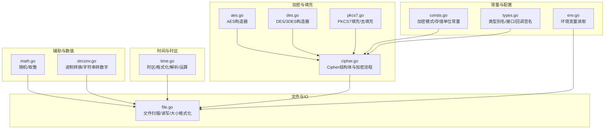
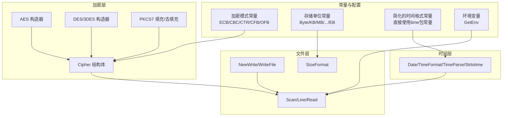
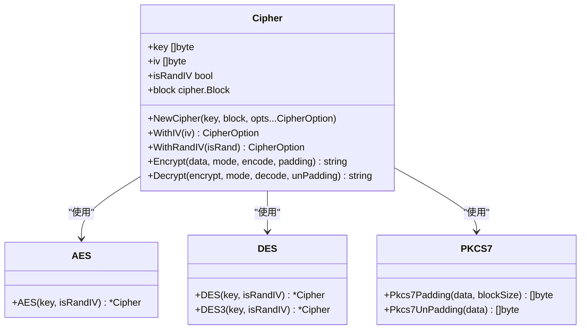
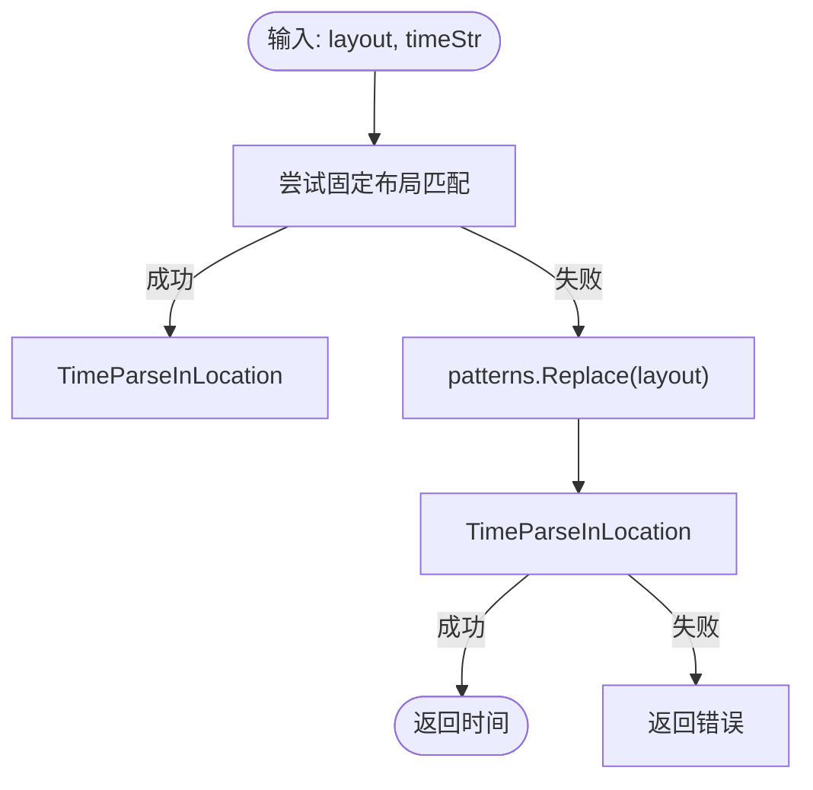
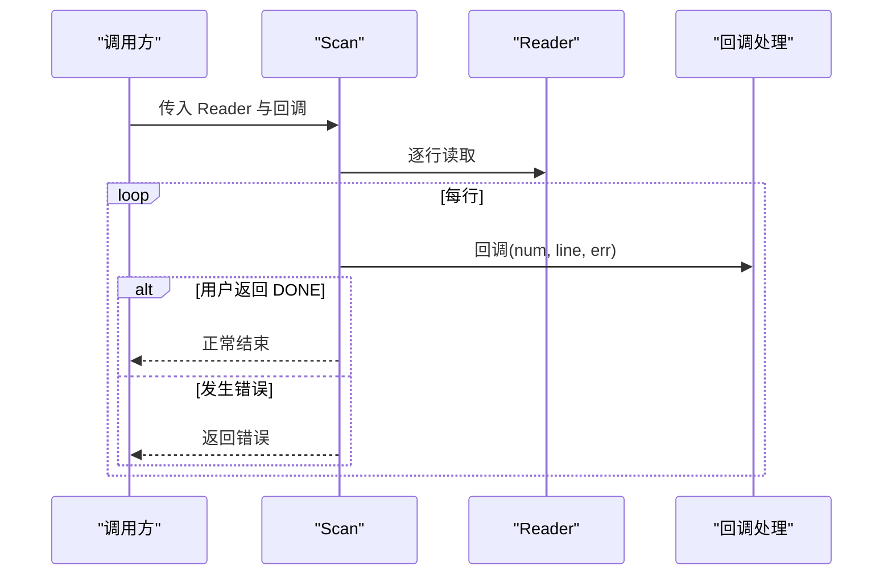
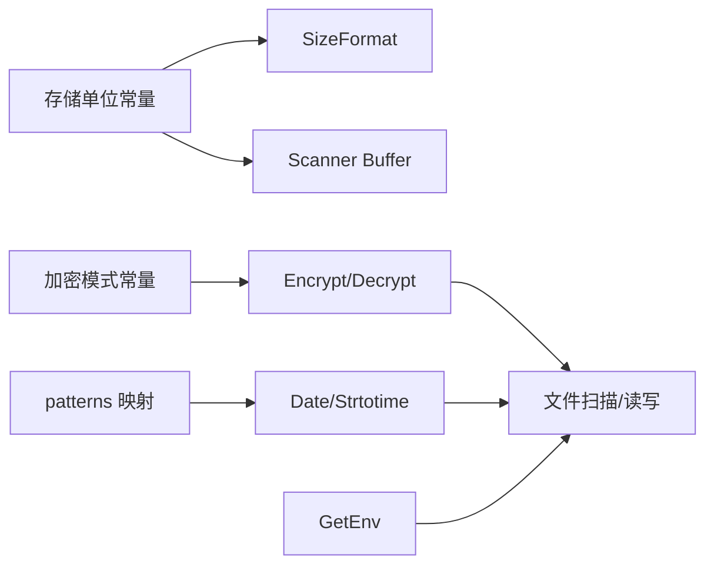

# 常量与配置

<cite>
**本文引用的文件**
- [consts.go](file://consts.go)
- [types.go](file://types.go)
- [cipher.go](file://cipher.go)
- [aes.go](file://aes.go)
- [des.go](file://des.go)
- [pkcs7.go](file://pkcs7.go)
- [time.go](file://time.go)
- [file.go](file://file.go)
- [env.go](file://env.go)
- [math.go](file://math.go)
- [strconv.go](file://strconv.go)
- [cipher_test.go](file://cipher_test.go)
- [time_test.go](file://time_test.go)
- [file_test.go](file://file_test.go)
- [env_test.go](file://env_test.go)
- [go.mod](file://go.mod)
</cite>

## 更新摘要

**变更内容**

- 移除了冗余的时间格式常量定义，简化API表面
- 保留核心配置功能，保持向后兼容性
- 优化了时间格式化逻辑，直接使用Go标准库常量

## 目录

1. [简介](#简介)
2. [项目结构](#项目结构)
3. [核心组件](#核心组件)
4. [架构总览](#架构总览)
5. [详细组件分析](#详细组件分析)
6. [依赖关系分析](#依赖关系分析)
7. [性能考量](#性能考量)
8. [故障排查指南](#故障排查指南)
9. [结论](#结论)
10. [附录](#附录)

## 简介

本文件系统性梳理项目中的"常量与配置"设计与使用，覆盖以下主题：

- 常量定义与命名规范：加密模式常量、存储单位常量等
- 常量分组与用途：按功能域划分（加密、存储、时间、文件、环境变量等）
- 配置选项设计理念：默认值、校验、运行时行为
- 常量在各模块的应用：加密算法选择、文件操作参数、时间格式化、环境变量读取
- 配置管理最佳实践：环境特定配置、配置文件管理、热更新策略
- 开发者使用指南与优化建议

## 项目结构

项目采用按功能域分层的文件组织方式，常量与配置相关的核心文件如下：

- 加密与存储：consts.go、types.go、cipher.go、aes.go、des.go、pkcs7.go
- 时间与时区：time.go
- 文件与IO：file.go
- 环境变量：env.go
- 辅助与数值：math.go、strconv.go
- 测试与示例：cipher_test.go、time_test.go、file_test.go、env_test.go
- 工程元信息：go.mod

**图表来源**

- [consts.go](file://consts.go#L1-L32)
- [types.go](file://types.go#L1-L109)
- [cipher.go](file://cipher.go#L1-L530)
- [aes.go](file://aes.go#L1-L21)
- [des.go](file://des.go#L1-L34)
- [pkcs7.go](file://pkcs7.go#L1-L31)
- [time.go](file://time.go#L1-L340)
- [file.go](file://file.go#L1-L478)
- [env.go](file://env.go#L1-L19)
- [math.go](file://math.go#L1-L37)
- [strconv.go](file://strconv.go#L1-L109)

**章节来源**

- [consts.go](file://consts.go#L1-L32)
- [types.go](file://types.go#L1-L109)
- [cipher.go](file://cipher.go#L1-L530)
- [aes.go](file://aes.go#L1-L21)
- [des.go](file://des.go#L1-L34)
- [pkcs7.go](file://pkcs7.go#L1-L31)
- [time.go](file://time.go#L1-L340)
- [file.go](file://file.go#L1-L478)
- [env.go](file://env.go#L1-L19)
- [math.go](file://math.go#L1-L37)
- [strconv.go](file://strconv.go#L1-L109)
- [go.mod](file://go.mod#L1-L4)

## 核心组件

本节聚焦"常量与配置"的核心要素与使用要点。

- 加密模式常量
    - 定义：ECB、CBC、CTR、CFB、OFB
    - 用途：作为加密模式枚举，贯穿加密/解密流程
    - 应用：Cipher.Encrypt/Cipher.Decrypt 根据模式分支调用具体实现
    - 参考：[consts.go](file://consts.go#L3-L10)，[cipher.go](file://cipher.go#L455-L529)

- 存储单位常量
    - 定义：Byte、KB、MB、GB、TB、PB、EB（以1024为底的幂）
    - 用途：文件大小格式化、阈值比较、内存/磁盘容量展示
    - 应用：SizeFormat、扫描缓冲上限等
    - 参考：[consts.go](file://consts.go#L12-L22)，[file.go](file://file.go#L424-L459)

- **已简化的时间格式化常量**
    - 更新：移除了冗余的YearTime、MonthTime、DayTime等常量定义
    - 现状：直接使用Go标准库time包常量（如time.DateTime、time.DateOnly等）
    - 用途：时间格式化与解析的基础布局
    - 应用：Date、TimeFormat、TimeParse等函数
    - 参考：[time.go](file://time.go#L193-L195)，[time.go](file://time.go#L205-L220)，[time.go](file://time.go#L228-L230)

- 文件扫描与读写常量
    - DONE：终止扫描的信号
    - GB、MB 等：Scanner.maxTokenSize 上限与保护
    - 参考：[file.go](file://file.go#L19-L20)，[file.go](file://file.go#L235-L241)

- 环境变量配置
    - GetEnv：统一读取环境变量，支持默认值
    - 参考：[env.go](file://env.go#L9-L18)

- 类型与回调签名
    - McryptMode、Encode/Decode、Padding/UnPadding、CipherBlock 等
    - 作用：约束加密流程的可插拔能力（编码、填充、算法块）
    - 参考：[types.go](file://types.go#L44-L74)

**章节来源**

- [consts.go](file://consts.go#L3-L22)
- [cipher.go](file://cipher.go#L455-L529)
- [file.go](file://file.go#L19-L20)
- [file.go](file://file.go#L235-L241)
- [time.go](file://time.go#L193-L195)
- [time.go](file://time.go#L205-L220)
- [time.go](file://time.go#L228-L230)
- [env.go](file://env.go#L9-L18)
- [types.go](file://types.go#L44-L74)

## 架构总览

下图展示"常量与配置"在系统中的交互关系与流向。

**图表来源**

- [consts.go](file://consts.go#L3-L22)
- [cipher.go](file://cipher.go#L21-L26)
- [aes.go](file://aes.go#L9-L20)
- [des.go](file://des.go#L9-L22)
- [pkcs7.go](file://pkcs7.go#L8-L30)
- [time.go](file://time.go#L193-L195)
- [file.go](file://file.go#L424-L459)
- [file.go](file://file.go#L235-L241)
- [env.go](file://env.go#L9-L18)

## 详细组件分析

### 加密模式与存储单位常量

- 加密模式常量
    - 语义：定义对称加密的五种工作模式，决定分组处理与IV策略
    - 使用：Cipher.Encrypt/Decrypt 根据 McryptMode 分派到具体模式实现
    - 注意：不同模式对IV长度与随机生成策略有差异
    - 参考：[consts.go](file://consts.go#L3-L10)，[cipher.go](file://cipher.go#L455-L529)

- 存储单位常量
    - 语义：以 Byte 为基准的 1024 进制单位，覆盖至 EB
    - 使用：文件大小格式化、扫描缓冲上限、阈值比较
    - 参考：[consts.go](file://consts.go#L12-L22)，[file.go](file://file.go#L424-L459)，[file.go](file://file.go#L443-L458)

**图表来源**

- [cipher.go](file://cipher.go#L21-L26)
- [aes.go](file://aes.go#L9-L20)
- [des.go](file://des.go#L9-L33)
- [pkcs7.go](file://pkcs7.go#L8-L30)

**章节来源**

- [consts.go](file://consts.go#L3-L22)
- [cipher.go](file://cipher.go#L455-L529)
- [aes.go](file://aes.go#L9-L20)
- [des.go](file://des.go#L9-L33)
- [pkcs7.go](file://pkcs7.go#L8-L30)

### 时间格式化与解析常量

- **已简化的常量设计**
    - 更新：移除了consts.go中的YearTime、MonthTime、DayTime、HourTime、MinuteTime、SecondTime常量
    - 现状：直接使用Go标准库time包常量（如time.DateTime、time.DateOnly等）
    - 优势：减少API表面复杂度，避免重复定义，提高维护性
    - 参考：[time.go](file://time.go#L193-L195)，[time.go](file://time.go#L205-L220)，[time.go](file://time.go#L228-L230)

- patterns 映射表
    - 作用：将 PHP 风格占位符映射到 Go time.Format/Parse 的布局片段
    - 应用：Date(layout, timestamp...) 通过 replace 后交给 TimeFormat/TimeParse
    - 参考：[time.go](file://time.go#L26-L61)，[time.go](file://time.go#L238-L240)，[time.go](file://time.go#L253-L287)

- 时间运算与比较
    - AddTime：支持 Y/M/D/H/I/S/L/C/N 的增量/减量
    - Before/After/Equal/Sub：基于布局字符串解析后进行比较
    - 参考：[time.go](file://time.go#L107-L144)，[time.go](file://time.go#L289-L339)

**图表来源**

- [time.go](file://time.go#L253-L287)

**章节来源**

- [time.go](file://time.go#L26-L61)
- [time.go](file://time.go#L107-L144)
- [time.go](file://time.go#L238-L240)
- [time.go](file://time.go#L253-L287)
- [time.go](file://time.go#L289-L339)

### 文件扫描与读写常量

- DONE 终止信号
    - 作用：在 Scan/Line/Read 的回调中返回 DONE 以提前结束扫描
    - 参考：[file.go](file://file.go#L19-L20)

- 扫描缓冲上限
    - 限制：maxTokenSize 最大不超过 4×GB
    - 依据：使用 EB/KB/MB 等常量进行边界检查
    - 参考：[file.go](file://file.go#L235-L241)

- 文件大小格式化
    - 依据：Byte/KB/MB/GB/TB/PB/EB 常量进行单位换算与字符串拼接
    - 参考：[file.go](file://file.go#L443-L458)

**图表来源**

- [file.go](file://file.go#L228-L254)

**章节来源**

- [file.go](file://file.go#L19-L20)
- [file.go](file://file.go#L235-L241)
- [file.go](file://file.go#L443-L458)
- [file.go](file://file.go#L228-L254)

### 环境变量配置

- GetEnv
    - 功能：读取环境变量，支持默认值回退
    - 适用：配置项的环境覆盖、运行时参数注入
    - 参考：[env.go](file://env.go#L9-L18)

**章节来源**

- [env.go](file://env.go#L9-L18)

### 类型与回调签名

- McryptMode、Encode/Decode、Padding/UnPadding、CipherBlock
    - 作用：抽象加密流程的关键可插拔点，便于扩展新算法与编码方式
    - 参考：[types.go](file://types.go#L44-L74)

**章节来源**

- [types.go](file://types.go#L44-L74)

## 依赖关系分析

- 常量依赖
    - 存储单位常量被文件大小格式化与扫描缓冲上限直接使用
    - 加密模式常量驱动 Cipher 的多态分支
    - **简化后的时间格式常量**：直接依赖Go标准库time包常量
- 模块耦合
    - cipher 与 types 高内聚，通过类型别名与接口解耦外部实现
    - time 与 file 通过公共的常量与工具函数间接协作
    - env 与 file 在运行时配置与文件操作之间形成松耦合

**图表来源**

- [consts.go](file://consts.go#L12-L22)
- [cipher.go](file://cipher.go#L455-L529)
- [time.go](file://time.go#L238-L240)
- [file.go](file://file.go#L443-L458)
- [file.go](file://file.go#L235-L241)
- [env.go](file://env.go#L9-L18)

**章节来源**

- [consts.go](file://consts.go#L12-L22)
- [cipher.go](file://cipher.go#L455-L529)
- [time.go](file://time.go#L238-L240)
- [file.go](file://file.go#L443-L458)
- [file.go](file://file.go#L235-L241)
- [env.go](file://env.go#L9-L18)

## 性能考量

- 扫描缓冲上限
    - 通过常量限制 Scanner.maxTokenSize，避免超大单行导致内存峰值过高
    - 参考：[file.go](file://file.go#L235-L241)
- 文件大小格式化
    - 使用整除与常量映射，避免浮点运算开销
    - 参考：[file.go](file://file.go#L443-L458)
- **简化的时间常量访问**
    - 更新：移除冗余常量定义，直接使用标准库常量，减少内存占用
    - 参考：[time.go](file://time.go#L193-L195)
- 随机数与数值处理
    - Rand/round 等函数尽量减少临时对象分配
    - 参考：[math.go](file://math.go#L8-L36)

## 故障排查指南

- 加密模式错误
    - 现象：Encrypt/Decrypt 报错"错误的加密模式"
    - 排查：确认传入的模式值属于 ECB/CBC/CTR/CFB/OFB
    - 参考：[cipher.go](file://cipher.go#L484-L485)
- IV 长度不匹配
    - 现象：WithIV 报错"iv的长度只能是X"
    - 排查：确保 IV 长度与所选算法块大小一致
    - 参考：[cipher.go](file://cipher.go#L125-L127)
- 密文长度非法
    - 现象：CBC/CTR/CFB/OFB 解密报错"密文不是块大小的倍数"
    - 排查：确认密文长度满足分组对齐要求
    -
    参考：[cipher.go](file://cipher.go#L225-L227)，[cipher.go](file://cipher.go#L296-L298)，[cipher.go](file://cipher.go#L367-L369)，[cipher.go](file://cipher.go#L438-L440)
- **简化后的常量问题**
    - 现象：时间格式化异常或编译错误
    - 排查：确认使用Go标准库time包常量而非consts.go中的冗余常量
    - 参考：[time.go](file://time.go#L193-L195)，[time.go](file://time.go#L205-L220)
- 时间解析失败
    - 现象：Strtotime 返回"无法解析的时间格式"
    - 排查：确认 layout 与 timeStr 匹配，或使用内置布局
    - 参考：[time.go](file://time.go#L270-L287)
- 扫描提前终止
    - 现象：Scan/Line/Read 提前退出
    - 排查：检查回调是否返回 DONE
    - 参考：[file.go](file://file.go#L246-L248)，[file.go](file://file.go#L271-L273)，[file.go](file://file.go#L293-L294)

**章节来源**

- [cipher.go](file://cipher.go#L484-L485)
- [cipher.go](file://cipher.go#L125-L127)
- [cipher.go](file://cipher.go#L225-L227)
- [cipher.go](file://cipher.go#L296-L298)
- [cipher.go](file://cipher.go#L367-L369)
- [cipher.go](file://cipher.go#L438-L440)
- [time.go](file://time.go#L270-L287)
- [time.go](file://time.go#L193-L195)
- [time.go](file://time.go#L205-L220)
- [file.go](file://file.go#L246-L248)
- [file.go](file://file.go#L271-L273)
- [file.go](file://file.go#L293-L294)

## 结论

本项目通过明确的常量分组与类型抽象，将"加密模式、存储单位、时间格式、文件扫描、环境变量"等配置要素清晰地组织起来。**
最新的优化移除了冗余的时间格式常量定义，直接使用Go标准库常量，简化了API表面，提高了代码的简洁性和维护性。**
配合严格的参数校验与可插拔的回调签名，既保证了易用性，也兼顾了扩展性与稳定性。建议在实际工程中遵循本文档的命名规范与使用范式，结合测试用例进行回归验证，确保配置在不同环境下的正确性与一致性。

## 附录

### 常量与配置清单

- 加密模式常量
    - ECB、CBC、CTR、CFB、OFB
    - 用途：加密/解密模式选择
    - 参考：[consts.go](file://consts.go#L3-L10)

- 存储单位常量
    - Byte、KB、MB、GB、TB、PB、EB
    - 用途：文件大小格式化、阈值比较
    - 参考：[consts.go](file://consts.go#L12-L22)，[file.go](file://file.go#L443-L458)

- **已简化的** 时间格式常量
    - **更新**：移除了YearTime、MonthTime、DayTime、HourTime、MinuteTime、SecondTime常量
    - 现状：直接使用Go标准库time包常量（如time.DateTime、time.DateOnly等）
    - 用途：时间格式化与解析的基础布局
    - 参考：[time.go](file://time.go#L193-L195)，[time.go](file://time.go#L205-L220)

- 文件扫描与读写
    - DONE：终止扫描信号
    - GB、MB：Scanner.maxTokenSize 上限
    - 参考：[file.go](file://file.go#L19-L20)，[file.go](file://file.go#L235-L241)

- 环境变量
    - GetEnv：读取环境变量并支持默认值
    - 参考：[env.go](file://env.go#L9-L18)

### 使用示例与最佳实践

- 加密
    - 使用 AES/DES/3DES 构造器设置密钥与IV策略
    - 通过 McryptMode 选择合适的工作模式
    - 参考：[aes.go](file://aes.go#L9-L20)，[des.go](file://des.go#L9-L22)，[cipher.go](file://cipher.go#L455-L529)

- **时间**
    - **更新**：直接使用Go标准库time包常量进行格式化与解析
    - 使用 Date/Strtotime 进行格式化与解析
    - AddTime 进行时间增量/减量计算
    -
    参考：[time.go](file://time.go#L193-L195)，[time.go](file://time.go#L205-L220)，[time.go](file://time.go#L238-L240)，[time.go](file://time.go#L253-L287)，[time.go](file://time.go#L107-L144)

- 文件
    - Scan/Line/Read 选择合适的扫描策略
    - SizeFormat 展示人类可读的文件大小
    - 参考：[file.go](file://file.go#L228-L254)，[file.go](file://file.go#L443-L458)

- 环境变量
    - 通过 GetEnv 读取配置，必要时提供默认值
    - 参考：[env.go](file://env.go#L9-L18)

### 测试参考

- 加密模式测试：覆盖 ECB/CBC/CTR/CFB/OFB 的加解密正确性
    - 参考：[cipher_test.go](file://cipher_test.go#L10-L61)
- **时间测试**：Date/TimeFormat/Strtotime/AddTime 等功能验证
    - **更新**：测试用例现在使用Go标准库time包常量
    - 参考：[time_test.go](file://time_test.go#L80-L177)
- 文件测试：FindFiles/Scan/Line/Read/NewWrite 等功能验证
    - 参考：[file_test.go](file://file_test.go#L13-L680)
- 环境变量测试：GetEnv 默认值与存在性
    - 参考：[env_test.go](file://env_test.go#L8-L27)