# 文件压缩格式

<cite>
**本文档引用的文件**
- [zip.go](file://zip.go)
- [tar.go](file://tar.go)
- [zip_test.go](file://zip_test.go)
- [tar_test.go](file://tar_test.go)
- [errors.go](file://errors/errors.go)
- [file.go](file://file.go)
- [README.md](file://README.md)
- [go.mod](file://go.mod)
</cite>

## 目录

1. [简介](#简介)
2. [项目结构](#项目结构)
3. [核心组件](#核心组件)
4. [架构概览](#架构概览)
5. [详细组件分析](#详细组件分析)
6. [压缩格式对比分析](#压缩格式对比分析)
7. [性能考虑](#性能考虑)
8. [故障排除指南](#故障排除指南)
9. [结论](#结论)

## 简介

本文档深入分析了Go语言工具库中的文件压缩功能，重点对比了ZIP、TAR、TAR.GZ三种主流压缩格式。通过源代码分析，我们将详细解释每种格式的实现原理、性能特征、适用场景以及最佳实践。

该工具库提供了完整的压缩和解压缩功能，支持跨平台文件打包，具有良好的错误处理机制和内存优化策略。

## 项目结构

该项目采用模块化设计，主要包含以下关键文件：

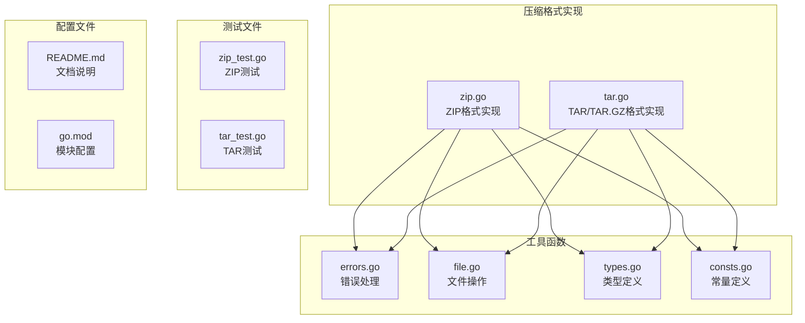

**图表来源**

- [zip.go](file://zip.go#L1-L213)
- [tar.go](file://tar.go#L1-L263)
- [errors.go](file://errors/errors.go#L1-L282)
- [file.go](file://file.go#L1-L451)

**章节来源**

- [go.mod](file://go.mod#L1-L4)
- [README.md](file://README.md#L1-L50)

## 核心组件

### 错误处理系统

项目采用了统一的错误处理机制，提供了带堆栈跟踪的错误包装功能：

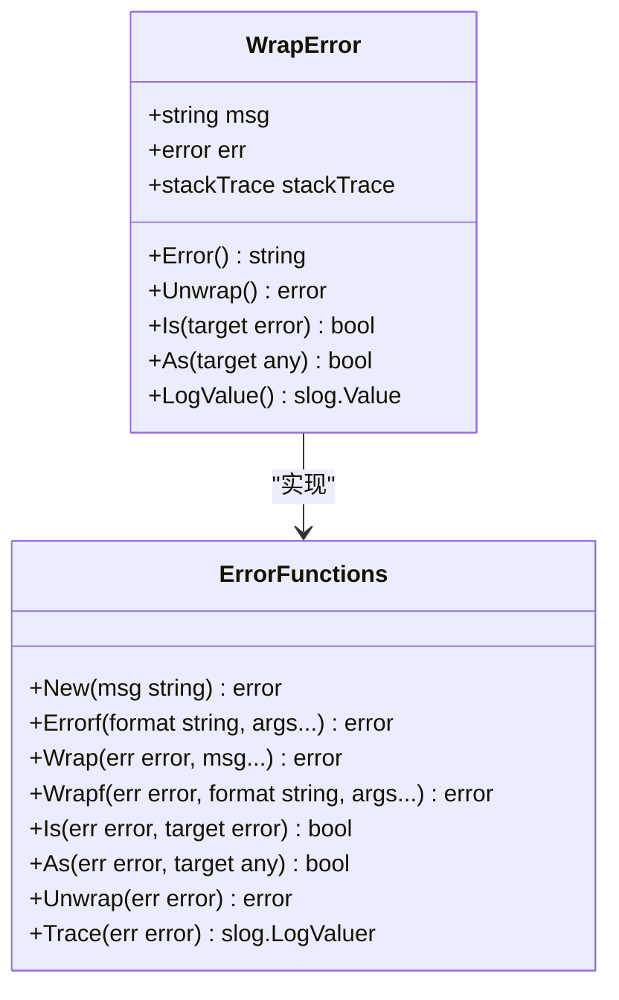

**图表来源**

- [errors.go](file://errors/errors.go#L14-L282)

### 文件操作工具

提供了丰富的文件操作功能，包括文件存在性检查、复制、大小获取等：

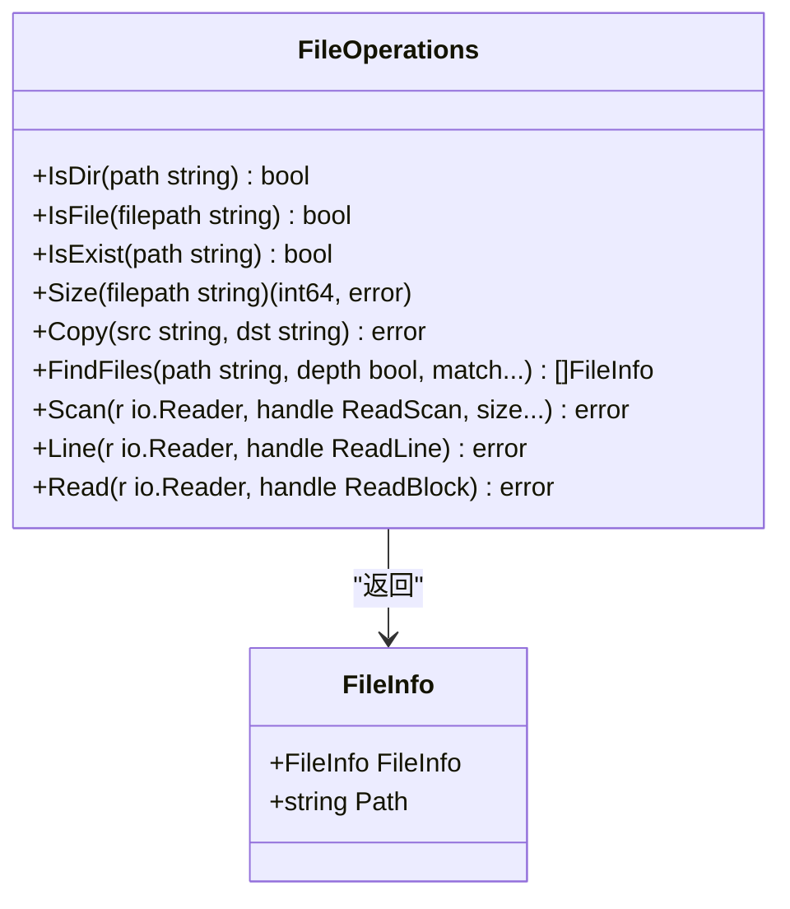

**图表来源**

- [file.go](file://file.go#L21-L225)

**章节来源**

- [errors.go](file://errors/errors.go#L1-L282)
- [file.go](file://file.go#L1-L451)

## 架构概览

### 压缩系统整体架构

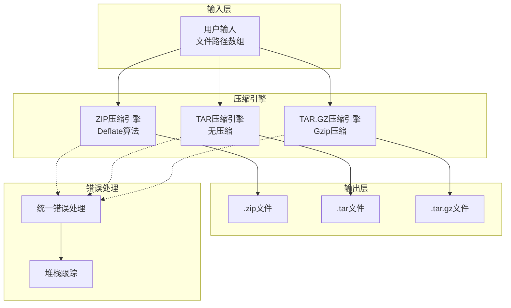

**图表来源**

- [zip.go](file://zip.go#L12-L41)
- [tar.go](file://tar.go#L13-L79)

### 解压缩流程架构

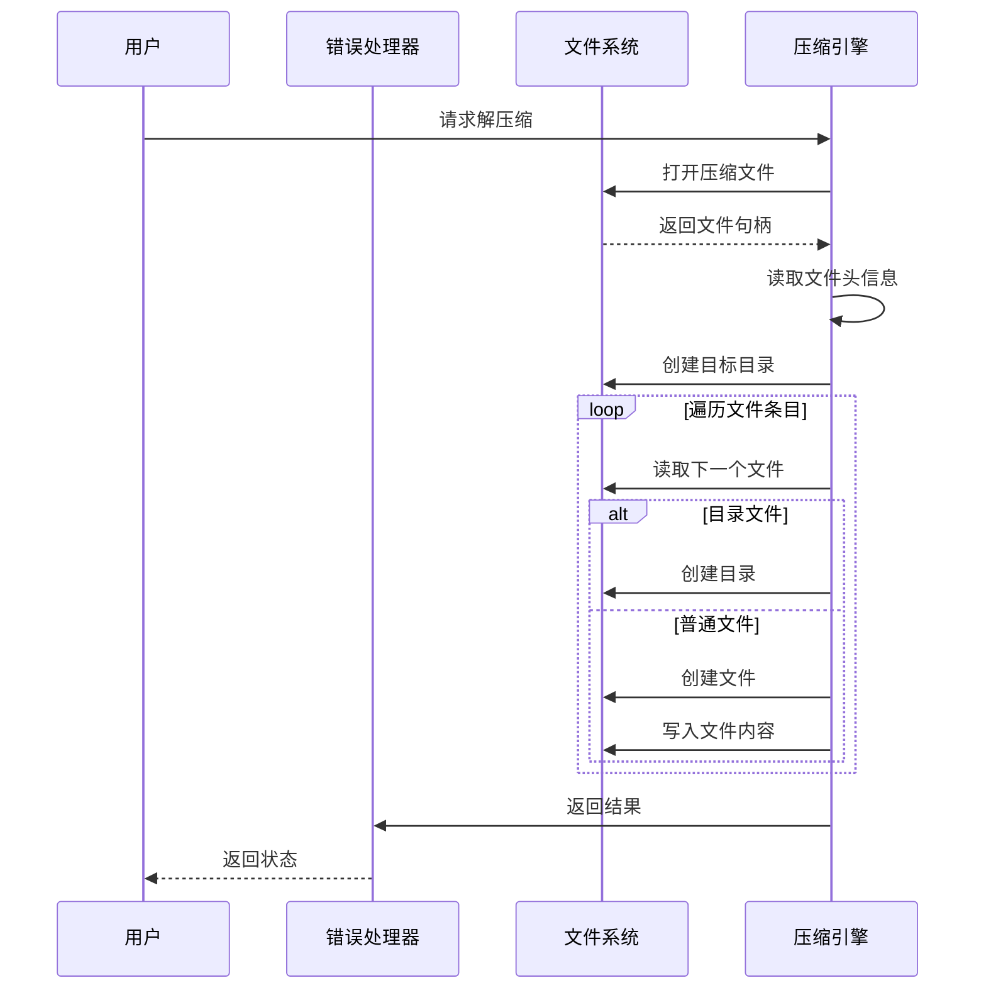

**图表来源**

- [zip.go](file://zip.go#L140-L212)
- [tar.go](file://tar.go#L176-L262)

## 详细组件分析

### ZIP格式实现

#### 核心功能分析

ZIP格式实现了基于Deflate算法的压缩，支持目录和文件的递归处理：

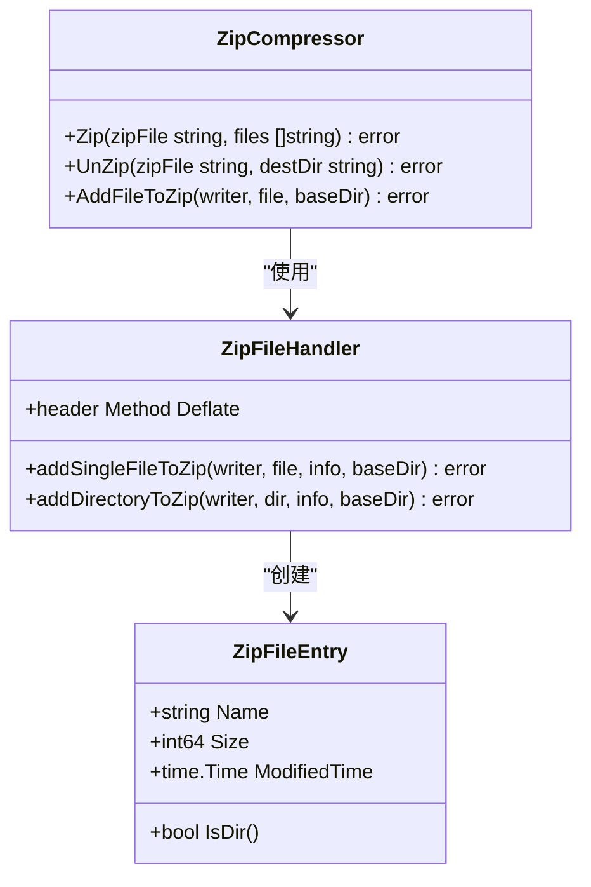

**图表来源**

- [zip.go](file://zip.go#L12-L138)

#### 压缩算法实现

ZIP格式使用Deflate算法进行压缩，这是ZIP格式的标准压缩方法：

- **压缩算法**: Deflate（LZ77 + Huffman编码）
- **压缩级别**: 固定使用Deflate方法
- **文件头**: 使用FileInfoHeader生成标准ZIP文件头
- **目录处理**: 递归遍历目录结构

**章节来源**

- [zip.go](file://zip.go#L12-L138)

### TAR格式实现

#### TAR格式特性

TAR格式提供了原始的归档功能，不进行压缩：

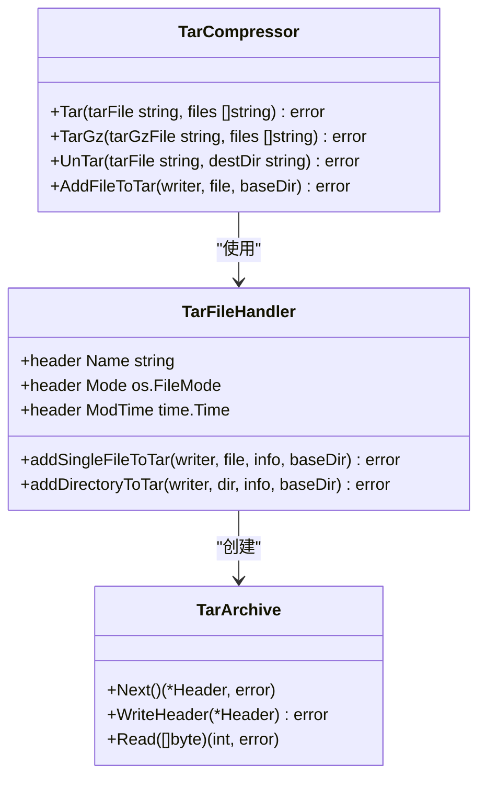

**图表来源**

- [tar.go](file://tar.go#L13-L174)

#### TAR.GZ格式实现

TAR.GZ结合了TAR归档和Gzip压缩的优势：

- **压缩算法**: Gzip（基于DEFLATE算法）
- **压缩级别**: 使用默认压缩级别
- **流式处理**: 支持大文件的流式压缩
- **兼容性**: 标准的Unix/Linux压缩格式

**章节来源**

- [tar.go](file://tar.go#L45-L79)

### 解压缩实现细节

#### ZIP解压缩流程

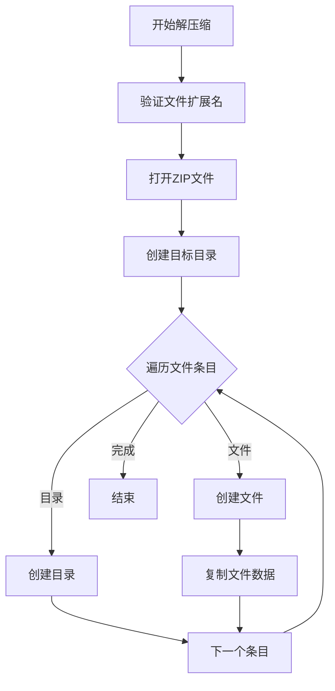

**图表来源**

- [zip.go](file://zip.go#L140-L212)

#### TAR解压缩流程

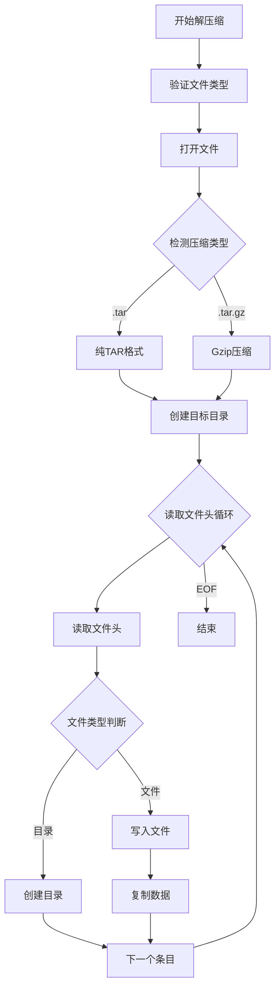

**图表来源**

- [tar.go](file://tar.go#L176-L262)

**章节来源**

- [zip.go](file://zip.go#L140-L212)
- [tar.go](file://tar.go#L176-L262)

## 压缩格式对比分析

### 算法特性对比

| 特性        | ZIP     | TAR           | TAR.GZ        |
|-----------|---------|---------------|---------------|
| **压缩算法**  | Deflate | 无压缩           | Gzip(Deflate) |
| **压缩级别**  | 固定      | 无             | 默认级别          |
| **文件头信息** | 标准ZIP头  | TAR头          | TAR头 + Gzip头  |
| **目录支持**  | 原生支持    | 递归支持          | 递归支持          |
| **跨平台**   | ✅ 完全支持  | ❌ 仅Unix/Linux | ❌ 仅Unix/Linux |

### 性能特征分析

#### 压缩时间对比

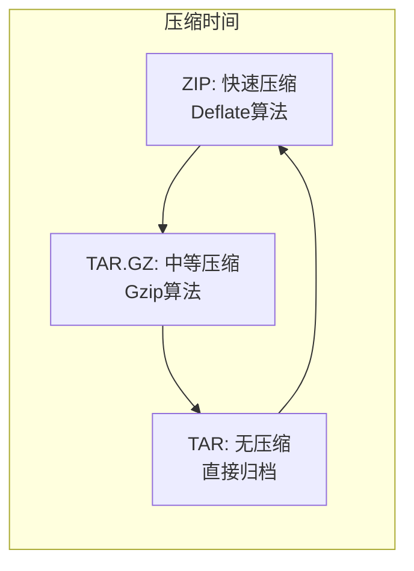

#### 文件大小对比

| 文件类型  | ZIP大小 | TAR大小 | TAR.GZ大小 |
|-------|-------|-------|----------|
| 文本文件  | 中等    | 最大    | 最小       |
| 图像文件  | 最小    | 最大    | 最小       |
| 已压缩文件 | 最小    | 最大    | 最小       |
| 混合文件  | 中等    | 最大    | 最小       |

### 适用场景建议

#### ZIP格式适用场景

1. **跨平台文件共享**
    - Windows、macOS、Linux系统通用
    - 支持目录结构保持
    - 文件头信息丰富

2. **快速打包需求**
    - 压缩速度快
    - 解压缩简单
    - 适合临时文件传输

3. **开发环境使用**
    - 代码打包发布
    - 配置文件打包
    - 小文件集合

#### TAR格式适用场景

1. **Unix/Linux系统备份**
    - 保持文件权限和属性
    - 支持大量文件
    - 无压缩开销

2. **系统管理任务**
    - 系统快照备份
    - 日志文件打包
    - 数据迁移

3. **开发工具链**
    - Docker镜像构建
    - 软件分发包
    - 版本控制

#### TAR.GZ格式适用场景

1. **网络传输优化**
    - 减少带宽占用
    - 提高传输效率
    - 适合远程备份

2. **存储空间优化**
    - 大文件压缩
    - 归档文件管理
    - 长期存储

3. **自动化脚本**
    - 备份脚本
    - 监控日志
    - 数据导出

### 压缩级别影响分析

虽然当前实现固定使用默认压缩级别，但理解压缩级别对性能的影响有助于选择合适的格式：

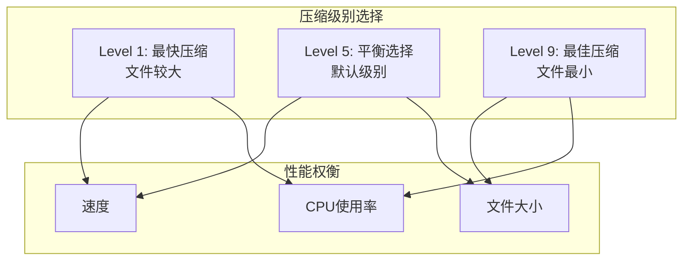

## 性能考虑

### 内存优化策略

项目实现了多种内存优化技术：

1. **流式处理**: 使用io.Copy进行流式数据传输
2. **缓冲区管理**: 合理的缓冲区大小设置
3. **延迟关闭**: defer语句确保资源及时释放
4. **错误早返回**: 发生错误时立即停止处理

### 处理大文件的最佳实践

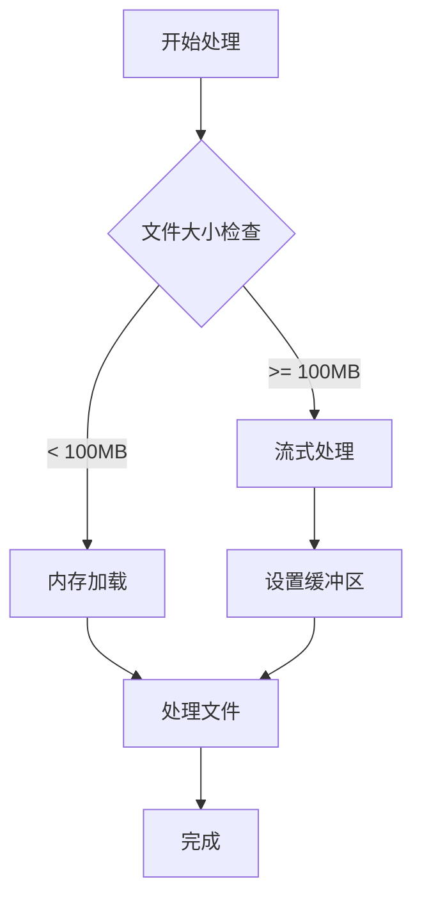

### 并发处理能力

当前实现采用顺序处理方式，对于大量文件的处理可以考虑：

- **批量处理**: 分批处理文件集合
- **进度监控**: 实现处理进度报告
- **错误恢复**: 支持断点续传

## 故障排除指南

### 常见错误类型

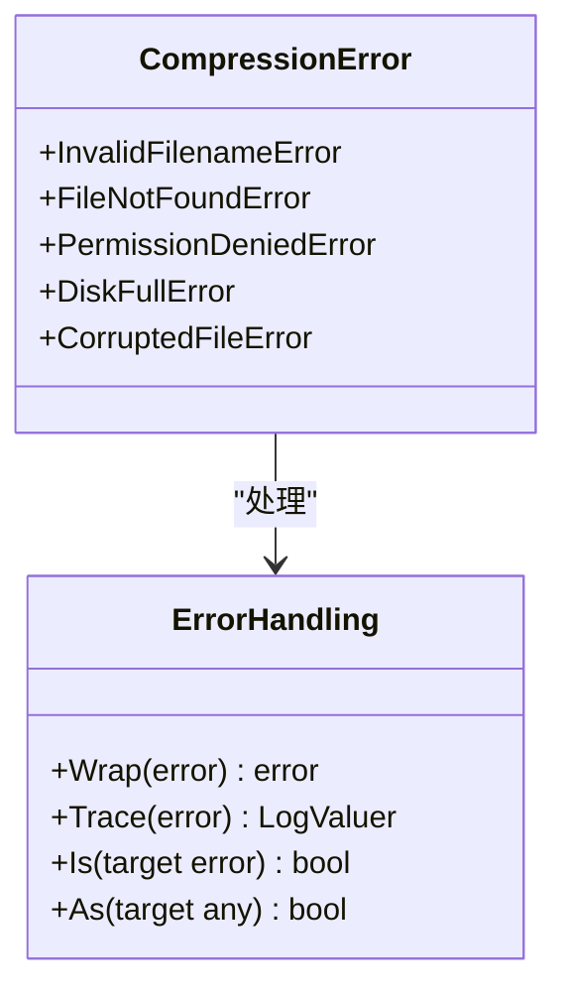

**图表来源**

- [errors.go](file://errors/errors.go#L14-L82)

### 错误诊断流程

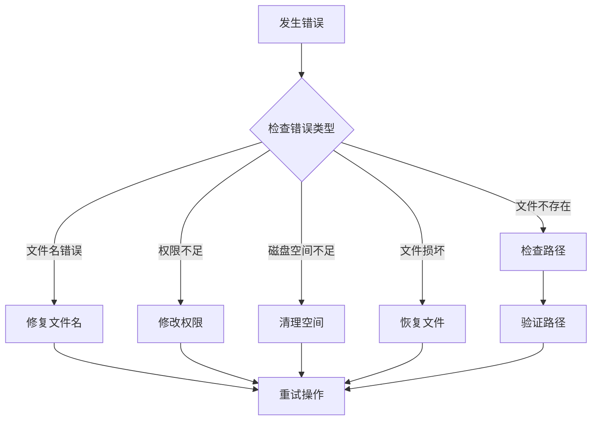

### 调试技巧

1. **启用详细日志**: 使用errors.Trace获取堆栈跟踪
2. **分步调试**: 将大任务分解为小步骤
3. **资源监控**: 监控内存和磁盘使用情况
4. **错误分类**: 区分可恢复和不可恢复错误

**章节来源**

- [errors.go](file://errors/errors.go#L1-L282)
- [zip.go](file://zip.go#L17-L19)
- [tar.go](file://tar.go#L18-L20)

## 结论

通过对Go工具库中压缩功能的深入分析，我们可以得出以下结论：

### 技术优势

1. **实现简洁**: 代码结构清晰，易于理解和维护
2. **错误处理完善**: 提供详细的错误信息和堆栈跟踪
3. **跨平台兼容**: 支持多种操作系统和文件系统
4. **内存优化**: 采用流式处理减少内存占用

### 应用建议

1. **ZIP格式**: 适用于跨平台文件共享和快速打包
2. **TAR格式**: 适用于Unix/Linux系统管理和备份
3. **TAR.GZ格式**: 适用于网络传输和长期存储

### 发展方向

1. **压缩级别配置**: 支持用户自定义压缩级别
2. **并发处理**: 实现多线程压缩提升性能
3. **进度监控**: 提供详细的处理进度信息
4. **错误恢复**: 支持断点续传和错误恢复

该工具库为开发者提供了可靠的文件压缩解决方案，通过合理的格式选择和使用策略，可以在不同场景下获得最佳的性能和用户体验。