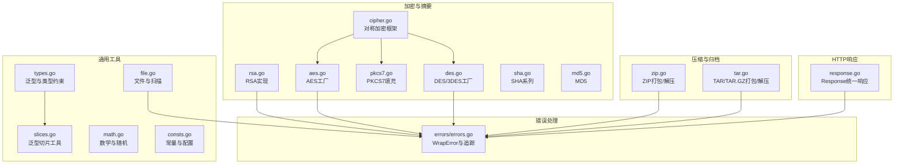
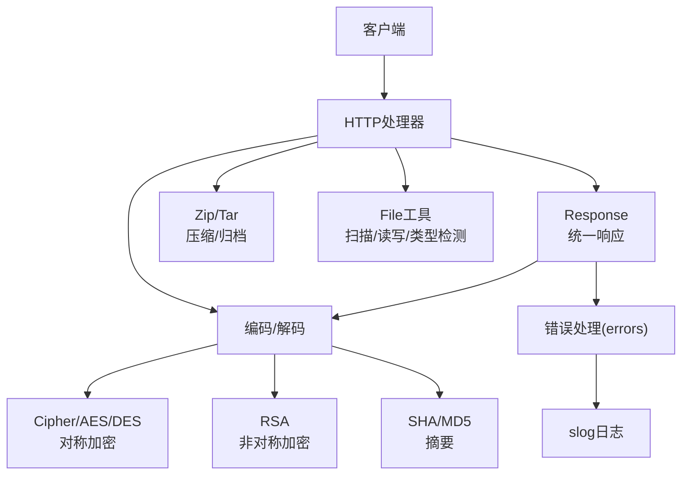
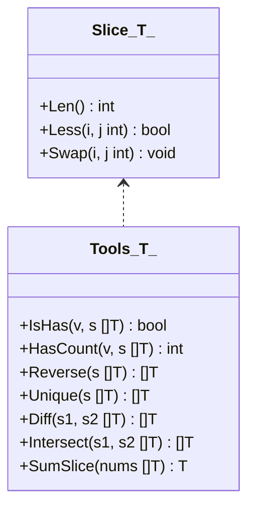
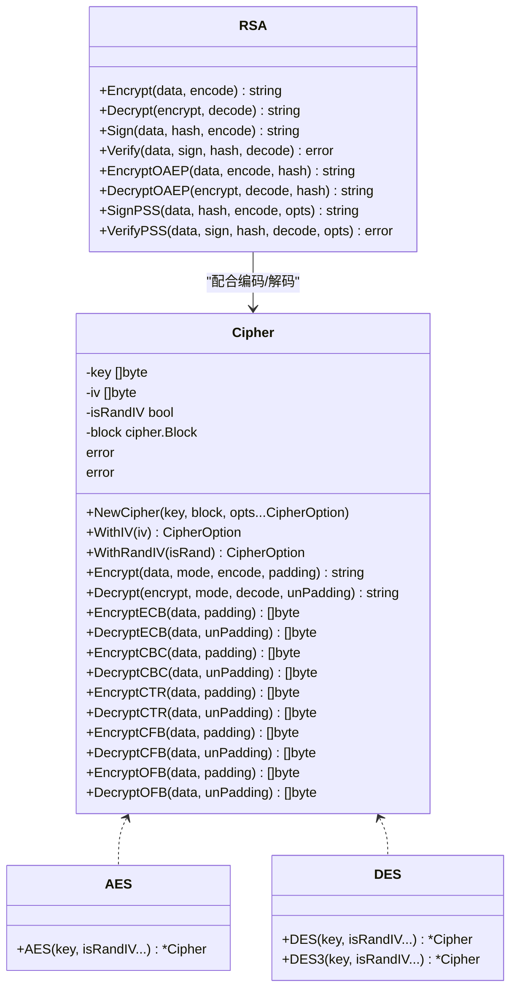
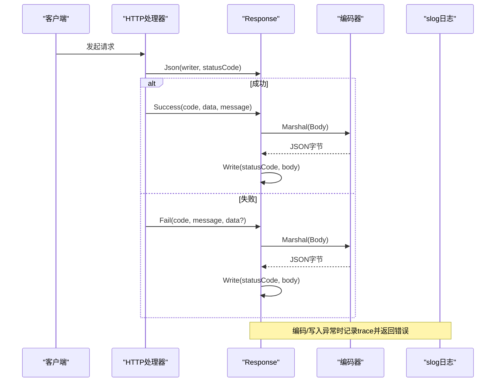
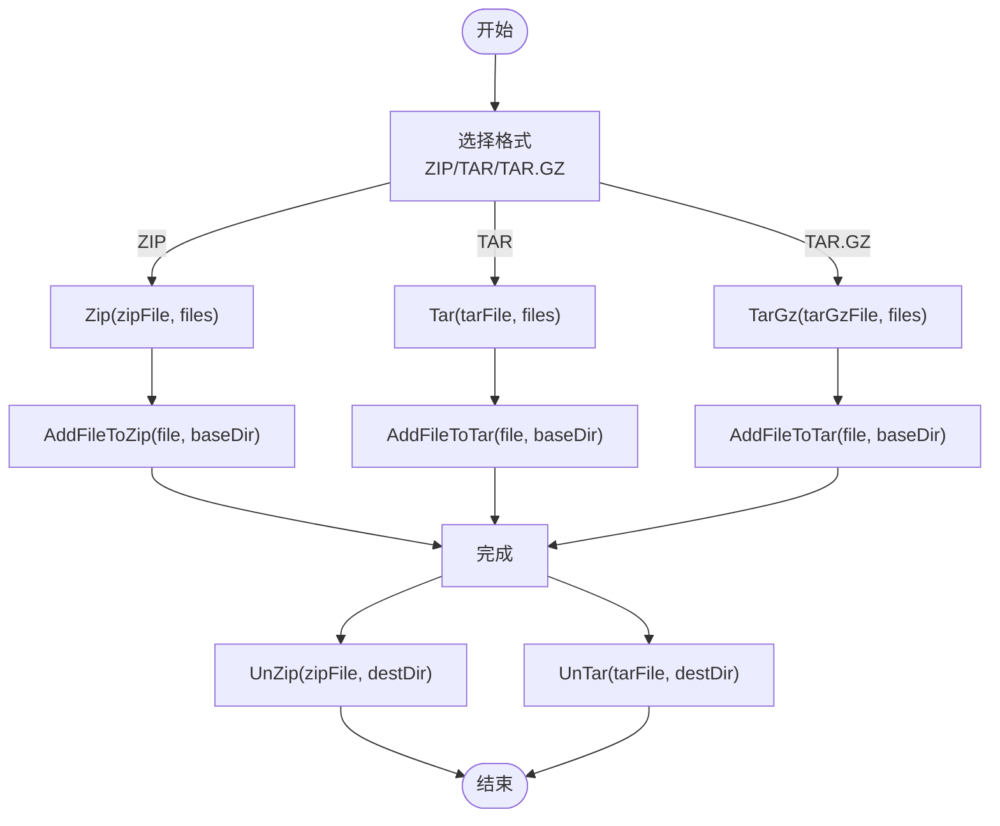
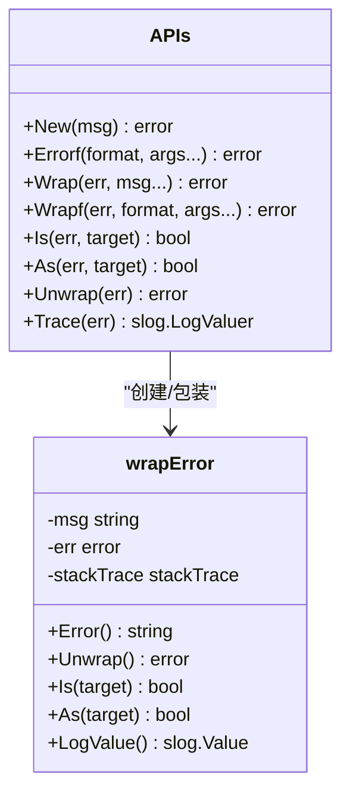
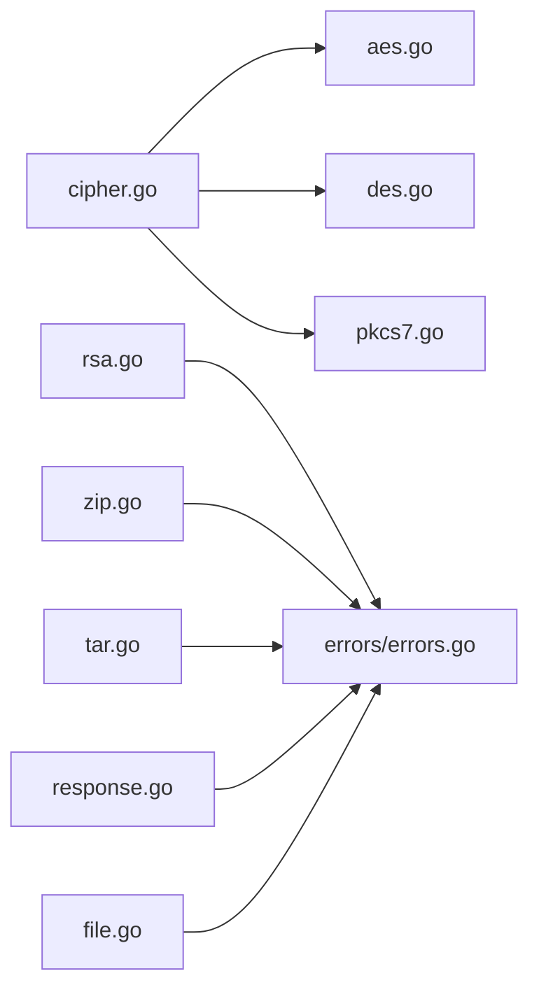

# 核心概念

<cite>
**本文引用的文件**
- [README.md](file://README.md)
- [types.go](file://types.go)
- [slices.go](file://slices.go)
- [response.go](file://response.go)
- [errors.go](file://errors/errors.go)
- [consts.go](file://consts.go)
- [cipher.go](file://cipher.go)
- [aes.go](file://aes.go)
- [des.go](file://des.go)
- [pkcs7.go](file://pkcs7.go)
- [rsa.go](file://rsa.go)
- [sha.go](file://sha.go)
- [md5.go](file://md5.go)
- [zip.go](file://zip.go)
- [tar.go](file://tar.go)
- [file.go](file://file.go)
- [math.go](file://math.go)
</cite>

## 目录

1. [简介](#简介)
2. [项目结构](#项目结构)
3. [核心组件](#核心组件)
4. [架构总览](#架构总览)
5. [详细组件分析](#详细组件分析)
6. [依赖关系分析](#依赖关系分析)
7. [性能考量](#性能考量)
8. [故障排查指南](#故障排查指南)
9. [结论](#结论)
10. [附录](#附录)

## 简介

本文件面向Go Utils库的核心概念与使用实践，重点覆盖以下主题：

- Go泛型：Slice[T]等泛型类型的实现、约束与典型用法
- 加密算法基础：对称加密（AES/DES/3DES）与非对称加密（RSA）的差异、模式与适用场景
- HTTP统一响应结构：Response的设计理念与多格式输出
- 文件压缩格式选择：ZIP、TAR、TAR.GZ的适用场景与实现要点
- 错误处理机制：WrapError与errors包的集成、日志追踪与最佳实践
- 常量与配置：加密模式、存储单位、时间格式化常量的语义与用途
- 前置知识与进阶细节：为初学者提供入门路径，为有经验开发者提供深入实现细节与使用模式

## 项目结构

仓库采用按功能域划分的文件组织方式，核心模块包括：

- 泛型与类型系统：types.go、slices.go
- HTTP响应封装：response.go
- 错误处理与追踪：errors/errors.go
- 加密与摘要：cipher.go、aes.go、des.go、pkcs7.go、rsa.go、sha.go、md5.go
- 压缩与归档：zip.go、tar.go
- 文件工具与扫描：file.go
- 常量与配置：consts.go
- 数学与随机：math.go
- 文档与历史：README.md

**图表来源**

- [types.go](file://types.go#L35-L43)
- [slices.go](file://slices.go#L1-L83)
- [cipher.go](file://cipher.go#L20-L25)
- [aes.go](file://aes.go#L1-L23)
- [des.go](file://des.go#L1-L45)
- [pkcs7.go](file://pkcs7.go#L1-L31)
- [rsa.go](file://rsa.go#L1-L527)
- [sha.go](file://sha.go#L1-L27)
- [md5.go](file://md5.go#L1-L13)
- [zip.go](file://zip.go#L1-L213)
- [tar.go](file://tar.go#L1-L263)
- [file.go](file://file.go#L1-L451)
- [response.go](file://response.go#L11-L342)
- [errors.go](file://errors/errors.go#L1-L282)

**章节来源**

- [README.md](file://README.md#L1-L80)
- [consts.go](file://consts.go#L1-L48)

## 核心组件

- 泛型与类型系统：通过Ordered、Number、Integer等接口约束，定义Slice[T]并实现排序接口，支撑跨类型的安全操作
- 加密框架：Cipher抽象对称加密流程，支持多种模式（ECB/CBC/CTR/CFB/OFB），配合填充与编码策略
- 非对称加密：RSA实现公钥加密、私钥解密、签名与验签，支持PKCS1/PKCS8与OAEP/PSS等多种变体
- 统一响应：Response提供成功/失败、文本/HTML/XML/下载/展示等多形态输出，内置编码与错误兜底
- 压缩归档：Zip/Tar/Tar.Gz提供打包与解压能力，兼顾目录与文件的递归处理
- 错误追踪：errors包提供WrapError，支持链式追踪、slog日志集成与格式化输出
- 工具常量：加密模式、存储单位、时间格式化模板，统一语义与可读性

**章节来源**

- [types.go](file://types.go#L5-L43)
- [cipher.go](file://cipher.go#L20-L498)
- [rsa.go](file://rsa.go#L18-L527)
- [response.go](file://response.go#L11-L342)
- [zip.go](file://zip.go#L12-L213)
- [tar.go](file://tar.go#L13-L263)
- [errors.go](file://errors/errors.go#L14-L282)
- [consts.go](file://consts.go#L5-L47)

## 架构总览

下图展示了“请求-响应-错误”在HTTP层的协作，以及“加密/压缩/文件”等工具层如何与之交互。

**图表来源**

- [response.go](file://response.go#L29-L342)
- [errors.go](file://errors/errors.go#L14-L82)
- [cipher.go](file://cipher.go#L20-L498)
- [aes.go](file://aes.go#L1-L23)
- [des.go](file://des.go#L1-L45)
- [rsa.go](file://rsa.go#L18-L527)
- [sha.go](file://sha.go#L1-L27)
- [md5.go](file://md5.go#L1-L13)
- [zip.go](file://zip.go#L12-L213)
- [tar.go](file://tar.go#L13-L263)
- [file.go](file://file.go#L227-L451)

## 详细组件分析

### 泛型与Slice[T]

- 设计要点
    - 通过Ordered、Number、Integer等接口限定类型范围，保证比较、计算与排序安全
    - Slice[T]实现Len/Less/Swap，可直接用于sort.Sort，便于跨类型排序
    - 提供IsHas、HasCount、Reverse、Unique、Diff、Intersect、SumSlice等工具函数，覆盖常见集合与数值操作
- 使用模式
    - 对任意有序类型（数字或字符串）进行排序与去重
    - 在不同数据类型间复用相同的算法逻辑，降低重复代码
- 复杂度
    - Reverse为O(n)，Unique/Diff/Intersect基于哈希表，平均O(n)，最坏O(n^2)
    - SumSlice为O(n)

**图表来源**

- [types.go](file://types.go#L35-L43)
- [slices.go](file://slices.go#L1-L83)

**章节来源**

- [types.go](file://types.go#L5-L43)
- [slices.go](file://slices.go#L1-L83)

### 加密算法基础与Cipher框架

- 对称加密（AES/DES/3DES）
    - 支持模式：ECB、CBC、CTR、CFB、OFB
    - 填充：PKCS7等
    - IV策略：固定或随机生成（随机时将IV置于密文头部）
- 非对称加密（RSA）
    - 支持PKCS1/PKCS8公私钥格式
    - 支持PKCS1v15/OAEP/PSS签名与验签
    - 支持长文本分段加解密
- 选择原则
    - 对称加密适合大量数据、高吞吐场景；需妥善管理密钥与IV
    - 非对称加密适合密钥交换、数字签名与身份认证；性能较低但安全性更高
- 使用模式
    - AES/DES工厂函数校验密钥长度并构造Cipher
    - 通过Cipher.Encrypt/Decrypt统一入口，按模式与填充策略执行
    - RSA提供Encrypt/Decrypt/Sign/Verify/EncryptOAEP/DecryptOAEP/SignPSS/VerifyPSS等

**图表来源**

- [cipher.go](file://cipher.go#L20-L498)
- [aes.go](file://aes.go#L1-L23)
- [des.go](file://des.go#L1-L45)
- [rsa.go](file://rsa.go#L18-L527)

**章节来源**

- [cipher.go](file://cipher.go#L10-L18)
- [cipher.go](file://cipher.go#L42-L84)
- [aes.go](file://aes.go#L12-L22)
- [des.go](file://des.go#L12-L27)
- [des.go](file://des.go#L33-L44)
- [pkcs7.go](file://pkcs7.go#L8-L30)
- [rsa.go](file://rsa.go#L162-L331)

### HTTP统一响应结构与设计

- 设计理念
    - 以Response承载统一的success/code/message/data结构，支持泛型数据类型
    - 提供Success/Fail快速返回，自动编码并处理编码失败的兜底
    - 支持Text/Html/Xml/Download/Show等多格式输出，内置Content-Type与错误日志
- 使用模式
    - 在HTTP处理器中通过Json创建响应对象，设置状态码与Content-Type
    - 业务成功时调用Success(code, data, message...)，失败时调用Fail(code, message, data...)
    - 下载/展示文件时使用Download/Show，自动推断MIME类型与Content-Disposition
- 错误兜底
    - 编码失败、文件打开/Stat失败、写入失败均记录trace并返回统一错误码

**图表来源**

- [response.go](file://response.go#L29-L83)
- [response.go](file://response.go#L294-L308)
- [response.go](file://response.go#L253-L269)

**章节来源**

- [response.go](file://response.go#L11-L342)

### 文件压缩格式选择与实现

- 选择原则
    - ZIP：跨平台兼容性好，适合Windows/Linux/macOS环境；支持目录与文件打包
    - TAR：Unix/Linux生态常用，便于脚本化处理；TAR.GZ在TAR基础上增加gzip压缩，进一步减小体积
- 实现要点
    - Zip：校验扩展名、创建zip.Writer、递归AddFileToZip（文件/目录）、UnZip解压
    - Tar/Tar.Gz：校验扩展名、创建tar.Writer、可选gzip包装、递归AddFileToTar、UnTar按类型分流
- 使用模式
    - 打包多个文件/目录：Zip或Tar/TarGz
    - 解压：UnZip/UnTar，自动创建目标目录并写入文件

**图表来源**

- [zip.go](file://zip.go#L12-L41)
- [zip.go](file://zip.go#L43-L138)
- [tar.go](file://tar.go#L13-L79)
- [tar.go](file://tar.go#L81-L174)
- [tar.go](file://tar.go#L176-L263)

**章节来源**

- [zip.go](file://zip.go#L12-L213)
- [tar.go](file://tar.go#L13-L263)

### 错误处理机制与WrapError

- WrapError特性
    - 支持Wrap/Wrapf/New/Errorf，链式包裹错误并保留原始错误
    - 自动捕获调用栈，实现slog.LogValuer接口，便于日志追踪
    - 提供Is/As/Unwrap标准库兼容接口
- 使用模式
    - 任何可能失败的调用均Wrap(err)，并在上层决定是否新增上下文消息
    - 在slog.With(Trace(err))中输出trace，定位问题来源
    - 业务层通过errors.Is(err, TARGET)进行错误分类处理
- 典型场景
    - 编码失败、文件操作失败、网络写入失败、解压/解码异常等

**图表来源**

- [errors.go](file://errors/errors.go#L14-L82)
- [errors.go](file://errors/errors.go#L141-L256)

**章节来源**

- [errors.go](file://errors/errors.go#L14-L282)

### 常量定义与配置选项

- 加密模式常量：ECB/CBC/CTR/CFB/OFB，用于Cipher各模式选择
- 存储单位常量：Byte、KB、MB、GB、TB、PB、EB，统一文件大小表达
- 时间格式化常量：年/月/日/时/分/秒及其组合，便于日志与文件名格式化
- 使用建议
    - 在日志与文件大小展示中统一使用常量，避免魔法数字
    - 在加密流程中明确选择模式与填充策略，确保兼容性

**章节来源**

- [consts.go](file://consts.go#L5-L47)

### 前置知识与进阶细节

- Go版本与标准库演进
    - 项目要求Go 1.22及以上，推荐使用标准库内置函数替代utils中的旧实现
    - 日志采用log/slog，错误追踪通过errors包与WrapError实现
- 进阶建议
    - 在高并发场景下，注意Cipher与RSA的线程安全与资源释放
    - 压缩时优先选择TAR.GZ以获得更好压缩比，ZIP便于跨平台
    - 在HTTP响应中统一使用Response，减少重复编码与状态码管理

**章节来源**

- [README.md](file://README.md#L13-L28)

## 依赖关系分析

- 组件内聚与耦合
    - Cipher与AES/DES/3DES高度内聚，统一调度填充与编码
    - Response与errors紧密耦合，确保错误路径一致
    - 压缩模块与errors耦合，保证异常可追踪
- 外部依赖
    - 标准库：crypto/*、archive/*、compress/*、net/http、log/slog、mime等
    - 第三方：errors包（标准库errors的增强版）

**图表来源**

- [cipher.go](file://cipher.go#L1-L498)
- [aes.go](file://aes.go#L1-L23)
- [des.go](file://des.go#L1-L45)
- [pkcs7.go](file://pkcs7.go#L1-L31)
- [rsa.go](file://rsa.go#L1-L527)
- [zip.go](file://zip.go#L1-L213)
- [tar.go](file://tar.go#L1-L263)
- [response.go](file://response.go#L1-L342)
- [file.go](file://file.go#L1-L451)
- [errors.go](file://errors/errors.go#L1-L282)

**章节来源**

- [cipher.go](file://cipher.go#L1-L498)
- [rsa.go](file://rsa.go#L1-L527)
- [zip.go](file://zip.go#L1-L213)
- [tar.go](file://tar.go#L1-L263)
- [response.go](file://response.go#L1-L342)
- [file.go](file://file.go#L1-L451)
- [errors.go](file://errors/errors.go#L1-L282)

## 性能考量

- 加密
    - Cipher各模式在大数据量下的吞吐取决于所选模式与填充策略；CTR/CFB/OFB通常具备流式优势
    - RSA分段加解密受密钥长度影响，建议仅用于密钥或短消息
- 压缩
    - ZIP/TAR.GZ在大文件/目录上具有明显体积优势；TAR更利于脚本化与Unix生态
- 文件扫描
    - Scan/Line/Read针对不同场景优化：大行数据优先Line，大文件/无换行优先Read
- 错误处理
    - WrapError引入调用栈捕获，带来一定内存与CPU开销；在高频路径上可权衡是否启用

[本节为通用指导，无需具体文件分析]

## 故障排查指南

- 常见错误与定位
    - 编码失败：检查Response.Encode()与Marshal路径，查看trace日志
    - 文件操作失败：检查file.go中的Open/Stat/Copy/Seek等调用，确认权限与路径
    - 压缩/解压异常：核对扩展名校验、目录创建与文件写入，关注errors.Wrap输出
    - 加密/解密异常：核对密钥长度、IV长度与模式一致性，确认填充策略匹配
- 日志与追踪
    - 使用errors.Trace(err)在slog中输出链式调用栈，快速定位问题来源
    - 在HTTP响应中遇到错误时，服务端会返回带唯一码的错误提示，便于前端与运维定位

**章节来源**

- [response.go](file://response.go#L40-L53)
- [response.go](file://response.go#L69-L82)
- [response.go](file://response.go#L122-L198)
- [response.go](file://response.go#L202-L250)
- [file.go](file://file.go#L54-L81)
- [file.go](file://file.go#L140-L142)
- [zip.go](file://zip.go#L16-L40)
- [tar.go](file://tar.go#L17-L79)
- [errors.go](file://errors/errors.go#L74-L82)

## 结论

Go
Utils库围绕“泛型抽象、统一响应、加密框架、压缩归档、错误追踪”构建了一套实用且可扩展的工具集。对于初学者，建议从Response与Slice[T]
入手，理解泛型与HTTP响应的统一模型；对于有经验的开发者，可深入Cipher/RSA与压缩模块，结合WrapError实现健壮的错误处理与可观测性。

[本节为总结性内容，无需具体文件分析]

## 附录

- 快速参考
    - 泛型切片工具：IsHas、HasCount、Reverse、Unique、Diff、Intersect、SumSlice
    - 对称加密：AES/DES/3DES工厂函数与Cipher模式选择
    - 非对称加密：RSA公钥加密/私钥解密/签名/验签/OAEP/PSS
    - 统一响应：Success/Fail/Text/Html/Xml/Download/Show
    - 压缩归档：Zip/Tar/TarGz打包与UnZip/UnTar解压
    - 错误处理：Wrap/Wrapf/New/Errorf/Is/As/Unwrap/Trace

[本节为概览性内容，无需具体文件分析]