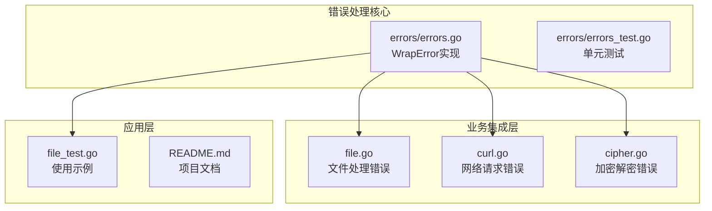
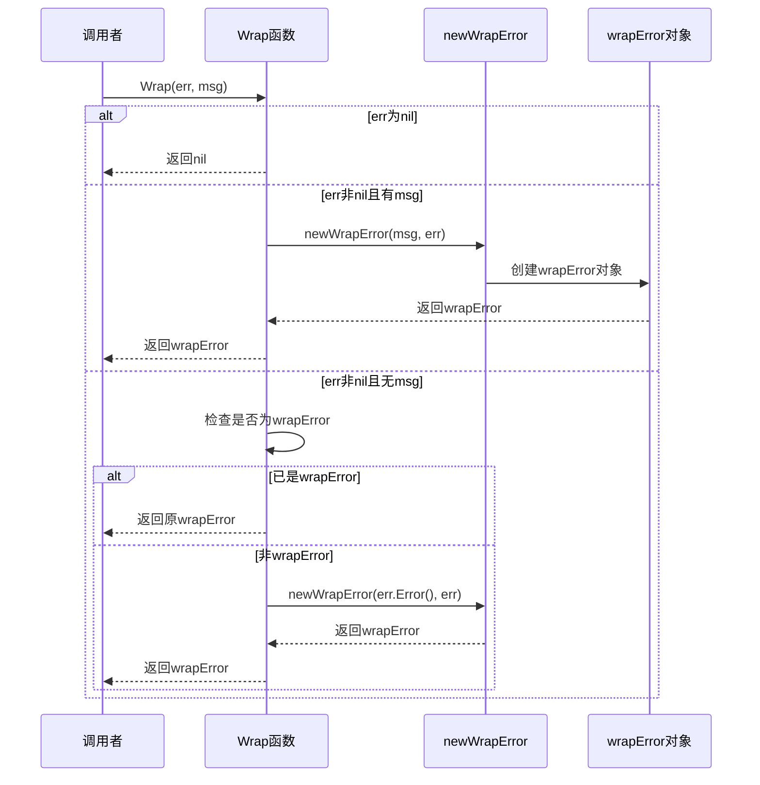
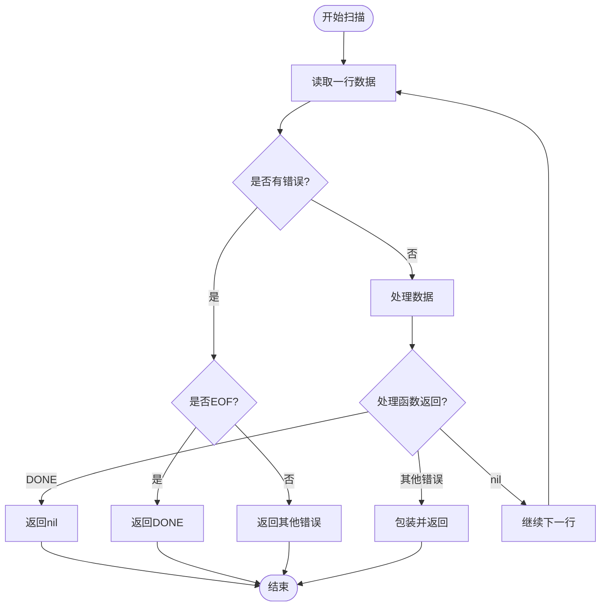
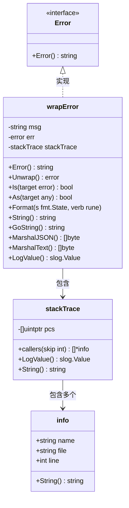
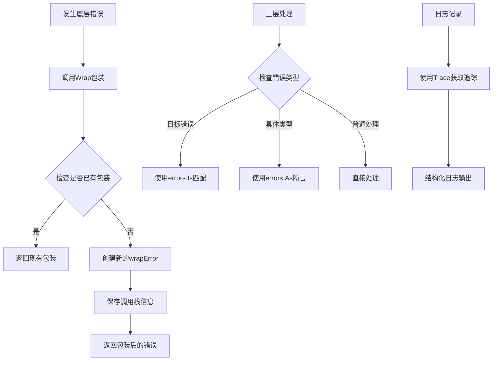
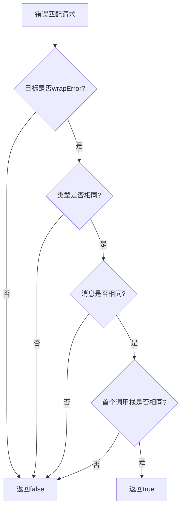
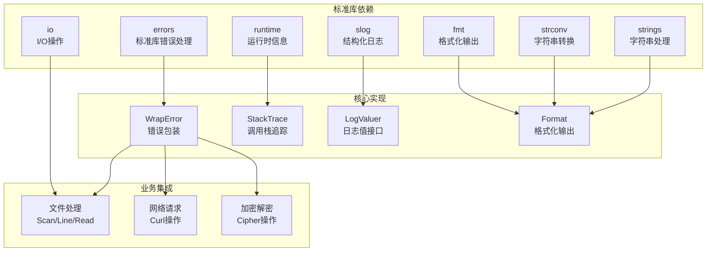

# 错误处理机制

<cite>
**本文档引用的文件**
- [errors.go](file://errors/errors.go)
- [errors_test.go](file://errors/errors_test.go)
- [file.go](file://file.go)
- [file_test.go](file://file_test.go)
- [curl.go](file://curl.go)
- [cipher.go](file://cipher.go)
- [README.md](file://README.md)
</cite>

## 更新摘要

**变更内容**

- 更新了 WrapError 设计理念和实现原理的详细说明
- 新增了 DONE 错误常量的使用场景和终止扫描机制
- 完善了错误类型系统的设计和错误处理最佳实践
- 增强了错误包装模式的调试和跟踪能力说明
- 添加了跨模块错误处理统一性的分析

## 目录

1. [简介](#简介)
2. [项目结构](#项目结构)
3. [核心组件](#核心组件)
4. [架构概览](#架构概览)
5. [详细组件分析](#详细组件分析)
6. [依赖关系分析](#依赖关系分析)
7. [性能考虑](#性能考虑)
8. [故障排除指南](#故障排除指南)
9. [结论](#结论)

## 简介

本项目提供了一套完整的Go语言错误处理机制，重点围绕`WrapError`设计模式展开。该机制不仅实现了标准库的错误处理功能，还引入了链式错误追踪、上下文信息保留和结构化日志记录等高级特性。

错误处理机制的核心价值在于：

- **链式错误追踪**：通过包装器保存完整的调用栈信息
- **上下文保留**：在错误传播过程中保持原始错误信息
- **结构化日志**：提供丰富的错误元数据用于调试
- **统一错误格式**：标准化错误消息和格式化输出
- **跨模块统一**：在文件处理、网络请求、加密解密等模块中提供一致的错误处理体验

## 项目结构

该项目采用模块化设计，错误处理功能独立封装在`errors`包中，其他业务模块通过导入该包来获得统一的错误处理能力。



**图表来源**

- [errors.go](file://errors/errors.go#L1-L282)
- [file.go](file://file.go#L1-L478)
- [curl.go](file://curl.go#L1-L200)
- [cipher.go](file://cipher.go#L1-L200)

**章节来源**

- [errors.go](file://errors/errors.go#L1-L282)
- [file.go](file://file.go#L1-L478)

## 核心组件

### WrapError 设计理念

`WrapError`是整个错误处理系统的核心，它基于以下设计理念：

1. **不可变性**：错误对象一旦创建就保持不变
2. **链式包装**：支持多层错误包装，形成错误链
3. **上下文保留**：在包装过程中保留原始错误信息
4. **智能识别**：自动识别已存在的包装错误避免重复包装
5. **格式化支持**：提供多种格式化输出方式满足不同需求

### 错误包装机制



**图表来源**

- [errors.go](file://errors/errors.go#L24-L53)

### DONE 错误常量机制

`DONE`是一个特殊的错误常量，用于控制扫描操作的终止：



**图表来源**

- [file.go](file://file.go#L245-L251)
- [file.go](file://file.go#L270-L275)

**章节来源**

- [errors.go](file://errors/errors.go#L14-L82)
- [file.go](file://file.go#L18-L19)
- [file.go](file://file.go#L227-L283)

## 架构概览

### 错误类型层次结构



**图表来源**

- [errors.go](file://errors/errors.go#L141-L145)
- [errors.go](file://errors/errors.go#L84-L103)
- [errors.go](file://errors/errors.go#L258-L266)

### 错误处理流程



**图表来源**

- [errors.go](file://errors/errors.go#L24-L72)
- [errors.go](file://errors/errors.go#L74-L82)

**章节来源**

- [errors.go](file://errors/errors.go#L141-L282)

## 详细组件分析

### WrapError 实现详解

#### 数据结构设计

`wrapError`结构体精心设计了三个核心字段：

- **msg**：用户友好的错误消息
- **err**：原始错误引用，支持链式访问
- **stackTrace**：完整的调用栈信息

这种设计确保了错误信息的完整性和可追溯性。

#### 格式化输出机制

`wrapError`实现了多种格式化输出方式：

1. **标准格式**：简洁的错误消息
2. **详细格式**：包含完整调用栈
3. **Go语法格式**：适合调试和日志记录
4. **JSON格式**：便于机器解析

### 错误匹配算法

错误匹配算法是`WrapError`系统的关键特性之一：



**图表来源**

- [errors.go](file://errors/errors.go#L160-L165)

### 调用栈追踪机制

调用栈追踪通过以下步骤实现：

1. **捕获PC**：使用`runtime.Callers`获取程序计数器
2. **解析帧**：通过`runtime.CallersFrames`解析调用帧
3. **提取信息**：提取函数名、文件名和行号
4. **过滤重复**：使用`diff`函数过滤重复的调用帧

**章节来源**

- [errors.go](file://errors/errors.go#L84-L139)
- [errors.go](file://errors/errors.go#L268-L281)

### DONE 错误常量使用场景

`DONE`常量专门用于控制扫描操作的终止，具有以下特点：

#### 文件扫描终止

在文件扫描场景中，当处理函数返回`DONE`时，扫描器会正常终止而不认为是错误：

```go
// 在文件扫描中使用DONE
func processFileContent(reader io.Reader) error {
    return utils.Scan(reader, func(num int, line []byte, err error) error {
        if err != nil {
            if err == io.EOF {
                return utils.DONE  // 正常终止
            }
            return err  // 真正的错误
        }
        
        // 处理数据...
        return nil
    })
}
```

#### 行读取终止

在行读取场景中，`DONE`同样用于优雅终止：

```go
// 在行读取中使用DONE
func processLargeFile(reader io.Reader) error {
    return utils.Line(reader, func(num int, line []byte, lineDone bool) error {
        if num > 1000 {
            return utils.DONE  // 处理1000行后终止
        }
        
        // 处理单行数据...
        return nil
    })
}
```

**章节来源**

- [file.go](file://file.go#L18-L19)
- [file.go](file://file.go#L227-L283)
- [file_test.go](file://file_test.go#L173-L200)

## 依赖关系分析

### 错误处理依赖图



**图表来源**

- [errors.go](file://errors/errors.go#L3-L12)
- [file.go](file://file.go#L3-L16)

### 错误传播路径

错误在系统中的传播遵循以下路径：

1. **底层操作**：文件I/O、网络请求、加密解密
2. **业务层包装**：调用`errors.Wrap`或`errors.Wrapf`
3. **服务层处理**：根据错误类型进行相应处理
4. **应用层响应**：最终的错误响应和日志记录

**章节来源**

- [errors.go](file://errors/errors.go#L24-L53)
- [file.go](file://file.go#L45-L79)

## 性能考虑

### 内存使用优化

1. **延迟调用栈捕获**：仅在创建错误时捕获调用栈
2. **智能缓存**：避免重复计算相同的调用栈信息
3. **零分配设计**：在可能的情况下避免额外的内存分配

### 时间复杂度分析

- **错误包装**：O(1) - 基本的指针操作
- **调用栈捕获**：O(n) - n为调用深度
- **错误匹配**：O(m) - m为错误链长度
- **格式化输出**：O(k) - k为错误信息长度

### 性能最佳实践

1. **避免过度包装**：只在必要时包装错误
2. **合理使用DONE**：在适当的地方使用`DONE`终止扫描
3. **批量错误处理**：对于大量相似错误，考虑使用统一的处理策略

## 故障排除指南

### 常见问题诊断

#### 错误匹配失败

当使用`errors.Is`或`errors.As`时，如果匹配失败，检查以下几点：

1. **错误类型一致性**：确保使用正确的错误类型
2. **包装层级**：确认错误的包装层级是否正确
3. **消息匹配**：检查错误消息是否完全一致

#### 调用栈信息缺失

如果发现调用栈信息不完整：

1. **检查调用深度**：确认调用栈捕获的深度设置
2. **验证运行时信息**：确保运行时环境支持调用栈追踪
3. **调试模式**：在开发环境中启用更详细的日志

### 调试技巧

#### 结构化日志记录

使用`errors.Trace`获取详细的错误追踪信息：

```go
// 获取错误追踪信息
trace := errors.Trace(err)
slog.Info("错误详情", "error", err, "trace", trace)
```

#### 错误链分析

通过`Unwrap`方法分析错误链：

```go
// 逐层分析错误
for err != nil {
    slog.Info("当前错误", "message", err.Error())
    err = errors.Unwrap(err)
}
```

**章节来源**

- [errors.go](file://errors/errors.go#L74-L82)
- [errors.go](file://errors/errors.go#L67-L72)

## 结论

本项目的错误处理机制通过`WrapError`设计模式，成功地将Go语言的标准错误处理能力提升到了一个新的高度。主要成就包括：

1. **完整的错误追踪**：提供了从底层到应用层的完整错误链路
2. **智能错误包装**：避免了重复包装，保持了错误信息的纯净性
3. **结构化日志支持**：为调试和监控提供了丰富的元数据
4. **优雅的终止机制**：通过`DONE`常量实现了可控的错误终止
5. **跨模块统一性**：在文件处理、网络请求、加密解密等多个模块中提供了一致的错误处理体验

这套机制不仅适用于简单的错误处理场景，也为复杂的分布式系统提供了可靠的错误管理基础。对于初学者，它提供了清晰的错误处理模式；对于有经验的开发者，它提供了灵活的扩展空间。

通过遵循本文档的指导原则和最佳实践，开发者可以构建更加健壮和可维护的应用程序，有效提升系统的稳定性和可调试性。