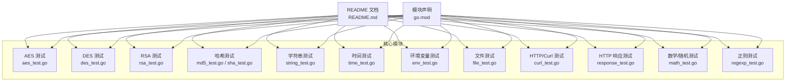
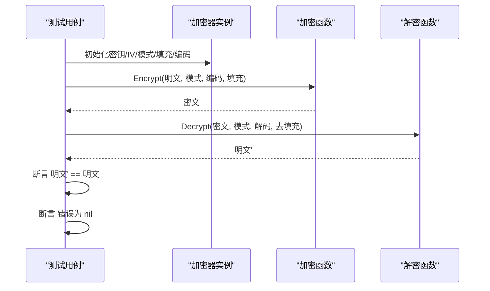
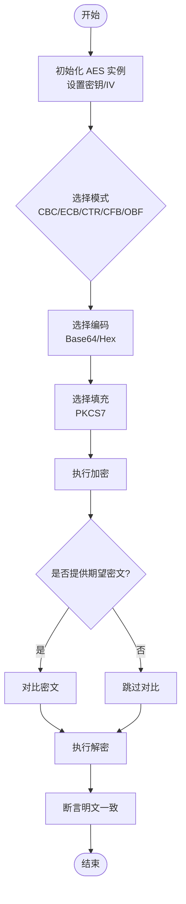
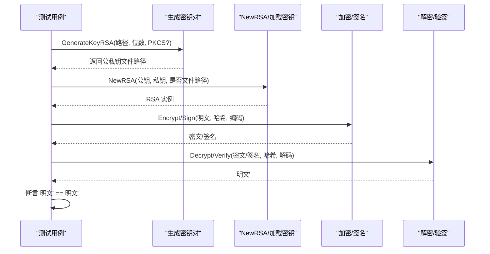
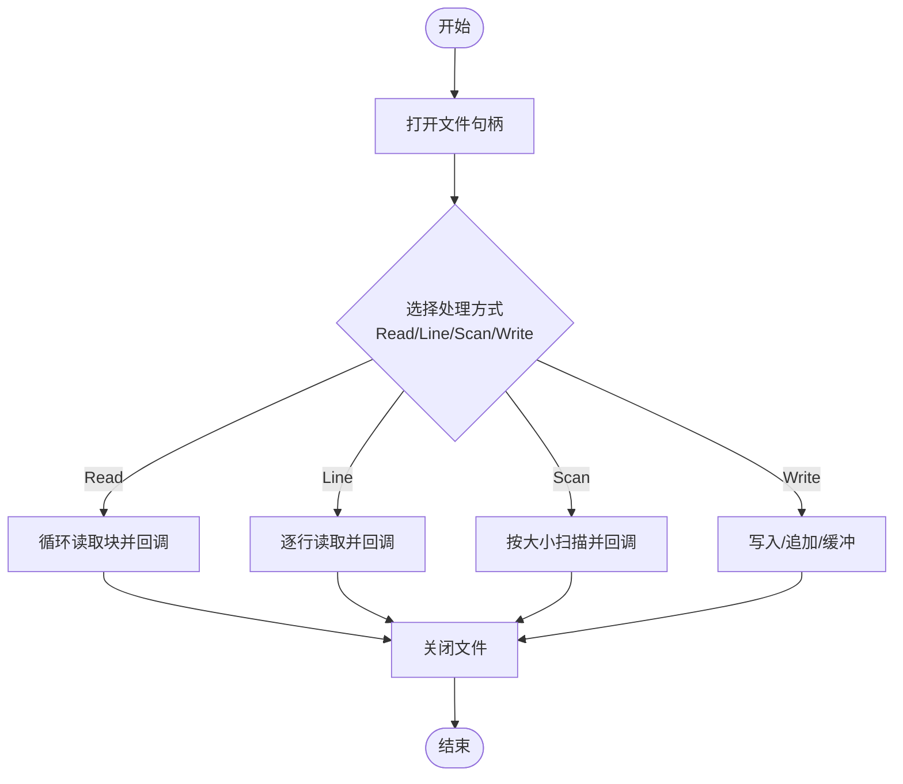
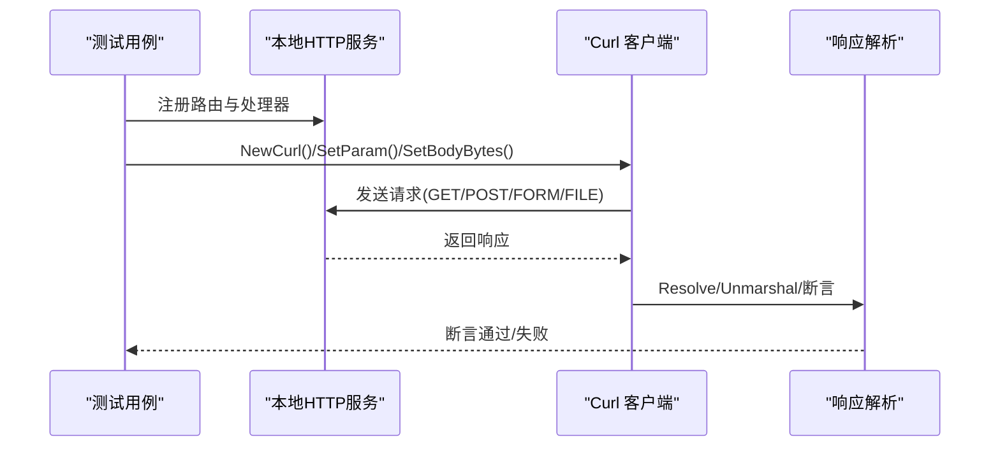
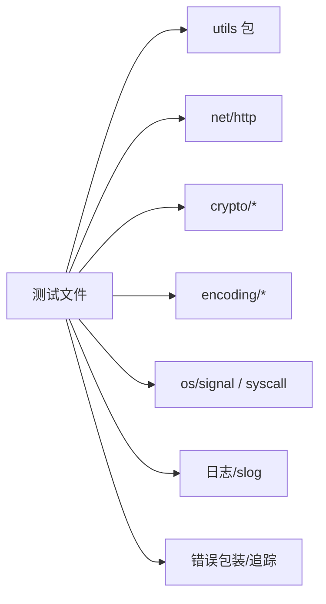

# 单元测试

<cite>
**本文引用的文件**
- [README.md](file://README.md)
- [go.mod](file://go.mod)
- [aes_test.go](file://aes_test.go)
- [cipher_test.go](file://cipher_test.go)
- [des_test.go](file://des_test.go)
- [rsa_test.go](file://rsa_test.go)
- [response_test.go](file://response_test.go)
- [file_test.go](file://file_test.go)
- [env_test.go](file://env_test.go)
- [time_test.go](file://time_test.go)
- [string_test.go](file://string_test.go)
- [curl_test.go](file://curl_test.go)
- [md5_test.go](file://md5_test.go)
- [sha_test.go](file://sha_test.go)
- [math_test.go](file://math_test.go)
- [regexp_test.go](file://regexp_test.go)
</cite>

## 目录

1. [简介](#简介)
2. [项目结构](#项目结构)
3. [核心组件](#核心组件)
4. [架构总览](#架构总览)
5. [详细组件分析](#详细组件分析)
6. [依赖关系分析](#依赖关系分析)
7. [性能考量](#性能考量)
8. [故障排查指南](#故障排查指南)
9. [结论](#结论)
10. [附录](#附录)

## 简介

本指南面向 Go Utils 库的使用者与维护者，系统性讲解如何基于 Go 标准测试框架编写高质量的单元测试。内容覆盖：

- 测试文件与命名规范
- 加密解密模块（AES、DES、RSA、哈希）的测试策略
- 文件处理（读写、扫描、复制、压缩/归档）的测试方法
- HTTP 响应与 Curl 客户端的测试实现
- 字符串处理、环境变量、时间处理等基础工具模块的测试示例
- 断言最佳实践、错误处理测试、测试数据准备与模拟对象使用

## 项目结构

仓库采用“按功能模块划分”的文件组织方式，每个模块通常对应一个源文件与其对应的测试文件（如 string.go 与
string_test.go）。测试文件统一以 _test.go 结尾，位于同一包下，便于直接导入被测包进行测试。

图表来源

- [README.md](file://README.md#L1-L800)
- [go.mod](file://go.mod#L1-L4)

章节来源

- [README.md](file://README.md#L1-L800)
- [go.mod](file://go.mod#L1-L4)

## 核心组件

本节概述各模块的测试重点与策略要点，便于快速定位测试关注点。

- 加密解密
    - AES/DES：验证不同模式（CBC/ECB/CTR/CFB/OBF）、填充（PKCS7）与编码（Base64/Hex）组合下的加解密一致性与错误处理。
    - RSA：覆盖公钥/私钥加载、文件路径与内存内容两种输入、多种填充（PKCS1v15/OAEP）与哈希算法（MD5/SHA256），并包含 PEM 头尾处理校验。
    - 哈希：MD5/SHA1/SHA256/SHA512 的确定性输出校验。
- 文件处理
    - 读写：文本写入、缓冲写入、并发写入、权限控制、追加模式。
    - 扫描与读取：逐行扫描、块读取、回调处理、EOF 控制。
    - 复制与存在性：文件复制、存在性判断、尺寸查询、目录/文件判定。
    - 归档/压缩：归档扫描、压缩/解压流程（见 tar/zip 测试文件）。
- HTTP 响应与 Curl
    - 响应：HTML/XML/JSON/文件/图片/下载/重定向等场景的端到端验证。
    - Curl：GET/POST/FORM/FILE 上传，参数构造、状态码处理、错误日志与重试策略。
- 字符串与正则
    - 字符串：替换、截取、反转、随机字符串、唯一 ID、模糊测试。
    - 正则：金额、邮箱、手机号、密码强度、账户名、域名、时间戳等规则校验。
- 时间与数学
    - 时间：月份天数、日期计算、格式化、解析、相等/先后/差值。
    - 数学：随机数范围校验、四舍五入精度。
- 环境变量
    - 变量读取与默认值回退。

章节来源

- [aes_test.go](file://aes_test.go#L1-L148)
- [des_test.go](file://des_test.go#L1-L82)
- [rsa_test.go](file://rsa_test.go#L1-L270)
- [md5_test.go](file://md5_test.go#L1-L28)
- [sha_test.go](file://sha_test.go#L1-L70)
- [file_test.go](file://file_test.go#L1-L680)
- [string_test.go](file://string_test.go#L1-L292)
- [regexp_test.go](file://regexp_test.go#L1-L744)
- [time_test.go](file://time_test.go#L1-L299)
- [math_test.go](file://math_test.go#L1-L123)
- [env_test.go](file://env_test.go#L1-L28)
- [curl_test.go](file://curl_test.go#L1-L724)
- [response_test.go](file://response_test.go#L1-L82)

## 架构总览

以下序列图展示典型“加密-解密”测试流程，体现测试驱动的断言与错误处理策略。

图表来源

- [aes_test.go](file://aes_test.go#L50-L94)
- [des_test.go](file://des_test.go#L44-L79)
- [cipher_test.go](file://cipher_test.go#L31-L60)

## 详细组件分析

### AES 测试策略

- 覆盖多种密钥长度（16/24/32 字节）、IV（可选）与模式（CBC/ECB/CTR/CFB/OBF）。
- 使用 Base64/Hex 等编码进行加解密，确保编码一致性。
- 通过预置期望密文与去填充对比，验证解密还原。
- 随机 IV 场景：仅提供密钥，由实现生成 IV，仍能正确解密。

图表来源

- [aes_test.go](file://aes_test.go#L10-L94)

章节来源

- [aes_test.go](file://aes_test.go#L1-L148)

### DES 测试策略

- 与 AES 类似，覆盖不同密钥长度与模式，支持 IV。
- 通过已知明文与期望密文进行回归测试，保证兼容性。

章节来源

- [des_test.go](file://des_test.go#L1-L82)

### RSA 测试策略

- 支持从内存或文件加载公钥/私钥，支持 PKCS1v15 与 OAEP 填充。
- 支持多种哈希算法（MD5/SHA256），并验证签名与验签流程。
- 提供 PEM 头尾去除与还原的双向校验，确保密钥格式一致性。
- 生成密钥对并落盘，随后读取进行加解密与签名验签。

图表来源

- [rsa_test.go](file://rsa_test.go#L22-L145)

章节来源

- [rsa_test.go](file://rsa_test.go#L1-L270)

### 哈希测试策略

- MD5/SHA1/SHA256/SHA512：针对固定输入输出进行确定性校验。
- 适合回归测试与跨平台一致性验证。

章节来源

- [md5_test.go](file://md5_test.go#L1-L28)
- [sha_test.go](file://sha_test.go#L1-L70)

### 文件处理测试策略

- 复制/存在性/尺寸/目录/文件判定：覆盖边界与错误场景。
- 读取/扫描：逐行扫描、块读取、回调处理、EOF 控制。
- 写入：普通写、字符串写、缓冲写、并发写入、权限与追加模式。
- 性能基准：提供 Benchmark，便于评估不同写入方式的吞吐与内存占用。

图表来源

- [file_test.go](file://file_test.go#L141-L207)
- [file_test.go](file://file_test.go#L279-L335)
- [file_test.go](file://file_test.go#L397-L445)
- [file_test.go](file://file_test.go#L499-L588)

章节来源

- [file_test.go](file://file_test.go#L1-L680)

### HTTP 响应与 Curl 测试策略

- 响应：启动本地 HTTP 服务，验证 HTML/XML/JSON/文件/图片/下载/重定向等输出。
- Curl：构造 GET/POST/FORM/FILE 上传请求，设置参数、头部、重试与状态码处理，解析响应体并断言业务字段。

图表来源

- [response_test.go](file://response_test.go#L51-L81)
- [curl_test.go](file://curl_test.go#L38-L220)
- [curl_test.go](file://curl_test.go#L222-L414)
- [curl_test.go](file://curl_test.go#L416-L544)
- [curl_test.go](file://curl_test.go#L546-L724)

章节来源

- [response_test.go](file://response_test.go#L1-L82)
- [curl_test.go](file://curl_test.go#L1-L724)

### 字符串与正则测试策略

- 字符串：替换、截取、反转、随机字符串、唯一 ID、模糊测试（Fuzz）。
- 正则：金额、邮箱、手机号、密码强度、账户名、域名、时间戳等规则校验，覆盖边界与非法输入。

章节来源

- [string_test.go](file://string_test.go#L1-L292)
- [regexp_test.go](file://regexp_test.go#L1-L744)

### 时间与数学测试策略

- 时间：月份天数、日期计算、格式化、解析、相等/先后/差值，覆盖闰年与纳秒级精度。
- 数学：随机数范围校验、四舍五入精度，提供基准测试。

章节来源

- [time_test.go](file://time_test.go#L1-L299)
- [math_test.go](file://math_test.go#L1-L123)

### 环境变量测试策略

- 读取指定键的环境变量，若不存在则回退默认值，断言返回值。

章节来源

- [env_test.go](file://env_test.go#L1-L28)

## 依赖关系分析

- 测试文件统一导入被测包（如 utils），并通过 t.Run 并发/顺序执行用例。
- 外部依赖：net/http、crypto/*、encoding/*、os/signal、syscall 等，用于 HTTP 服务、加密、编码与信号处理。
- 错误追踪：统一使用错误包装与追踪工具，便于断言与日志输出。

图表来源

- [curl_test.go](file://curl_test.go#L1-L16)
- [response_test.go](file://response_test.go#L1-L12)
- [rsa_test.go](file://rsa_test.go#L1-L14)

章节来源

- [curl_test.go](file://curl_test.go#L1-L16)
- [response_test.go](file://response_test.go#L1-L12)
- [rsa_test.go](file://rsa_test.go#L1-L14)

## 性能考量

- 写入性能：优先使用缓冲写入（WriteBuf），结合并发 goroutine 与 WaitGroup，评估不同写入方式的吞吐与内存占用。
- 随机数与字符串：提供基准测试，便于对比 RandStr/RandStr2/UniqId 的性能差异。
- I/O 扫描：Line/Scan/Read 的回调处理与 EOF 控制，避免一次性读取大文件导致内存峰值。

章节来源

- [file_test.go](file://file_test.go#L591-L679)
- [string_test.go](file://string_test.go#L175-L200)
- [math_test.go](file://math_test.go#L58-L82)

## 故障排查指南

- 断言失败
    - 使用 t.Errorf 输出期望值与实际值，结合日志与错误追踪工具定位问题。
    - 对于 JSON/XML/HTML 响应，先断言状态码与内容类型，再解析主体进行字段断言。
- 加密解密
    - 确认密钥长度、IV、模式、填充与编码一致。
    - 对于 RSA，确认填充与哈希算法匹配，PEM 头尾处理无误。
- 文件操作
    - 权限不足、路径不存在、并发写入竞争等问题，检查权限与关闭句柄。
    - 使用 Benchmark 定位性能瓶颈。
- HTTP/Curl
    - 本地服务未启动或端口冲突，检查服务启动与退出信号。
    - 请求参数与 Content-Type 不匹配导致解析失败，核对 SetParam/SetBodyBytes/SetContentType。

章节来源

- [aes_test.go](file://aes_test.go#L50-L94)
- [des_test.go](file://des_test.go#L44-L79)
- [rsa_test.go](file://rsa_test.go#L90-L144)
- [file_test.go](file://file_test.go#L517-L588)
- [curl_test.go](file://curl_test.go#L177-L218)

## 结论

通过对加密解密、文件处理、HTTP 响应与 Curl、字符串与正则、时间与数学、环境变量等模块的系统化测试实践，可以有效保障 Go Utils
库在多场景下的正确性与稳定性。建议在新增功能时同步补充测试用例，并结合基准测试持续优化性能。

## 附录

- 测试命名规范
    - 测试函数以 TestXxx 或 FuzzXxx 命名，子测试使用 t.Run。
    - 表驱动测试使用 tests 切片，每条用例包含 name 与 args。
- 断言最佳实践
    - 使用 t.Errorf 输出详细上下文，避免仅断言布尔值。
    - 对错误进行显式断言，区分预期错误与异常错误。
    - 对 JSON/XML/HTML 等结构化响应，先断言状态码与类型，再解析主体字段。
- 测试数据与模拟
    - 使用固定种子或伪随机源，确保可重复性。
    - 对外部依赖（HTTP 服务、文件系统）使用临时目录与端口，测试结束后清理。
    - 对加密/哈希等模块，使用已知输入输出进行回归测试。