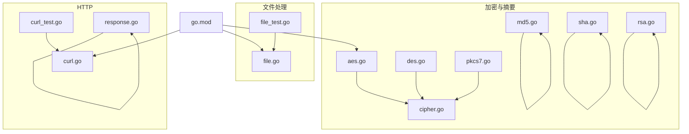
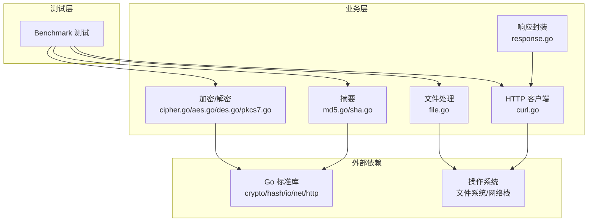
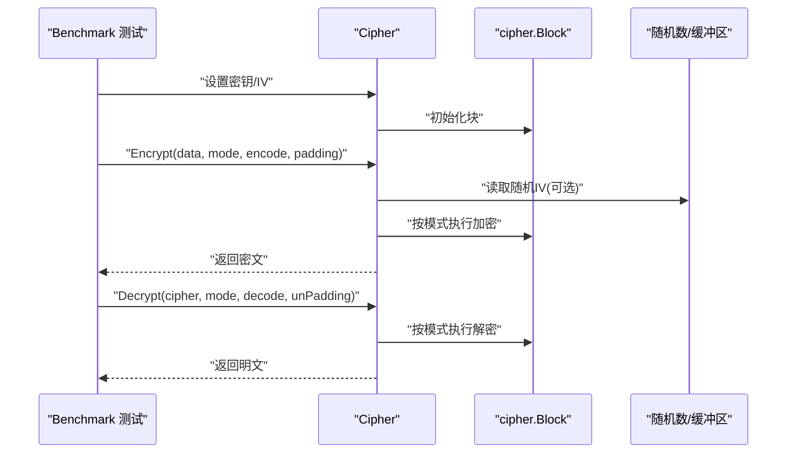
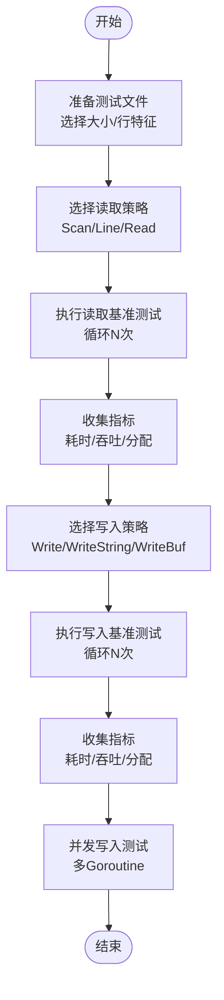
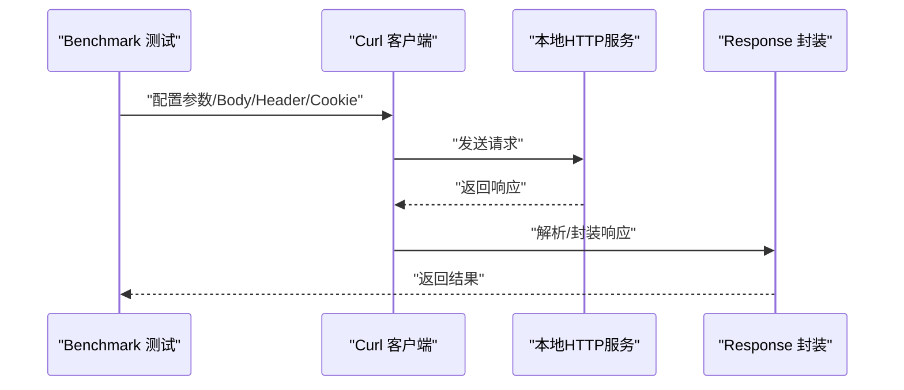
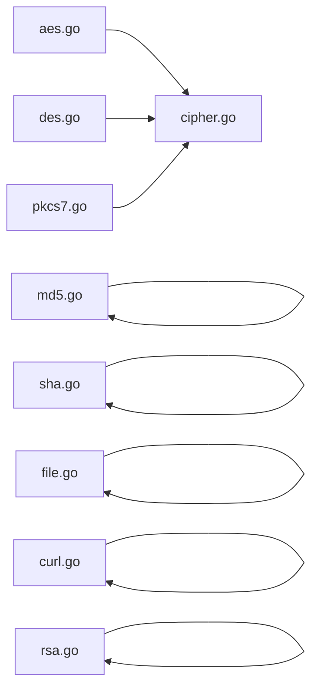

# 性能测试

<cite>
**本文引用的文件**
- [cipher.go](file://cipher.go)
- [aes.go](file://aes.go)
- [des.go](file://des.go)
- [pkcs7.go](file://pkcs7.go)
- [md5.go](file://md5.go)
- [sha.go](file://sha.go)
- [file.go](file://file.go)
- [file_test.go](file://file_test.go)
- [curl.go](file://curl.go)
- [curl_test.go](file://curl_test.go)
- [rsa.go](file://rsa.go)
- [rsa_test.go](file://rsa_test.go)
- [response.go](file://response.go)
- [go.mod](file://go.mod)
</cite>

## 目录

1. [简介](#简介)
2. [项目结构](#项目结构)
3. [核心组件](#核心组件)
4. [架构总览](#架构总览)
5. [详细组件分析](#详细组件分析)
6. [依赖关系分析](#依赖关系分析)
7. [性能考量](#性能考量)
8. [故障排查指南](#故障排查指南)
9. [结论](#结论)
10. [附录](#附录)

## 简介

本指南面向 Go Utils 库的性能测试实践，系统讲解如何基于 Go 标准库的 testing/benchmark
框架编写与执行性能测试，覆盖对称加密（AES/DES）、填充（PKCS7）、哈希（MD5/SHA）、文件读写、HTTP 请求与响应等模块的性能基准测试设计与执行要点。同时提供内存与
CPU 分析技巧、结果解读与瓶颈定位方法、优化建议与回归测试策略，帮助团队建立稳定高效的性能保障体系。

## 项目结构

仓库采用按功能域划分的文件组织方式，便于针对具体能力进行性能测试设计与落地：

- 加密与摘要：cipher.go、aes.go、des.go、pkcs7.go、md5.go、sha.go、rsa.go
- 文件处理：file.go、file_test.go
- HTTP 客户端与响应：curl.go、curl_test.go、response.go
- 依赖管理：go.mod

图表来源

- [cipher.go](file://cipher.go#L1-L498)
- [aes.go](file://aes.go#L1-L23)
- [des.go](file://des.go#L1-L200)
- [pkcs7.go](file://pkcs7.go#L1-L200)
- [md5.go](file://md5.go#L1-L13)
- [sha.go](file://sha.go#L1-L27)
- [file.go](file://file.go#L1-L451)
- [file_test.go](file://file_test.go#L1-L680)
- [curl.go](file://curl.go#L1-L1058)
- [curl_test.go](file://curl_test.go#L1-L724)
- [rsa.go](file://rsa.go#L1-L527)
- [response.go](file://response.go#L1-L342)
- [go.mod](file://go.mod#L1-L200)

章节来源

- [cipher.go](file://cipher.go#L1-L498)
- [file.go](file://file.go#L1-L451)
- [curl.go](file://curl.go#L1-L1058)
- [rsa.go](file://rsa.go#L1-L527)
- [go.mod](file://go.mod#L1-L200)

## 核心组件

- 对称加密与填充：cipher.go 提供统一的 Cipher 抽象，支持 AES/DES、多种分组模式（ECB/CBC/CTR/CFB/OFB）、IV 管理与 PKCS7
  填充；aes.go/des.go 提供便捷入口。
- 哈希摘要：md5.go、sha.go 提供常用摘要算法封装。
- 文件处理：file.go 提供扫描、逐行读取、分块读取、写入与并发写入等能力，file_test.go 中包含扫描/行读取/分块读取/写入的基准测试。
- HTTP 客户端与响应：curl.go 提供链式配置的 HTTP 客户端，支持重试、日志、TLS、Cookie、参数与 Body 设置；response.go
  提供统一响应封装；curl_test.go 展示了服务端与客户端联调测试。
- 非对称加密：rsa.go 提供 RSA 加解密、签名与验签、密钥生成、PEM 头部处理等。

章节来源

- [cipher.go](file://cipher.go#L1-L498)
- [aes.go](file://aes.go#L1-L23)
- [des.go](file://des.go#L1-L200)
- [pkcs7.go](file://pkcs7.go#L1-L200)
- [md5.go](file://md5.go#L1-L13)
- [sha.go](file://sha.go#L1-L27)
- [file.go](file://file.go#L1-L451)
- [file_test.go](file://file_test.go#L1-L680)
- [curl.go](file://curl.go#L1-L1058)
- [response.go](file://response.go#L1-L342)
- [rsa.go](file://rsa.go#L1-L527)

## 架构总览

下图展示性能测试涉及的核心调用链路与交互关系，便于定位测试场景与数据流。

图表来源

- [cipher.go](file://cipher.go#L1-L498)
- [aes.go](file://aes.go#L1-L23)
- [des.go](file://des.go#L1-L200)
- [pkcs7.go](file://pkcs7.go#L1-L200)
- [md5.go](file://md5.go#L1-L13)
- [sha.go](file://sha.go#L1-L27)
- [file.go](file://file.go#L1-L451)
- [curl.go](file://curl.go#L1-L1058)
- [response.go](file://response.go#L1-L342)

## 详细组件分析

### 加密解密性能测试

目标：对比不同算法（AES/DES）、不同模式（CBC/CTR/CFB/OFC/ECB）、不同填充（PKCS7）以及不同密钥长度（AES-128/192/256、DES/3DES）的加解密吞吐与延迟，评估
IV 生成策略（固定/随机）对性能的影响。

- 测试设计要点
    - 固定数据集：准备不同长度的明文样本（如 64B、1KB、64KB、1MB），覆盖小/中/大三档。
    - 参数组合：枚举算法、密钥长度、模式、填充、IV 策略（固定/随机）。
    - 指标采集：每组 N 次迭代，统计平均耗时、P50/P95/P99 延迟、吞吐（MB/s）、分配次数与分配字节数。
    - 并发场景：在高并发下（如 GOMAXPROCS=1/2/4）重复上述组合，观察线程竞争与锁开销。
    - 稳定性：多次运行取均值与方差，排除瞬时抖动。

- 关键实现参考
    - cipher.go 提供统一的 Encrypt/Decrypt 接口与各模式实现，适合直接基准测试。
    - aes.go/des.go 提供便捷入口，便于快速切换算法与密钥长度。
    - pkcs7.go 提供填充/去填充逻辑，确保测试一致性。

图表来源

- [cipher.go](file://cipher.go#L423-L497)
- [aes.go](file://aes.go#L12-L22)
- [des.go](file://des.go#L1-L200)
- [pkcs7.go](file://pkcs7.go#L1-L200)

章节来源

- [cipher.go](file://cipher.go#L1-L498)
- [aes.go](file://aes.go#L1-L23)
- [des.go](file://des.go#L1-L200)
- [pkcs7.go](file://pkcs7.go#L1-L200)

### 文件处理性能测试

目标：评估不同读取策略（Scanner/Line/Read）与写入策略（Write/WriteString/WriteBuf）在不同文件大小与行长度下的性能表现，识别缓冲区大小、锁竞争与磁盘
I/O 的影响。

- 测试设计要点
    - 文件规模：小文件（<10KB）、中文件（~1MB）、大文件（~100MB）。
    - 读取策略：Scan、Line、Read，分别测试其在大行/无换行场景下的差异。
    - 写入策略：普通写、字符串写、带缓冲写，比较吞吐与内存分配。
    - 并发写入：多 goroutine 并发写同一文件，对比加锁与不加锁的差异。
    - 缓冲区参数：调整 Scanner 的 Buffer 大小，观察对大行读取的影响。

- 关键实现参考
    - file.go 提供 Scan/Line/Read 与 WriteFile 的多种写入接口。
    - file_test.go 已内置 Scan/Line/Read/Write 的基准测试样例，可直接复用或扩展。

图表来源

- [file.go](file://file.go#L227-L387)
- [file_test.go](file://file_test.go#L209-L679)

章节来源

- [file.go](file://file.go#L1-L451)
- [file_test.go](file://file_test.go#L1-L680)

### HTTP 响应性能测试

目标：在不同请求体大小与并发条件下，评估 HTTP 客户端发送与响应解析的延迟与吞吐，关注 TLS、重试、日志与 Body 处理对性能的影响。

- 测试设计要点
    - 请求体大小：小（JSON/表单）、中（MB 级）、大（文件上传）。
    - 并发：单并发、低并发（2/4）、高并发（8/16）。
    - 场景：GET/POST/FORM/FILE 上传，含参数、Cookie、自定义 Header。
    - 指标：请求-响应往返时间、每秒请求数、响应体解析耗时、重试次数与延迟。
    - 服务端：curl_test.go 中提供了本地 HTTP 服务示例，可用于联调与压测。

图表来源

- [curl.go](file://curl.go#L435-L772)
- [response.go](file://response.go#L11-L342)
- [curl_test.go](file://curl_test.go#L38-L220)

章节来源

- [curl.go](file://curl.go#L1-L1058)
- [response.go](file://response.go#L1-L342)
- [curl_test.go](file://curl_test.go#L1-L724)

### 哈希摘要性能测试

目标：对比 MD5/SHA1/SHA256/SHA512 在不同数据大小下的吞吐与延迟，识别算法复杂度与实现差异带来的性能差异。

- 测试设计要点
    - 数据规模：小（64B/1KB）、中（64KB）、大（1MB/10MB）。
    - 指标：每秒处理字节数、CPU 时间、分配次数与字节数。
    - 复杂度：SHA 系列随摘要长度增加而提升计算成本，需关注批量处理与流水线优化。

章节来源

- [md5.go](file://md5.go#L1-L13)
- [sha.go](file://sha.go#L1-L27)

### 非对称加密性能测试

目标：评估 RSA 加解密、签名与验签在不同密钥位数（如
1024/2048/4096）与哈希算法（MD5/SHA256）下的性能，识别密钥大小与填充方案（PKCS1v15/OAEP/PSS）对性能的影响。

- 测试设计要点
    - 密钥生成：使用 rsa.go 的 GenerateKeyRSA 生成不同规格密钥，保存至临时目录。
    - 场景：公钥加密/私钥解密、私钥签名/公钥验签、OAEP 加解密。
    - 数据规模：小消息（<100B）、中消息（~1KB）、大消息（~8KB）。
    - 指标：单次耗时分布、吞吐、CPU 占用、内存分配。

章节来源

- [rsa.go](file://rsa.go#L1-L527)
- [rsa_test.go](file://rsa_test.go#L1-L270)

## 依赖关系分析

- 加密模块依赖 Go 标准库 crypto/aes、crypto/des、crypto/cipher、crypto/rand 等，性能受底层实现与 CPU 指令集优化影响。
- 文件处理依赖 io、bufio、os，性能受缓冲区大小、锁竞争与磁盘 I/O 子系统影响。
- HTTP 客户端依赖 net/http、crypto/tls，性能受连接池、TLS 握手、重试与日志开销影响。
- 哈希模块依赖 crypto/md5、crypto/sha1、crypto/sha256、crypto/sha512，性能与算法复杂度直接相关。

图表来源

- [aes.go](file://aes.go#L1-L23)
- [des.go](file://des.go#L1-L200)
- [pkcs7.go](file://pkcs7.go#L1-L200)
- [cipher.go](file://cipher.go#L1-L498)
- [md5.go](file://md5.go#L1-L13)
- [sha.go](file://sha.go#L1-L27)
- [file.go](file://file.go#L1-L451)
- [curl.go](file://curl.go#L1-L1058)
- [rsa.go](file://rsa.go#L1-L527)

章节来源

- [go.mod](file://go.mod#L1-L200)

## 性能考量

- 缓冲与零拷贝
    - 文件读写优先使用带缓冲的 Writer/Scanner，合理设置缓冲大小，避免频繁系统调用。
    - 大文件分块读取（Read）可减少一次性内存占用。
- 锁与并发
    - WriteFile 内部使用互斥锁保护写入，高并发写入建议合并写入批次或使用独立文件。
    - 多 goroutine 并发读取时，注意避免共享 Reader 的竞争。
- 加密与哈希
    - AES/DES 模式选择：CTR/OFB 通常具备更好的并行性；CBC/CFB/ECB 有不同适用场景。
    - IV 策略：随机 IV 会引入额外随机数生成开销，固定 IV 可降低开销但安全性需权衡。
    - 哈希算法：SHA256/512 比 SHA1/Md5 更安全但更慢，按需选择。
- HTTP
    - 合理设置超时与重试次数，避免长尾延迟拖累整体吞吐。
    - 关闭不必要的日志与 Dump 模式，减少 CPU 与内存压力。
    - 复用连接池，减少 TLS 握手与连接建立开销。
- 内存与 CPU
    - 使用 testing 的 -benchmem 收集分配次数与字节数，结合 pprof 定位热点。
    - 对热点路径进行 SIMD/并行优化（如批量处理、流水线）。

## 故障排查指南

- 基准测试异常
    - 现象：吞吐波动大、P99 明显偏高。
    - 排查：检查系统负载、磁盘 I/O、网络抖动；确认测试环境隔离；重复多次取均值。
- 加密错误
    - 现象：解密失败或长度不匹配。
    - 排查：核对密钥长度、IV 长度与模式要求；确认填充/去填充一致；检查随机 IV 的读取与传递。
- 文件读写失败
    - 现象：读取 EOF 提前、行截断、写入失败。
    - 排查：检查 Scanner 的 Buffer 设置；确认 WriteBuf 的 Flush 调用；排查并发写入的锁与顺序。
- HTTP 请求失败
    - 现象：超时、状态码异常、Body 解析错误。
    - 排查：检查服务端状态码白名单、Body 读取与 DrainBody 的使用；确认 Content-Type 与参数设置。

章节来源

- [cipher.go](file://cipher.go#L68-L84)
- [file.go](file://file.go#L227-L387)
- [curl.go](file://curl.go#L435-L772)

## 结论

通过系统化的性能测试设计与执行，结合 Go 标准库的 testing/benchmark 框架与 pprof 工具，能够有效评估与优化 Go Utils
库在加密解密、文件处理、HTTP 交互与摘要计算等关键路径上的性能表现。建议将性能测试纳入
CI，建立回归基线，持续监控关键指标，确保在功能演进过程中维持稳定的性能水平。

## 附录

- 性能测试执行命令示例（以文件处理为例）
    - 运行扫描基准测试：go test -bench=Scan$ -run ^$ -count 5 -benchmem
    - 运行行读取基准测试：go test -bench=Line$ -run ^$ -count 5 -benchmem
    - 运行分块读取基准测试：go test -bench=Read$ -run ^$ -count 5 -benchmem
    - 运行写入基准测试：go test -bench=Write$ -run ^$ -count 5 -benchmem
- 性能分析工具
    - pprof：go test -bench=. -run ^$ -cpuprofile=cpu.pprof -memprofile=mem.pprof
    - benchstat：对比多次基准测试结果，查看均值与方差变化趋势

章节来源

- [file_test.go](file://file_test.go#L209-L679)
- [curl_test.go](file://curl_test.go#L38-L220)