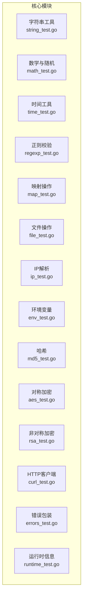
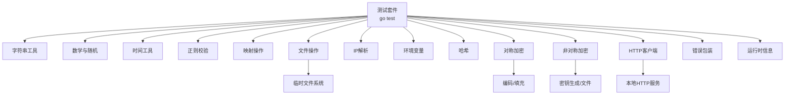
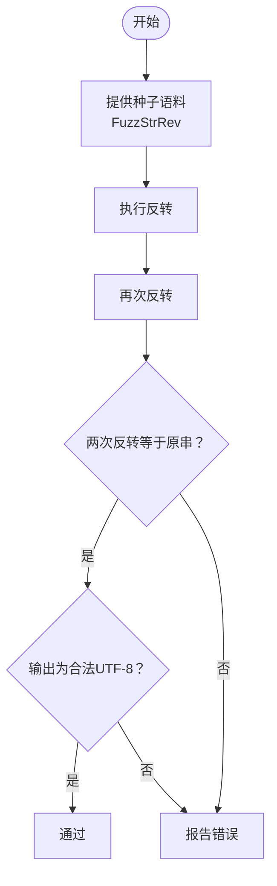
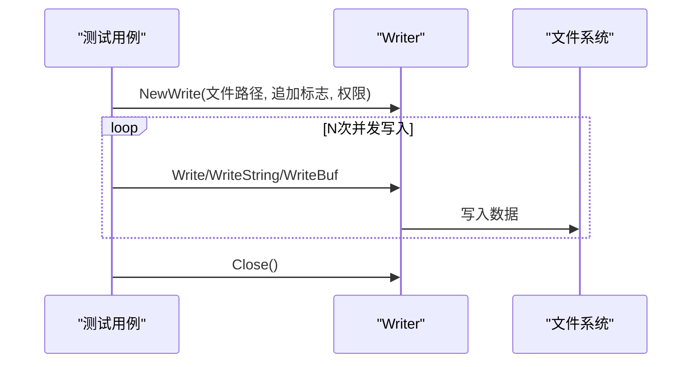
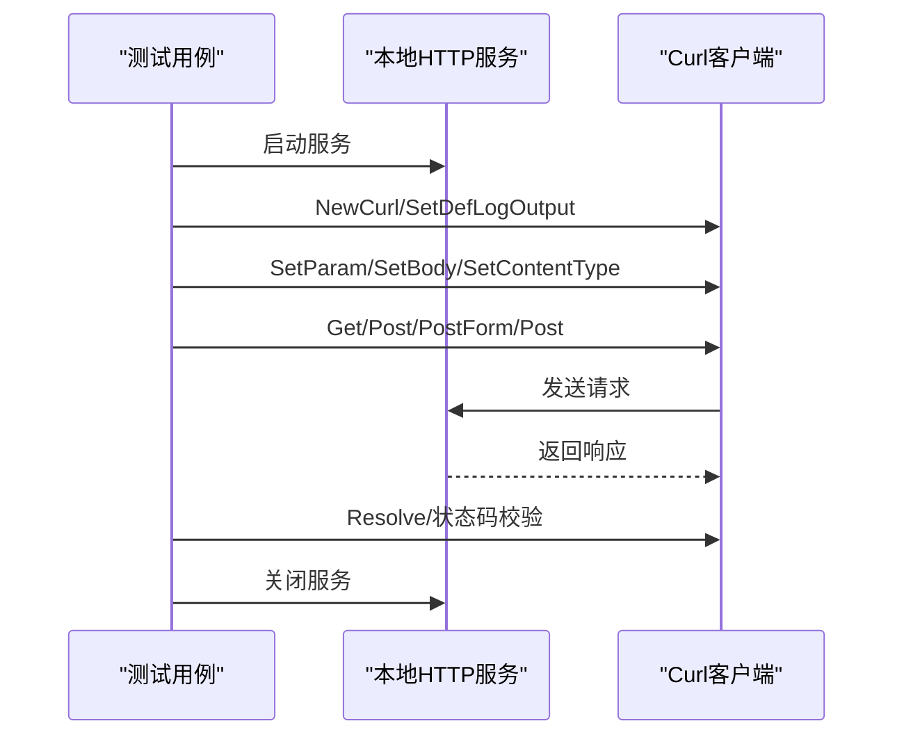
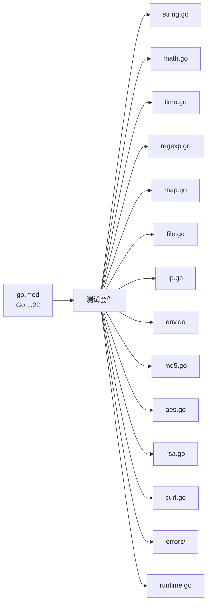

# 测试指南

<cite>
**本文档引用的文件**
- [README.md](file://README.md)
- [go.mod](file://go.mod)
- [errors_test.go](file://errors/errors_test.go)
- [aes_test.go](file://aes_test.go)
- [cipher_test.go](file://cipher_test.go)
- [env_test.go](file://env_test.go)
- [math_test.go](file://math_test.go)
- [string_test.go](file://string_test.go)
- [file_test.go](file://file_test.go)
- [ip_test.go](file://ip_test.go)
- [md5_test.go](file://md5_test.go)
- [rsa_test.go](file://rsa_test.go)
- [curl_test.go](file://curl_test.go)
- [regexp_test.go](file://regexp_test.go)
- [strconv_test.go](file://strconv_test.go)
- [time_test.go](file://time_test.go)
- [map_test.go](file://map_test.go)
- [runtime_test.go](file://runtime_test.go)
</cite>

## 目录

1. [简介](#简介)
2. [项目结构](#项目结构)
3. [核心组件](#核心组件)
4. [架构总览](#架构总览)
5. [详细组件分析](#详细组件分析)
6. [依赖关系分析](#依赖关系分析)
7. [性能考虑](#性能考虑)
8. [故障排查指南](#故障排查指南)
9. [结论](#结论)
10. [附录](#附录)

## 简介

本测试指南面向 Go Utils 库，系统性阐述单元测试、集成测试、性能测试与覆盖率提升方法，覆盖 Mock 技术、测试数据与环境准备、测试用例设计原则与
TDD 实践，以及持续集成与自动化测试配置建议。文档基于仓库现有测试文件进行归纳总结，确保读者能快速落地最佳实践。

## 项目结构

- 采用按功能模块划分的文件组织方式，每个功能模块通常对应一个源文件与其对应的测试文件（如 string.go 与 string_test.go）。
- 测试文件命名统一为 <功能>_test.go，便于识别与管理。
- 通过 go test 命令即可执行测试，支持基准测试（-bench）、并发测试（-race）、覆盖率统计（-cover）等。

图表来源

- [string_test.go](file://string_test.go#L1-L292)
- [math_test.go](file://math_test.go#L1-L123)
- [time_test.go](file://time_test.go#L1-L299)
- [regexp_test.go](file://regexp_test.go#L1-L744)
- [map_test.go](file://map_test.go#L1-L319)
- [file_test.go](file://file_test.go#L1-L680)
- [ip_test.go](file://ip_test.go#L1-L87)
- [env_test.go](file://env_test.go#L1-L28)
- [md5_test.go](file://md5_test.go#L1-L28)
- [aes_test.go](file://aes_test.go#L1-L148)
- [rsa_test.go](file://rsa_test.go#L1-L270)
- [curl_test.go](file://curl_test.go#L1-L724)
- [errors_test.go](file://errors/errors_test.go#L1-L85)
- [runtime_test.go](file://runtime_test.go#L1-L26)

章节来源

- [README.md](file://README.md#L1-L80)
- [go.mod](file://go.mod#L1-L4)

## 核心组件

- 单元测试框架：Go 标准库 testing，广泛使用 t.Run 进行子测试、t.Parallel 并发执行、t.Cleanup 清理资源。
- 基准测试：使用 -bench 标志，配合 b.RunParallel、b.ResetTimer 控制计时与并发。
- 并发测试：使用 -race 检测竞态条件，示例中可见 WaitGroup 与 goroutine 并发场景。
- 覆盖率：通过 -coverprofile 生成覆盖率文件，结合 go tool cover 可视化。
- Mock 与隔离：通过接口注入、函数替换、外部依赖（网络、文件系统）抽象实现隔离。
- 集成测试：通过本地 HTTP 服务、临时文件、密钥生成等方式模拟真实环境。

章节来源

- [string_test.go](file://string_test.go#L89-L109)
- [math_test.go](file://math_test.go#L37-L54)
- [file_test.go](file://file_test.go#L120-L139)
- [curl_test.go](file://curl_test.go#L38-L81)

## 架构总览

下图展示测试体系与被测模块的关系：测试文件围绕具体功能模块进行验证，部分模块（如加密、HTTP）引入外部依赖并通过 Mock
或本地服务进行隔离。

图表来源

- [curl_test.go](file://curl_test.go#L46-L74)
- [file_test.go](file://file_test.go#L1-L680)
- [rsa_test.go](file://rsa_test.go#L22-L54)
- [aes_test.go](file://aes_test.go#L10-L94)

## 详细组件分析

### 字符串工具测试

- 功能覆盖：替换、截取、反转、随机字符串、唯一 ID、UTF-8 校验、模糊测试（Fuzz）。
- 测试要点：
    - 使用 t.Run 为不同场景分组，便于定位问题。
    - 使用 utf8.ValidString 校验输入合法性。
    - 使用 FuzzStrRev 验证自反性（反转两次等于原串），提升健壮性。
    - 基准测试覆盖 RandStr2、UniqId，关注内存分配与吞吐。

图表来源

- [string_test.go](file://string_test.go#L89-L109)

章节来源

- [string_test.go](file://string_test.go#L1-L292)

### 数学与随机测试

- 功能覆盖：整数随机数、四舍五入、并发安全与边界检查。
- 测试要点：
    - 使用 WaitGroup 并发调用 Rand，验证范围与线程安全。
    - 基准测试 BenchmarkRand，控制 t.N 循环次数，避免重复计算。

章节来源

- [math_test.go](file://math_test.go#L1-L123)

### 时间工具测试

- 功能覆盖：月份天数、时间格式化、时间解析、时间比较与差值。
- 测试要点：
    - 使用多种格式与纳秒精度验证 Date、TimeFormat、Strtotime。
    - 使用 Equal、After、Before、Sub 比较不同粒度的时间。

章节来源

- [time_test.go](file://time_test.go#L1-L299)

### 正则校验测试

- 功能覆盖：金额、邮箱、字母数字、手机号、电话、QQ、日期、密码强度、账号规范等。
- 测试要点：
    - 正例与反例并重，覆盖边界与非法格式。
    - 使用 PassWord/PassWord2/PassWord3 验证复杂规则组合。

章节来源

- [regexp_test.go](file://regexp_test.go#L1-L744)

### 映射操作测试

- 功能覆盖：键值提取、差集/交集、过滤、遍历、排序。
- 测试要点：
    - 使用泛型约束 utils.Ordered，保证键与值的有序性。
    - 通过 isReverse 控制升/降序，验证排序一致性。

章节来源

- [map_test.go](file://map_test.go#L1-L319)

### 文件操作测试

- 功能覆盖：文件查找、存在性、复制、扫描、逐行读取、缓冲写入、并发写入。
- 测试要点：
    - 使用临时目录与文件进行集成测试，避免污染工作区。
    - 并发写入场景使用 WaitGroup 保证完整性。
    - 基准测试覆盖 Scan、Line、Read、Write，关注 I/O 性能。

图表来源

- [file_test.go](file://file_test.go#L499-L588)

章节来源

- [file_test.go](file://file_test.go#L1-L680)

### IP 解析测试

- 功能覆盖：服务器IP、本地IP、客户端IP（支持 X-Real-Ip、X-Forwarded-For）。
- 测试要点：
    - 通过构造 http.Request 模拟代理链路，验证解析顺序与优先级。

章节来源

- [ip_test.go](file://ip_test.go#L1-L87)

### 环境变量测试

- 功能覆盖：GetEnv 支持多默认值选择。
- 测试要点：
    - 使用 t.Run 验证不同键与默认值组合。

章节来源

- [env_test.go](file://env_test.go#L1-L28)

### 哈希测试

- 功能覆盖：MD5。
- 测试要点：
    - 对照已知摘要验证一致性。

章节来源

- [md5_test.go](file://md5_test.go#L1-L28)

### 对称加密（AES）测试

- 功能覆盖：CBC/ECB/CTR/CFB/OFB 模式、PKCS7 填充、Base64 编解码。
- 测试要点：
    - 固定密钥与向量，对比预期密文与解密结果。
    - RandIV 模式自动生成 IV，验证解密一致性。

章节来源

- [aes_test.go](file://aes_test.go#L1-L148)

### 非对称加密（RSA）测试

- 功能覆盖：密钥生成、公钥加密/私钥解密（PKCS1v15/OAEP）、签名/验签（PKCS1v15/PSS）、PEM 头部处理。
- 测试要点：
    - 生成临时密钥文件，读取后进行端到端验证。
    - 验证签名与验签流程，覆盖不同哈希算法。

章节来源

- [rsa_test.go](file://rsa_test.go#L1-L270)

### HTTP 客户端（Curl）测试

- 功能覆盖：GET/POST/FORM/FILE，参数设置、重试、状态码校验、响应解析。
- 测试要点：
    - 启动本地 HTTP 服务，模拟真实接口行为。
    - 使用 Resolve 自定义响应解析，SetDump 记录请求细节。
    - SetMaxRetry 验证重试机制。

图表来源

- [curl_test.go](file://curl_test.go#L38-L220)

章节来源

- [curl_test.go](file://curl_test.go#L1-L724)

### 错误包装测试

- 功能覆盖：errors.Is、errors.Unwrap，验证错误类型匹配与解包。
- 测试要点：
    - 使用 Wrapf 包装底层错误，验证 Is/Unwrap 行为。

章节来源

- [errors_test.go](file://errors/errors_test.go#L1-L85)

### 运行时信息测试

- 功能覆盖：RuntimeInfo(skip)。
- 测试要点：
    - 验证调用栈跳过层级，辅助调试定位。

章节来源

- [runtime_test.go](file://runtime_test.go#L1-L26)

## 依赖关系分析

- 测试文件与被测模块一一对应，遵循 go test 命名约定。
- 部分测试模块依赖外部系统（HTTP、文件系统、密钥生成），通过本地服务与临时文件实现隔离。
- go.mod 指定 Go 版本为 1.22，确保测试环境一致性。

图表来源

- [go.mod](file://go.mod#L1-L4)

章节来源

- [go.mod](file://go.mod#L1-L4)

## 性能考虑

- 基准测试实践
    - 使用 -bench 标志运行基准测试，如
      BenchmarkRand、BenchmarkRandStr2、BenchmarkUniqId、BenchmarkScan、BenchmarkLine、BenchmarkRead、BenchmarkWrite。
    - 在基准测试中使用 b.ResetTimer 控制计时起点，避免初始化开销影响结果。
    - 使用 b.RunParallel 并发基准测试，评估多核扩展性。
- 内存与吞吐
    - 关注字符串与缓冲写入的内存分配，优化热点路径。
    - 对文件 I/O 场景，优先使用缓冲 Writer 与批量写入减少系统调用。
- 并发与竞态
    - 使用 -race 检测并发问题，确保共享状态访问安全。
    - 对随机数生成器与并发写入场景，使用 WaitGroup 保证完成与一致性。

章节来源

- [math_test.go](file://math_test.go#L57-L82)
- [string_test.go](file://string_test.go#L174-L200)
- [file_test.go](file://file_test.go#L209-L277)
- [file_test.go](file://file_test.go#L337-L395)
- [file_test.go](file://file_test.go#L447-L497)
- [file_test.go](file://file_test.go#L589-L679)

## 故障排查指南

- 常见问题
    - HTTP 集成测试失败：确认本地服务已启动且端口未被占用；检查 SetDump 与 Resolve 配置。
    - 文件测试失败：确认临时目录权限与路径正确；注意并发写入的竞态条件。
    - 加密测试失败：核对密钥长度、模式与填充方式；确保 Base64 编解码一致。
    - 正则校验异常：检查输入格式与边界条件，补充 Fuzz 测试。
- 调试技巧
    - 使用 -v 与 -run 过滤输出，快速定位失败用例。
    - 使用 -coverprofile 生成覆盖率文件，结合 go tool cover 分析未覆盖分支。
    - 使用 -race 检测并发竞态，修复数据竞争。

章节来源

- [curl_test.go](file://curl_test.go#L38-L81)
- [file_test.go](file://file_test.go#L120-L139)
- [aes_test.go](file://aes_test.go#L10-L94)
- [regexp_test.go](file://regexp_test.go#L1-L744)

## 结论

本指南基于仓库现有测试文件，总结了 Go Utils 库的测试方法论与最佳实践。通过单元测试、基准测试、并发与集成测试相结合，能够有效保障代码质量与性能表现。建议在后续迭代中持续完善覆盖率、引入更多
Fuzz 测试与 Mock 场景，进一步提升稳定性与可维护性。

## 附录

- 测试命令示例
    - 运行全部测试：go test ./...
    - 运行特定包：go test -run TestXxx ./path/to/pkg
    - 基准测试：go test -bench=. -run ^$ ./path/to/pkg
    - 并发与竞态：go test -race ./...
    - 覆盖率：go test -coverprofile=coverage.out ./... && go tool cover -html=coverage.out
- 持续集成建议
    - 在 CI 中执行 go test -race -coverprofile=coverage.out ./...
    - 使用 -bench 标志在 PR 中对比关键基准（如 Rand、RandStr2、Write）性能波动
    - 将覆盖率阈值纳入 CI 校验，逐步提升整体覆盖率