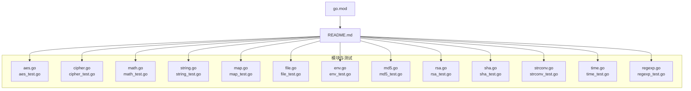
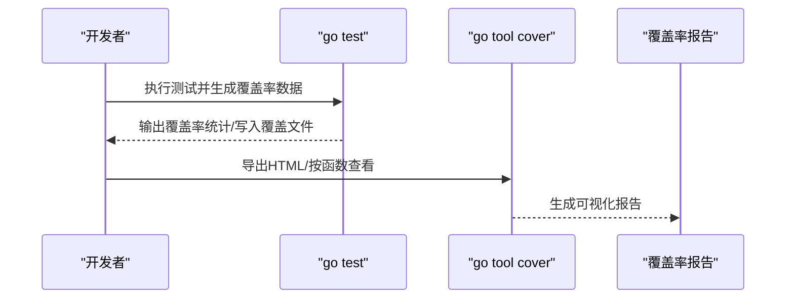

# 测试覆盖率

<cite>
**本文引用的文件**
- [README.md](file://README.md)
- [go.mod](file://go.mod)
- [aes_test.go](file://aes_test.go)
- [cipher_test.go](file://cipher_test.go)
- [math_test.go](file://math_test.go)
- [string_test.go](file://string_test.go)
- [map_test.go](file://map_test.go)
- [file_test.go](file://file_test.go)
- [env_test.go](file://env_test.go)
- [md5_test.go](file://md5_test.go)
- [rsa_test.go](file://rsa_test.go)
- [sha_test.go](file://sha_test.go)
- [strconv_test.go](file://strconv_test.go)
- [time_test.go](file://time_test.go)
- [regexp_test.go](file://regexp_test.go)
</cite>

## 目录

1. [简介](#简介)
2. [项目结构](#项目结构)
3. [核心组件](#核心组件)
4. [架构总览](#架构总览)
5. [详细组件分析](#详细组件分析)
6. [依赖关系分析](#依赖关系分析)
7. [性能考量](#性能考量)
8. [故障排查指南](#故障排查指南)
9. [结论](#结论)
10. [附录](#附录)

## 简介

本指南面向 Go Utils 库的测试覆盖率实践，系统讲解如何使用 go test -cover
生成覆盖率报告，理解语句覆盖率与分支覆盖率的差异与重要性，结合仓库现有测试用例进行覆盖率现状分析，提出提升覆盖率的策略与最佳实践，并给出在持续集成中设置覆盖率质量门禁的建议。

## 项目结构

仓库采用按功能模块划分的文件组织方式，每个功能模块通常对应一个源文件与其对应的测试文件。测试文件命名以 _test.go 结尾，便于
go test 自动发现与执行。根目录包含模块元信息与文档说明。

图表来源

- [README.md](file://README.md#L1-L80)
- [go.mod](file://go.mod#L1-L4)

章节来源

- [README.md](file://README.md#L1-L80)
- [go.mod](file://go.mod#L1-L4)

## 核心组件

- 测试框架与命令
    - go test：执行测试，支持 -cover 输出覆盖率统计。
    - go test -coverpkg：限定覆盖率统计范围至特定包。
    - go test -coverprofile：输出覆盖率数据到文件，供后续分析。
    - go tool cover -html/-func/-mode：将覆盖率数据可视化为 HTML 或按函数/行展示。
- 覆盖率指标
    - 语句覆盖率：被至少执行一次的源码行占比。
    - 分支覆盖率：被至少执行一次的判定分支（if/else、switch-case、短路运算等）占比。
    - 函数覆盖率：被至少调用一次的函数占比。
    - 行覆盖率：与语句覆盖率类似，常混用。
- 报告解读
    - 通过 go tool cover -func 可查看每个文件的覆盖率百分比。
    - 通过 go tool cover -html 可查看源码行的覆盖状态（已覆盖/未覆盖）。
    - 结合 -coverpkg 可聚焦到具体模块或子系统。

章节来源

- [README.md](file://README.md#L1-L80)

## 架构总览

下图展示了测试执行与覆盖率生成的整体流程，从 go test 到覆盖率数据文件，再到可视化报告。

图表来源

- [README.md](file://README.md#L1-L80)

## 详细组件分析

本节基于现有测试文件，逐项说明各模块的测试覆盖现状与改进建议，重点围绕覆盖率指标、未覆盖分支与边缘场景的补充策略。

### AES 与 Cipher 加解密

- 现状
    - 测试覆盖多种模式（CBC/ECB/CTR/CFB/OBF）与填充方式，验证加解密一致性。
    - 包含固定 IV 与随机 IV 的场景。
- 覆盖率关注点
    - 语句覆盖率：高，涉及加密/解密主流程。
    - 分支覆盖率：需确认错误路径（如非法 key 长度、解密失败、编码/解码异常）是否被覆盖。
- 提升建议
    - 增加对错误输入（空 key、非法 IV、损坏密文）的断言与错误返回路径测试。
    - 针对不同填充/编码组合增加边界用例，确保每种分支均被执行。

章节来源

- [aes_test.go](file://aes_test.go#L1-L148)
- [cipher_test.go](file://cipher_test.go#L1-L62)

### 字符串处理

- 现状
    - 覆盖替换、截取、反转、随机字符串生成、唯一 ID 生成等。
    - 包含模糊测试（Fuzz）与基准测试（Benchmark）。
- 覆盖率关注点
    - 语句覆盖率：高。
    - 分支覆盖率：需检查空字符串、超长字符串、UTF-8 边界、并发生成等路径。
- 提升建议
    - 针对空/极值长度字符串补充断言。
    - 在并发场景下增加竞态检测与稳定性验证。

章节来源

- [string_test.go](file://string_test.go#L1-L292)

### 数学与随机数

- 现状
    - 覆盖随机数生成、四舍五入等。
    - 包含并发与基准测试。
- 覆盖率关注点
    - 语句覆盖率：高。
    - 分支覆盖率：需覆盖 min/max 交换、边界精度等。
- 提升建议
    - 增加 min > max 的边界用例，验证内部交换逻辑。
    - 针对精度为负的场景补充断言。

章节来源

- [math_test.go](file://math_test.go#L1-L123)

### 映射与集合操作

- 现状
    - 覆盖键值提取、差集、交集、过滤、范围遍历等。
- 覆盖率关注点
    - 语句覆盖率：高。
    - 分支覆盖率：需覆盖空映射、无交集/差集等边界。
- 提升建议
    - 增加空映射与全量相等/不相等的用例，确保分支覆盖。

章节来源

- [map_test.go](file://map_test.go#L1-L319)

### 文件与 I/O

- 现状
    - 覆盖文件查找、存在性、复制、扫描、逐行读取、批量读取、写入（含缓冲）等。
- 覆盖率关注点
    - 语句覆盖率：高。
    - 分支覆盖率：需覆盖权限不足、路径不存在、正则错误、写入并发冲突等。
- 提升建议
    - 增加异常路径测试（如打开只读文件写入、权限不足、并发写入竞争）。
    - 针对错误的正则表达式与空文件场景补充断言。

章节来源

- [file_test.go](file://file_test.go#L1-L680)

### 环境变量

- 现状
    - 覆盖环境变量读取与默认值处理。
- 覆盖率关注点
    - 语句覆盖率：高。
    - 分支覆盖率：默认值选择逻辑。
- 提升建议
    - 增加空键、空默认值列表等边界用例。

章节来源

- [env_test.go](file://env_test.go#L1-L28)

### 哈希算法

- 现状
    - 覆盖 MD5、SHA1、SHA256、SHA512。
- 覆盖率关注点
    - 语句覆盖率：高。
    - 分支覆盖率：哈希计算内部逻辑。
- 提升建议
    - 增加空字符串与超长字符串用例，确保边界行为稳定。

章节来源

- [md5_test.go](file://md5_test.go#L1-L28)
- [sha_test.go](file://sha_test.go#L1-L70)

### 类型转换

- 现状
    - 覆盖字符串到整数/浮点的转换，含非法输入。
- 覆盖率关注点
    - 语句覆盖率：高。
    - 分支覆盖率：非法输入与空字符串的处理。
- 提升建议
    - 增加更多非法格式与边界值用例。

章节来源

- [strconv_test.go](file://strconv_test.go#L1-L145)

### 时间与日期

- 现状
    - 覆盖月份天数、时间解析、格式化、比较、差值等。
- 覆盖率关注点
    - 语句覆盖率：高。
    - 分支覆盖率：闰年、时区、纳秒/微秒/毫秒精度、边界时间等。
- 提升建议
    - 增加跨年、跨时区、极端纳秒值等用例。

章节来源

- [time_test.go](file://time_test.go#L1-L299)

### 正则校验

- 现状
    - 覆盖金额、邮箱、字母数字、手机号、电话、QQ、时间、域、密码、账号等规则校验。
- 覆盖率关注点
    - 语句覆盖率：高。
    - 分支覆盖率：大量 if/else 分支与正则匹配，需确保“合法/非法”两类用例齐全。
- 提升建议
    - 补充更多非法格式与边界字符组合，确保每个判定分支都被覆盖。

章节来源

- [regexp_test.go](file://regexp_test.go#L1-L744)

## 依赖关系分析

- 模块依赖
    - go.mod 指定 Go 版本为 1.22，测试使用标准库 testing、crypto、os 等。
- 测试耦合
    - 多个测试文件依赖 utils 包导出的函数与常量，形成对核心库的强依赖。
- 质量门禁建议
    - 在 CI 中设置覆盖率阈值（如语句覆盖率≥80%，分支覆盖率≥60%），未达标则阻断合并。

章节来源

- [go.mod](file://go.mod#L1-L4)

## 性能考量

- 基准测试（Benchmark）
    - 已在字符串、文件、数学等模块提供基准测试样例，可用于评估性能回归。
- 并发测试
    - 已在字符串与文件模块体现并发写入/读取场景，有助于发现竞态与性能瓶颈。
- 建议
    - 为关键路径补充基准测试，定期在 CI 中对比覆盖率与性能变化。

[本节为通用指导，无需列出具体文件来源]

## 故障排查指南

- 常见问题
    - 覆盖率报告为空或为 0：检查是否正确使用 -coverpkg 或 -coverprofile。
    - 分支未覆盖：针对错误路径补充测试用例，确保 if/else/switch 分支均被执行。
    - 并发竞态：使用 go test -race 验证并发安全。
- 定位方法
    - 使用 go tool cover -html 生成 HTML 报告，定位未覆盖行。
    - 使用 go test -coverprofile 生成 .out 文件，再用 go tool cover -func 查看各文件覆盖率。

章节来源

- [README.md](file://README.md#L1-L80)

## 结论

当前仓库在多数模块具备良好的测试覆盖，尤其在字符串、文件、正则校验等方面覆盖全面。建议进一步完善错误路径与边界场景的测试，提升分支覆盖率，并在
CI 中引入覆盖率质量门禁，持续保障代码质量与可维护性。

[本节为总结性内容，无需列出具体文件来源]

## 附录

- 快速开始
    - 生成覆盖率统计：go test ./... -cover
    - 生成覆盖率文件：go test ./... -coverprofile=coverage.out
    - 生成 HTML 报告：go tool cover -html=coverage.out -o coverage.html
- 质量门禁建议
    - 设置语句覆盖率阈值（如 ≥80%）、分支覆盖率阈值（如 ≥60%）。
    - 在 PR 中显示覆盖率变化，未达标禁止合并。

章节来源

- [README.md](file://README.md#L1-L80)