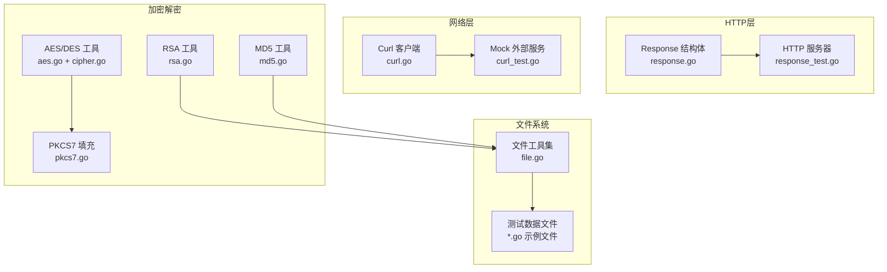
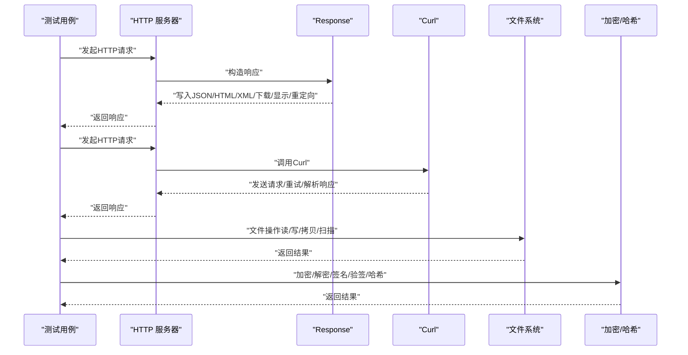
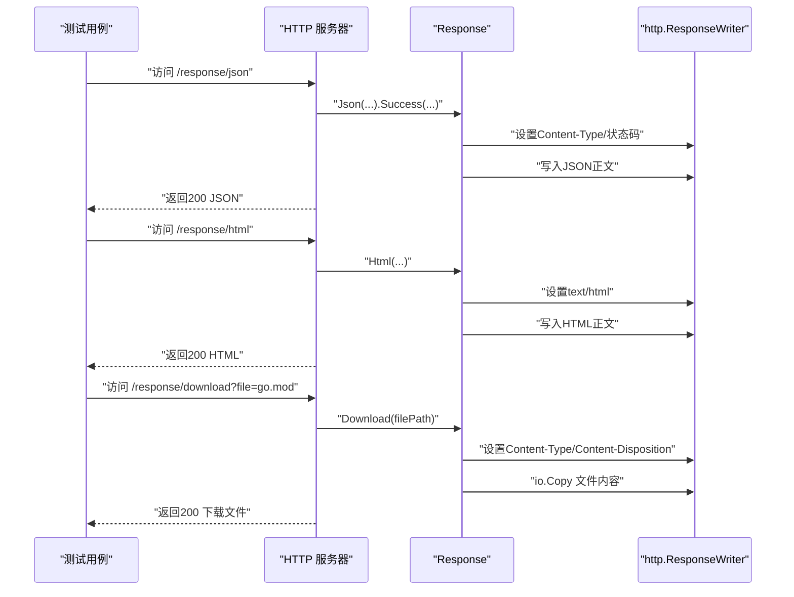
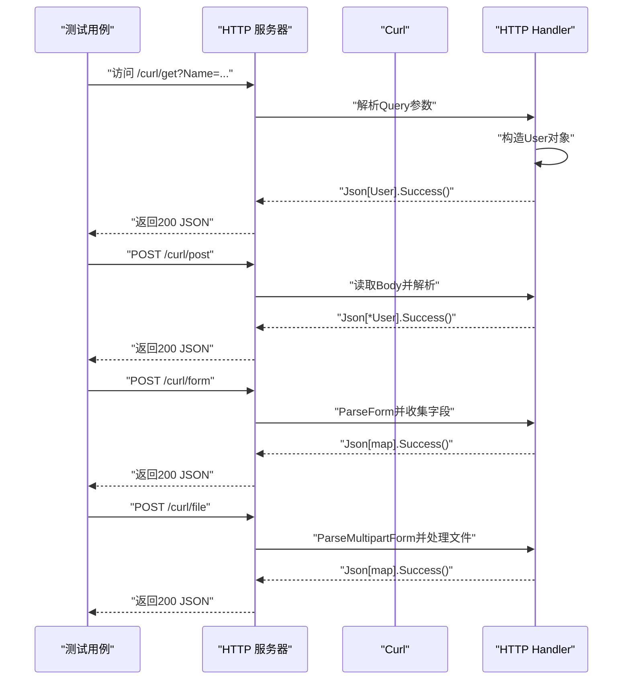
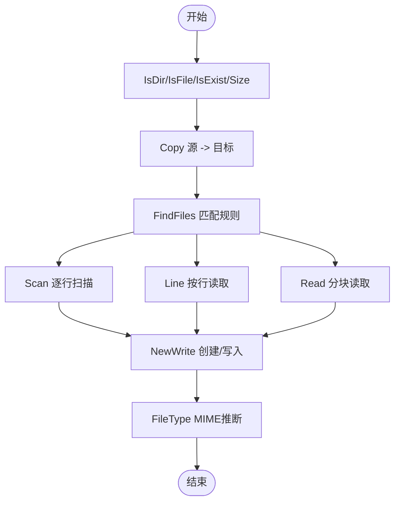
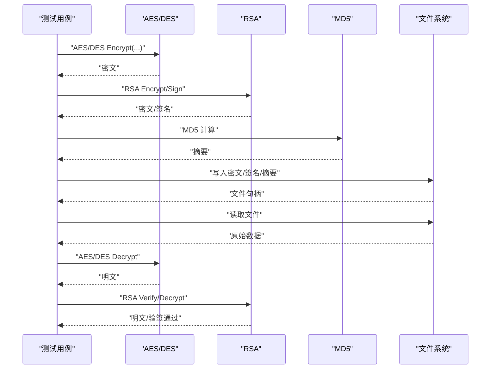
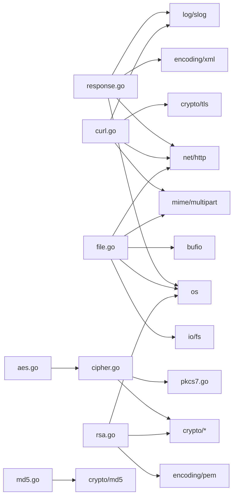

# 集成测试

<cite>
**本文引用的文件**
- [go.mod](file://go.mod)
- [README.md](file://README.md)
- [response.go](file://response.go)
- [response_test.go](file://response_test.go)
- [curl.go](file://curl.go)
- [curl_test.go](file://curl_test.go)
- [file.go](file://file.go)
- [file_test.go](file://file_test.go)
- [aes.go](file://aes.go)
- [aes_test.go](file://aes_test.go)
- [cipher.go](file://cipher.go)
- [pkcs7.go](file://pkcs7.go)
- [rsa.go](file://rsa.go)
- [rsa_test.go](file://rsa_test.go)
- [md5.go](file://md5.go)
- [md5_test.go](file://md5_test.go)
- [types.go](file://types.go)
- [consts.go](file://consts.go)
</cite>

## 目录

1. [简介](#简介)
2. [项目结构](#项目结构)
3. [核心组件](#核心组件)
4. [架构总览](#架构总览)
5. [组件详解](#组件详解)
6. [依赖关系分析](#依赖关系分析)
7. [性能考量](#性能考量)
8. [故障排查指南](#故障排查指南)
9. [结论](#结论)
10. [附录](#附录)

## 简介

本指南面向Go Utils库的集成测试实践，聚焦于模块间协作与端到端流程验证。文档覆盖以下主题：

- HTTP服务器集成测试：Response结构体与实际HTTP服务器的交互验证
- 文件系统集成测试：文件操作与真实文件系统的交互验证
- 网络请求集成测试：Curl功能与外部服务的交互验证
- 跨模块功能集成：加密解密与文件处理的组合使用测试
- 测试环境搭建与测试数据准备
- 测试隔离与依赖管理最佳实践

## 项目结构

仓库采用按功能域划分的文件组织方式，核心模块包括：

- HTTP响应封装与输出：response.go
- 网络请求客户端：curl.go
- 文件系统工具：file.go
- 对称加密（AES/DES）与填充：aes.go、cipher.go、pkcs7.go
- 非对称加密（RSA）：rsa.go
- 哈希工具：md5.go
- 类型与常量定义：types.go、consts.go
- 测试文件：各模块对应的_test.go文件

图表来源

- [response.go](file://response.go#L1-L342)
- [response_test.go](file://response_test.go#L1-L82)
- [curl.go](file://curl.go#L1-L1058)
- [curl_test.go](file://curl_test.go#L1-L724)
- [file.go](file://file.go#L1-L451)
- [aes.go](file://aes.go#L1-L23)
- [cipher.go](file://cipher.go#L1-L498)
- [pkcs7.go](file://pkcs7.go#L1-L31)
- [rsa.go](file://rsa.go#L1-L527)
- [md5.go](file://md5.go#L1-L13)

章节来源

- [go.mod](file://go.mod#L1-L4)
- [README.md](file://README.md#L1-L3892)

## 核心组件

- Response：封装统一响应结构体与多种输出能力（JSON、HTML、XML、文本、下载、显示、重定向），并与http.ResponseWriter交互。
- Curl：基于net/http的HTTP客户端，支持请求头、参数、Cookie、Basic认证、代理、TLS、重试、日志与回调钩子。
- 文件工具：目录/文件检测、拷贝、扫描读取、写入缓冲、文件类型推断等。
- 加密工具：对称加密（AES/DES，含多种模式与填充）、非对称加密（RSA，含PKCS1v15/OAEP/PSS）、MD5。
- 类型与常量：加密模式、单位常量、回调函数类型别名。

章节来源

- [response.go](file://response.go#L11-L342)
- [curl.go](file://curl.go#L21-L84)
- [file.go](file://file.go#L21-L451)
- [aes.go](file://aes.go#L8-L23)
- [cipher.go](file://cipher.go#L20-L498)
- [rsa.go](file://rsa.go#L18-L527)
- [md5.go](file://md5.go#L8-L13)
- [types.go](file://types.go#L44-L98)
- [consts.go](file://consts.go#L3-L22)

## 架构总览

集成测试围绕“测试服务器 + 被测模块”的模式展开：

- HTTP集成：通过内置HTTP服务器模拟真实场景，验证Response的输出行为（JSON/HTML/XML/下载/显示/重定向）。
- 网络集成：通过内置HTTP服务器作为外部服务，验证Curl的请求构建、参数传递、响应解析、状态码处理与重试机制。
- 文件系统集成：通过真实文件系统进行文件读写、拷贝、扫描与类型推断，验证并发写入与缓冲策略。
- 加密集成：结合文件系统与网络请求，验证加密/解密与签名/验签在端到端流程中的正确性。

图表来源

- [response_test.go](file://response_test.go#L16-L81)
- [curl_test.go](file://curl_test.go#L38-L724)
- [file_test.go](file://file_test.go#L13-L680)
- [aes_test.go](file://aes_test.go#L10-L148)
- [rsa_test.go](file://rsa_test.go#L22-L270)
- [md5_test.go](file://md5_test.go#L8-L28)

## 组件详解

### HTTP服务器集成测试（Response）

目标：验证Response在真实HTTP服务器中的输出行为，包括JSON、HTML、XML、文本、下载、显示、重定向等。

- 测试策略
    - 启动内置HTTP服务器，注册多条路由，分别触发不同Response输出。
    - 使用真实http.ResponseWriter与Response交互，验证状态码、头信息、正文内容与下载/显示行为。
    - 使用信号控制服务器生命周期，确保测试结束后优雅关闭。

- 关键流程
    - JSON响应：Success/Fail统一结构体输出，校验JSON字段与状态码。
    - HTML/XML/Text：校验Content-Type与正文内容。
    - 下载/显示：校验Content-Type推断、文件存在性、Content-Disposition头。
    - 重定向：校验Location头与状态码。

图表来源

- [response_test.go](file://response_test.go#L16-L81)
- [response.go](file://response.go#L29-L342)

章节来源

- [response_test.go](file://response_test.go#L51-L82)
- [response.go](file://response.go#L29-L342)

### 网络请求集成测试（Curl）

目标：验证Curl与外部服务的交互，包括GET/POST/FORM/FILE上传、参数与Body、状态码处理、重试与日志。

- 测试策略
    - 启动内置HTTP服务器，注册多条路由，分别处理GET/POST/FORM/FILE。
    - 使用Curl发送请求，设置Header、参数、Body、Cookie、Basic认证、代理、TLS等。
    - 通过Resolve回调解析响应体，SetStatusCode允许非200状态码视为成功。
    - 验证重试机制、日志输出、请求ID、Dump模式。

- 关键流程
    - GET：UrlPath拼接参数，SetParam批量设置，Resolve解析JSON。
    - POST：SetBodyBytes设置JSON Body，SetContentType设置application/json。
    - FORM：SetParams/AddParams设置表单参数，PostForm提交。
    - FILE：Form构造multipart表单，SetBody与SetContentType提交。

图表来源

- [curl_test.go](file://curl_test.go#L38-L724)
- [curl.go](file://curl.go#L435-L772)

章节来源

- [curl_test.go](file://curl_test.go#L38-L724)
- [curl.go](file://curl.go#L435-L772)

### 文件系统集成测试（file.go）

目标：验证文件系统操作在真实环境中的行为，包括目录/文件检测、拷贝、扫描读取、写入缓冲、类型推断与并发写入。

- 测试策略
    - 使用真实文件路径与临时目录进行测试，避免mock带来的行为偏差。
    - 验证FindFiles的多种匹配模式（前缀/后缀/正则/精确）。
    - 验证Scan/Line/Read三种读取方式的性能与边界条件。
    - 验证NewWrite的创建目录、权限、追加/覆盖模式与并发写入安全性。
    - 验证FileType的MIME推断与文件指针复位。

- 关键流程
    - FindFiles：深度/非深度遍历，匹配规则校验与错误处理。
    - 读取：Scan逐行扫描，Line按行读取，Read分块读取。
    - 写入：NewWrite创建目录与文件，Write/WriteString/WriteBuf三种写入方式，同步与并发写入。
    - 类型：FileType通过扩展名与内容探测推断MIME。

图表来源

- [file.go](file://file.go#L21-L451)
- [file_test.go](file://file_test.go#L13-L680)

章节来源

- [file.go](file://file.go#L21-L451)
- [file_test.go](file://file_test.go#L13-L680)

### 加密解密与文件处理组合测试

目标：验证加密/解密与文件处理在端到端流程中的协同工作，包括对称加密（AES/DES）与填充、非对称加密（RSA）与签名/验签、哈希（MD5）。

- 测试策略
    - 对称加密：AES/DES多种模式（ECB/CBC/CTR/CFB/OFB）与PKCS7填充，验证加密/解密一致性与随机IV。
    - 非对称加密：RSA密钥生成、公钥加密/私钥解密（PKCS1v15/OAEP）、私钥签名/公钥验签（PKCS1v15/PSS），验证编码/解码。
    - 哈希：MD5计算与断言。
    - 组合：将加密结果写入文件，再从文件读取进行解密/验签，验证端到端正确性。

图表来源

- [aes_test.go](file://aes_test.go#L10-L148)
- [cipher.go](file://cipher.go#L20-L498)
- [pkcs7.go](file://pkcs7.go#L8-L31)
- [rsa_test.go](file://rsa_test.go#L56-L270)
- [rsa.go](file://rsa.go#L18-L527)
- [md5_test.go](file://md5_test.go#L8-L28)
- [md5.go](file://md5.go#L8-L13)
- [file.go](file://file.go#L311-L395)

章节来源

- [aes_test.go](file://aes_test.go#L10-L148)
- [cipher.go](file://cipher.go#L20-L498)
- [pkcs7.go](file://pkcs7.go#L8-L31)
- [rsa_test.go](file://rsa_test.go#L56-L270)
- [rsa.go](file://rsa.go#L18-L527)
- [md5_test.go](file://md5_test.go#L8-L28)
- [md5.go](file://md5.go#L8-L13)
- [file.go](file://file.go#L311-L395)

## 依赖关系分析

- 模块耦合
    - Response依赖http、os、encoding/xml、log/slog，与HTTP服务器紧密耦合。
    - Curl依赖net/http、mime/multipart、crypto/tls、log/slog、httputil，与外部服务交互。
    - 文件工具依赖os、io/fs、mime、net/http、bufio等标准库。
    - 加密工具依赖crypto/*与自定义填充函数，与文件工具存在组合关系。
- 外部依赖
    - go.mod声明Go版本要求与模块元信息。
- 潜在循环依赖
    - 当前文件结构清晰，未发现直接循环依赖；若引入全局状态或共享资源，需谨慎设计。

图表来源

- [response.go](file://response.go#L3-L9)
- [curl.go](file://curl.go#L3-L19)
- [file.go](file://file.go#L3-L16)
- [aes.go](file://aes.go#L3-L6)
- [cipher.go](file://cipher.go#L3-L8)
- [pkcs7.go](file://pkcs7.go#L3-L6)
- [rsa.go](file://rsa.go#L3-L16)
- [md5.go](file://md5.go#L3-L6)

章节来源

- [go.mod](file://go.mod#L1-L4)
- [response.go](file://response.go#L3-L9)
- [curl.go](file://curl.go#L3-L19)
- [file.go](file://file.go#L3-L16)
- [aes.go](file://aes.go#L3-L6)
- [cipher.go](file://cipher.go#L3-L8)
- [pkcs7.go](file://pkcs7.go#L3-L6)
- [rsa.go](file://rsa.go#L3-L16)
- [md5.go](file://md5.go#L3-L6)

## 性能考量

- 文件读写
    - 使用bufio.Writer与WriteBuf提升写入性能，适合大文件与高并发写入。
    - Scan/Line/Read针对不同场景优化：逐行扫描、按行读取、分块读取。
- 网络请求
    - 合理设置超时与重试次数，避免长时间阻塞。
    - 使用httputil.DumpRequestOut/DumpResponse仅在调试阶段启用，避免影响性能。
- 加密
    - 对称加密建议使用合适模式与填充，避免不必要的内存拷贝。
    - 非对称加密涉及大数运算，注意批处理与缓存公私钥。

## 故障排查指南

- HTTP响应问题
    - 检查Content-Type设置与状态码，确认Write调用顺序与错误日志。
    - 下载/显示失败时检查文件路径、Stat与MIME推断。
- Curl请求问题
    - 确认Header、Cookie、Basic认证、代理、TLS配置正确。
    - 使用SetDefLogOutput与SetDump输出详细日志，定位请求/响应细节。
    - 非200状态码需通过SetStatusCode显式允许。
- 文件系统问题
    - 权限不足导致创建/写入失败，检查目录权限与文件权限。
    - 并发写入冲突，使用互斥锁或顺序写入。
- 加密问题
    - 对称加密密钥长度与IV长度需满足算法要求。
    - 非对称加密公私钥格式与PEM头尾处理需一致。

章节来源

- [response.go](file://response.go#L254-L269)
- [curl.go](file://curl.go#L440-L772)
- [file.go](file://file.go#L311-L395)
- [cipher.go](file://cipher.go#L42-L99)

## 结论

通过上述集成测试实践，能够有效验证Go
Utils库在真实环境中的模块协作与端到端流程。HTTP服务器集成测试确保Response输出的正确性；网络请求集成测试覆盖Curl的多种使用场景；文件系统集成测试验证真实文件系统的稳定性与性能；加密解密与文件处理的组合测试则保证了安全与可靠性。配合合理的测试环境与隔离策略，可显著提升代码质量与交付稳定性。

## 附录

- 测试环境搭建
    - 使用内置HTTP服务器模拟外部服务，便于在无网络环境下进行集成测试。
    - 使用临时目录与测试文件，避免污染真实文件系统。
- 测试数据准备
    - 准备多种类型的测试文件（文本、二进制、JSON等），覆盖不同读取与写入场景。
    - 生成RSA密钥对，准备加密/签名测试数据。
- 测试隔离与依赖管理
    - 使用信号控制服务器生命周期，确保测试结束后释放资源。
    - 对共享资源（如文件、网络端口）进行唯一命名与清理。
    - 通过go test的-bench选项评估性能瓶颈，持续优化。