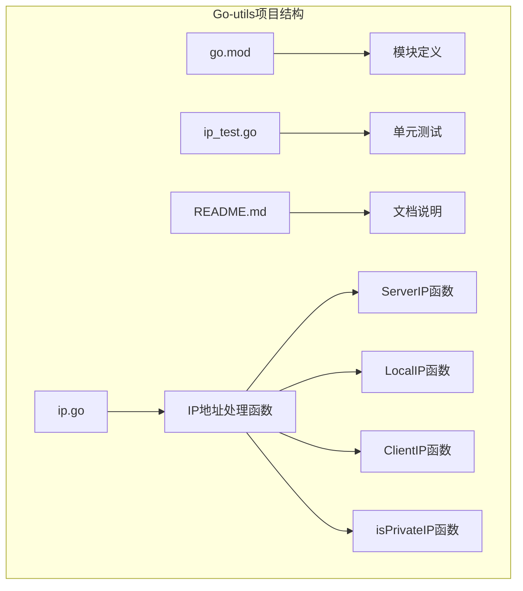
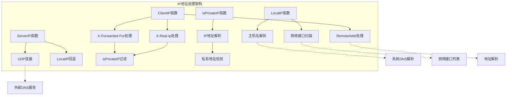
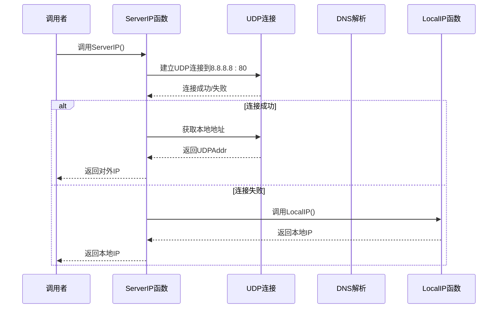
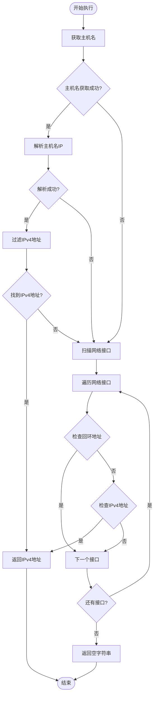
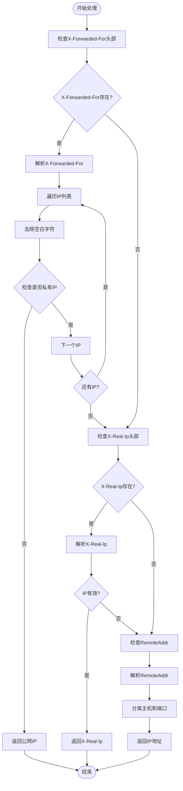
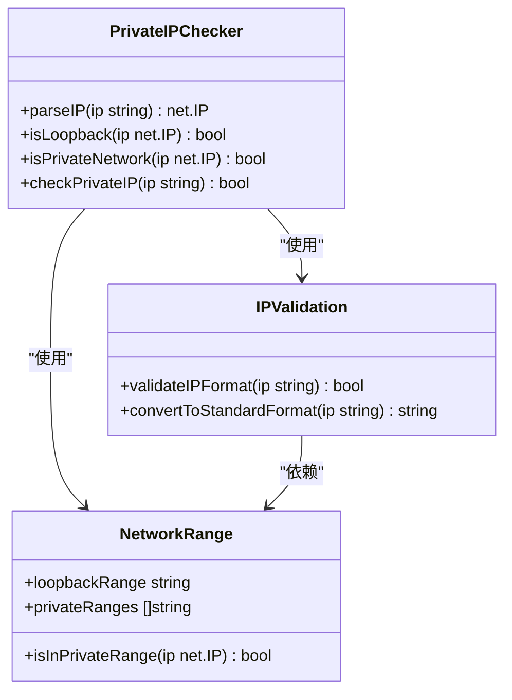
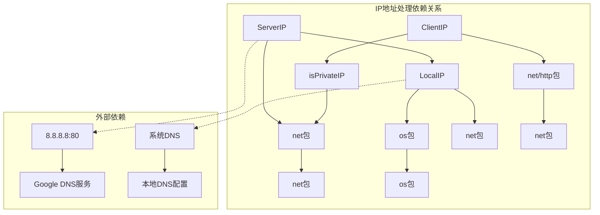
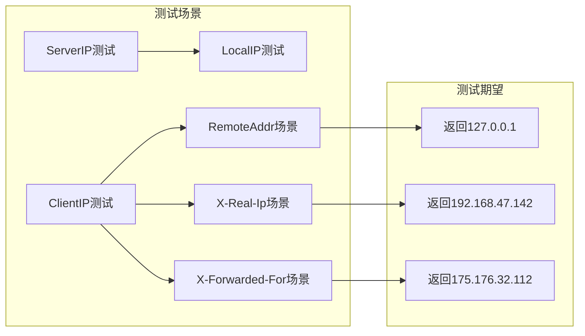

# IP地址处理

<cite>
**本文档引用的文件**
- [ip.go](file://ip.go)
- [ip_test.go](file://ip_test.go)
- [README.md](file://README.md)
- [go.mod](file://go.mod)
</cite>

## 目录

1. [简介](#简介)
2. [项目结构](#项目结构)
3. [核心组件](#核心组件)
4. [架构概览](#架构概览)
5. [详细组件分析](#详细组件分析)
6. [依赖关系分析](#依赖关系分析)
7. [性能考虑](#性能考虑)
8. [故障排除指南](#故障排除指南)
9. [结论](#结论)

## 简介

本文档详细介绍Go-utils库中的IP地址处理功能，包括服务器对外IP获取、本地IP地址获取、客户端IP地址提取以及私有IP地址检测等核心功能。这些功能在Web应用开发中至关重要，特别是在需要准确识别用户真实IP地址和服务器网络状态的场景中。

## 项目结构

Go-utils是一个Go语言工具库项目，专注于提供各种实用的功能函数。该项目采用简洁的模块化设计，每个功能模块独立封装，便于单独使用和维护。

**图表来源**

- [go.mod](file://go.mod#L1-L4)
- [ip.go](file://ip.go#L1-L89)

**章节来源**

- [go.mod](file://go.mod#L1-L4)
- [README.md](file://README.md#L1-L50)

## 核心组件

Go-utils库中的IP地址处理功能由四个主要函数组成，每个函数都有特定的职责和应用场景：

### ServerIP() - 服务器对外IP获取

- **功能**：获取服务器对外可访问的IP地址
- **实现原理**：通过UDP连接到外部服务（如8.8.8.8:80）来确定出站IP地址
- **回退机制**：当UDP连接失败时，自动切换到LocalIP()函数

### LocalIP() - 本地IP地址获取

- **功能**：获取服务器本地网络接口的IP地址
- **实现策略**：提供两种获取方式
    1. 通过主机名解析获取IP地址
    2. 通过网络接口地址获取IP地址
- **优先级**：IPv4地址优先，过滤回环地址

### ClientIP() - 客户端真实IP提取

- **功能**：从HTTP请求中提取客户端真实IP地址
- **处理逻辑**：按照X-Forwarded-For → X-Real-Ip → RemoteAddr的顺序处理
- **智能过滤**：自动过滤私有IP地址，优先返回公网IP

### isPrivateIP() - 私有IP地址检测

- **功能**：判断IP地址是否为私有地址
- **检测范围**：支持回环地址和私有网络地址检测
- **应用场景**：客户端IP提取过程中的关键过滤步骤

**章节来源**

- [ip.go](file://ip.go#L11-L88)

## 架构概览

IP地址处理功能采用分层架构设计，每个函数都有明确的职责边界和清晰的调用关系。

**图表来源**

- [ip.go](file://ip.go#L11-L88)

## 详细组件分析

### ServerIP() 函数实现分析

ServerIP()函数通过主动建立UDP连接来确定服务器的对外IP地址，这是网络编程中的经典技术。

**图表来源**

- [ip.go](file://ip.go#L12-L24)

#### 实现细节

- **超时控制**：使用5秒超时确保函数不会长时间阻塞
- **错误处理**：UDP连接失败时自动回退到LocalIP()函数
- **地址提取**：通过UDPAddr结构体的IP字段获取实际出站IP

**章节来源**

- [ip.go](file://ip.go#L11-L24)

### LocalIP() 函数实现分析

LocalIP()函数提供了双重IP地址获取策略，确保在不同环境下都能获得有效的IP地址。

**图表来源**

- [ip.go](file://ip.go#L26-L52)

#### 实现策略

1. **主机名解析优先**：尝试通过os.Hostname()获取主机名，然后进行DNS解析
2. **网络接口回退**：当主机名解析失败时，直接扫描系统网络接口
3. **地址过滤规则**：
    - 优先选择IPv4地址（To4() != nil）
    - 过滤回环地址（IsLoopback()）
    - 返回第一个符合条件的地址

**章节来源**

- [ip.go](file://ip.go#L26-L52)

### ClientIP() 函数实现分析

ClientIP()函数是IP地址处理中最复杂的函数，需要处理多种代理和负载均衡场景。

**图表来源**

- [ip.go](file://ip.go#L54-L82)

#### 处理逻辑详解

1. **X-Forwarded-For优先级**：这是最常用的代理IP传递头
    - 支持多个IP地址的逗号分隔列表
    - 从左到右遍历，优先返回第一个公网IP
    - 自动过滤私有IP地址

2. **X-Real-Ip次优级**：备用的代理IP传递头
    - 单个IP地址，支持逗号分隔的备用列表
    - 去除空白字符后验证有效性

3. **RemoteAddr最后选择**：直接来自客户端的连接地址
    - 格式通常为"IP:端口"
    - 如果解析失败，直接返回原始RemoteAddr

**章节来源**

- [ip.go](file://ip.go#L54-L82)

### isPrivateIP() 函数实现分析

isPrivateIP()函数是客户端IP提取过程中的关键过滤器，确保返回的是真实的公网IP地址。

**图表来源**

- [ip.go](file://ip.go#L84-L88)

#### 检测范围

- **回环地址检测**：127.0.0.0/8范围内的所有地址
- **私有网络检测**：标准私有网络范围
    - 10.0.0.0/8 (10.0.0.0 - 10.255.255.255)
    - 172.16.0.0/12 (172.16.0.0 - 172.31.255.255)
    - 192.168.0.0/16 (192.168.0.0 - 192.168.255.255)

**章节来源**

- [ip.go](file://ip.go#L84-L88)

## 依赖关系分析

IP地址处理功能之间的依赖关系相对简单，主要体现了功能的层次化设计。

**图表来源**

- [ip.go](file://ip.go#L3-L9)

### 内部依赖关系

- **ServerIP → LocalIP**：作为回退机制
- **ClientIP → isPrivateIP**：用于IP地址过滤
- **LocalIP → 系统API**：依赖操作系统网络接口

### 外部依赖关系

- **网络连接**：需要访问外部DNS服务
- **系统配置**：依赖操作系统的网络配置
- **时间限制**：UDP连接具有超时限制

**章节来源**

- [ip.go](file://ip.go#L1-L9)

## 性能考虑

### 时间复杂度分析

- **ServerIP()**：O(1) - 最多一次UDP连接尝试
- **LocalIP()**：O(n) - n为网络接口数量，通常很小
- **ClientIP()**：O(m) - m为X-Forwarded-For列表中的IP数量
- **isPrivateIP()**：O(1) - 固定的IP地址解析和检查

### 内存使用

- 所有函数都使用常量级别的内存分配
- ClientIP()函数在处理X-Forwarded-For时会临时存储IP列表

### 网络延迟优化

- ServerIP()函数设置了5秒超时，避免长时间阻塞
- LocalIP()函数的网络接口扫描通常很快完成

## 故障排除指南

### 常见问题及解决方案

#### ServerIP()返回空值

**可能原因**：

- 无法连接到外部DNS服务（防火墙或网络限制）
- DNS解析失败

**解决方案**：

- 检查网络连接和防火墙设置
- 确认8.8.8.8可达性
- 在测试环境中可以预期返回空值

#### LocalIP()返回空值

**可能原因**：

- 系统没有可用的IPv4网络接口
- 主机名解析失败且网络接口扫描异常

**解决方案**：

- 检查系统网络配置
- 确认至少有一个IPv4网络接口
- 验证系统DNS配置

#### ClientIP()返回代理IP而非真实IP

**可能原因**：

- 代理服务器配置不当
- X-Forwarded-For头部被恶意篡改

**解决方案**：

- 验证代理服务器配置
- 在可信网络范围内使用
- 考虑添加额外的安全检查

### 单元测试分析

项目提供了完整的单元测试，覆盖了主要的IP地址处理场景：

**图表来源**

- [ip_test.go](file://ip_test.go#L47-L86)

**章节来源**

- [ip_test.go](file://ip_test.go#L1-L87)

## 结论

Go-utils库中的IP地址处理功能提供了完整而实用的网络地址识别解决方案。通过精心设计的算法和错误处理机制，这些函数能够在各种网络环境中可靠地工作。

### 主要优势

1. **健壮性**：多重回退机制确保在不同环境下都能获得IP地址
2. **准确性**：智能的代理IP过滤确保返回真实的公网IP
3. **易用性**：简洁的API设计，易于集成到现有项目中
4. **可靠性**：完善的单元测试覆盖主要使用场景

### 应用建议

- 在生产环境中使用时，建议结合其他安全措施
- 对于高并发场景，注意网络连接的超时设置
- 定期测试网络连通性和代理配置
- 根据具体需求调整IP地址过滤策略

这些IP地址处理功能为Go语言开发者提供了可靠的网络地址识别工具，适用于Web应用、API服务、监控系统等各种应用场景。