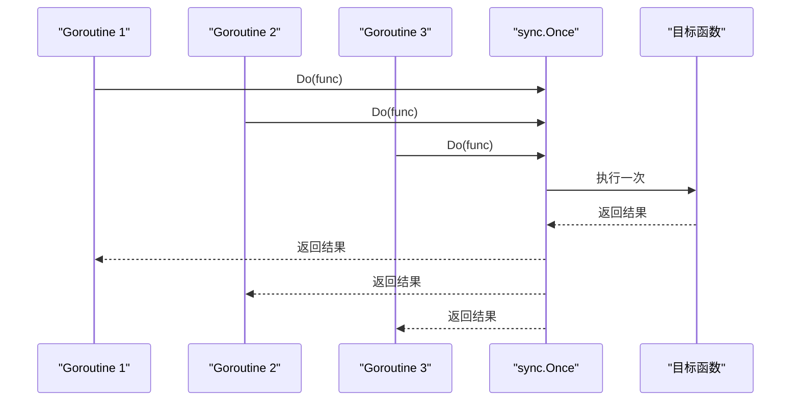
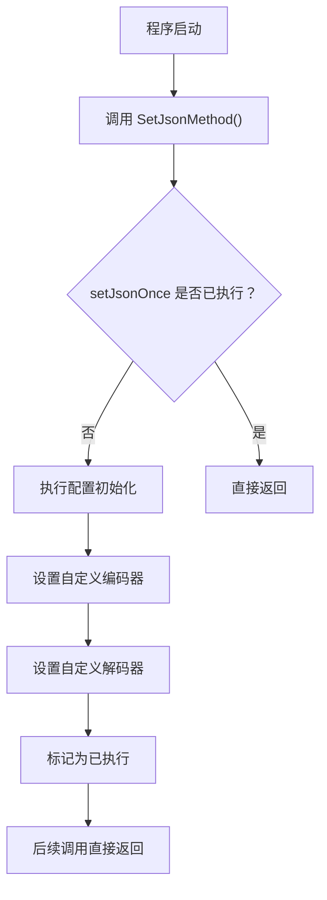
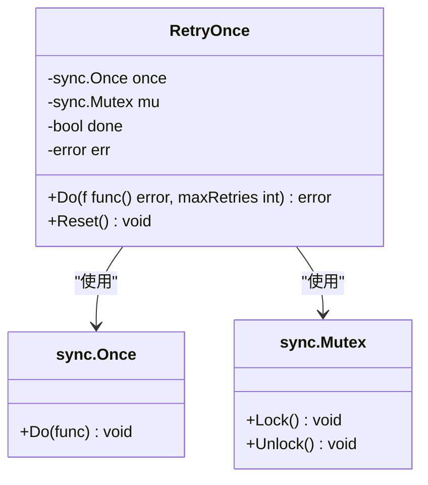
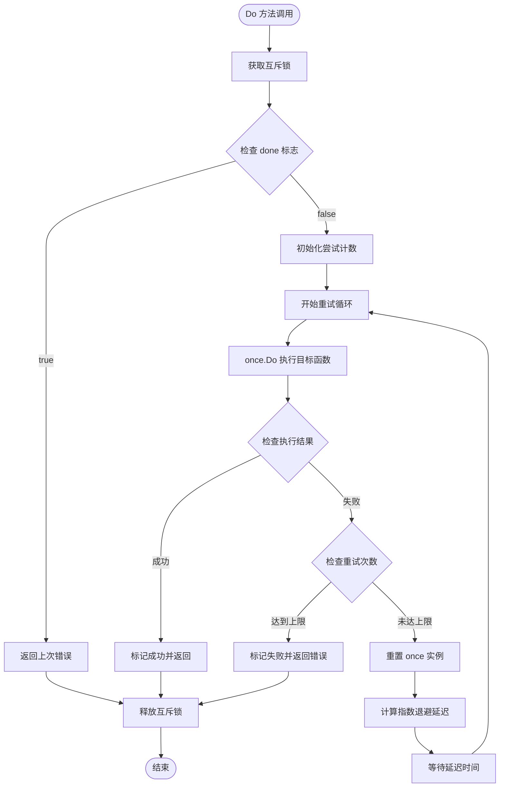
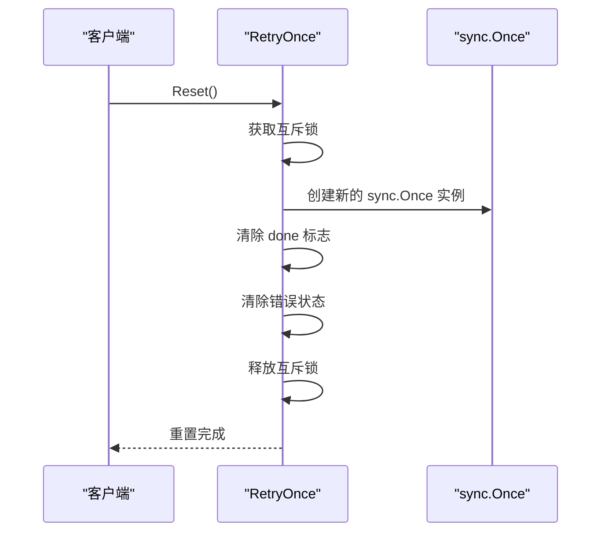
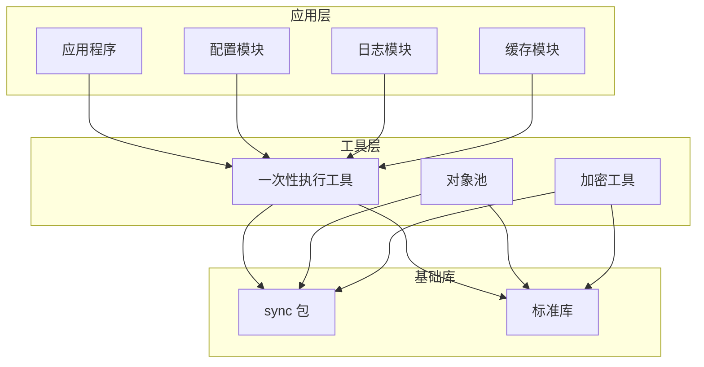
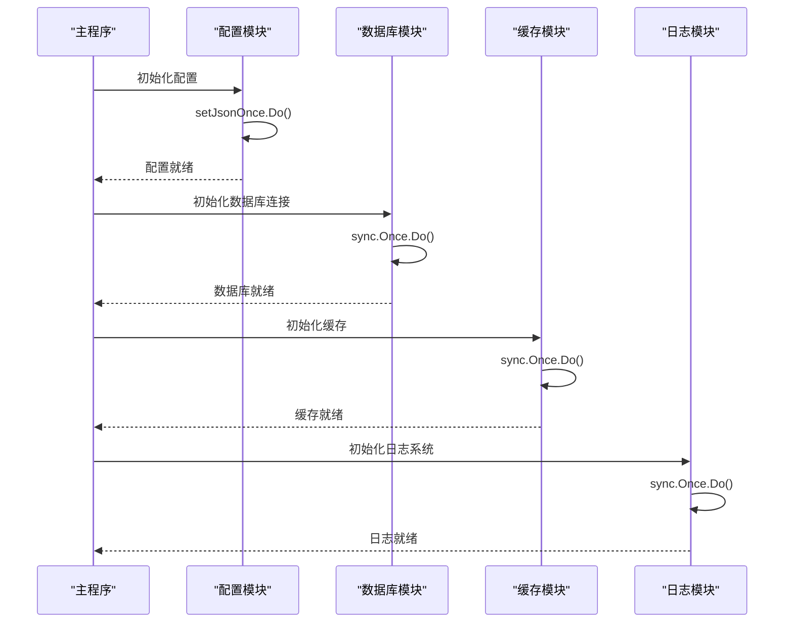
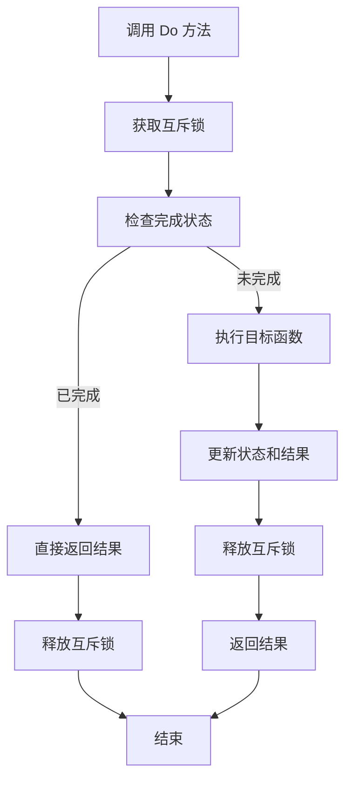
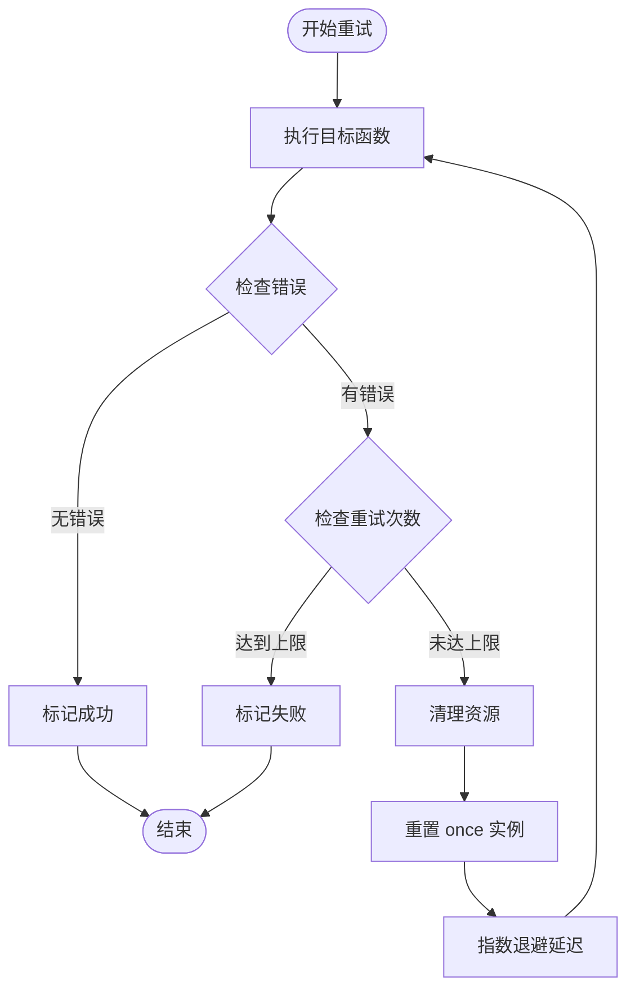
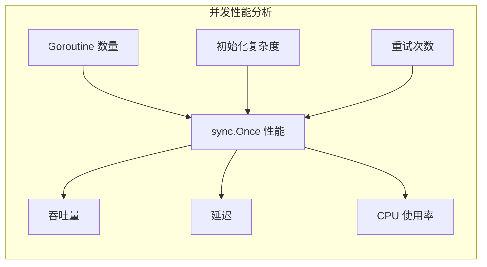

# 一次性执行

<cite>
**本文档引用的文件**
- [once.go](file://once.go)
- [json.go](file://json.go)
- [go.mod](file://go.mod)
- [README.md](file://README.md)
- [example_test.go](file://example_test.go)
</cite>

## 目录

1. [简介](#简介)
2. [核心概念](#核心概念)
3. [sync.Once 实现原理](#synconce-实现原理)
4. [项目中的使用案例](#项目中的使用案例)
5. [详细组件分析](#详细组件分析)
6. [架构设计](#架构设计)
7. [最佳实践](#最佳实践)
8. [常见误区与解决方案](#常见误区与解决方案)
9. [性能考虑](#性能考虑)
10. [故障排除指南](#故障排除指南)
11. [总结](#总结)

## 简介

一次性执行（Once-Only Execution）是并发编程中的一个重要概念，它确保某个操作在整个程序生命周期内只执行一次。在Go语言中，
`sync.Once`提供了这种保证，广泛应用于初始化过程、配置加载和资源管理等场景。

本项目通过两个核心组件展示了一次性执行的实际应用：

- `RetryOnce`：带重试机制的一次性执行器
- 全局JSON编解码器配置：标准的一次性执行模式

## 核心概念

### 什么是 sync.Once

`sync.Once`是Go标准库提供的并发原语，用于确保某个函数在程序执行期间只被执行一次。它的核心特性包括：

- **线程安全**：内部使用原子操作保证并发安全
- **幂等性**：多次调用不会产生副作用
- **内存可见性**：确保初始化操作对所有goroutine可见

### 基本工作原理



**图表来源**

- [once.go](file://once.go#L30-L50)
- [json.go](file://json.go#L40-L50)

## sync.Once 实现原理

### 底层机制

`sync.Once`内部使用一个布尔标志位和原子操作来实现线程安全的一次性执行。其核心逻辑如下：

1. **检查标志位**：读取内部的完成标志
2. **竞争执行**：多个goroutine同时尝试执行
3. **原子设置**：第一个成功执行的goroutine设置标志位
4. **阻塞等待**：其他goroutine等待标志位变为真

### 内存模型保证

Go语言的内存模型为`sync.Once`提供了以下保证：

- **初始化顺序**：初始化操作在所有goroutine看到结果之前完成
- **可见性**：初始化过程中修改的变量对后续访问可见
- **原子性**：标志位的检查和设置是原子操作

## 项目中的使用案例

### 1. 全局JSON编解码器配置

项目中最典型的一次性执行使用场景是在`json.go`中实现的全局JSON配置：



**图表来源**

- [json.go](file://json.go#L38-L50)

### 2. 带重试机制的一次性执行器

`RetryOnce`类提供了更复杂的一次性执行模式，支持最大重试次数：



**图表来源**

- [once.go](file://once.go#L9-L14)

## 详细组件分析

### RetryOnce 结构体

`RetryOnce`是一个复合结构，结合了`sync.Once`的线程安全性和自定义的状态管理：

#### 核心字段解析

| 字段名    | 类型           | 作用          | 线程安全性  |
|--------|--------------|-------------|--------|
| `once` | `sync.Once`  | 控制目标函数的唯一执行 | 内置线程安全 |
| `mu`   | `sync.Mutex` | 保护实例状态的互斥锁  | 手动管理   |
| `done` | `bool`       | 标记执行是否完成    | 需要互斥保护 |
| `err`  | `error`      | 存储最后一次执行的结果 | 需要互斥保护 |

#### Do 方法执行流程



**图表来源**

- [once.go](file://once.go#L30-L71)

### Reset 方法设计

`Reset`方法允许重新使用已经完成的`RetryOnce`实例：



**图表来源**

- [once.go](file://once.go#L73-L80)

## 架构设计

### 整体架构图



### 初始化流程设计



**图表来源**

- [json.go](file://json.go#L38-L50)
- [once.go](file://once.go#L30-L50)

## 最佳实践

### 1. 正确的初始化模式

#### 推荐模式

```go
// ✅ 正确：使用 sync.Once 进行初始化
var (
    dbConn *sql.DB
    once   sync.Once
)

func getDBConnection() *sql.DB {
    once.Do(func() {
        var err error
        dbConn, err = sql.Open("mysql", dsn)
        if err != nil {
            panic(err)
        }
    })
    return dbConn
}
```

#### 避免的模式

```go
// ❌ 错误：直接在每次调用时初始化
func getDBConnection() *sql.DB {
    // 每次调用都会创建新连接
    conn, _ := sql.Open("mysql", dsn)
    return conn
}
```

### 2. 错误处理策略

#### 一次性执行中的错误处理

```go
// ✅ 推荐：在一次性执行中正确处理错误
var (
    config *Config
    once   sync.Once
    err    error
)

once.Do(func() {
    config, err = loadConfig()
    if err != nil {
        return // 错误会在第一次调用时传播
    }
})

if err != nil {
    return nil, err
}
return config, nil
```

### 3. 状态管理最佳实践

#### 使用互斥锁保护状态



**图表来源**

- [once.go](file://once.go#L30-L50)

## 常见误区与解决方案

### 1. 忽视线程安全

#### 问题描述

在一次性执行中忘记使用互斥锁保护共享状态

#### 解决方案

```go
// ❌ 错误：缺少互斥锁保护
func (r *RetryOnce) Do(f func() error, maxRetries int) error {
    if r.done { // 竞态条件！
        return r.err
    }
    // ...
}

// ✅ 正确：使用互斥锁保护
func (r *RetryOnce) Do(f func() error, maxRetries int) error {
    r.mu.Lock()
    defer r.mu.Unlock()
    
    if r.done {
        return r.err
    }
    // ...
}
```

### 2. 错误重置策略

#### 问题描述

在重试失败后没有正确重置状态

#### 解决方案

```go
// ✅ 正确：在重试失败后重置 once 实例
for {
    r.once.Do(func() {
        r.err = f()
    })
    
    if r.err == nil {
        break
    }
    
    attempt++
    if attempt >= maxRetries {
        break
    }
    
    // 重置 once 实例以允许下一次重试
    r.once = sync.Once{}
    time.Sleep(calculateDelay(attempt))
}
```

### 3. 资源泄漏风险

#### 问题描述

在重试过程中没有正确清理资源

#### 解决方案



**图表来源**

- [once.go](file://once.go#L58-L65)

## 性能考虑

### 1. 内存开销

- `sync.Once`实例本身只包含一个原子标志位，内存开销极小
- 每个一次性执行器会额外占用互斥锁的内存空间
- 对于频繁使用的初始化场景，建议复用一次性执行器实例

### 2. 时间复杂度

- **首次执行**：O(1) + 初始化开销
- **后续执行**：O(1) - 直接返回结果
- **重试场景**：最坏情况下为 O(n) × 初始化开销

### 3. 并发性能



## 故障排除指南

### 1. 常见问题诊断

#### 问题：一次性执行没有生效

**可能原因**：

- 没有正确使用互斥锁保护状态
- 重试次数设置过低
- 目标函数返回的错误类型不正确

**解决方案**：

```go
// 检查互斥锁使用
func (r *RetryOnce) Do(f func() error, maxRetries int) error {
    r.mu.Lock()
    defer r.mu.Unlock()
    
    // 确保检查 done 标志
    if r.done {
        return r.err
    }
    
    // ... 执行逻辑
}
```

#### 问题：重试机制不工作

**可能原因**：

- 没有正确重置 `sync.Once` 实例
- 指数退避延迟计算错误
- 重试次数上限设置不当

**解决方案**：

```go
// 确保正确重置 once 实例
r.once = sync.Once{}
r.once.Do(func() {
    r.err = f()
})
```

### 2. 调试技巧

#### 启用详细日志

```go
// 在关键路径添加日志
func (r *RetryOnce) Do(f func() error, maxRetries int) error {
    log.Printf("开始重试执行，最大重试次数：%d", maxRetries)
    
    r.mu.Lock()
    defer r.mu.Unlock()
    
    if r.done {
        log.Printf("返回缓存结果：%v", r.err)
        return r.err
    }
    
    // ... 执行逻辑
}
```

## 总结

一次性执行是Go并发编程中的重要工具，它提供了简单而强大的初始化保证机制。通过本项目的两个核心组件，我们可以看到一次性执行在不同场景下的应用：

### 主要优势

1. **线程安全**：内置的原子操作保证并发安全
2. **性能优异**：后续调用几乎零开销
3. **使用简单**：API简洁明了，易于理解和使用
4. **内存高效**：极小的内存开销

### 适用场景

- **单例模式实现**：确保对象只创建一次
- **配置加载**：避免重复加载配置文件
- **资源初始化**：数据库连接、缓存等资源的初始化
- **日志系统配置**：统一的日志初始化
- **插件系统**：第三方库的初始化

### 设计要点

1. **正确使用互斥锁**：保护共享状态的访问
2. **合理的错误处理**：在一次性执行中妥善处理错误
3. **适当的重试策略**：平衡可靠性与性能
4. **资源清理**：确保重试失败时的资源清理

通过遵循这些最佳实践，开发者可以充分利用一次性执行的优势，在保证线程安全的同时获得优秀的性能表现。