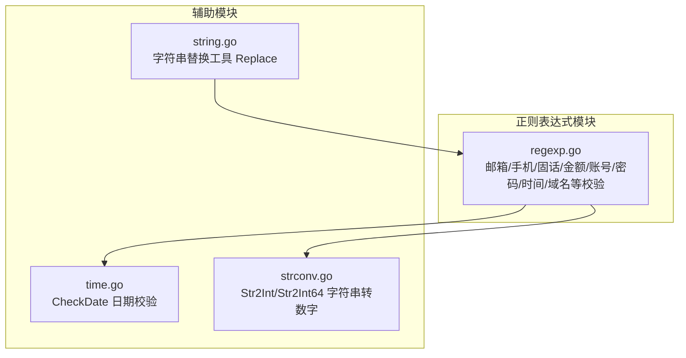
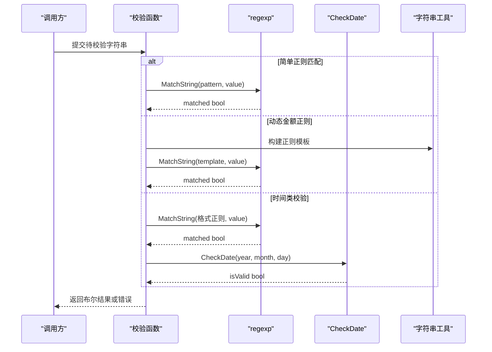
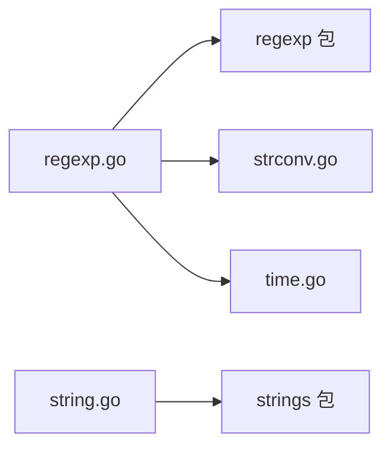

# 正则表达式处理

<cite>
**本文档引用的文件**
- [regexp.go](file://regexp.go)
- [regexp_test.go](file://regexp_test.go)
- [time.go](file://time.go)
- [strconv.go](file://strconv.go)
- [string.go](file://string.go)
- [README.md](file://README.md)
- [go.mod](file://go.mod)
</cite>

## 目录

1. [简介](#简介)
2. [项目结构](#项目结构)
3. [核心组件](#核心组件)
4. [架构总览](#架构总览)
5. [详细组件分析](#详细组件分析)
6. [依赖关系分析](#依赖关系分析)
7. [性能考量](#性能考量)
8. [故障排查指南](#故障排查指南)
9. [结论](#结论)
10. [附录](#附录)

## 简介

本文件聚焦于仓库中的正则表达式处理能力，系统梳理其编译、匹配与替换的实现方式，覆盖字符串验证、数据提取与文本处理等典型场景。文档同时提供性能优化建议、常见陷阱与最佳实践，并通过测试用例路径展示实际使用方法，便于读者快速上手与深度理解。

## 项目结构

该仓库采用“按功能域划分”的组织方式，正则表达式相关功能集中在单文件模块中，配合日期校验与字符串转换工具形成完整的输入校验与处理链路。

图表来源

- [regexp.go](file://regexp.go#L1-L299)
- [time.go](file://time.go#L84-L105)
- [strconv.go](file://strconv.go#L7-L18)
- [string.go](file://string.go#L22-L36)

章节来源

- [go.mod](file://go.mod#L1-L4)
- [README.md](file://README.md#L1-L800)

## 核心组件

- 邮箱验证：基于精确的本地部分与域名部分规则，支持多级域名与连字符、下划线等合法字符组合。
- 手机号码验证：针对中国大陆手机号码的严格前缀与长度约束。
- 固话验证：支持多种分段格式与横杠分隔。
- 金额验证：动态构造正则，支持有/无符号、小数位数控制。
- 字母/数字/中文/混合字符验证：覆盖英文字母、数字、中文汉字与特定符号集合。
- 域名验证：支持可选协议头与多级域名，限制长度与字符集。
- 时间格式验证：月格式与日格式，包含分隔符一致性与日期有效性双重校验。
- 账号/密码策略：长度约束、字符集限制、强度要求（大小写/数字/特殊字符）。
- 符号检测：识别各类标点、分隔符与符号类别。

章节来源

- [regexp.go](file://regexp.go#L25-L298)

## 架构总览

正则表达式处理模块围绕“输入校验”展开，关键流程如下：

- 输入字符串进入对应校验函数
- 若为简单匹配，直接使用 MatchString
- 若涉及复杂规则（如金额），通过字符串构建器动态拼接正则模板
- 对时间类规则，先用正则匹配格式，再调用 CheckDate 进行日期有效性校验
- 对账号/密码类规则，先长度校验，再正则匹配，最后返回统一的错误包装

图表来源

- [regexp.go](file://regexp.go#L73-L91)
- [regexp.go](file://regexp.go#L129-L149)
- [time.go](file://time.go#L84-L105)

## 详细组件分析

### 邮箱验证（Email）

- 功能：校验邮箱地址的本地部分与域名部分合法性，支持多级域名与连字符、下划线等。
- 实现要点：使用 MatchString，本地部分允许字母数字与特定分隔符，域名部分限制字母与连字符，顶级域限制长度。
- 使用场景：用户注册、登录、通知发送等场景的邮箱格式校验。
- 测试用例路径：[TestEmail](file://regexp_test.go#L45-L76)

章节来源

- [regexp.go](file://regexp.go#L25-L29)
- [regexp_test.go](file://regexp_test.go#L45-L76)

### 手机号码验证（Mobile）

- 功能：中国大陆手机号码前缀与长度校验。
- 实现要点：严格前缀与11位数字。
- 使用场景：用户注册、身份认证、短信发送等。
- 测试用例路径：[TestMobile](file://regexp_test.go#L189-L210)

章节来源

- [regexp.go](file://regexp.go#L31-L35)
- [regexp_test.go](file://regexp_test.go#L189-L210)

### 固话验证（Phone）

- 功能：支持多种固话格式与横杠分隔。
- 实现要点：三段式匹配（区号-号码）、不同长度组合。
- 使用场景：企业联系信息、客服系统等。
- 测试用例路径：[TestPhone](file://regexp_test.go#L267-L294)

章节来源

- [regexp.go](file://regexp.go#L37-L41)
- [regexp_test.go](file://regexp_test.go#L267-L294)

### 金额验证（Amount）

- 功能：支持有/无符号、指定小数位数的金额格式校验。
- 实现要点：使用字符串构建器预分配容量，动态拼接正则模板，避免频繁扩容。
- 使用场景：支付系统、财务报表、账单生成等。
- 测试用例路径：[TestAmount](file://regexp_test.go#L8-L43)

章节来源

- [regexp.go](file://regexp.go#L73-L91)
- [regexp_test.go](file://regexp_test.go#L8-L43)

### 字母/数字/中文/混合字符验证

- 字母验证（Alpha）：仅允许英文字母。
- 数字验证（Numeric/UnNumeric/UnInteger/UnIntZero）：支持有/无符号、整数/浮点、0允许与否。
- 中文验证（Zh）：仅允许中文汉字。
- 混合字符（MixStr）：允许字母、数字与特定符号集合（不含换行符）。
- 使用场景：字段格式约束、输入清洗、安全过滤。
- 测试用例路径：
    - [TestAlpha](file://regexp_test.go#L104-L129)
    - [TestAlnum](file://regexp_test.go#L78-L102)
    - [TestNumeric](file://regexp_test.go#L237-L265)
    - [TestUnNumeric](file://regexp_test.go#L449-L479)
    - [TestUnInteger](file://regexp_test.go#L131-L161)
    - [TestUnIntZero](file://regexp_test.go#L481-L511)
    - [TestZh](file://regexp_test.go#L513-L536)
    - [TestMixStr](file://regexp_test.go#L163-L187)

章节来源

- [regexp.go](file://regexp.go#L93-L109)
- [regexp_test.go](file://regexp_test.go#L78-L187)

### 域名验证（Domain）

- 功能：支持可选协议头与多级域名，限制长度与字符集。
- 实现要点：域名主体允许字母、数字、连字符，但不允许首尾连字符，顶级域长度限制。
- 使用场景：链接校验、站点配置、反向代理等。
- 测试用例路径：[TestDomain](file://regexp_test.go#L538-L565)

章节来源

- [regexp.go](file://regexp.go#L117-L121)
- [regexp_test.go](file://regexp_test.go#L538-L565)

### 时间格式验证

- 月格式（TimeMonth）：yyyy-MM/yyyy/MM 格式，支持分隔符。
- 日格式（TimeDay）：yyyy-MM-dd，先用正则匹配格式，再校验分隔符一致性与日期有效性。
- 时间戳（Timestamp）：完整日期时间格式，同样进行分隔符与日期有效性校验。
- 使用场景：日志时间、业务时间戳、报表统计等。
- 测试用例路径：
    - [TestTimeMonth](file://regexp_test.go#L368-L396)
    - [TestTimeDay](file://regexp_test.go#L323-L366)
    - [TestTimestamp](file://regexp_test.go#L398-L447)

章节来源

- [regexp.go](file://regexp.go#L123-L170)
- [time.go](file://time.go#L84-L105)
- [strconv.go](file://strconv.go#L7-L18)
- [regexp_test.go](file://regexp_test.go#L323-L447)

### 账号/密码策略

- 账号（Account）：字母开头，允许字母数字下划线，长度在 min-max 之间，禁止连续下划线。
- 密码（PassWord/PassWord2/PassWord3）：长度约束，字符集与强度要求逐级提升。
- 使用场景：用户注册、密码策略、权限管理等。
- 测试用例路径：
    - [TestAccount](file://regexp_test.go#L676-L709)
    - [TestPassWord](file://regexp_test.go#L567-L600)
    - [TestPassWord2](file://regexp_test.go#L602-L638)
    - [TestPassWord3](file://regexp_test.go#L640-L674)

章节来源

- [regexp.go](file://regexp.go#L172-L292)
- [regexp_test.go](file://regexp_test.go#L567-L709)

### 符号检测（HasSymbols）

- 功能：检测字符串是否包含标点、分隔符或符号类别字符。
- 使用场景：输入清洗、安全审计、内容过滤。
- 测试用例路径：[Test_hasSymbols](file://regexp_test.go#L711-L743)

章节来源

- [regexp.go](file://regexp.go#L294-L298)
- [regexp_test.go](file://regexp_test.go#L711-L743)

### 字符串替换工具（Replace）

- 功能：基于映射表批量替换字符串，内部使用 strings.Replacer，性能优于多次字符串.Replace。
- 使用场景：模板渲染、占位符替换、批量文本处理。
- 实现要点：将 map 转换为 pairs 列表，一次性构建 Replacer。
- 测试用例路径：[README 中 Replace 示例](file://README.md#L793-L801)

章节来源

- [string.go](file://string.go#L22-L36)
- [README.md](file://README.md#L793-L801)

## 依赖关系分析

- 正则表达式模块依赖 Go 标准库 regexp 包进行编译与匹配。
- 时间类校验依赖 time.go 中的 CheckDate 与 strconv.go 中的 Str2Int/Str2Int64。
- 字符串替换工具依赖标准库 strings.Replacer。

图表来源

- [regexp.go](file://regexp.go#L3-L9)
- [strconv.go](file://strconv.go#L1-L18)
- [time.go](file://time.go#L84-L105)
- [string.go](file://string.go#L22-L36)

章节来源

- [regexp.go](file://regexp.go#L1-L299)
- [strconv.go](file://strconv.go#L1-L109)
- [time.go](file://time.go#L80-L279)
- [string.go](file://string.go#L1-L187)

## 性能考量

- 动态正则模板构建：在金额验证中使用 strings.Builder 预分配容量，减少内存重分配，提升性能。
- 批量替换：使用 strings.Replacer 一次性构建替换器，避免多次字符串扫描与复制。
- 正则匹配策略：优先使用 MatchString 进行布尔校验；对复杂规则（如金额）通过模板拼接减少正则复杂度。
- 日期校验前置：时间类规则先用正则匹配格式，再调用 CheckDate，避免正则回溯导致的性能问题。

章节来源

- [regexp.go](file://regexp.go#L73-L91)
- [string.go](file://string.go#L22-L36)

## 故障排查指南

- 常见错误类型
    - 正则编译错误：在文件匹配场景中，若正则表达式非法会返回错误包装，需检查表达式语法。
    - 格式不一致：时间类校验要求分隔符一致且日期有效，不符合将返回 false。
    - 长度与字符集：账号/密码类校验对长度与字符集有严格要求，违反规则会返回错误包装。
- 定位方法
    - 使用测试用例中的边界值与异常值进行回归验证。
    - 对时间类问题，先确认格式正则匹配，再检查 CheckDate 的年月日参数。
    - 对替换问题，确认映射表 keys 与目标字符串是否匹配。

章节来源

- [regexp_test.go](file://regexp_test.go#L1-L744)
- [time.go](file://time.go#L84-L105)

## 结论

该正则表达式处理模块以简洁的函数接口覆盖了常见的输入校验需求，结合日期校验与字符串工具，形成了完整的数据清洗与验证链路。通过动态模板构建与批量替换等手段，在保证易用性的同时兼顾性能。建议在生产环境中结合测试用例持续验证边界行为，并根据业务需求扩展更细粒度的校验规则。

## 附录

- 与 Go 标准库 regexp 的对比与优势
    - 优势：提供更高层的封装与业务语义化的函数（如 Amount、Account、PassWord 等），减少重复代码；在时间类校验中结合自定义
      CheckDate，避免正则回溯带来的性能问题。
    - 对比：标准库 regexp 更通用，适合复杂场景；本模块更适合常见业务场景的一站式校验。
- 最佳实践
    - 优先使用布尔校验函数进行快速判断，必要时再进行更严格的二次校验。
    - 对动态模板（如金额）使用预分配容量的字符串构建器。
    - 对批量替换使用 strings.Replacer。
    - 在时间类校验中，先格式后日期，确保分隔符一致性与日期有效性。