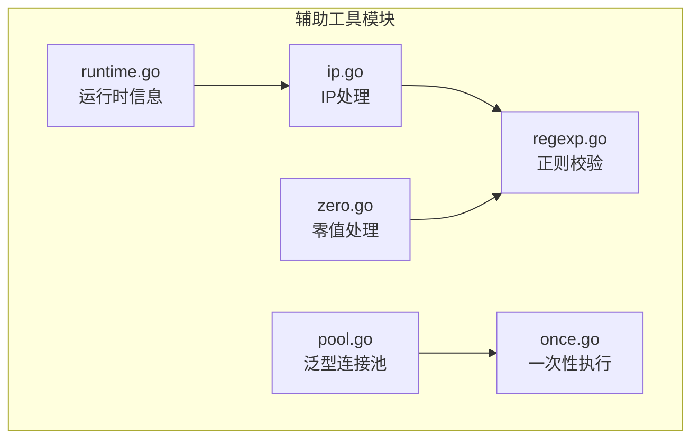
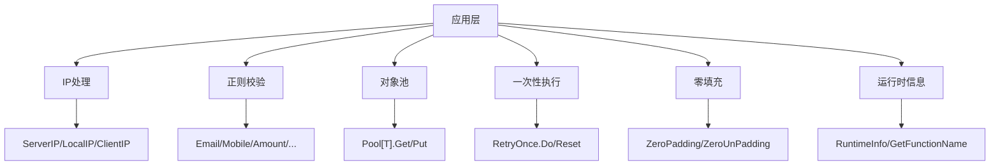
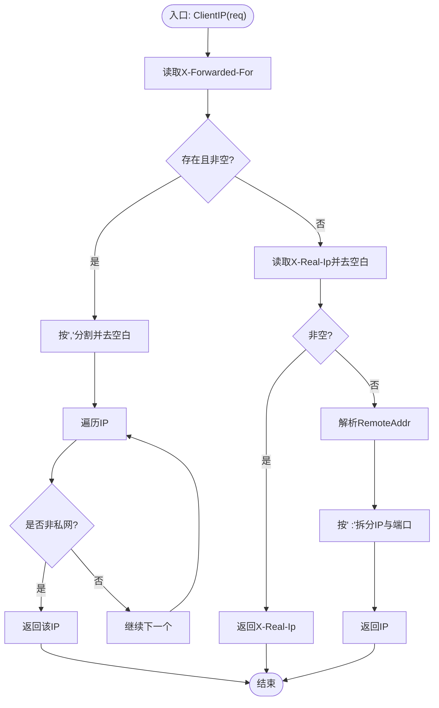
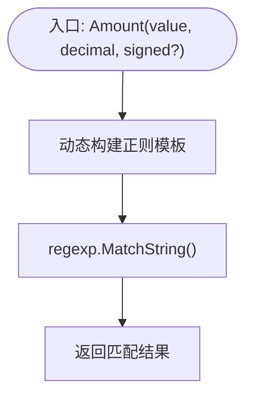
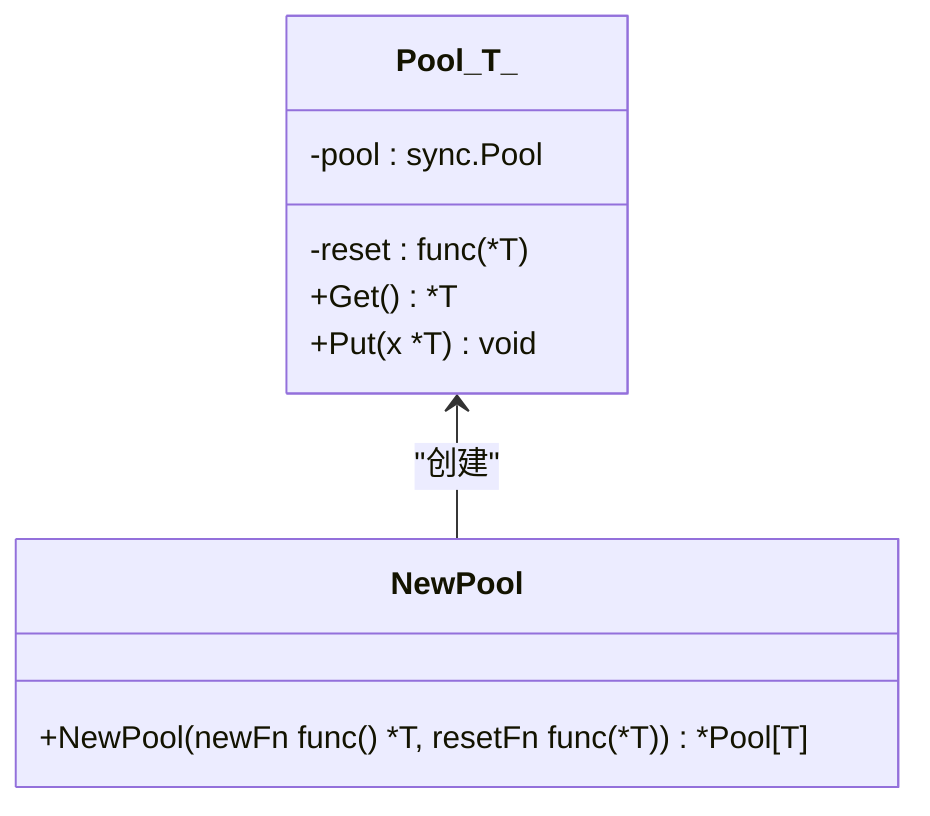
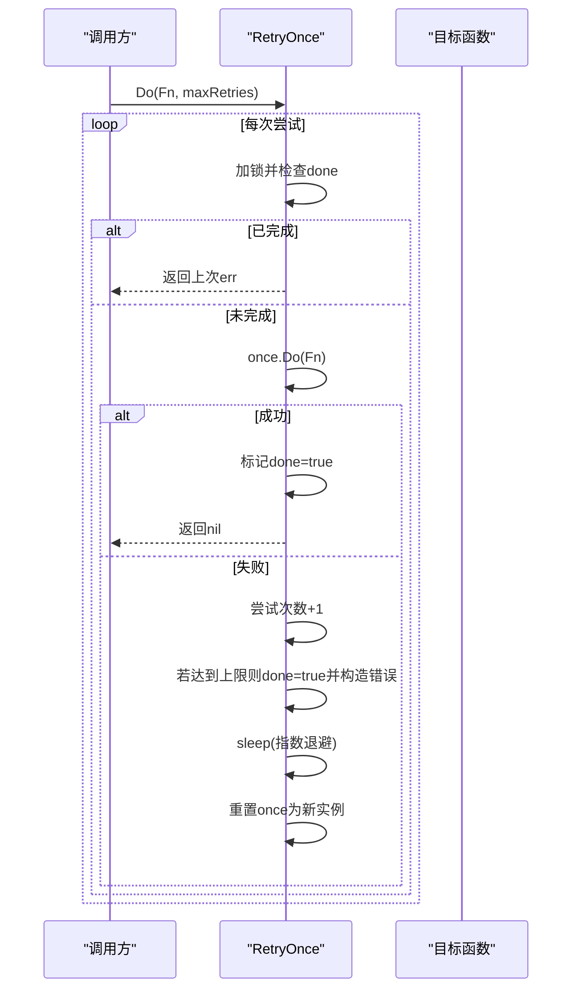
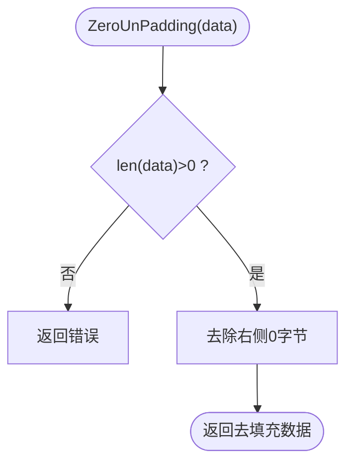
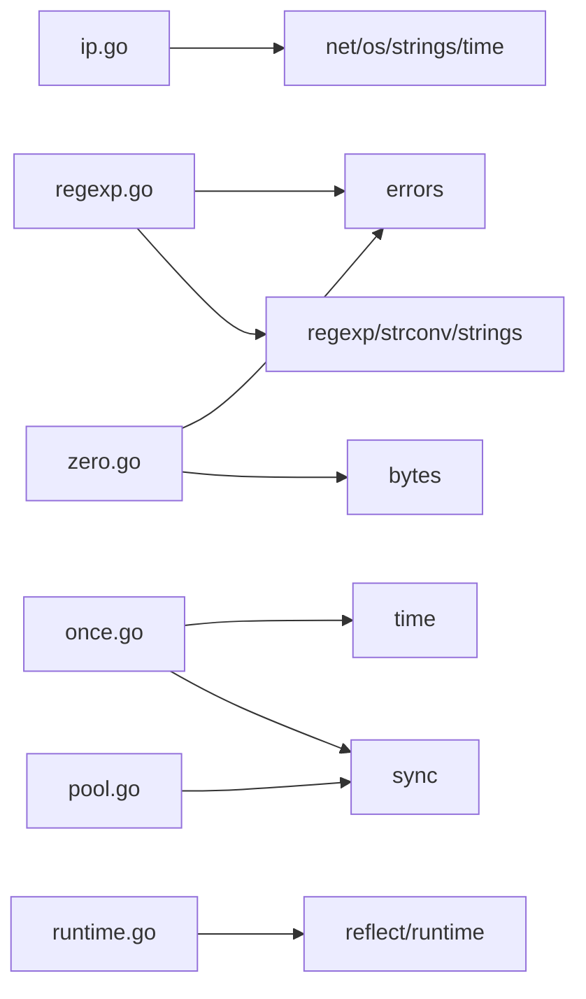

# 辅助工具模块

<cite>
**本文档引用的文件**
- [ip.go](file://ip.go)
- [regexp.go](file://regexp.go)
- [pool.go](file://pool.go)
- [once.go](file://once.go)
- [zero.go](file://zero.go)
- [runtime.go](file://runtime.go)
- [ip_test.go](file://ip_test.go)
- [regexp_test.go](file://regexp_test.go)
- [zero_test.go](file://zero_test.go)
- [runtime_test.go](file://runtime_test.go)
- [example_test.go](file://example_test.go)
- [README.md](file://README.md)
</cite>

## 目录

1. [简介](#简介)
2. [项目结构](#项目结构)
3. [核心组件](#核心组件)
4. [架构总览](#架构总览)
5. [详细组件分析](#详细组件分析)
6. [依赖关系分析](#依赖关系分析)
7. [性能考量](#性能考量)
8. [故障排查指南](#故障排查指南)
9. [结论](#结论)
10. [附录](#附录)

## 简介

本文件聚焦于辅助工具模块，系统化梳理以下能力：

- IP地址处理：服务器外网IP、本地IP、客户端IP解析与私网过滤
- 正则表达式处理：多类业务校验（邮箱、手机、金额、时间、账号、密码等）
- 连接池（泛型Pool）：对象复用与可选重置
- 一次性执行（RetryOnce）：带指数退避的重试控制
- 零值处理（ZeroPadding/ZeroUnPadding）：块对齐填充与去填充
- 运行时信息（RuntimeInfo/GetFunctionName）：Caller帧与函数名获取

文档提供各功能的职责边界、使用场景、最佳实践、集成示例与排障建议。

## 项目结构

辅助工具模块位于仓库根目录，核心文件如下：

- ip.go：IP地址相关工具
- regexp.go：正则表达式校验与格式化
- pool.go：泛型对象池
- once.go：带重试的一次性执行器
- zero.go：零填充与去填充
- runtime.go：运行时栈帧与函数名



**图表来源**

- [ip.go](file://ip.go#L1-L89)
- [regexp.go](file://regexp.go#L1-L299)
- [pool.go](file://pool.go#L1-L34)
- [once.go](file://once.go#L1-L81)
- [zero.go](file://zero.go#L1-L29)
- [runtime.go](file://runtime.go#L1-L41)

**章节来源**

- [ip.go](file://ip.go#L1-L89)
- [regexp.go](file://regexp.go#L1-L299)
- [pool.go](file://pool.go#L1-L34)
- [once.go](file://once.go#L1-L81)
- [zero.go](file://zero.go#L1-L29)
- [runtime.go](file://runtime.go#L1-L41)

## 核心组件

- IP地址处理：ServerIP、LocalIP、ClientIP、isPrivateIP
-
正则表达式处理：Empty、Email、Mobile、Phone、Numeric、UnNumeric、UnInteger、UnIntZero、Amount、Alpha、Zh、MixStr、Alnum、Domain、TimeMonth、TimeDay、Timestamp、Account、PassWord、PassWord2、PassWord3、HasSymbols
- 泛型连接池：Pool[T]、NewPool、Get、Put
- 一次性执行：RetryOnce、Do、Reset
- 零值处理：ZeroPadding、ZeroUnPadding
- 运行时信息：Frame、RuntimeInfo、GetFunctionName

**章节来源**

- [ip.go](file://ip.go#L11-L88)
- [regexp.go](file://regexp.go#L11-L298)
- [pool.go](file://pool.go#L5-L33)
- [once.go](file://once.go#L9-L80)
- [zero.go](file://zero.go#L8-L28)
- [runtime.go](file://runtime.go#L8-L40)

## 架构总览

整体采用“工具函数+结构体”的轻量设计，避免引入复杂依赖，便于在HTTP中间件、数据清洗、配置加载等场景复用。



[本图为概念示意，无需图表来源]

## 详细组件分析

### IP地址处理（ip.go）

职责与行为

- ServerIP：尝试UDP拨号获取出站IP，失败回退到LocalIP
- LocalIP：优先解析主机名对应IPv4，否则遍历接口地址，排除回环与非IPv4
- ClientIP：优先读取X-Forwarded-For首个公网IP，其次X-Real-Ip，最后RemoteAddr拆解
- isPrivateIP：解析IP后判定回环或私网

适用场景

- 日志埋点识别真实来源
- 网关后端服务定位真实客户端
- 服务自检与网络连通性探测

最佳实践

- 在反向代理后部署时，确保X-Forwarded-For/X-Real-Ip由可信上游注入
- 对ClientIP结果进行白名单/黑名单二次校验
- ServerIP可能受DNS解析与防火墙影响，需结合监控告警



**图表来源**

- [ip.go](file://ip.go#L54-L82)

**章节来源**

- [ip.go](file://ip.go#L11-L88)
- [ip_test.go](file://ip_test.go#L9-L86)

### 正则表达式处理（regexp.go）

职责与行为

- 基础校验：Empty、Alpha、Alnum、MixStr、Zh、HasSymbols
- 数值校验：Numeric、UnNumeric、UnInteger、UnIntZero
- 金额校验：Amount(支持小数位与符号)
- 通讯校验：Email、Mobile、Phone、QQ
- 时间校验：TimeMonth、TimeDay、Timestamp（含日期有效性与分隔符一致性）
- 账号与密码：Account、PassWord、PassWord2、PassWord3（长度、字符集、强度约束）

注意

- 大多数函数返回布尔值，部分强校验函数返回error（Account/PassWord/PassWord2/PassWord3），便于统一错误包装

使用场景

- 用户输入校验、表单验证、API参数清洗
- 金额与时间字段的格式与范围双重校验
- 密码强度策略落地

最佳实践

- 对用户输入先做Empty/Trim再进入具体正则
- 金额校验建议固定decimal位数，避免歧义
- 时间校验建议统一分隔符，避免跨平台差异



**图表来源**

- [regexp.go](file://regexp.go#L73-L91)

**章节来源**

- [regexp.go](file://regexp.go#L11-L298)
- [regexp_test.go](file://regexp_test.go#L8-L42)

### 泛型连接池（pool.go）

职责与行为

- Pool[T]：基于sync.Pool的泛型封装，支持可选reset回调
- NewPool：创建池，newFn生成新实例，resetFn用于回收前清理
- Get/Put：获取与放回对象，Put阶段可选执行reset

适用场景

- 大量短生命周期对象的频繁创建/销毁（如缓冲区、解析器）
- 避免GC压力与内存抖动

最佳实践

- reset仅清理必要状态，避免持有外部引用导致泄漏
- 对共享资源（文件句柄、数据库连接）谨慎复用，必要时在reset中关闭或重置



**图表来源**

- [pool.go](file://pool.go#L5-L20)

**章节来源**

- [pool.go](file://pool.go#L1-L34)

### 一次性执行（once.go）

职责与行为

- RetryOnce：带重试与指数退避的一次性执行器
- Do：并发安全地执行目标函数，最大重试次数限制，指数退避等待
- Reset：重置状态，允许再次执行

适用场景

- 仅需“执行一次”的幂等任务，但允许有限次重试
- 初始化资源、拉取配置、健康检查等

最佳实践

- 目标函数应尽量无副作用或具备幂等性
- 重试间隔采用指数退避，避免雪崩
- 结合上下文超时控制整体耗时



**图表来源**

- [once.go](file://once.go#L30-L71)

**章节来源**

- [once.go](file://once.go#L1-L81)

### 零值处理（zero.go）

职责与行为

- ZeroPadding：按blockSize补齐0填充
- ZeroUnPadding：去除右侧0填充，空数据时返回错误

适用场景

- 块加密算法的明文填充（如PKCS#7的0填充变种）
- 二进制协议的定长报文对齐

最佳实践

- 明确blockSize，避免与业务语义冲突
- 解码侧严格校验ZeroUnPadding返回，防止空输入



**图表来源**

- [zero.go](file://zero.go#L18-L28)

**章节来源**

- [zero.go](file://zero.go#L1-L29)
- [zero_test.go](file://zero_test.go#L9-L64)

### 运行时信息（runtime.go）

职责与行为

- Frame：封装函数名、文件名、行号
- RuntimeInfo：跳过skip层级获取调用者信息
- GetFunctionName：反射获取任意函数指针对应的函数名

适用场景

- 日志增强（堆栈定位）、调试信息输出、性能剖析

最佳实践

- skip=0获取直接调用者，skip>0向上追溯
- 函数名可能包含包路径，必要时做裁剪

```mermaid
classDiagram
class Frame {
+Func string
+File string
+Line int
}
class RuntimeInfo {
+RuntimeInfo(skip int) *Frame
}
class GetFunctionName {
+GetFunctionName(i interface{}) string
}
RuntimeInfo --> Frame : "返回"
```

**图表来源**

- [runtime.go](file://runtime.go#L8-L30)

**章节来源**

- [runtime.go](file://runtime.go#L1-L41)
- [runtime_test.go](file://runtime_test.go#L8-L25)

## 依赖关系分析

- IP处理依赖net、os、strings、time
- 正则处理依赖regexp、strconv、strings、errors
- 连接池依赖sync
- 一次性执行依赖sync、time
- 零值处理依赖bytes、errors
- 运行时信息依赖reflect、runtime



**图表来源**

- [ip.go](file://ip.go#L3-L9)
- [regexp.go](file://regexp.go#L3-L9)
- [pool.go](file://pool.go#L3)
- [once.go](file://once.go#L3-L7)
- [zero.go](file://zero.go#L3-L6)
- [runtime.go](file://runtime.go#L3-L6)

**章节来源**

- [ip.go](file://ip.go#L3-L9)
- [regexp.go](file://regexp.go#L3-L9)
- [pool.go](file://pool.go#L3)
- [once.go](file://once.go#L3-L7)
- [zero.go](file://zero.go#L3-L6)
- [runtime.go](file://runtime.go#L3-L6)

## 性能考量

- IP处理
    - ServerIP依赖UDP拨号，网络不稳定时会回退LocalIP，建议缓存结果或在上层做去抖
    - ClientIP字符串拆分与循环判定，建议在高并发场景配合限流
- 正则处理
    - 大量重复匹配可考虑预编译正则（当前已预编译），避免重复构造
    - 时间/金额校验包含额外日期合法性检查，建议在上层做快速格式校验后再精细校验
- 连接池
    - sync.Pool适合短生命周期对象，避免持有大对象或外部资源
    - reset应轻量，避免阻塞Put
- 一次性执行
    - 指数退避避免忙等，但需结合全局超时
- 零值处理
    - bytes.Repeat与bytes.TrimRightFunc为O(n)，注意大数据量时的内存分配
- 运行时信息
    - runtime.Caller开销相对较高，仅在必要时调用

[本节为通用指导，无需章节来源]

## 故障排查指南

- IP解析异常
    - ServerIP为空：检查网络可达性与DNS解析；确认防火墙策略
    - ClientIP始终为内网：确认X-Forwarded-For/X-Real-Ip是否正确注入
- 正则校验失败
    - 金额/时间格式：确认分隔符一致性与数值范围
    - 密码强度：逐条核对长度、字符集与强度要求
- 连接池问题
    - reset未清空状态导致脏数据：检查reset逻辑
    - 资源泄漏：确保reset中释放外部资源
- 一次性执行
    - 一直重试：确认maxRetries与指数退避是否合理
    - 并发竞争：确保目标函数幂等
- 零填充
    - 去填充报错：确认输入非空
- 运行时信息
    - 无法获取函数名：确认传入的是函数指针而非闭包

**章节来源**

- [ip_test.go](file://ip_test.go#L9-L86)
- [regexp_test.go](file://regexp_test.go#L8-L744)
- [zero_test.go](file://zero_test.go#L9-L64)
- [runtime_test.go](file://runtime_test.go#L8-L25)

## 结论

辅助工具模块以简洁API覆盖常见基础设施需求：IP识别、正则校验、对象复用、重试控制、填充处理与运行时信息。建议在实际工程中结合业务特性进行参数化与监控，确保在高并发与复杂网络环境下稳定可用。

[本节为总结，无需章节来源]

## 附录

### 集成示例与最佳实践清单

- IP处理
    - 在HTTP中间件中使用ClientIP提取真实来源，结合白名单策略
    - 服务启动时记录ServerIP用于运维定位
- 正则校验
    - 对用户提交的金额统一走Amount校验，固定decimal位数
    - 时间字段先走TimeDay/Timestamp快速校验，再做业务合法性检查
- 连接池
    - 为高频创建的对象（如解析器、缓冲区）配置Pool[T]
    - reset仅清理内部状态，避免持有外部资源
- 一次性执行
    - 对初始化任务使用RetryOnce，设置合理maxRetries与超时
- 零值处理
    - 明确blockSize，解码侧严格校验返回值
- 运行时信息
    - 仅在关键路径调用RuntimeInfo，避免性能损耗

**章节来源**

- [example_test.go](file://example_test.go#L17-L107)
- [README.md](file://README.md#L1-L800)