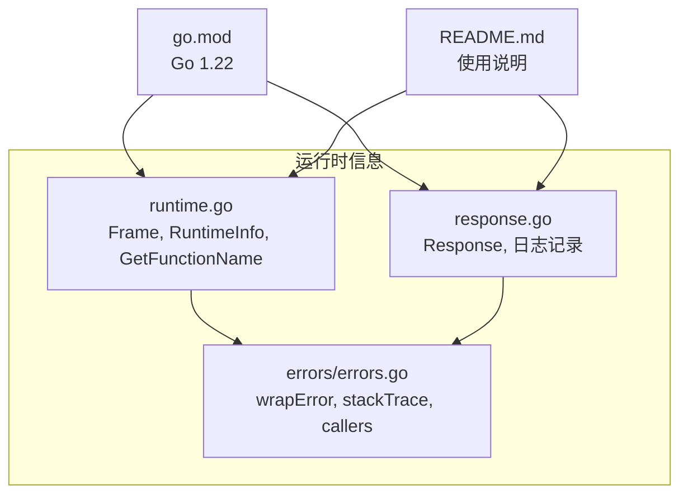
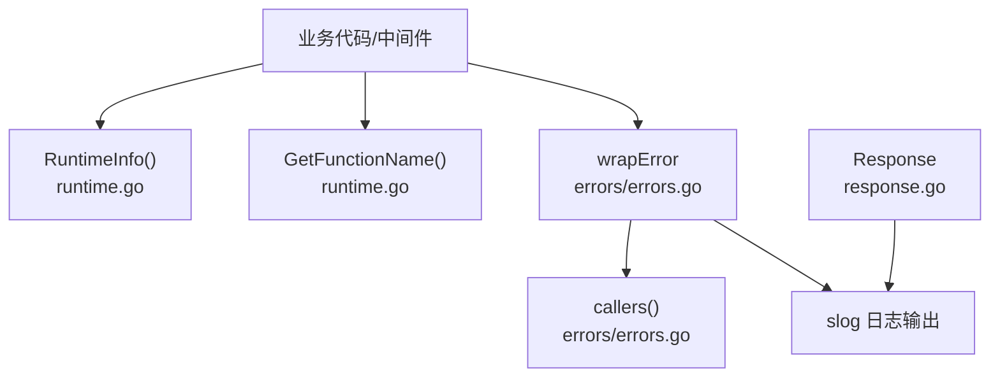
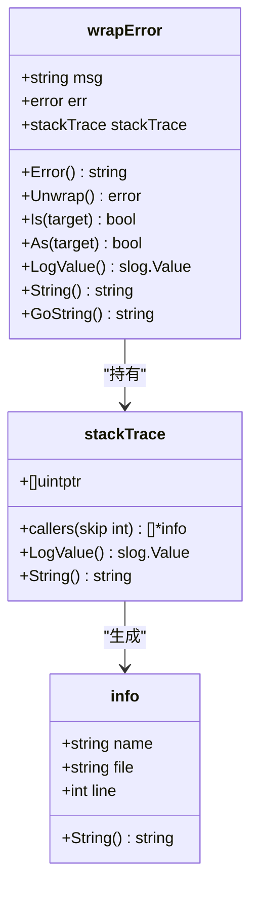
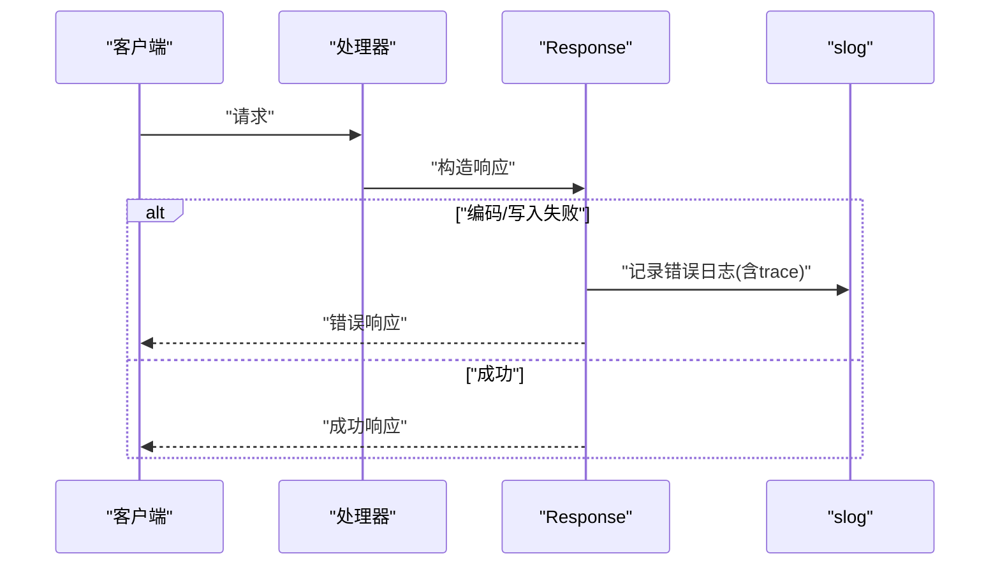
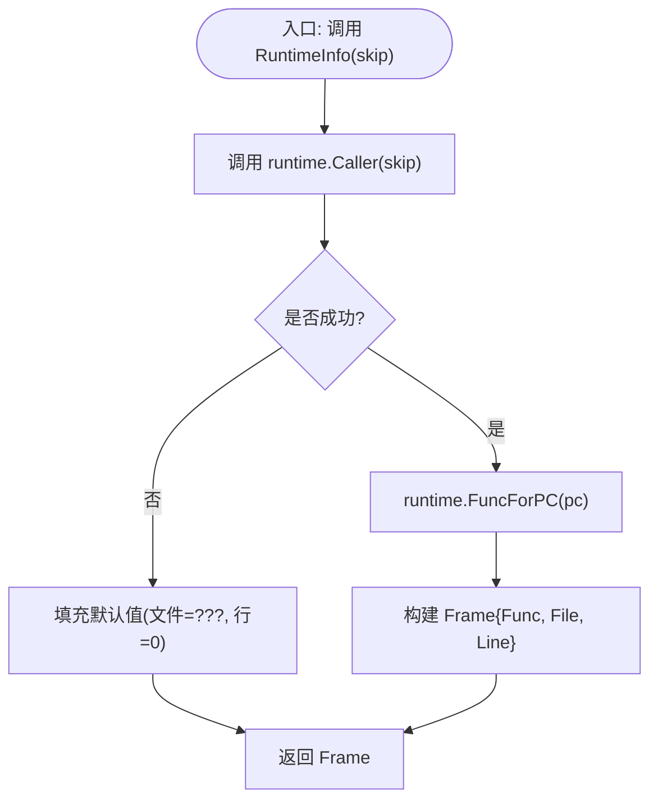
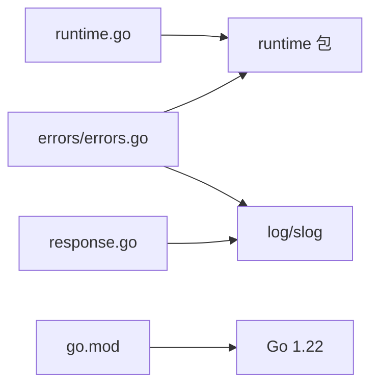

# 运行时信息

<cite>
**本文引用的文件**
- [runtime.go](file://runtime.go)
- [runtime_test.go](file://runtime_test.go)
- [errors.go](file://errors/errors.go)
- [response.go](file://response.go)
- [README.md](file://README.md)
- [go.mod](file://go.mod)
</cite>

## 目录

1. [简介](#简介)
2. [项目结构](#项目结构)
3. [核心组件](#核心组件)
4. [架构总览](#架构总览)
5. [组件详解](#组件详解)
6. [依赖关系分析](#依赖关系分析)
7. [性能考量](#性能考量)
8. [故障排查指南](#故障排查指南)
9. [结论](#结论)
10. [附录](#附录)

## 简介

本文件围绕运行时信息获取能力展开，系统性阐述如何在Go应用中采集与监控运行时指标，包括goroutine数量、内存使用、垃圾回收状态等，并结合仓库现有能力（调用栈帧信息、函数名解析、错误追踪）给出可落地的采集、分析与可视化建议。同时提供最佳实践，涵盖定期采样、历史趋势分析与异常检测，帮助优化应用性能与稳定性。

## 项目结构

该项目采用按功能域划分的扁平目录结构，运行时信息相关的核心能力集中在以下文件：

- 运行时信息采集：runtime.go（调用栈帧、函数名）
- 错误追踪与调用栈：errors/errors.go（封装错误并携带调用栈）
- Web响应封装与日志：response.go（统一响应结构与日志记录）
- 项目元信息：go.mod（Go版本要求）、README.md（使用说明）



图表来源

- [runtime.go](file://runtime.go#L1-L41)
- [errors.go](file://errors/errors.go#L1-L282)
- [response.go](file://response.go#L1-L342)
- [go.mod](file://go.mod#L1-L4)
- [README.md](file://README.md#L1-L800)

章节来源

- [go.mod](file://go.mod#L1-L4)
- [README.md](file://README.md#L1-L800)

## 核心组件

- Frame 结构体：承载当前调用栈帧的函数名、文件名与行号，用于定位运行时信息来源。
- RuntimeInfo 函数：基于 runtime.Caller 与 runtime.FuncForPC 获取调用者信息，支持跳过若干层级的调用栈。
- GetFunctionName 函数：通过反射获取任意函数指针对应的函数名，便于日志与错误追踪中标识调用方。
- wrapError 与 stackTrace：封装错误并携带调用栈，支持 slog 输出与 JSON 序列化，便于问题溯源。
- Response：统一响应结构与日志记录，便于在业务层集成运行时信息采集与上报。

章节来源

- [runtime.go](file://runtime.go#L8-L40)
- [errors.go](file://errors/errors.go#L84-L139)
- [response.go](file://response.go#L11-L30)

## 架构总览

下图展示了运行时信息采集与错误追踪在系统中的交互关系，以及与HTTP响应层的衔接，体现“采集—记录—上报”的闭环。



图表来源

- [runtime.go](file://runtime.go#L14-L40)
- [errors.go](file://errors/errors.go#L133-L139)
- [errors.go](file://errors/errors.go#L252-L256)
- [response.go](file://response.go#L40-L54)

## 组件详解

### 运行时信息采集（Frame、RuntimeInfo、GetFunctionName）

- Frame：包含函数名、文件名、行号，用于描述调用栈帧。
- RuntimeInfo(skip int)：根据 skip 跳过若干层级，获取当前调用者的函数名、文件与行号。
- GetFunctionName(i interface{})：通过反射获取任意函数指针对应的函数名，便于在日志与错误中标识调用方。

```mermaid
classDiagram
class Frame {
+string Func
+string File
+int Line
}
class RuntimeInfo {
+RuntimeInfo(skip int) Frame*
}
class GetFunctionName {
+GetFunctionName(i interface{}) string
}
RuntimeInfo --> Frame : "返回"
GetFunctionName --> Frame : "辅助定位"
```

图表来源

- [runtime.go](file://runtime.go#L8-L12)
- [runtime.go](file://runtime.go#L14-L40)

章节来源

- [runtime.go](file://runtime.go#L8-L40)

### 错误追踪与调用栈（wrapError、stackTrace、callers）

- stackTrace：保存调用栈的程序计数器数组。
- callers(skip)：基于 runtime.Callers 采集当前调用栈，返回 stackTrace。
- wrapError：封装原始错误，携带 msg、嵌套错误与 stackTrace，支持 slog.LogValuer 与 JSON 序列化。
- info：单个调用栈帧的函数名、文件名与行号。



图表来源

- [errors.go](file://errors/errors.go#L84-L139)
- [errors.go](file://errors/errors.go#L141-L145)
- [errors.go](file://errors/errors.go#L258-L266)

章节来源

- [errors.go](file://errors/errors.go#L84-L139)
- [errors.go](file://errors/errors.go#L141-L145)
- [errors.go](file://errors/errors.go#L252-L256)
- [errors.go](file://errors/errors.go#L258-L266)

### HTTP响应与日志记录（Response）

- Response：统一响应结构，包含 Success/Fail/Text/Html/Xml/Download/Show 等方法。
- 在编码失败、文件打开/复制失败等场景中，记录带有唯一标识的错误日志，便于回溯。



图表来源

- [response.go](file://response.go#L24-L54)
- [response.go](file://response.go#L56-L83)
- [response.go](file://response.go#L118-L199)
- [response.go](file://response.go#L200-L251)
- [response.go](file://response.go#L253-L269)

章节来源

- [response.go](file://response.go#L11-L30)
- [response.go](file://response.go#L24-L54)
- [response.go](file://response.go#L56-L83)
- [response.go](file://response.go#L118-L199)
- [response.go](file://response.go#L200-L251)
- [response.go](file://response.go#L253-L269)

### 运行时信息采集流程（RuntimeInfo）



图表来源

- [runtime.go](file://runtime.go#L14-L30)

章节来源

- [runtime.go](file://runtime.go#L14-L30)

## 依赖关系分析

- 运行时信息采集依赖 runtime 包提供的 Caller 与 FuncForPC。
- 错误追踪依赖 runtime.Callers 与 slog，形成可序列化的调用栈。
- HTTP响应层依赖 slog 记录错误上下文，便于与运行时信息联动。
- 项目要求 Go 1.22，确保可用的运行时与标准库特性。



图表来源

- [runtime.go](file://runtime.go#L3-L6)
- [errors.go](file://errors/errors.go#L3-L12)
- [response.go](file://response.go#L3-L9)
- [go.mod](file://go.mod#L3-L4)

章节来源

- [runtime.go](file://runtime.go#L3-L6)
- [errors.go](file://errors/errors.go#L3-L12)
- [response.go](file://response.go#L3-L9)
- [go.mod](file://go.mod#L3-L4)

## 性能考量

- 采样频率与粒度
    - 建议对 RuntimeInfo 的调用进行限流与采样，避免高频调用带来的额外开销。
    - 对关键路径（如请求入口、错误发生点）保留高采样，对常规路径降低采样频率。
- 调用栈深度控制
    - callers/skip 参数需谨慎设置，避免过深的调用栈导致栈帧过多与序列化成本上升。
- 日志与序列化
    - 错误追踪与 slog 输出应避免在热路径频繁触发，建议异步落盘或批量上报。
- 内存与GC
    - 在高并发场景下，注意避免频繁创建临时对象（如 strings.Builder、[]byte），减少GC压力。
- CPU与阻塞
    - 对阻塞敏感的路径，尽量避免在关键路径中进行昂贵的IO或网络调用；必要时使用超时与并发控制。

## 故障排查指南

- 如何定位调用来源
    - 在关键函数入口调用 RuntimeInfo(skip)，结合 Frame 的 File/Line 快速定位问题发生位置。
    - 使用 GetFunctionName 获取函数名，便于在日志中标识调用方。
- 如何分析错误链路
    - 使用 errors 包的 Wrap/Errorf/newWrapError 创建带调用栈的错误，配合 slog 输出 trace。
    - 通过 wrapError 的 String/GoString/MarshalJSON 输出，快速获取错误消息与调用栈。
- 如何在HTTP响应中记录上下文
    - 在 Response.Success/Fail/Download/Show 等方法中，遇到错误时记录带 trace 的日志，包含唯一标识与数据摘要，便于回溯。

章节来源

- [runtime.go](file://runtime.go#L14-L40)
- [errors.go](file://errors/errors.go#L133-L139)
- [errors.go](file://errors/errors.go#L204-L235)
- [response.go](file://response.go#L40-L54)
- [response.go](file://response.go#L118-L199)

## 结论

本项目提供了运行时信息采集与错误追踪的基础能力，结合 slog
与统一响应层，可在实际业务中实现“可观测性—可追溯—可诊断”的闭环。建议在生产环境中配合采样策略、异步上报与可视化看板，持续优化性能与稳定性。

## 附录

- 使用说明与版本要求请参考 README 与 go.mod。
- 单元测试覆盖了 RuntimeInfo 的基础行为，可作为使用参考。

章节来源

- [README.md](file://README.md#L1-L800)
- [go.mod](file://go.mod#L1-L4)
- [runtime_test.go](file://runtime_test.go#L8-L25)