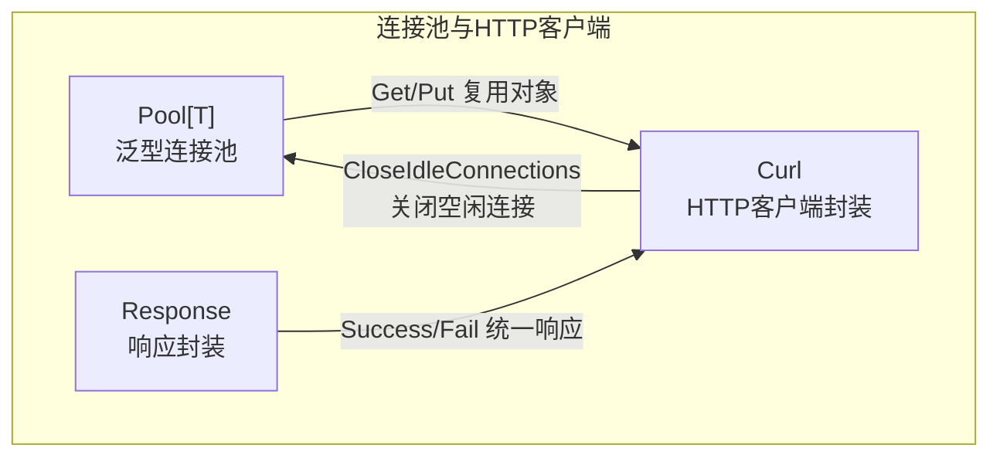
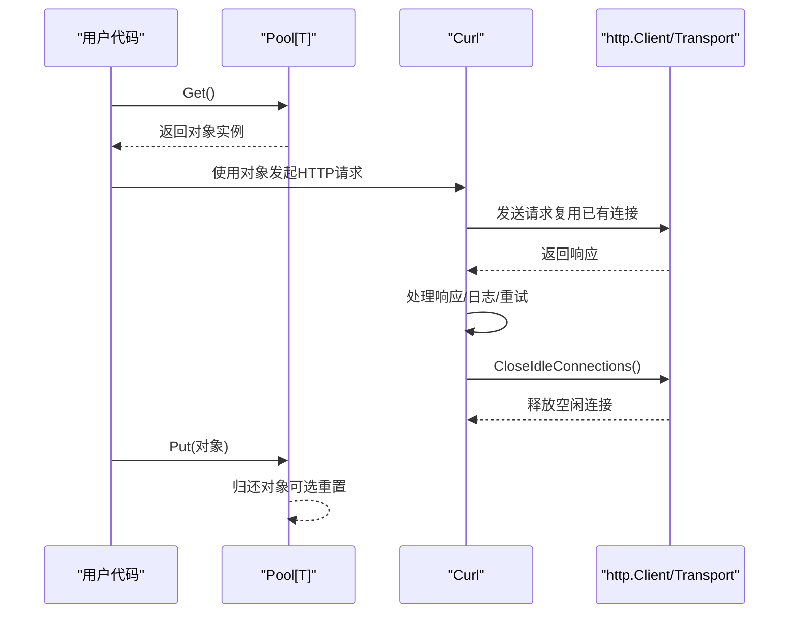
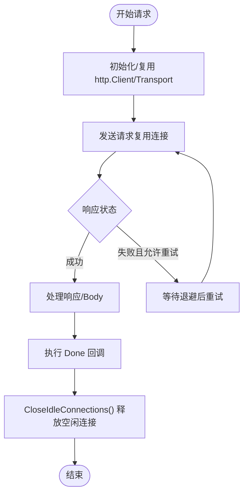
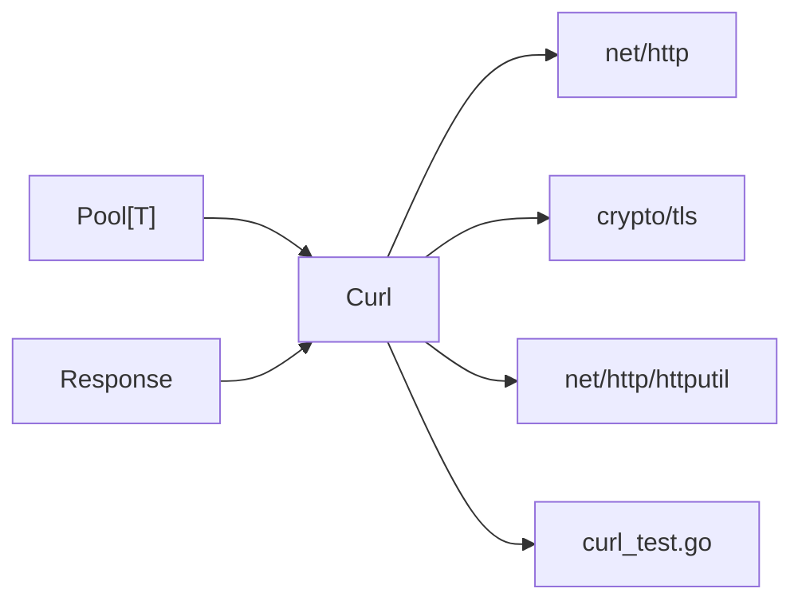

# 连接池管理

<cite>
**本文引用的文件列表**
- [pool.go](file://pool.go)
- [curl.go](file://curl.go)
- [curl_test.go](file://curl_test.go)
- [README.md](file://README.md)
- [go.mod](file://go.mod)
- [response.go](file://response.go)
</cite>

## 目录

1. [简介](#简介)
2. [项目结构](#项目结构)
3. [核心组件](#核心组件)
4. [架构总览](#架构总览)
5. [组件详解](#组件详解)
6. [依赖关系分析](#依赖关系分析)
7. [性能与资源管理](#性能与资源管理)
8. [使用示例](#使用示例)
9. [监控与调优](#监控与调优)
10. [最佳实践与常见问题](#最佳实践与常见问题)
11. [结论](#结论)

## 简介

本文件围绕仓库中的连接池管理能力展开，重点说明通用泛型连接池的设计与实现、在HTTP客户端中的连接复用策略、以及在高并发场景下的性能优势与资源管理机制。同时给出使用示例、监控与调优方法、最佳实践与常见问题解决方案，帮助读者在数据库连接、HTTP客户端连接等场景中正确高效地使用连接池。

## 项目结构

该项目是一个Go工具库，包含多种通用工具函数与组件。与连接池相关的核心文件如下：

- pool.go：定义通用泛型连接池结构与接口，基于标准库 sync.Pool 实现对象复用。
- curl.go：封装HTTP客户端，内置连接复用与连接池化能力，支持自定义Transport、代理、TLS等。
- curl_test.go：演示HTTP客户端的使用方式，包含连接关闭与重试等行为。
- response.go：辅助HTTP响应处理，便于在高并发场景下统一响应结构。
- README.md、go.mod：项目说明与版本约束。



图表来源

- [pool.go](file://pool.go#L5-L33)
- [curl.go](file://curl.go#L21-L84)
- [response.go](file://response.go#L11-L22)

章节来源

- [README.md](file://README.md#L1-L40)
- [go.mod](file://go.mod#L1-L4)

## 核心组件

- 泛型连接池 Pool[T]
    - 通过 sync.Pool 实现对象的创建与复用，支持可选的重置回调，确保对象放回池前状态被清理。
    - 提供 Get/Put 两个核心方法，简化使用者的获取与归还流程。
- HTTP客户端 Curl
    - 内置 http.Client，按需初始化 Transport，支持代理、TLS、超时、重试、日志等。
    - 提供 CloseIdleConnections 方法，主动关闭空闲连接并释放底层资源。
    - 支持在请求完成后执行 Done 回调，便于统一资源回收。

章节来源

- [pool.go](file://pool.go#L5-L33)
- [curl.go](file://curl.go#L21-L84)
- [curl.go](file://curl.go#L774-L780)

## 架构总览

连接池在系统中的作用是减少频繁创建销毁对象带来的开销，提升高并发场景下的吞吐量与稳定性。在HTTP客户端中，连接池主要体现在Transport层面的连接复用与空闲连接管理。



图表来源

- [pool.go](file://pool.go#L22-L33)
- [curl.go](file://curl.go#L435-L772)
- [curl.go](file://curl.go#L774-L780)

## 组件详解

### 泛型连接池 Pool[T]

- 设计要点
    - 基于 sync.Pool 的零分配对象复用，降低GC压力。
    - reset 回调用于清理对象状态，避免“脏”对象污染后续使用。
    - NewPool 支持自定义构造函数与重置函数，适配不同类型的对象生命周期。
- 关键方法
    - Get：从池中取出一个对象，若池为空则调用 New 构造新对象。
    - Put：可选执行重置逻辑后将对象放回池中。
- 典型应用场景
    - HTTP请求对象、缓冲区、解析器等可复用对象的池化管理。

```mermaid
classDiagram
class Pool_T_ {
-pool : sync.Pool
-reset : func(*T)
+Get() *T
+Put(x *T) void
}
class sync_Pool {
+Get() interface{}
+Put(x interface{}) void
}
Pool_T_ --> sync_Pool : "封装"
```

图表来源

- [pool.go](file://pool.go#L5-L33)

章节来源

- [pool.go](file://pool.go#L11-L20)
- [pool.go](file://pool.go#L22-L33)

### HTTP客户端 Curl 与连接复用

- 连接复用策略
    - Curl 内部持有 http.Client，按需初始化 Transport。
    - 通过 http.Transport 的连接复用机制，实现TCP连接的复用与空闲管理。
    - 支持设置超时、代理、TLS等，满足不同网络环境需求。
- 生命周期管理
    - CloseIdleConnections 主动关闭空闲连接，释放底层资源，避免连接泄漏。
    - Done 回调可在请求完成后统一执行资源回收逻辑。
- 重试与容错
    - 支持最大重试次数与指数退避策略，提升网络波动下的成功率。
- 日志与可观测性
    - 可开启详细日志与dump模式，便于定位问题。
    - 通过 SetDefLogOutput 控制默认日志输出级别。



图表来源

- [curl.go](file://curl.go#L435-L772)
- [curl.go](file://curl.go#L774-L780)

章节来源

- [curl.go](file://curl.go#L86-L118)
- [curl.go](file://curl.go#L564-L644)
- [curl.go](file://curl.go#L659-L681)
- [curl.go](file://curl.go#L774-L780)

### 响应封装 Response

- 统一响应结构，支持 Success/Fail 两种模式，便于前端与调用方处理。
- 内部编码错误时生成唯一追踪码，便于问题定位与审计。

章节来源

- [response.go](file://response.go#L11-L22)
- [response.go](file://response.go#L24-L83)

## 依赖关系分析

- Pool[T] 与 Curl 的耦合
    - Curl 通过 CloseIdleConnections 主动释放空闲连接，间接配合池化对象的生命周期管理。
    - Curl 的 Done 回调可用于统一回收资源，与池化对象的 Put 流程形成互补。
- Curl 与标准库
    - 依赖 net/http、crypto/tls、net/http/httputil 等标准库实现连接复用、TLS、日志dump等功能。
- 与测试的关系
    - curl_test.go 展示了HTTP客户端的基本使用方式，包含参数设置、响应处理与连接关闭的注释，体现了连接池/连接复用在测试中的实践。



图表来源

- [pool.go](file://pool.go#L1-L3)
- [curl.go](file://curl.go#L3-L19)
- [curl_test.go](file://curl_test.go#L1-L16)

章节来源

- [curl.go](file://curl.go#L3-L19)
- [curl_test.go](file://curl_test.go#L1-L16)

## 性能与资源管理

- 连接池的优势
    - 减少频繁创建/销毁对象的开销，降低GC压力，提高吞吐量。
    - 通过重置回调确保对象状态一致，避免“脏”对象导致的性能与稳定性问题。
- HTTP连接复用
    - http.Transport 自带连接池与空闲连接管理，结合 CloseIdleConnections 可在高并发场景下有效控制资源占用。
    - 超时、代理、TLS等配置影响连接建立与复用效率，需根据实际网络环境调整。
- 重试与退避
    - 合理设置最大重试次数与退避间隔，可提升网络波动下的成功率，但需避免过度重试导致资源浪费。

章节来源

- [pool.go](file://pool.go#L28-L33)
- [curl.go](file://curl.go#L564-L644)
- [curl.go](file://curl.go#L659-L681)

## 使用示例

以下示例展示如何在HTTP客户端中正确使用连接池与连接复用能力。示例来源于测试文件，展示了请求参数设置、响应处理与连接关闭的实践。

- 示例：GET请求与参数传递
    - 在测试中，通过 SetParam 设置请求参数，Resolve 设置响应处理逻辑，SetDefLogOutput 开启默认日志输出，SetMaxRetry 设置重试次数。
    - 请求结束后，可通过 CloseIdleConnections 主动释放空闲连接，避免资源泄漏。

章节来源

- [curl_test.go](file://curl_test.go#L82-L218)
- [curl.go](file://curl.go#L310-L395)
- [curl.go](file://curl.go#L423-L433)
- [curl.go](file://curl.go#L774-L780)

## 监控与调优

- 连接状态监控
    - 使用 CloseIdleConnections 主动释放空闲连接，观察连接数量变化与资源占用。
    - 通过 SetDefLogOutput 与 dump 模式记录请求/响应细节，辅助定位问题。
- 性能指标收集
    - 结合日志统计请求耗时、重试次数、状态码分布等，评估连接池与重试策略的效果。
- 故障排查
    - 当出现连接泄漏或性能下降时，优先检查是否遗漏调用 CloseIdleConnections 或 Done 回调。
    - 检查超时、代理、TLS配置是否合理，避免因配置不当导致连接复用失效。

章节来源

- [curl.go](file://curl.go#L397-L401)
- [curl.go](file://curl.go#L448-L562)
- [curl.go](file://curl.go#L774-L780)

## 最佳实践与常见问题

- 最佳实践
    - 在高并发场景下，优先使用连接池与连接复用，避免频繁创建销毁对象。
    - 合理设置超时、重试与退避策略，平衡成功率与资源消耗。
    - 在请求完成后调用 CloseIdleConnections 或在 Done 回调中统一回收资源。
    - 使用统一的响应封装 Response，便于前后端对接与错误追踪。
- 常见问题
    - 连接泄漏：未调用 CloseIdleConnections 或未在 Done 回调中回收资源。
    - 性能抖动：重试次数过多或退避间隔不合理，导致CPU与连接资源占用上升。
    - TLS/代理配置错误：导致连接无法复用或频繁重建，需检查相关配置。

章节来源

- [curl.go](file://curl.go#L774-L780)
- [response.go](file://response.go#L24-L83)

## 结论

本项目提供了通用的泛型连接池与完善的HTTP客户端封装，能够有效支撑高并发场景下的连接复用与资源管理。通过合理的配置与监控，可以在保证性能的同时提升系统的稳定性与可观测性。建议在实际工程中结合业务特点，选择合适的连接池策略与重试退避参数，并持续优化连接复用与资源回收流程。