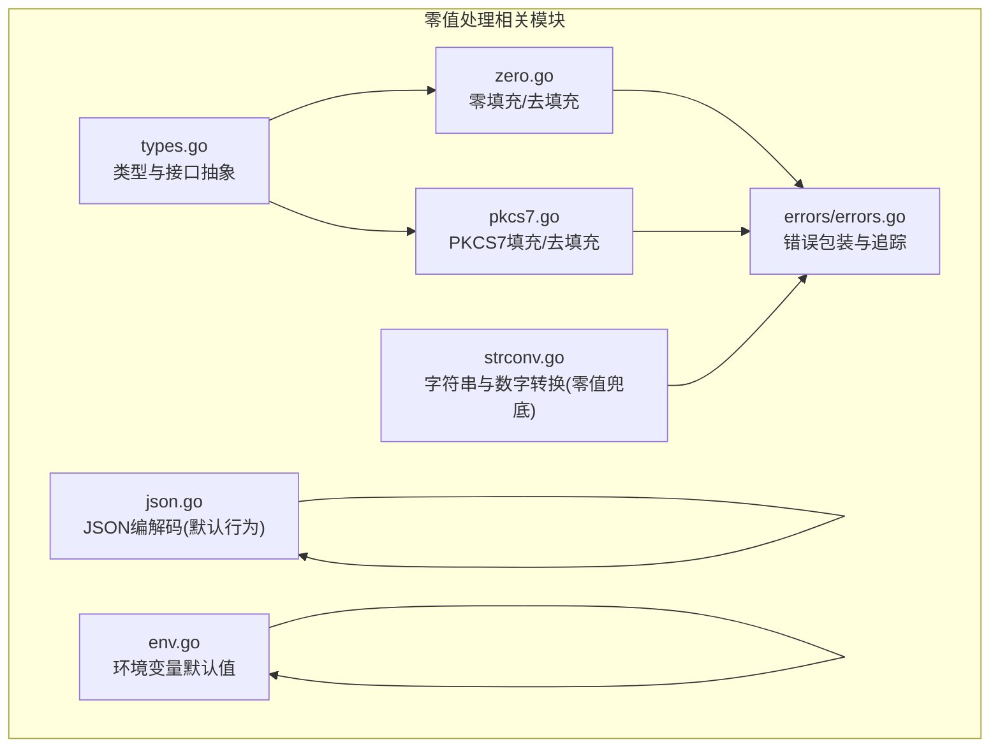
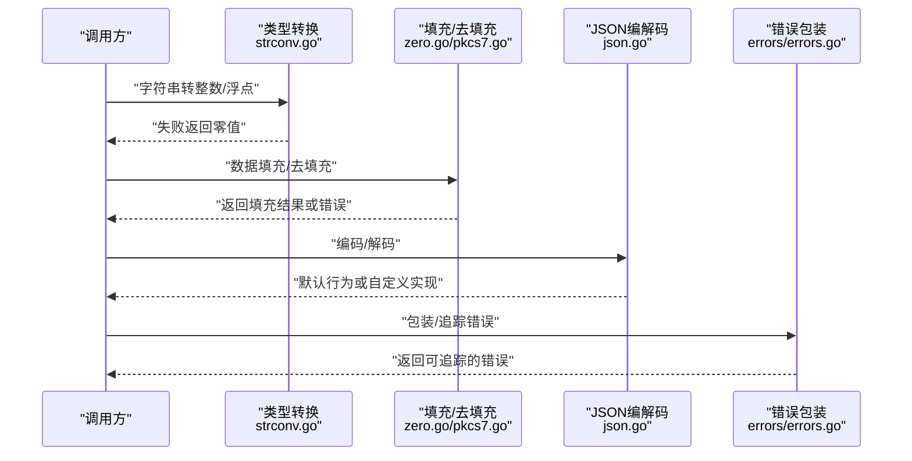
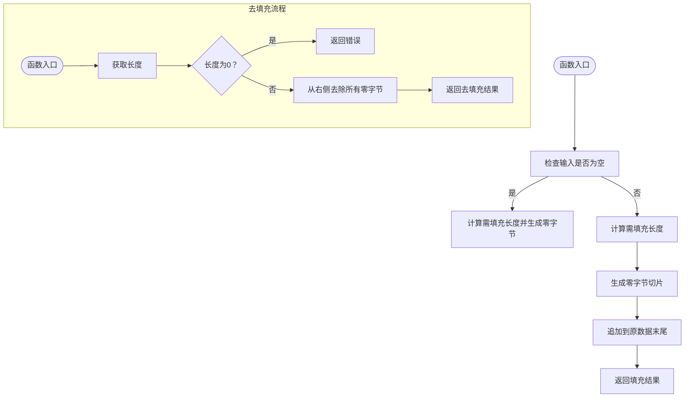
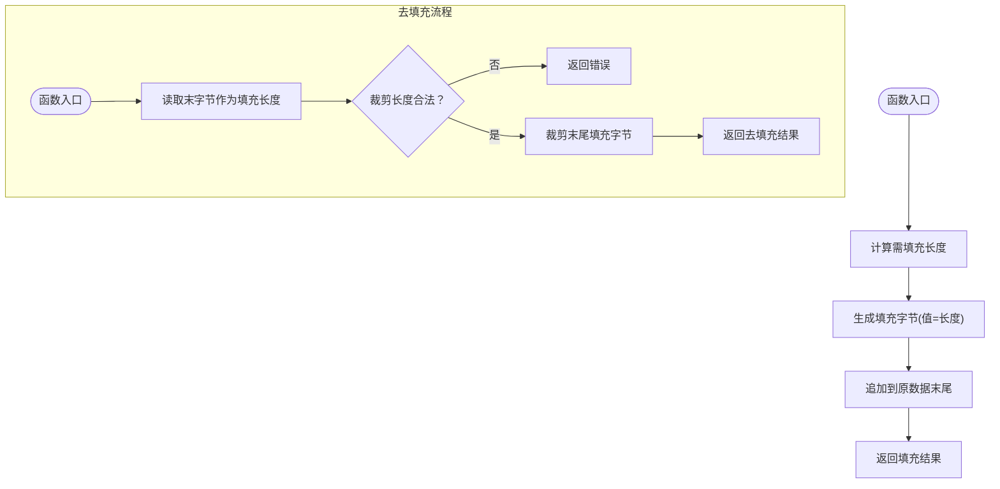
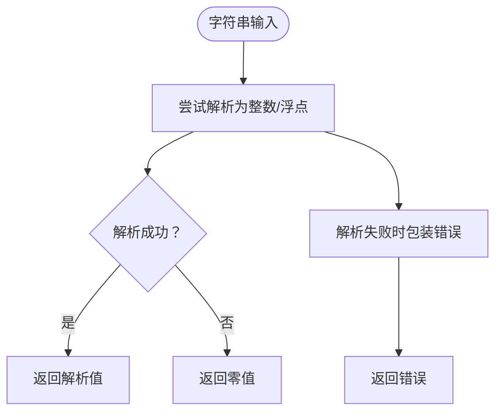
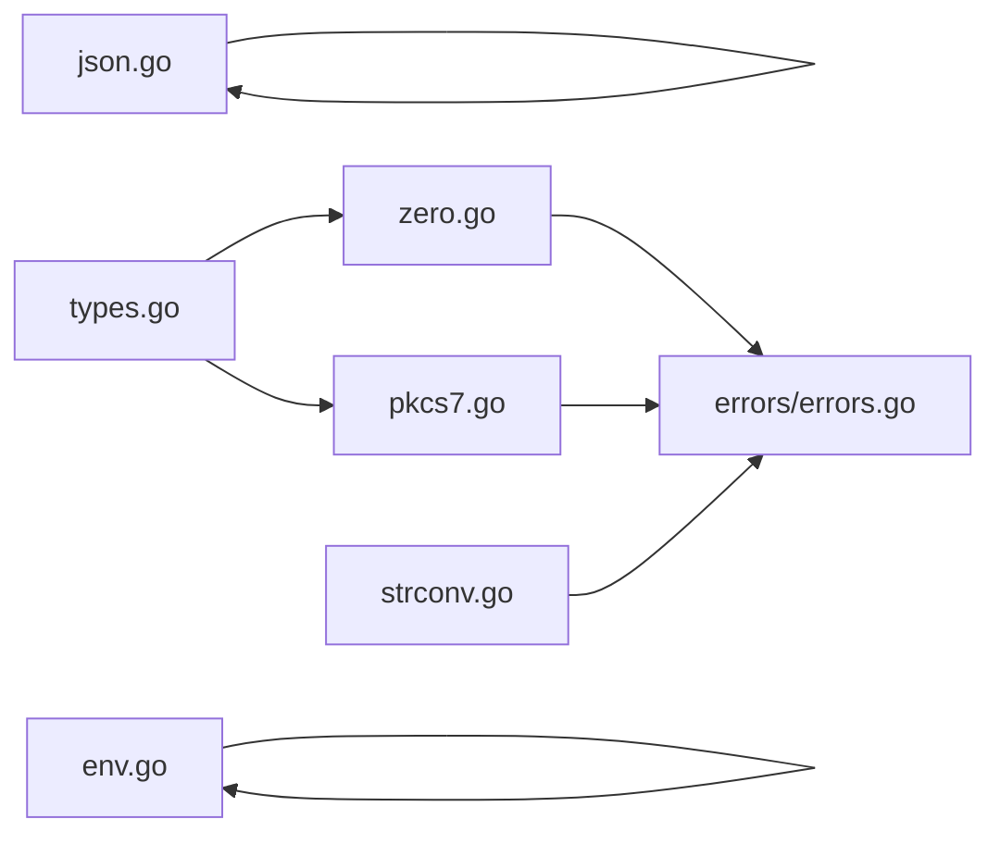

# 零值处理

<cite>
**本文引用的文件列表**
- [zero.go](file://zero.go)
- [zero_test.go](file://zero_test.go)
- [pkcs7.go](file://pkcs7.go)
- [pkcs7_test.go](file://pkcs7_test.go)
- [strconv.go](file://strconv.go)
- [json.go](file://json.go)
- [errors/errors.go](file://errors/errors.go)
- [types.go](file://types.go)
- [env.go](file://env.go)
- [README.md](file://README.md)
- [go.mod](file://go.mod)
</cite>

## 目录

1. [简介](#简介)
2. [项目结构](#项目结构)
3. [核心组件](#核心组件)
4. [架构总览](#架构总览)
5. [组件详解](#组件详解)
6. [依赖关系分析](#依赖关系分析)
7. [性能考量](#性能考量)
8. [故障排查指南](#故障排查指南)
9. [结论](#结论)
10. [附录](#附录)

## 简介

本文件围绕“零值处理”主题，系统梳理Go语言中零值的概念、边界情况与最佳实践，并结合本仓库中的零填充与去填充实现，给出在数据验证、默认值设置、类型转换、JSON序列化、数据库与API响应中的应用要点。同时总结常见陷阱与解决方案，覆盖nil、空字符串、零数值等边界场景，以及与指针、接口的交互注意事项。

## 项目结构

本仓库采用按功能域划分的组织方式，与零值处理直接相关的核心文件集中在以下模块：

- 零填充/去填充：zero.go、pkcs7.go
- 类型与接口抽象：types.go
- 类型转换（含零值兜底）：strconv.go
- JSON编解码与默认行为：json.go
- 错误包装与追踪：errors/errors.go
- 环境变量默认值：env.go
- 文档与示例：README.md、各模块测试文件

图表来源

- [zero.go](file://zero.go#L1-L29)
- [pkcs7.go](file://pkcs7.go#L1-L31)
- [strconv.go](file://strconv.go#L1-L109)
- [json.go](file://json.go#L1-L67)
- [errors/errors.go](file://errors/errors.go#L1-L282)
- [types.go](file://types.go#L1-L98)
- [env.go](file://env.go#L1-L19)

章节来源

- [go.mod](file://go.mod#L1-L4)
- [README.md](file://README.md#L1-L3892)

## 核心组件

- 零填充与去填充：提供字节级填充与反填充能力，典型用于密码学分组对齐与协议兼容。
- PKCS7填充与去填充：提供标准填充方案，强调填充长度可校验。
- 类型与接口抽象：通过泛型接口约束统一整数、浮点、有序类型，便于零值语义的一致性处理。
- 类型转换：提供字符串到整数/浮点的转换函数，失败时返回零值，体现零值兜底策略。
- JSON编解码：支持自定义编解码器，若未设置则使用标准库默认行为，零值在JSON中表现为null或空容器。
- 错误包装：统一错误追踪与包装，便于在零值场景下定位问题。
- 环境变量默认值：提供空字符串兜底策略，避免nil与空字符串混淆。

章节来源

- [zero.go](file://zero.go#L1-L29)
- [pkcs7.go](file://pkcs7.go#L1-L31)
- [strconv.go](file://strconv.go#L1-L109)
- [json.go](file://json.go#L1-L67)
- [errors/errors.go](file://errors/errors.go#L1-L282)
- [types.go](file://types.go#L1-L98)
- [env.go](file://env.go#L1-L19)

## 架构总览

零值处理贯穿于输入校验、数据转换、序列化与错误处理的全链路。下图展示关键流程与组件交互：

图表来源

- [strconv.go](file://strconv.go#L1-L109)
- [zero.go](file://zero.go#L1-L29)
- [pkcs7.go](file://pkcs7.go#L1-L31)
- [json.go](file://json.go#L1-L67)
- [errors/errors.go](file://errors/errors.go#L1-L282)

## 组件详解

### 零填充与去填充（zero.go）

- 功能概述
    - ZeroPadding：按指定块大小对字节数据进行零填充，确保长度满足块对齐。
    - ZeroUnPadding：去除右侧零字节，若输入为空则返回错误。
- 边界与零值
    - 输入为空切片时，ZeroPadding会填充完整块长度的零字节，体现“空即零”的零值语义。
    - ZeroUnPadding对空输入显式报错，避免静默失败。
- 应用场景
    - 密码学分组算法（如AES/DES）的块对齐。
    - 协议层数据对齐与兼容。
- 测试覆盖
    - 包含空切片、单字节、多字节、跨块长度等用例，验证填充与去填充的正确性。

图表来源

- [zero.go](file://zero.go#L8-L28)

章节来源

- [zero.go](file://zero.go#L1-L29)
- [zero_test.go](file://zero_test.go#L1-L65)

### PKCS7填充与去填充（pkcs7.go）

- 功能概述
    - Pkcs7Padding：按块大小计算填充长度，并以该长度值填充相应数量的字节。
    - Pkcs7UnPadding：读取末字节作为填充长度，校验长度合法性并裁剪。
- 边界与零值
    - 输入为空时返回错误，避免零长度输入导致的不可预期行为。
    - 去填充时若末字节指示的裁剪长度越界，立即返回错误。
- 应用场景
    - 标准密码学填充方案，适用于多种对称加密算法。
- 测试覆盖
    - 覆盖空输入、满块、跨块、超长等边界用例。

图表来源

- [pkcs7.go](file://pkcs7.go#L8-L30)

章节来源

- [pkcs7.go](file://pkcs7.go#L1-L31)
- [pkcs7_test.go](file://pkcs7_test.go#L1-L65)

### 类型与接口抽象（types.go）

- 功能概述
    - 定义有符号/无符号整数、浮点、数字、有序类型等接口，配合泛型Slice实现排序等通用能力。
- 零值语义
    - 通过接口约束，保证不同数值类型在统一抽象下的零值行为一致，便于在转换与比较中处理零值。
- 应用场景
    - 在排序、比较、默认值处理等场景中，统一数值类型的行为。

章节来源

- [types.go](file://types.go#L1-L98)

### 类型转换与零值兜底（strconv.go）

- 功能概述
    - 提供字符串到整数、整数到字符串、各种进制转换的函数。
    - 字符串到整数/浮点的转换失败时返回零值，体现零值兜底策略。
- 零值处理
    - 失败返回零值，调用方可据此区分“解析失败”与“数值为零”的两种语义。
- 错误包装
    - 进制转换失败时通过错误包装函数返回可追踪的错误，便于定位问题。

图表来源

- [strconv.go](file://strconv.go#L8-L24)
- [strconv.go](file://strconv.go#L27-L108)

章节来源

- [strconv.go](file://strconv.go#L1-L109)

### JSON编解码与零值（json.go）

- 功能概述
    - 支持设置自定义JSON编解码器；若未设置则使用标准库默认行为。
- 零值与默认行为
    - 默认行为下，零值在JSON中通常序列化为null或空容器，具体取决于字段类型与标签。
    - 自定义编解码器可用于统一零值处理策略（如将零值映射为特定占位符）。
- 应用场景
    - API响应、配置文件、消息队列等场景中对零值的规范化输出。

章节来源

- [json.go](file://json.go#L1-L67)

### 错误包装与追踪（errors/errors.go）

- 功能概述
    - 提供New、Wrap、Wrapf、Is、As、Unwrap、Trace等函数，统一错误处理与追踪。
- 零值处理
    - Wrap对nil直接返回nil，避免在零值场景下产生无效错误对象。
    - Trace支持将错误栈追踪序列化，便于日志与调试。
- 应用场景
    - 在零填充/去填充、类型转换、JSON编解码等过程中，统一错误传播与记录。

章节来源

- [errors/errors.go](file://errors/errors.go#L1-L282)

### 环境变量默认值（env.go）

- 功能概述
    - GetEnv在环境变量为空时返回默认值，避免空字符串与nil的混淆。
- 零值处理
    - 通过默认值参数提供零值兜底，确保调用方获得可用的字符串值。
- 应用场景
    - 配置加载、运行时参数设置等场景。

章节来源

- [env.go](file://env.go#L1-L19)

## 依赖关系分析

- 组件耦合
    - zero.go与pkcs7.go均依赖errors包进行错误包装与返回，形成一致的错误处理风格。
    - strconv.go在进制转换失败时调用errors.Wrap，统一错误追踪。
    - json.go提供可插拔的编解码器，便于在不同场景下定制零值处理策略。
- 外部依赖
    - 标准库bytes、crypto/cipher、encoding/json、os、runtime等。
- 循环依赖
    - 未发现循环依赖，模块职责清晰。

图表来源

- [zero.go](file://zero.go#L1-L29)
- [pkcs7.go](file://pkcs7.go#L1-L31)
- [strconv.go](file://strconv.go#L1-L109)
- [json.go](file://json.go#L1-L67)
- [errors/errors.go](file://errors/errors.go#L1-L282)
- [types.go](file://types.go#L1-L98)
- [env.go](file://env.go#L1-L19)

章节来源

- [zero.go](file://zero.go#L1-L29)
- [pkcs7.go](file://pkcs7.go#L1-L31)
- [strconv.go](file://strconv.go#L1-L109)
- [json.go](file://json.go#L1-L67)
- [errors/errors.go](file://errors/errors.go#L1-L282)
- [types.go](file://types.go#L1-L98)
- [env.go](file://env.go#L1-L19)

## 性能考量

- 零填充/去填充
    - 时间复杂度：O(n)，其中n为数据长度；空间复杂度：O(k)，k为填充长度。
    - 建议：批量处理时复用缓冲区，减少内存分配。
- 类型转换
    - 字符串到整数/浮点的转换为线性复杂度；失败返回零值避免额外开销。
- JSON编解码
    - 默认行为使用标准库，性能稳定；自定义编解码器需谨慎评估性能影响。
- 错误包装
    - Wrap对nil直接返回nil，避免无效对象创建；Trace构建栈追踪有一定开销，建议仅在必要时启用。

## 故障排查指南

- 零填充/去填充
    - 症状：去填充后数据异常或报错。
    - 排查：确认输入非空且符合预期块大小；检查填充长度与末字节一致性。
- PKCS7去填充
    - 症状：提示“参数长度异常”或裁剪越界。
    - 排查：核对末字节指示的填充长度是否合理；确保输入来自可信源。
- 类型转换
    - 症状：解析失败返回零值，难以区分“数值为零”与“解析失败”。
    - 排查：结合错误包装与日志，明确失败原因；必要时增加前置校验。
- JSON编解码
    - 症状：零值序列化不符合预期。
    - 排查：检查自定义编解码器实现；核对字段标签与默认行为。
- 错误包装
    - 症状：错误追踪信息缺失。
    - 排查：确认Wrap调用路径；检查Trace输出格式与日志级别。

章节来源

- [zero.go](file://zero.go#L18-L28)
- [pkcs7.go](file://pkcs7.go#L18-L30)
- [strconv.go](file://strconv.go#L27-L108)
- [errors/errors.go](file://errors/errors.go#L24-L53)

## 结论

零值处理在Go语言中既是基础概念，也是工程实践中的关键环节。通过对零填充/去填充、类型转换、JSON编解码与错误包装的系统化设计，本项目提供了可复用的零值处理能力。建议在实际工程中：

- 明确“零值”的业务语义，区分“空即零”与“解析失败”两类场景；
- 在边界输入上保持防御性编程，结合错误包装与日志追踪；
- 在序列化阶段统一零值策略，确保API与配置的一致性；
- 在类型转换中优先使用零值兜底，并辅以显式的错误处理。

## 附录

### 零值处理最佳实践清单

- 数据验证
    - 对空输入进行显式校验，避免隐式零值带来的歧义。
- 默认值设置
    - 明确默认值来源与语义，优先使用具名常量或结构化配置。
- 类型转换
    - 失败时返回零值并记录错误，必要时提供可选的默认值参数。
- 条件判断
    - 避免将nil与空字符串混用，使用明确的判空与判零逻辑。
- JSON序列化
    - 统一零值处理策略，必要时通过自定义编解码器实现。
- 指针与接口
    - 明确nil与零值的区别，避免在接口断言中遗漏nil分支。

### 常见陷阱与解决方案

- 将nil与空字符串等价处理
    - 方案：引入明确的判空逻辑与默认值策略。
- 忽视去填充失败
    - 方案：对去填充结果进行长度与内容校验。
- 零值导致的解析歧义
    - 方案：在转换失败时返回错误并记录上下文。
- JSON零值不符合预期
    - 方案：通过自定义编解码器或字段标签控制序列化行为。