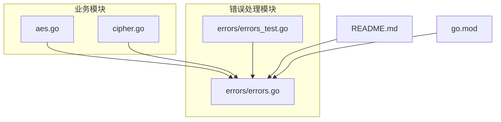
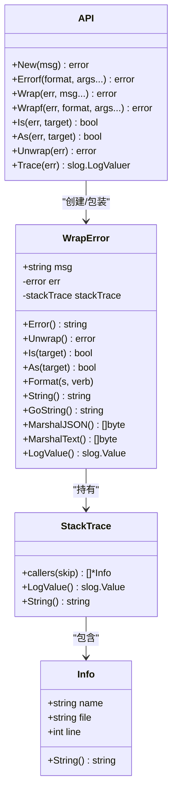
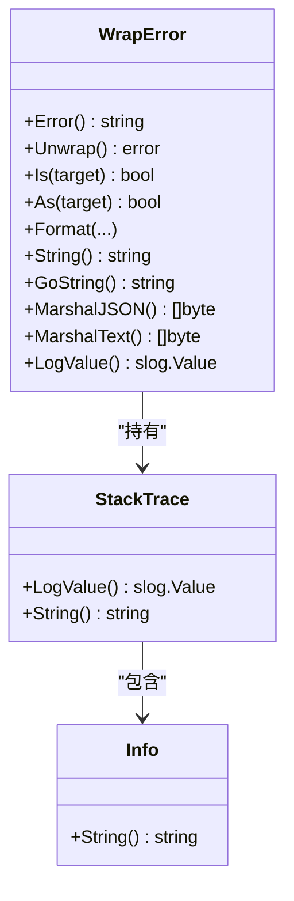
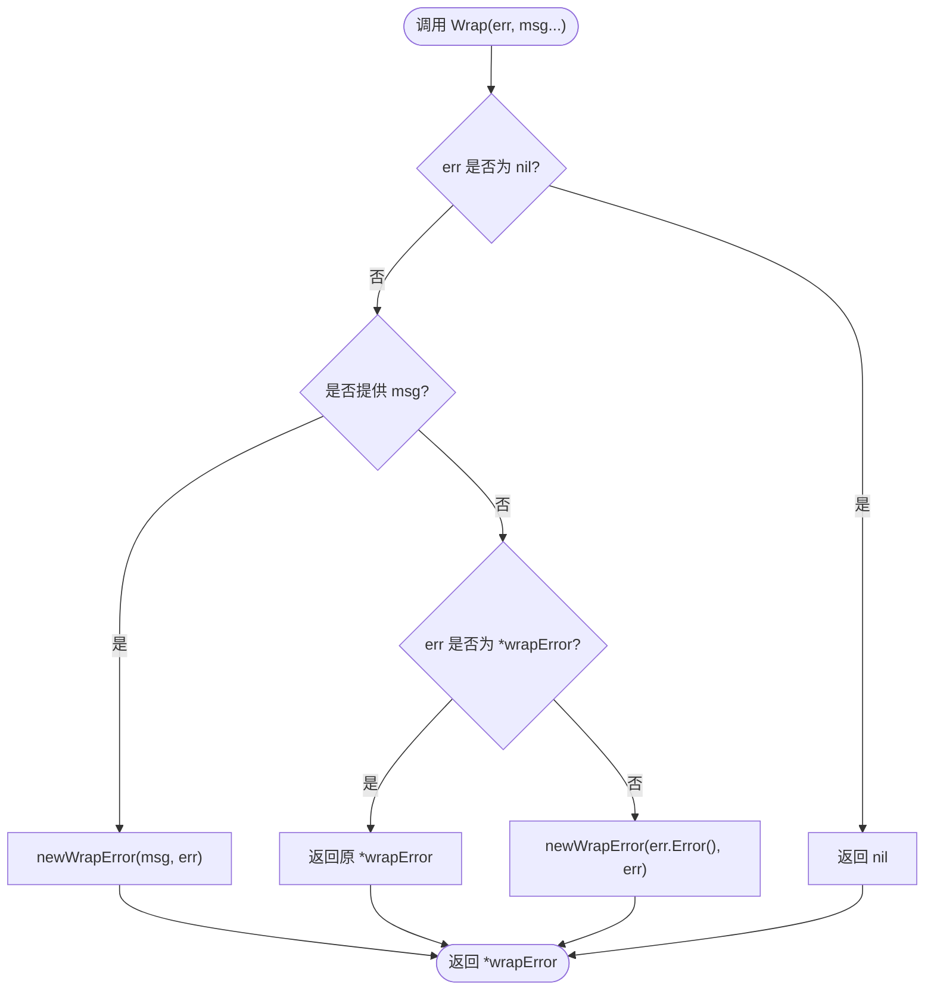
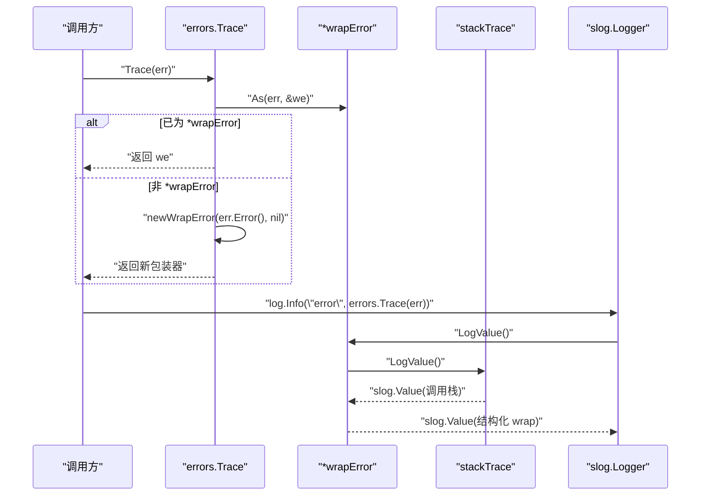
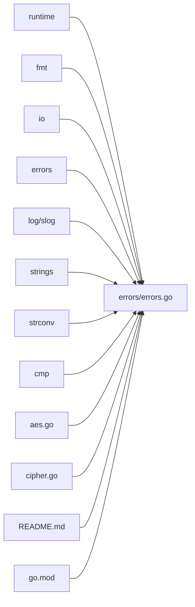

# 错误处理

<cite>
**本文引用的文件列表**
- [errors/errors.go](file://errors/errors.go)
- [errors/errors_test.go](file://errors/errors_test.go)
- [README.md](file://README.md)
- [go.mod](file://go.mod)
- [aes.go](file://aes.go)
- [cipher.go](file://cipher.go)
</cite>

## 目录

1. [简介](#简介)
2. [项目结构](#项目结构)
3. [核心组件](#核心组件)
4. [架构总览](#架构总览)
5. [详细组件分析](#详细组件分析)
6. [依赖关系分析](#依赖关系分析)
7. [性能考量](#性能考量)
8. [最佳实践与调试指南](#最佳实践与调试指南)
9. [结论](#结论)
10. [附录](#附录)

## 简介

本指南围绕错误处理模块展开，系统性讲解错误类型定义、错误包装机制、错误追踪与上下文信息添加、与标准库 log/slog
的集成、错误传播与分类、错误恢复策略、LogValuer 接口实现与 error 日志追踪、常见问题排查与性能优化建议。目标是帮助读者在工程实践中高效、一致地处理错误，提升可观测性与可维护性。

## 项目结构

错误处理模块位于 errors 包中，提供统一的错误构造、包装、传播与日志追踪能力，并在其他模块中广泛使用。关键文件如下：

- errors/errors.go：错误类型与包装器、格式化输出、日志追踪、标准库兼容接口
- errors/errors_test.go：基础行为测试（Is/Unwrap）
- README.md：历史变更与错误处理演进说明
- go.mod：Go 版本要求
- aes.go、cipher.go：在具体业务中使用 Wrap/Errorf/Trace 的示例

图表来源

- [errors/errors.go](file://errors/errors.go#L1-L282)
- [errors/errors_test.go](file://errors/errors_test.go#L1-L85)
- [aes.go](file://aes.go#L1-L23)
- [cipher.go](file://cipher.go#L1-L200)
- [README.md](file://README.md#L1-L200)
- [go.mod](file://go.mod#L1-L4)

章节来源

- [errors/errors.go](file://errors/errors.go#L1-L282)
- [errors/errors_test.go](file://errors/errors_test.go#L1-L85)
- [README.md](file://README.md#L1-L200)
- [go.mod](file://go.mod#L1-L4)

## 核心组件

- 错误包装器 wrapError：封装消息、底层错误与调用栈，支持 Is/As/Unwrap/Format 等接口，提供结构化日志输出与 JSON 文本输出
- 包装与构造函数：New、Errorf、Wrap、Wrapf，提供一致的错误创建与包装入口
- 日志追踪：Trace 返回 slog.LogValuer，便于将错误链路纳入结构化日志
- 标准库兼容：Is、As、Unwrap 直接委托标准库，确保生态一致性

章节来源

- [errors/errors.go](file://errors/errors.go#L14-L82)
- [errors/errors.go](file://errors/errors.go#L141-L173)
- [errors/errors.go](file://errors/errors.go#L237-L250)

## 架构总览

错误处理模块通过统一的包装器与一组便捷函数，向上游提供清晰的错误语义与可追溯性，向下兼容标准库错误处理接口，同时与 slog
集成实现结构化日志追踪。

图表来源

- [errors/errors.go](file://errors/errors.go#L84-L139)
- [errors/errors.go](file://errors/errors.go#L141-L250)
- [errors/errors.go](file://errors/errors.go#L258-L266)

## 详细组件分析

### 错误类型与包装器

- wrapError：承载错误消息、底层错误与调用栈，实现标准库错误接口与结构化输出
- stackTrace：基于 runtime.Callers 采集程序调用栈，支持 slog.LogValuer 输出
- info：单帧调用信息，包含函数名、文件路径与行号

图表来源

- [errors/errors.go](file://errors/errors.go#L141-L250)
- [errors/errors.go](file://errors/errors.go#L84-L139)
- [errors/errors.go](file://errors/errors.go#L258-L266)

章节来源

- [errors/errors.go](file://errors/errors.go#L141-L250)
- [errors/errors.go](file://errors/errors.go#L84-L139)
- [errors/errors.go](file://errors/errors.go#L258-L266)

### 构造与包装函数

- New：创建带追踪的错误
- Errorf：格式化消息后创建带追踪的错误
- Wrap：对已有错误进行包装，若未提供消息则复用底层错误消息；若已为 wrapError 则去重
- Wrapf：对已有错误进行格式化包装
- Is/As/Unwrap：直接委托标准库，保持生态一致性
- Trace：返回 slog.LogValuer，便于结构化日志记录

图表来源

- [errors/errors.go](file://errors/errors.go#L29-L53)

章节来源

- [errors/errors.go](file://errors/errors.go#L14-L82)

### 日志追踪与 LogValuer

- Trace：将任意 error 转换为 slog.LogValuer，优先复用现有 wrapError，否则创建临时包装器
- wrapError.LogValue：递归输出“wrap”分组，包含 msg、trace 与嵌套 wrap
- stackTrace.LogValue：输出调用栈帧数组，每帧为字符串描述

图表来源

- [errors/errors.go](file://errors/errors.go#L74-L82)
- [errors/errors.go](file://errors/errors.go#L237-L250)
- [errors/errors.go](file://errors/errors.go#L105-L113)

章节来源

- [errors/errors.go](file://errors/errors.go#L74-L82)
- [errors/errors.go](file://errors/errors.go#L237-L250)
- [errors/errors.go](file://errors/errors.go#L105-L113)

### 与标准库 log/slog 的集成

- 标准库兼容：Is/As/Unwrap 直接委托 errors/as/unwarp，确保与标准库生态一致
- 结构化日志：通过 slog.LogValuer 输出错误链路，便于日志系统解析与检索
- README 提及：自 1.21 版本起引入 errors 文件，统一使用 WrapError 支持错误追踪

章节来源

- [errors/errors.go](file://errors/errors.go#L55-L72)
- [README.md](file://README.md#L20-L26)

### 在业务模块中的使用示例

- AES 模块：当密钥长度不符合规范时，使用 Errorf 创建带追踪的错误
- Cipher 模块：在设置密钥、校验 IV、加密/解密过程中，使用 Wrap/Wrapf/新错误创建函数包装底层错误，保证上下文完整

章节来源

- [aes.go](file://aes.go#L12-L22)
- [cipher.go](file://cipher.go#L32-L58)
- [cipher.go](file://cipher.go#L140-L171)

## 依赖关系分析

- errors/errors.go 依赖标准库 runtime、fmt、io、errors、log/slog、strings、strconv、cmp
- 业务模块 aes.go、cipher.go 依赖 errors 包进行错误包装与追踪
- README.md 说明了错误处理的历史演进与版本要求

图表来源

- [errors/errors.go](file://errors/errors.go#L3-L12)
- [aes.go](file://aes.go#L3-L6)
- [cipher.go](file://cipher.go#L3-L8)
- [README.md](file://README.md#L1-L200)
- [go.mod](file://go.mod#L1-L4)

章节来源

- [errors/errors.go](file://errors/errors.go#L3-L12)
- [aes.go](file://aes.go#L3-L6)
- [cipher.go](file://cipher.go#L3-L8)
- [README.md](file://README.md#L1-L200)
- [go.mod](file://go.mod#L1-L4)

## 性能考量

- 调用栈采集：stackTrace.callers 通过 runtime.Callers 采集 PC，再用 CallersFrames 解析为函数名/文件/行号；频繁错误路径可能带来额外开销
- 去重策略：Wrap 在遇到已为 *wrapError 时直接返回，避免重复包装
- 格式化输出：Format 支持多种标志位，复杂格式化（如 GoString）会增加内存分配；在高频路径建议谨慎使用
- slog 输出：LogValue 输出为结构化数据，便于日志系统处理；但大量层级的 wrap 链会增加序列化成本

章节来源

- [errors/errors.go](file://errors/errors.go#L86-L103)
- [errors/errors.go](file://errors/errors.go#L252-L256)
- [errors/errors.go](file://errors/errors.go#L185-L202)
- [errors/errors.go](file://errors/errors.go#L237-L250)

## 最佳实践与调试指南

### 错误传播与分类

- 传播：在业务层使用 Wrap/Wrapf 保留上下文，底层错误通过 Unwrap 暴露
- 分类：使用 Is/As 进行错误类型与语义匹配，避免仅依赖字符串比较
- 去重：Wrap 会自动识别并返回已包装的 *wrapError，减少重复包装

章节来源

- [errors/errors.go](file://errors/errors.go#L29-L53)
- [errors/errors.go](file://errors/errors.go#L55-L72)

### 错误恢复策略

- 可重试：对瞬时错误（如网络抖动）在上层进行重试与退避
- 降级：在关键路径失败时提供降级方案，记录 Trace 以便后续修复
- 终止：对不可恢复错误（如配置非法）直接终止流程并上报

### 上下文与追踪

- 使用 Wrapf 添加动态上下文（如资源名、参数），便于定位问题
- 使用 Trace 将错误链路写入结构化日志，结合 slog 的属性键值进行检索

章节来源

- [errors/errors.go](file://errors/errors.go#L47-L53)
- [errors/errors.go](file://errors/errors.go#L74-L82)

### 与标准库 log/slog 的集成

- 使用 slog 记录错误时，传入 errors.Trace(err) 以输出结构化追踪
- 保持 Is/As/Unwrap 与标准库一致，确保第三方库与工具链兼容

章节来源

- [errors/errors.go](file://errors/errors.go#L55-L72)
- [errors/errors.go](file://errors/errors.go#L74-L82)

### 代码示例与调试技巧

- 示例路径
    - 新建带追踪的错误：参考 [errors/errors.go](file://errors/errors.go#L14-L22)
    - 包装已有错误并添加上下文：参考 [errors/errors.go](file://errors/errors.go#L29-L53)
    - 在业务中使用：AES 模块的 Errorf 使用 [aes.go](file://aes.go#L12-L22)，Cipher 模块的 Wrap/Wrapf
      使用 [cipher.go](file://cipher.go#L32-L58)、[cipher.go](file://cipher.go#L140-L171)
- 调试技巧
    - 使用 slog 记录 errors.Trace(err) 获取完整调用栈
    - 在高频错误路径评估是否需要简化格式化输出
    - 对于重复包装，检查上游是否已使用 Wrap/Wrapf

章节来源

- [errors/errors.go](file://errors/errors.go#L14-L82)
- [aes.go](file://aes.go#L12-L22)
- [cipher.go](file://cipher.go#L32-L58)
- [cipher.go](file://cipher.go#L140-L171)

## 结论

该错误处理模块通过统一的包装器与便捷函数，提供了清晰的错误语义、可追溯的调用栈、与标准库生态一致的接口，以及与 slog
的无缝集成。在实际工程中，建议在关键路径使用 Wrap/Wrapf 保留上下文，在日志中使用 Trace 输出结构化追踪，并遵循 Is/As/Unwrap
的标准库约定，以获得更好的可观测性与可维护性。

## 附录

### API 一览

- New(msg) error：创建带追踪的错误
- Errorf(format, args...) error：格式化消息后创建带追踪的错误
- Wrap(err, msg...) error：包装错误，若未提供消息则复用底层错误消息
- Wrapf(err, format, args...) error：格式化包装错误
- Is(err, target) bool：匹配错误
- As(err, target) bool：类型断言
- Unwrap(err) error：解包错误
- Trace(err) slog.LogValuer：返回可用于 slog 的日志追踪值

章节来源

- [errors/errors.go](file://errors/errors.go#L14-L82)