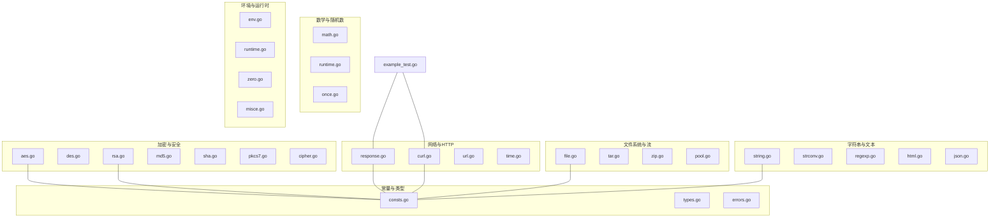
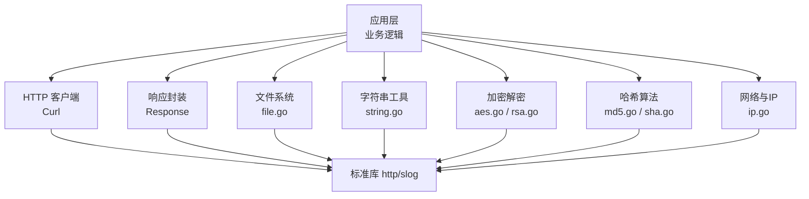
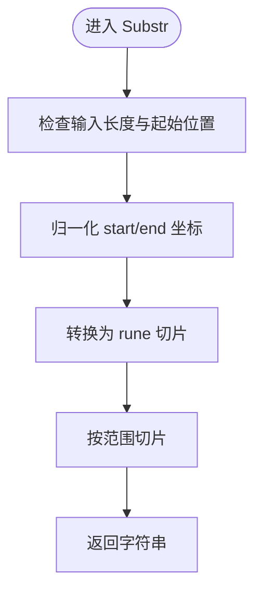
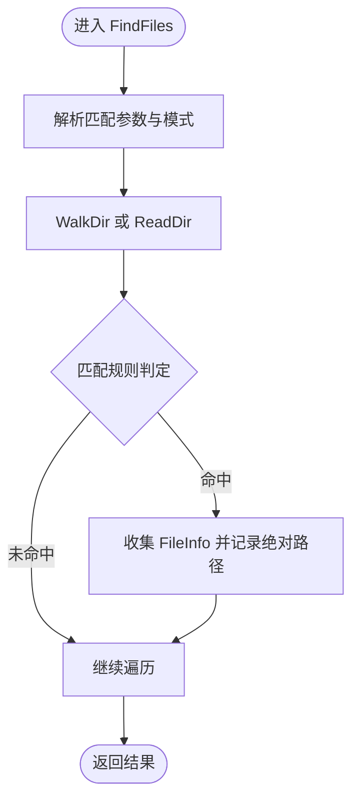
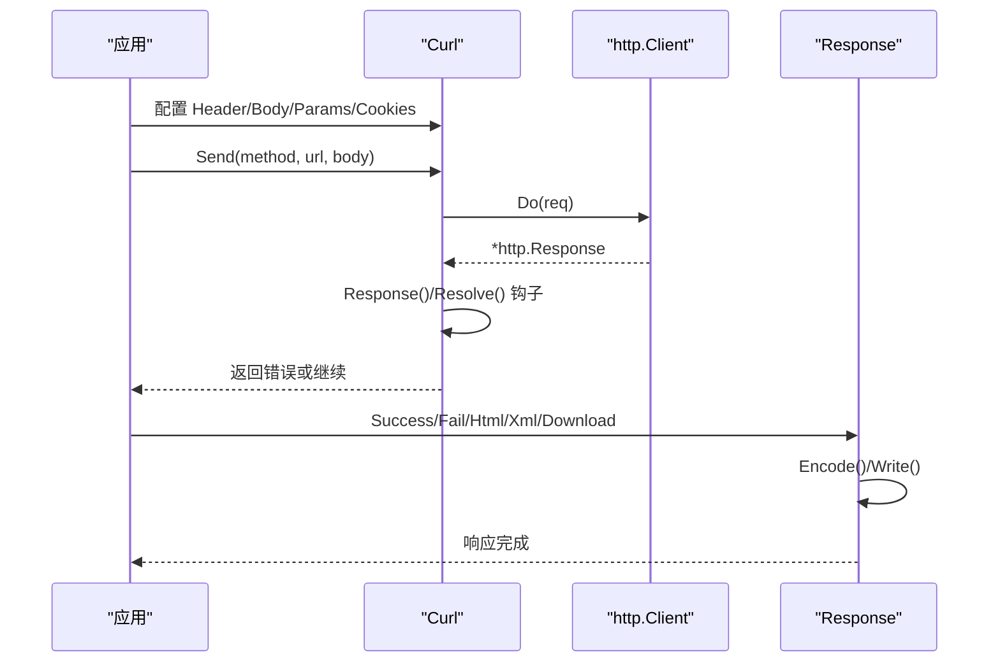
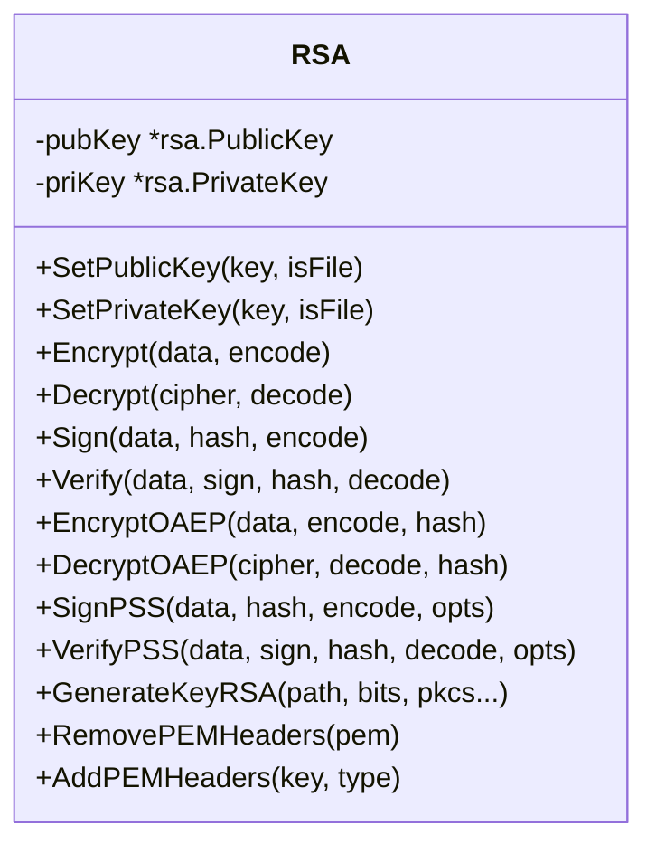
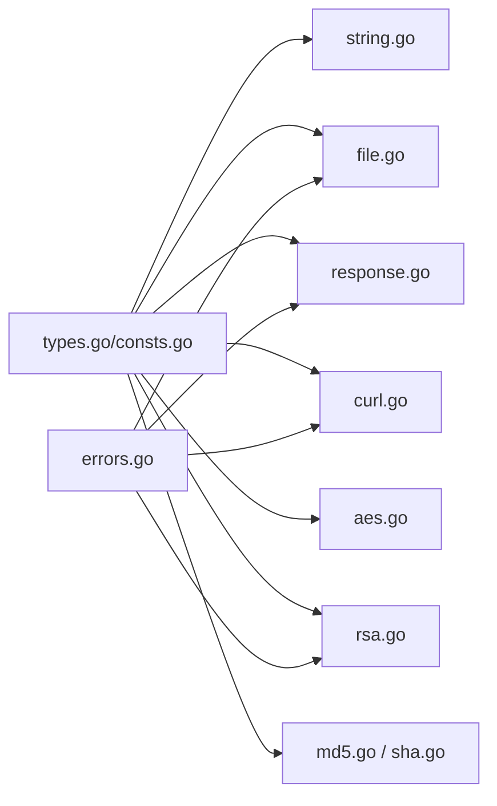

# 项目概述

<cite>
**本文档引用的文件**
- [README.md](file://README.md)
- [go.mod](file://go.mod)
- [example_test.go](file://example_test.go)
- [types.go](file://types.go)
- [consts.go](file://consts.go)
- [string.go](file://string.go)
- [math.go](file://math.go)
- [file.go](file://file.go)
- [aes.go](file://aes.go)
- [rsa.go](file://rsa.go)
- [response.go](file://response.go)
- [curl.go](file://curl.go)
- [ip.go](file://ip.go)
- [md5.go](file://md5.go)
- [sha.go](file://sha.go)
</cite>

## 目录

1. [简介](#简介)
2. [项目结构](#项目结构)
3. [核心组件](#核心组件)
4. [架构总览](#架构总览)
5. [详细组件分析](#详细组件分析)
6. [依赖关系分析](#依赖关系分析)
7. [性能考量](#性能考量)
8. [故障排查指南](#故障排查指南)
9. [结论](#结论)
10. [附录](#附录)

## 简介

Go Utils 是一个功能丰富的 Go 语言工具库，旨在提供广泛的基础工具函数与实用组件，覆盖字符串处理、数学与随机数、文件系统、HTTP
客户端、加密解密、响应封装、IP 获取、哈希算法等多个领域。项目强调易用性与可扩展性，提供统一的错误包装与日志记录机制，适合作为日常开发中的“工具箱”。

- 目标与价值
    - 提供高频使用的工具函数，减少重复造轮子的成本
    - 统一错误处理与日志记录，便于问题定位与追踪
    - 提供 HTTP 客户端与响应封装，简化 Web 开发流程
    - 提供多种加密算法与密钥管理辅助能力

- 设计理念
    - 以“工具函数 + 类型别名 + 结构体”的组合方式组织代码，兼顾简洁与可读
    - 通过泛型与接口抽象，提升通用性与复用性
    - 严格遵循 Go 语言最佳实践，保持低耦合、高内聚

- 技术要求与兼容性
    - Go 版本要求：1.22 及以上
    - 与标准库紧密协作，充分利用 log/slog、crypto/*、net/http 等生态能力

**章节来源**

- file://README.md#L1-L35
- file://go.mod#L1-L4

## 项目结构

项目采用扁平化的文件组织方式，每个功能域对应一个独立文件，便于按需导入与维护。核心模块包括：

- 字符串与文本处理：string.go、strconv.go、regexp.go、html.go、json.go
- 数学与随机数：math.go、runtime.go、once.go
- 文件系统与流处理：file.go、tar.go、zip.go、pool.go
- 网络与HTTP：curl.go、response.go、url.go、time.go
- 加密与安全：aes.go、des.go、rsa.go、md5.go、sha.go、pkcs7.go、cipher.go
- 环境与运行时：env.go、runtime.go、zero.go、misce.go
- 常量与类型定义：consts.go、types.go、errors.go
- 示例与集成：example_test.go

**图表来源**

- [string.go](file://string.go#L1-L187)
- [file.go](file://file.go#L1-L451)
- [curl.go](file://curl.go#L1-L800)
- [response.go](file://response.go#L1-L342)
- [aes.go](file://aes.go#L1-L23)
- [rsa.go](file://rsa.go#L1-L527)
- [md5.go](file://md5.go#L1-L13)
- [sha.go](file://sha.go#L1-L27)
- [consts.go](file://consts.go#L1-L48)
- [types.go](file://types.go#L1-L98)
- [example_test.go](file://example_test.go#L1-L108)

**章节来源**

- file://README.md#L37-L300
- file://go.mod#L1-L4

## 核心组件

- 类型与常量体系
    - 通过类型别名与接口抽象数字、字符串、切片等基础类型，提供统一的比较与排序能力
    - 定义加密模式、存储单位、时间格式化常量，便于跨模块复用

- 字符串工具
    - 提供带宽字符安全的截取、替换、随机字符串生成、唯一 ID 生成等能力
    - 支持多种编码与随机源，兼顾性能与可读性

- 数学与随机数
    - 提供区间随机数生成与浮点数四舍五入，支持自定义随机种子

- 文件系统与流处理
    - 提供文件存在性判断、复制、大小格式化、目录遍历与匹配
    - 提供基于 Scanner/Reader 的逐行/分块读取，支持大文件与超长行处理
    - 提供线程安全的写入封装与缓冲写入

- HTTP 客户端与响应封装
    - Curl 结构体提供链式配置与生命周期钩子，支持超时、代理、TLS、认证、重试、日志等
    - Response 泛型封装统一 JSON/XML/HTML/下载/显示等响应输出，内置错误编码与追踪

- 加密与安全
    - AES/DES/RSA 封装，支持多种填充与编码策略，提供密钥去头尾标记与还原能力
    - MD5/SHA 系列摘要，提供便捷的十六进制编码

- 网络与运行时
    - 提供服务器/本地/客户端 IP 获取，支持代理链路穿透判断
    - 提供运行时与一次性初始化等实用能力

**章节来源**

- file://types.go#L1-L98
- file://consts.go#L1-L48
- file://string.go#L22-L187
- file://math.go#L8-L37
- file://file.go#L21-L451
- file://curl.go#L21-L84
- file://response.go#L11-L342
- file://aes.go#L8-L23
- file://rsa.go#L18-L527
- file://md5.go#L8-L13
- file://sha.go#L10-L27
- file://ip.go#L11-L89

## 架构总览

整体架构围绕“工具函数 + 结构体 + 泛型 + 接口”展开，模块间通过清晰的职责边界与统一的错误/日志规范协作。

**图表来源**

- [curl.go](file://curl.go#L435-L772)
- [response.go](file://response.go#L294-L342)
- [file.go](file://file.go#L311-L351)
- [string.go](file://string.go#L133-L187)
- [aes.go](file://aes.go#L12-L22)
- [rsa.go](file://rsa.go#L23-L527)
- [md5.go](file://md5.go#L8-L13)
- [sha.go](file://sha.go#L10-L27)
- [ip.go](file://ip.go#L11-L89)

## 详细组件分析

### 字符串处理模块（string.go）

- 功能要点
    - 宽字符安全的子串截取（Substr）
    - 基于映射表的批量替换（Replace）
    - 随机字符串生成（RandStr 系列）
    - 唯一 ID 生成（UniqId），支持可调长度与排序友好性
- 性能与复杂度
    - 截取与替换基于 rune 切片与 strings.Replacer，避免错误的字节切片
    - 随机生成使用 rand/v2 与 unsafe 转换，兼顾效率与内存占用
- 使用场景
    - 文本清洗、模板替换、令牌生成、日志追踪 ID

**图表来源**

- [string.go](file://string.go#L38-L84)

**章节来源**

- file://string.go#L22-L187

### 文件系统与流处理（file.go）

- 功能要点
    - 文件存在性、大小、复制与权限继承
    - 目录遍历与多模式匹配（精确、前缀、后缀、正则）
    - 三种读取模式：逐行（Scan/Line）、分块（Read）、缓冲读取
    - 线程安全写入封装（WriteFile）与缓冲写入
    - 文件大小格式化与 MIME 类型推断
- 错误处理
    - 统一使用 WrapError 包裹底层错误，结合 slog 记录追踪码
- 使用场景
    - 日志轮转、配置文件扫描、大文件解析、批量文件处理

**图表来源**

- [file.go](file://file.go#L89-L225)

**章节来源**

- file://file.go#L21-L451

### HTTP 客户端与响应封装（curl.go / response.go）

- Curl
    - 链式配置：Header、Params、Body、Cookies、认证、代理、TLS、超时、重试
    - 生命周期钩子：Client、Request、Response、Resolve、Done
    - 日志：支持 dump 模式与关键信息模式，统一 X-Request-Id
- Response
    - 泛型封装统一 JSON/XML/HTML/下载/显示响应
    - 内置错误编码与 slog 追踪，自动设置 Content-Type 与状态码
- 使用场景
    - 微服务间调用、第三方 API 集成、Web 控制器响应

**图表来源**

- [curl.go](file://curl.go#L435-L772)
- [response.go](file://response.go#L24-L308)

**章节来源**

- file://curl.go#L21-L84
- file://response.go#L11-L342

### 加密与安全（aes.go / rsa.go / md5.go / sha.go）

- AES
    - 支持 16/24/32 字节密钥，随机 IV 与固定 IV 模式
- RSA
    - 支持 PKCS1/PKCS8 公私钥格式，长文本分段加解密，OAEP/PSS 签名
    - 提供 PEM 去头尾标记与还原能力
- 哈希
    - MD5/SHA1/SHA256/SHA512，统一十六进制编码输出
- 使用场景
    - 数据加密传输、数字签名与验签、摘要校验

**图表来源**

- [rsa.go](file://rsa.go#L18-L527)

**章节来源**

- file://aes.go#L8-L23
- file://rsa.go#L18-L527
- file://md5.go#L8-L13
- file://sha.go#L10-L27

### 网络与运行时（ip.go / time.go / runtime.go）

- IP 获取
    - ServerIP：通过 UDP 出站探测获取外网 IP
    - LocalIP：回退至本地接口地址
    - ClientIP：支持 X-Forwarded-For 与 X-Real-IP，过滤私网地址
- 使用场景
    - 日志上下文、访问统计、灰度路由

**章节来源**

- file://ip.go#L11-L89

## 依赖关系分析

- 内部依赖
    - types.go/consts.go 为全局类型与常量中心，被多数模块引用
    - errors 统一错误包装，配合 slog 记录追踪
- 外部依赖
    - 标准库：crypto/*、net/http、log/slog、time、sync 等
    - 第三方：github.com/Is999/go-utils/errors（内部模块）

**图表来源**

- [types.go](file://types.go#L1-L98)
- [consts.go](file://consts.go#L1-L48)
- [string.go](file://string.go#L1-L187)
- [file.go](file://file.go#L1-L451)
- [response.go](file://response.go#L1-L342)
- [curl.go](file://curl.go#L1-L800)
- [aes.go](file://aes.go#L1-L23)
- [rsa.go](file://rsa.go#L1-L527)
- [md5.go](file://md5.go#L1-L13)
- [sha.go](file://sha.go#L1-L27)

**章节来源**

- file://go.mod#L1-L4

## 性能考量

- 字符串与文本
    - 截取与替换优先使用 rune 切片与 strings.Replacer，避免错误的字节级操作
    - 随机字符串生成使用 rand/v2 与预分配缓冲，降低 GC 压力
- 文件读取
    - 大文件与超长行优先使用 Line/Read，减少内存峰值
    - Scan 支持动态调整缓冲区大小，避免大行读取失败
- HTTP
    - Curl 支持连接池与超时控制，提供指数退避重试
    - Resolve 钩子可直接消费流式响应，避免一次性加载
- 加密
    - RSA 分段加解密与 OAEP/PSS 签名，平衡安全性与性能

[本节为通用指导，无需特定文件分析]

## 故障排查指南

- 常见问题与定位
    - HTTP 请求失败：启用 dump 模式查看请求/响应详情；检查 X-Request-Id 与日志
    - 文件读取异常：确认缓冲区大小与 EOF 处理；检查 DONE 错误用于提前终止扫描
    - 加密失败：核对密钥长度与格式（PEM 去头尾标记）；确认填充与编码策略
- 建议流程
    - 启用默认日志输出（SetDefLogOutput），观察 Info/Warn/Error 级别日志
    - 使用 WrapError 包裹错误，结合 slog.GroupValue 记录上下文
    - 对关键路径增加 Resolve/Response 钩子，快速定位异常阶段

**章节来源**

- file://curl.go#L435-L772
- file://file.go#L227-L309
- file://rsa.go#L483-L527
- file://response.go#L24-L308

## 结论

Go Utils
以“实用、统一、可扩展”为核心目标，覆盖开发中的高频场景。通过清晰的模块划分、统一的错误与日志规范，以及对标准库的良好封装，既适合初学者快速上手，也能满足资深开发者对性能与可维护性的要求。建议在团队内作为“工具箱”统一引入，结合示例与单元测试快速落地。

[本节为总结性内容，无需特定文件分析]

## 附录

### 安装与使用

- 安装
    - GitHub：go get -u github.com/Is999/go-utils
    - Gitee：go get -u gitee.com/Is999/go-utils
- 版本要求：Go 1.22+
- 基本使用
    - 引入模块后，按需导入各功能文件或使用示例中的控制器封装

**章节来源**

- file://README.md#L7-L27
- file://go.mod#L3-L4

### 历史演进与版本要求

- Go 版本升级：从 1.18 升级至 1.22，移除旧版 Max/Min 与 Logger
- 标准库迁移：使用 log/slog 替代自定义日志
- 错误追踪：统一 WrapError，errors 文件实现 LogValuer 接口
- RSA 增强：长文本分段加解密与 PEM 处理

**章节来源**

- file://README.md#L18-L28

### 实际使用场景示例（参考示例文件）

- HTTP 响应封装：JSON/XML/HTML/下载/显示/重定向
- Curl 链式配置：Header/Body/Params/Cookies/TLS/代理/认证/重试
- 文件扫描：逐行/分块/大文件处理
- 字符串工具：替换、截取、随机字符串、唯一 ID

**章节来源**

- file://example_test.go#L17-L107
- file://response.go#L294-L342
- file://curl.go#L435-L772
- file://file.go#L227-L309
- file://string.go#L22-L187